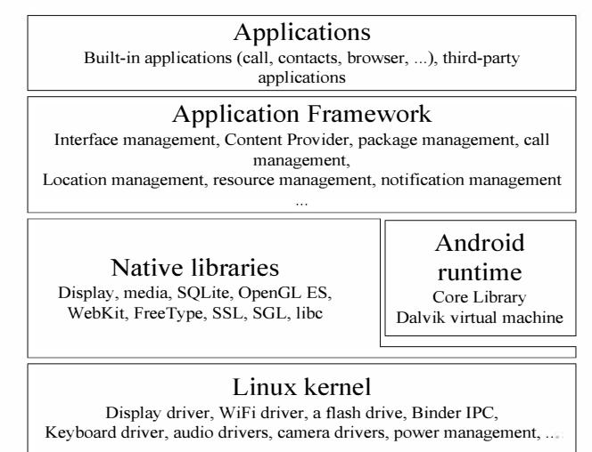
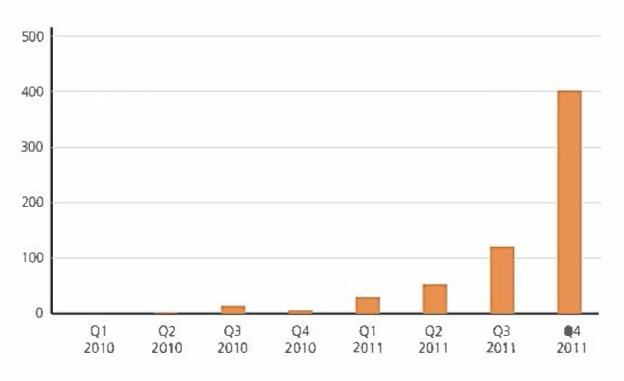

# A SURVEY OF ANDROID MOBILE PLATFORM SECURITY

Futai Zou, Siyu Zhang, Tianqi Wan, Li Pan

School of Information Security, Shanghai Jiao Tong University, Shanghai, China zoufutai@sjtu.edu.cn, dftbb@sjtu.edu.cn, tiantian\_llll@sjtu.edu.cn, panli@sjtu.edu.cn

Keywords: Android, Mobile Computing, Smartphone, 2 Security Model of Android Malware, Security.

## Abstract

Mobile devices have become high-value attacked targets since they contain numerous private or business information. Android, the most popular mobile computing platform, also known for its openness, is facing various threats from system vulnerabilities to malicious applications. After analyzing Android's security model and threat, we summarize the technic possibility for remote or physical attacks, privacy stealing, communication hijacking and mal ware C&C. According to these threatens, research progress in malware detection technologies and systems strengthening methods is also reviewed.

# 1 Introduction

With the development of mobile communication technology and the popularity of the mobile devices, mobile computing platform security has become the focus of the researchers around the world. Smartphone are widely equipped multi-functions such as storage of contacts, text messages, e-mail, calendar, photos and other user's privacy data. People use them to browse webs and pay online transactions. And they can also be used for GPS positioning and monitoring. All of these make the mobile platform a more valuable target than a desktop.

Android is one of the most popular mobile computing platfonn at present, has been widely used in smartphone, tablet computer and smart TV tenninal. Android was acquired by Google in 2005, officially announced in November 2007, jointly developed by the Open Handset Alliance currently.

Gartner's report [1] shows that in the fourth quarter of 2011, Android not only accounted for 50.9% of global smartphone shipments, what was much higher than Apple's iOS accounted for 23.8%, but also had a significant increase of 30.5% over the same period of 20 I O.

Due to Android's openness, it is for the attackers' convenience to deep research the bottom of it, loose release mechanism also cause the emergence of applications which contain malicious code on its official market. This paper conducts a comprehensive study and summary, of the security mechanism of the Android platform, threats and attacks facing them, and the corresponding defensive measures.

### 2.1 Android's Platform Architecture

The structure of Android platform is shown in Figure 1 [2]. The bottom of system is running on ARMorx86 processor Linux 2.6 kernel, which provides memory management, process management, network protocol stack and device drivers. On this basis, there are a series of C/C++ native libraries, such as the libc, the audio and video codecmedia library, the browser engine, 20/30 graphics library and SQLite, etc.

Oalvik virtual machine provides a runtime environment for Android applications to execute Oalvik byte code. Oalvik virtual machine itself is not a sandbox, any program can run native code [3]. Zygote is the main process of Dalvik virtual machine, which is used to start and manage a component based on Dalvik and their privileges.

The application framework, which is on the top of this, provides a rich API that can be used by application developers, such as a series of scalable View, Content Provider and notification management, etc. Android applications are written by JAVA, there are text messages, contacts, browser, Email and other core applications in the system when it is released.

In the composing of Android platform, there are wellknown techniques including Linux kernel, Linux security model, udev, WebKit, SQLite, ARM, etc. They provide convenient for security studies. Meanwhile, Android also introduces ADB (Android Debugging Bridge), Call protocol stack, Dalvik virtual machine, Binder IPC, Ashmem

Figure 1. Android's platform architecture.

(Anonymous shared memory), Android and vendorspecific drivers and other new components, which bring the new challenges to attacks and security protection [4].

# 2.2 Security and Application Permissions Isolation

References [5] summarize and assess the security mechanisms which Android adopts. In the hardware security mechanisms, Android doesn't adopt Trust Zone technology of ARM, and Android began to use the processor's NX (No execute) protection until version 2.3 [4]. In terms of software protection, Android uses the ProPolice/SSP of GCC compiler to protect native code on the stack, however, Android achieved ASLR (Address Space Layout Randomization) in order to increase difficulties of overflow attacks in buffer until version 4.0 [6].

References [3] [6] [7] introduce and analyze applying permissions and isolation mechanism of Android. By default, Android application can only access limited system resources, sensitive API is protected by privileges. Application developers affirm all the necessary permissions for the application in AndroidManifest.xml file, signature verification or request authorization when the application install. Protected API include camera functions, GPS, calls, short messages, B1uetooth and network connections, etc. Limitations for other sensitive functions take a direct approach by providing no API. For example, no Android's API could modify SIM card directly.

Isolation between Android applications is built on Linux kernel security mechanisms, using of the Linux user permissions model and process isolation. The application running on the Dalvik has one to one process of the Linux, and when the application was installed, each application and system components of Android generate their own different uid and gid. Data file of an application is owned by its uid/gid, in order to take advantage of file system permissions to prevent processes of other applications accessing to the file, moreover, Android does not support set uid file attributes

# 2.3 Android Application Development

Android provides two sets of development tools: Android SDK and Android NDK [8]. Android SDK provides an application development environment for JA VA, and ensures the independence of platfonn versions as far as possible. Android NDK provides a native code cross-compiler environment for CIC++, as well as a range of native system libraries and header files.

Android application consists of four types of modules: Activity is used to show a graphical screen interface, Service is used to achieve the program running in the background, Content Provider can visit and provide shared data, as well as that Broadcast Receiver is used to response the broadcast news of systems [9]. In Android development, the actions that we use Service to achieve background process, access to the contract and short messages and other user data by Content Provider, and take advantage of Broadcast Receiver to interrupt system event is the main point which the security study focus on. The broadcast of Android system event is extremely rich, including screen off, charging, time changes, booting up, dialing, the call connecting or hanging up, receiving and sending text messages, network connections changes, etc. For example, response BOOT\_COMPLETED (boot up) message can achieve that the program boot from the start. In addition, broadcast the events of Android take an orderly mechanism, handled these events firstly by the highest priority Broadcast Receiver, and thenpassed down one by one. Therefore, by setting the highest priority, and calling abort BroadcastO to tenninate the broadcast in the event handler function can Intercept events, it is used in SMS interception and other scenes.

# 3 Android Security Threats

Security threats of Android come from multiple aspects, including mobile devices self-protection, the security of mobile data networks, the software vulnerabilities of systems and components, malicious applications, and user's flimsily operation mode. Usually, consequences arising from security threats are execution of malicious code and leaking users' privacy data.

# 3.1 Vulnerability of Mobile Devices

Mobile devices are small and easy to carry, these features also make them easily lost or stolen. Especially after physical contact with the device, the attack is more direct and effective than remote attacks and malicious code. Symantec conducted an experiment called Smartphone Honey Stick Project [10]. In this experiment, they deliberately lost several special-configured smartphones in major cities in the US, as a result, 96% of smartphone was operated by the one who pick it, 89% of them accessed to the application associated with the personal information in the mobile phone, 83% of them access to the corporate data in the phone, only 50% of them got connection with the phone owner. This project demonstrates the weakness of data protection for mobile devices, as well as the personal data and corporate data stored in the mobile terminal is facing huge risk.

Another threat generally faced by mobile devices is unsafe mobile data networks, particularly, it is so easy to access to an open WiFi network structured maliciously by attackers, which will allow an attacker to implement a network traffic monitor and middle attack.

Besides, QR code, which is commonly used data input pathways for mobile devices, is also at risk of attack. Since the graphics after encoded cannot be directly decoded by people, people often need to learn the infonnation contained in QR Code via the included descriptions. Therefore, references [ I I] indicate that fishing, malicious code attacks and instruction execution could be implemented by malicious QR code.

# 3.2 Android Jailbreak

Android jailbreak, also called Rooting, allows the user to obtain the highest authority operating of Android system. Users will root Android for the purpose of deleting the system built-in applications, using highly privileged application, adjusting advanced system options and using a third party firmware. The systems after rooting, allow applications to obtain root privileges, and then will undennine the authority isolation mechanism of the Android platfonn. This will bring the security threats including allowing to manipulate any user data and applications data, allowing to obtain any application pennission, leading to execute malicious code and even install Rootkit, etc.

Rooting depends on the Android system's vulnerability to elevate privileges, and Android will patch known vulnerabilities in the new version. Therefore, for different Android versions, we need different jailbreak methods. As of the first quarter of 2012, the most used version of Android platform is 2.2 and 2.3.3 - 2.3.7, holds 86.3% of the total share of [12].

References [4] [13] [14] research the exploit of local elevated privileges on the Android platform, currently five common jailbreak vulnerability are developed by team 743C. Exploid exploits udev < 1.4.1 does not to check the sources of defects NETLINK, but to execute arbitrary code with root privilege, and then it will set resecure to 0 in order to let ADBd run as root. Rage Against The Cage which takes advantage of ADBd does not to check the weakness in return value of setuidO; however, it continue running as root through the failure of ADBd setuidO that is depleted by NPROC resource. The principle of Zimper Lich is similar to Rage Against The Cage, however, for the Zygote process, the three loopholes above are applicable to Android 2.2 or less version. Ginger Break uses a similar principle with Exploid, but for the void process, they are only applicable to Android 2.2 to Android 3.0.

#### 3.3 Third-Party ROM

Reference [15] studies the safety problems of a third-party ROM for Android. Third-party ROM is firmware developed by individuals or groups, usually with the optimization of the interface, built-in application and performance, and can provide higher version of Android system for devices after the manufacturer stopped updating; therefore, it is favored by the part of the user. There are well-known third-party finnware such as Cyanogen Modand MIUI, etc. However, third-party firmware commonly exist the following safety weakness. Firstly, third-party ROM is often pre-root, have the risk after Android jailbreak like the section 2.3 says. Secondly, third-partyROM USB debugging features are usually enabled by default. Also, attribute roo secure = 0 let ADBd run in the root, a phone can be read any user data after connecting to a computer. Besides, a part of third-party ROM has the risk that it allows to install unknown sources applications and the risk of file system permissions settings, etc. For these risks above, Cyanogen Mod announced a firmware patch in version 9 in March 2012, allowing the user to open or close the root privileges of application and ADB [16].

#### 3.4 Android Malicious Code

Same as desktop, Android, Symbian, iOS and other mobile computing platforms also face the threat of malicious code. Android adopted a more open policy, the official market Google Play (the old Android Market, renamed in March 2012) only charge developer a one-time \$25 registration fee, which is much lower than Apple's App Store (Charge for \$99 each year). In addition, Android take a self-signed to applications developers, there is no audit mechanism like Apple. So, loose management of official market to release applications cause a lot of applications with malicious code in the Android official market.

Droid Dream malware appeared on the official Android Market in the first quarter of 20 I I. Droid Dream released over 80 free applications in the fonn of pirating the application fee or other forms. With use of these two vulnerabilities, Exploid and Rage Against The Cage, it influence the version less than Android 2.2, Infected up to 250,000 users [17]. Ginger Master [18] is the first malicious programs to use Android 2.3 root privilege escalation vulnerabilities, including Ginger Break code. Ginger Master send stolen information via HTTP, and download and install other malicious programs.

McAfee's report showed that the number of Android malicious code grew rapidly in the past two years (Figure 2) [19]. According to Kaspersky's report, there were all together 178 new types of mobile platfonn malicious code and 5225 new variants found in the year 2011, which was 6.4 times increase over the previous year [20]. Among all mobile platform malicious code Kaspersky intercepted, the 65.1 % of them were against the Android platform.

# 4 Android Device Attack

# 4.1 Remote and Local Attacks

Reference [21] summarizes the current Android attack techniques. There are three categories for Android attacks. The first attack of them is that, without physical contact, they usually use social engineering methods to trick users into installing malicious applications from the application market, or visit the Web page with malicious code. WebKit engine vulnerability CVE-2010-1119 and CVE-2010-1807 of Android 2.0 and 2.1 can be used for remote code execution for browser, there were public exploit code on the Internet [22] [23].

Second, in the case of physical contact with an open USB debugging, the malicious code can be executed and information theft through ADB. ADB provides a com-

Figure 2. Samples statistics of McAfee Intercepted Android Malware [19].

mand-line operation (shell), package installation (install) and file transfer (pull/push) and other control functions on the device. The five Local privilege escalation methods can be used to jailbreak executed by ADB in Section 2.2, obtain root privileges in the case of that there's no root in the device itself, in order to gain complete control of the system. In root privileges, copy the APK file of applications to the path/system/appl and then will complete the installation. Direct access to all authority affirmed by application without user confirmation. When the system is not turned on USB debugging, especially when no password protection was set for the device, an attacker can also turn this feature directly through the interface interaction. For Android unlock patterns, reference [24] using fingers sliding traces on the touch screen surface to recognize the unlock pattern, they achieved 14% - 68% of full recognition rate under different experimental conditions.

The third attack is that, in the case of physical contact without opening USB debugging, an attacker could use the Recovery Mode of device. This method does not rely on the Android platform software vulnerabilities, but relate to equipment manufacturers and models. Reference [25] studied there covery image is created for a particular purpose (booting), using brush write mode (Flash Mode) to write the mirroring to the recovery partition, and then let the device boot into recovery mode in order to carry out forensic methods, and experimental verification on multiple types of devices.

# 4.2 Privacy Information Theft

Most of user data of Android system use the SQLite storage. Common Android applications access to user data through Content Provider API. After obtaining root privileges, you can manipulate directly SQLite file where the data stored in, then you can read the sensitive information that API can't access to.

User data storage locations of the Android system are summarized in Table 1. Except the accounts.db, account password of other database file, such as password remembered by Email and browser, are all stored in clear text. Cache. cell and cache. WiFi record the base station 10,

WiFi MAC address and GPS coordinates communicated equipment, while Android-Iocdump [26] provides an analytical approach to the file format.

# 4.3 Communication Hijacking

Communication hijacking control calls and SMS functions without the user's consent. Specific application scenarios include text messaging and call blocking, call recording, auto-dialing, SMS and Spy Call, etc. Since the opening of some API in call control and messages on Android platform, the attacker is easy to achieve a malicious program with the above functions.

With the use of Broadcast Receiver and terminate broadcast methods mentioned in Section 1.3, we can intercept the message receiving (SMS \_RECEIVED) and call state (PHONE\_STATE) events, to achieve the function that intercept text message and phone call. For SMS interception, terminate event broadcast can make mobile phone not to produce sound, vibration and screen prompts of text message. Programs [27] [28] use hidden Telephony Service API and analog headphone of Android to turn on or hang up calls automatically. Android 2.3 will limit MODIFY\_ PHONE\_STATE permissions to allowthe use of system applications only, in the equipment obtain root access, APK package can be copied to the path/system/app to get this privilege.

Android can provide Media Recorder API for a variety of recording operation, according to selection of Audio Source parameters, it is able to record microphone (MIC), the upper and lower rows voice (VOICE\_CALL) or voice of one-way call, and it can choose AAC/AMR and other coding and 3GPP/MPEG4 or other output formats. With the use of this API combined with call state (PHONE\_ STATE), call recording background can be achieved. This API can also be used for environment recording at any time.

The Android SDK provides API and allows programs to send message, phone dialing. While the phone dialing in this case will be shown on the Android call interface. Reference [29] proposed the communication ways that to send AT commands to GSM Modem with the use of RIL,

Table 1. Data storage path of Android user.

| Path                                                                        | Description                              |
|-----------------------------------------------------------------------------|------------------------------------------|
| Idatalsystemlaccounts.db                                                    | Multiple account credentials (encrypted) |
| I datal datal com .andro id. providers. te I eph ony I databases/mmssms.d b | SMS and MMS                              |
| Idataldata/com.android.providers.contacts/databases/contacts2.db            | Contacts, Call History                   |
| Idataldata/com.android.providers.calendar/databases/calendar.db             | Schedule                                 |
| Idataidata/com.android.emailldatabases/EmaiIProvider.db                     | Email Accounts, Passwords and e-mails    |
| Idataidata/com.android.emailldatabases/EmaiIProviderBody.db                 | Email Content                            |
| Idata/data/com.android.browser/databases/webview.db                         | Browser Password, Cookies                |
| Idata/data/com.android.browser/databaseslbrowser.db                         | Browser Bookmarks, History               |
| Idataldata/com.google.android.location/files/cache.cell                     | Cache of Base Station Location           |
| Idataldata/com.google.android.location/files/cache.wifi                     | Cache ofWiFi Location                    |
| Idataldata/com.google.android.providers.gmailldatabases/*.db                | Gmail messages                           |

for example, we can write "ATDI0086;\r" to Idev/smdO which GSM Modem in and then we can covertly dial 10086 number in the background.

#### 4.4 Remote Control and Botnet

There are multiple ways for rogue programs to remote control mobile devices. Generally, Mobile devices have the abilities to access networks like GPRS, 3G or Wi-Fi, so remote control which based on networks is the most simply effective way. For the characteristics of mobile devices, especially mobile phone, short message service is another common control channel. The Android platform of SMS remote control can be realized with the message interception method which mentioned in paragraph 3.3, and reference [4] shows the Android postern run by SMS.

As a way to more complicated control, botnets usually use one-to-many C&C (Command and Control) channel, to build the large-scale attacks platform composed of a large number of controlled hosts. As the ability of the mobile computing and communications, botnet also gradually appear on the mobile platform, reference [30] has researched a mobile botnet attack and its impact on mobile network infrastructure, reference [31] has studied the effectiveness of using Bluetooth to build mobile botnet C&C channel, reference [32] has designed a mobile botnet which use SMS to transmit news for C&C, and by using the structure of the P2P network topology. Reference [33] has designed a SMS mobile botnet based on Flooding. Simulation experiments in 20 minutes instruction can be spread to 20,000 more than 90% of the controlled equipment, and no more than 4 of each device to send text messages. Reference [34] [35] have designed a kind of mobile botnet model based on SMS, which will make C&C communication more efficient and safe.

The combination of network and message control channel makes the realization of the availability of balance of botnet mobile platforms on the communication channel bandwidth. With the development of mobile devices and software applications, Trojans, worms and botnet which have been widespread on Desktop platforms will gradually become a major threat to the mobile platform. This may cause the user in the mobile network, base station, and even mass attacks such as denial of service network infrastructure.

# 5 Android Security and Defense

Due to the security issues such as malicious code, the abuse of authority, and the breaking of authority, researches in recent two years have found a variety of means of defense against malicious code detection, application behavior detection, as well as Android system reinforcement.

#### 5.1 Detection of Malicious Application

To detect malicious applications on Android, besides static analysis of Dalvik byte code and the dynamic analysis of program behavior, Android specific application permissions statements are often used. SCanDroid [36] is Android's first program analysis tool, which can extract security specifications from manifests that accompany such applications, and checks whether data flows through those applications are consistent with those specifications. Crowdroid [37] monitors system calls, and use luster analysis to detect malware based on dynamic analysis on application behavior. Reference [38] implemented a Dalvik decomplier, analyzed 1100 popular free Android applications and uncovered the pervasive use of phone identity (IMEI, IMSI, or ICC-ID) and user location, as well as the deep penetration of AD Mob and Google Ads advertising and analytical networks. Reference [39] experimented with 204,040 applications from official Android Market and four alternative marketplaces focused on a permissionbased behavioral foot-printing scheme, and found on the official market 32 malicious applications (0.02% infection rate) and the alternative marketplaces 179 malicious applications ( from 0.20% to 0.47% infection rate).

In recent years, the major anti-virus vendors have released anti-virus software products for Android, and appeared several specialized mobile security vendors worldwide. The independent IT security organization A V-TEST released a test report for Android malware protection software in March 2012 [40], testing 41 kinds of Android anti-virus products, using 618 malicious code samples. The results showed that only 10 products made more than 90% detection rate, and 15 products their detection rate were less than 40%, of which two products cannot detect any malicious applications.

#### 5.2 System Reinforcement

Besides the achievement of malicious code detection algorithms of security studies, they also raised a number of ways to reinforce the Android system, namely the reinforcement for underlying architecture and kernel, the strengthening for Android application permissions, and the control for user privacy and data access.

Depend on the mobile computing platform architecture, reference [41] [42] using virtualization architecture to protect the Android platform. The Cells project in reference [41] enables multiple virtual smartphones to run simultaneously on the same physical cellphone in an isolated, secure manner. The L 4 Android project in reference [42] is based L 4 Linux, which encapsulate the original smartphone operating system in a microkernel virtual environment Karma, and would implement the software smartcards, unified corporate and private phone, the Rootkit detection and hardware abstraction.

On the reinforcement of the kernel of Android system, the references [43] proposed to transplant SELinux to the Android platform, and strengthened the access controls of process and files, and thereby the impact of software vulnerabilities and other attacks could be reduce. The SE Android [44] projects led by US National Security Agency (NSA) have already applied SELinux in Android system, which can prevent many existing root privilege escalation attacks.

Various solutions have been proposed on the enhancement of the application for Android permissions system. Reference [45] implements a tool that analyzes application's source code and calculates the minimum permissions required. Kirin service in Reference [46] performs lightweight certification of applications to mitigate malware at install time using security rules which are designed to conservatively match undesirable properties in security configuration bundled with applications. Apex extension in Reference [47] allows users to selectively grant permissions to applications as well as impose constraints on the usage of resources, and thus allows the application to complete the installation even if it cannot get all the permissions. Saint Framework defined in Reference [48] manages install-time permission assignment and their run-time use as dictated by application provider policy.

Protections on user's privacy restrict applications' access to user data, and apply a more fine-grained control to applications' behavior based on the permission system. MockDroid in Reference [49] sacrifices the application's function for user privacy. When the application calls the network, GPS, user data API or other resources, this resource is subsequently reported as empty or unavailable whenever the application request the access, rather than the abnormal messages like permission prohibited which would result into crashes. T[SSA system in Reference [50] implemented a privacy mode that can empower users to flexibly control in a fine-grained and dynamic manner what kinds of personal information will be accessible to an application. And in reference [5 [], based on the protection of the shadow data, the information flow tracking technology will prevent authorized applications from transmitting the real data through the network.

The study above shows the viable solutions to the security of Android system and the protection of user data, from multiple aspects as reinforce the bottom of the system and strengthen the authority proposes, which provide references and ideas to the improvement of future Android version system security and user data protection.

# 6 Conclusion

Android is one of most popular mobile computing platform today, its openness also attracts the attention of a large number of developers and security researchers. Over the past few years, the Android platform has found multiple root privilege vulnerability. There are also hundreds of applications containing malicious code appeared on its official market. After studying the Android platform security mechanism and the existing security threats, we classity a serial of remote and local attack for Android devices currently, such as privacy theft, hijacking and remote control communication practices etc. Moreover, we investigate the Android malicious code detection and system reinforcement and defense methods, hopefully to provide a comprehensive understanding of security for Android platform.

# Funding

National Key Basic Research Program of China (2013CB

329603); National Natural Science Foundation of China (61071081); Key Laboratory of Information Network Security Ministry ofpublic Open Project (C 1 [608).

# References

- [I] Gartner, [nco (2012) Gartner Says Worldwide Smartphone Sales Soared in Fourth Quarter of 201 [ with 47 Percent Growth. http://www.gartner.com/it/page.jsp?id= 1924314.
- [2] Google Inc. (2012) Android Developers: What Is Android? http://developer.android. com/ guide/basics/what -isandroid.html
- [3] Google [nco (2012) Android Developers: Security and Permissions. http://developer.android.com/guide/topics/security/s ecurity.html
- [4] Alberts, B. and Oldani, M. (20 [ [) Beating up on Android: Practical Android Attacks. http://www.immunitysec.com/infiltrate/20 I I/present ations/ Android Attacks.odt.pdf
- [5] Shabtai, A., Fledel, Y., Kanonov, U., et al. (2010) Google Android: A Comprehensive Security Assessment.IEEE Security & Privacy, 8, 35-44. http://dx.doi.orgIl0.ll09IMSP.201O.2
- [6] Google [nco (20 [2) Android Security Overview. http://source.android.com/tech/security/index .htm I.
- [7] Enck, W., Ongtang, M. and McDaniel, P. (2009) Understanding Android Security. IEEE Security & Privacy, 7, 50-57. http://dx.doi.orgIl0.l109/MSP.2009.26
- [8] Google Inc. (2012) Android Developers: What Is the NDK?
- http://developer.android.com/sdk/ndk/overview.html [9] Google Inc. (2012) Android Developers: Application Fundamentals. http://developer.android.com/guide/topics/fundamen tals.html
- [10] Symantec Corporation (2012) The Symantec Smartphone Honey Stick Project. http://www.symantec.com/content/ en/u s/ about/press kits/b-honey stick wheres your smartphone.enus.pdf
- [11] Kieseberg, P., Leithner, M., Mulazzani, M., et al. (2010) QR Code Security. MoMM 2010: Proceedings of the 8th International Conference on Advances in Mobile Computing and Multimedia, Paris, 8-10 November 2010,430-435.
- [12] Google Inc. (2012) Android Developers: Platform Versions. http://developer.android .com/resources/ dash board/p I atform-versions.html
- [13] H5barth, S. and Mayrhofer, R. (20[ 1) A Framework for On-Device Privilege Escalation Exploit Execution on Android. IWSSIISP MU 20 11: Proceedings of the 3rd International Workshop on Security and Privacy in Spontaneous Interaction and Mobile Phone Use, San Francisco, 12 June 2011, 1-6.
- [14] Oberheide, 1. (2011) Don't Root Robots: Breaks in Goog1e's Android Platform. http://jon.oberheide.org/files/bsides 11 dontrootrobots.pdf
- [15] Shrivastava, A. (2011) Security Issues in Android Custom ROMs. http://anantshri.info/articles/android cust rom secur itv.html
- [16] Cyanogen Mod (2012) Security and You. http://www.cyanogenmod.com/blog/security-and-Y.Q!!
- [17] Lookout, Inc. (2011) Lookout Mobile Threat Report.
- [18] Jiang, X. (2011) GingerMaster: First Android Malware Utilizing a Root Exploit on Android 2.3 (Gingerbread).
- http://www.csc.ncsu.edu/facultv/jiang/GingerMaster [19] McAfee Labs (2012) McAfee Threats Report: Fourth Quarter 201 I. http://www.mcafee.com/us/resources/reports/rpguarterly-threat-g4-20 I I.pdf
- [20] Kaspersky Lab (2012) The Menace on Your Mobile -Six Times as Much Malware Found in 201l. http://www.kaspersky.com/about/news/virus/20 12/T he menace on your mobile six times as much m alware found in 2011
- [21] Vidas, T., Votipka, D. and Christin, N. (2011) All Your Droid Are Belong to Us: A Survey of Current Android Attacks. WOOT 2011: Proceedings of the 5th USENIX Workshop on Offensive Technologies, San Francisco, 8 August 2011, 10.
- [22] Avraham, I. (2010) Android 2.0/2.1 Use-After-Free Remote Code Execution on Webkit. http://www.exploit-db.com/exploits/ 15548/
- [23] Keith, M.J. (2011) Android 2.0, 2.1, 2.l.l WebKit U se-After-Free Exploit. http://www.exploit-db.com/exploitsIl697 41
- [24] Aviv, A.J., Gibson, K., Mossop, E., et al. (2010) Smudge Attacks on Smartphone Touch Screens. WOOT 2010: Proceedings of the 4th USEN IX Conference on Offensive Technologies, Washington DC, 9 August 2010, 1-7.
- [25] Vidas, T., Zhang, C. and Christin, N. (2011) Towards a General Collection Methodology for Android Devices. DFRWS 2011: Proceedings of the 11th Digital Forensics Research Workshop, New Orleans, 1-3 August 2011, 14-24.
- [26] Eriksson, M. (2011) android-Locdump. https:llgithub.com/packetlss/android-locdump
- [27] EverySoft (2010) Android AutoAnswer. http://code. google.com/p/auto-answerl
- [28] Scofield, T. (2011) Tedd's Droid Tools. http://code. google.com/p/teddsdroidtoo lsi
- [29] Papathanasiou, C. and Percoco, N.J. (2010) This Is Not the Droid You're Looking For .... http://www.defcon.org/images/defcon-18/dc-18 presentations/Trustwave-SpiderlabslDEFCON -18- Trustwave-Spiderlabs-Android-Rootkit-WP .pdf
- [30] Traynor, P., Lin, M., Ongtang, M., et al. (2009) On Cellular Botnets: Measuring the Impact of Malicious Devices on a Cellular Network Core. CCS 2009:

Proceedings of the 16th ACM Conference on Computer and Communications Security, Chicago, 9-13 November 2009,223-234.

http://dx.doi.org/10.1145/1653662.1653690

[31] Singh, K., Sangal, S., Jain, N., et al. (2010) Evaluating B1uetooth as a Medium for Botnet Command and Control. DIMVA 2010: Proceedings of the 7th International Conference on Detection of Intrusions and Malware, and Vulnerability Assessment, Bonn, July 8-9 2010, 61-80.

http://dx.doi.orgIl0.1007/978-3-642-14215-4 4

- [32] Zeng, Y., Shin, K.G. and Hu, X. (2010) Design of SMS Commanded-and-Controlled and P2P-Structured Mobile Botnets. Computer Science and Engineering, The University of Michigan, Ann Arbor.
- [33] Hua, J. and Sakurai, K. (2011) A SMS-Based Mobile Botnet Using Flooding Algorithm. WISTP 2011: Proceedings of the 5th IFIP WG 11.2 International Workshop on Information Security Theory and Practices: Security and Privacy of Mobile Devices in Wireless Communication, Heraklion, 1-3 June 2011, 264-279.
- [34] Geng, G., Xu, G., Zhang, M., et al. (2011) An Improved SMS Based Heterogeneous Mobile Botnet Model. ICIA 2011: Proceedings of the IEEE International Conference on Information and Automation, Shenzhen, 6-8 June 20 I I , 198-202.
- [35] Geng, G., Xu, G., Zhang, M., et al. (2012) The Design of SMS Based Heterogeneous Mobile Botnet. Journal of Computers, 7, 235-243. http://dx.doi.org/10.4304/jcp.7.1.235-243
- [36] Fuchs, A.P., Chaudhuri, A. and Foster, J.S. (2009) SCanDroid: Automated Security Certification of Android Applications. http://www .cs.umd.edu/�avik/papers/scandroidascaa .pdf
- [37] Burguera, I., Zurutuza, U. and N adjm-Tehrani, S. (2011) Crowdroid: Behavior-Based Malware Detection System for Android. SPSM 2011: Proceedings of the 1st ACM Workshop on Security and Privacy in Smartphones and Mobile Devices, Chicago, 17-21 October 2011,15-26.

http://dx.doi.orgIl0.1145/2046614.2046619

- [38] Enck, W., Octeau, D., McDaniel, P., et al. (2011) A Study of Android Application Security. SEC 2011: Proceedings of the 20th USEN IX Conference on Security, San Francisco, 8-12 August 2011, 21-21.
- [39] Zhou, Y., Wang, Z., Zhou, W., et al. (2012) Hey, You, Get Off of My Market: Detecting Malicious Apps in Official and Alternative Android Markets. NDSS 2012: Proceedings of the 19th Annual Network & Distributed System Security Symposium, San Diego, 5-8 February, 1-13.
- [40] AV-TEST GmbH (2012) Test Report: Anti-Malware Solutions for Android. http://www .av-test.org/en/tests/android/.
- [41] Andrus, 1., Dall, C., Hof, A. V., et al. (20 I I) Cells: A Virtual Mobile Smartphone Architecture. SOSP 2011: Proceedings of the 23th ACM Symposium on Operating Systems Principles, Cascais, 23-26 October

2011, 173-187.

- [42] Lange, M., Liebergeld, S., Lackorzynski, A., et al. (2011) L4 Android: A Generic Operating System Framework for Secure Smartphones. SPSM 20 II: Proceedings of the 1st ACM Workshop on Security and Privacy in Smartphones and Mobile Devices, Chicago, 17-21 October 2011, 39-50. http://dx.doi.orgIl0.1145/2046614.2046623
- [43] Shabtai, A., Fledel, Y. and Elovici, Y. (2010) Securing Android-Powered Mobile Devices Using SELinux. IEEE Security & Privacy, 8, 36-44. http://dx.doi.org/l0.1109/MSP.2009.144
- [44] SELinux Project (2012) SE Android. http:// se I inuxproj ect.org/page/S EAndroid.
- [45] Vidas, T., Christin, N. and Cranor, L.F. (2011) Curbing Android Permission Creep. W2SP 20 I I: Proceedings of the 2011 Web 2.0 Security and Privacy, Oakland, 26 May 2011, 1-5.
- [46] Enck, W., Ongtang, M. and McDaniel, P. (2009) On Lightweight Mobile Phone Application Certification. CCS 2009: Proceedings of the 16th ACM Conference on Computer and Communications Security, Chicago, 9-13 November 2009, 235-245.
- [47] Nauman, M., Khan, S. and Zhang, X. (2010) Apex: Extending Android Permission Model and Enforcement with User-Defined Runtime Constraints. ASIACCS 2010: Proceedings of the 5th ACM Sym-

posium on Information, Computer and Communications Security, Beijing, 13-16 April 2010, 328-332.

- [48] Ongtang, M., McLaughlin, S., Enck, W., et al. (2009) Semantically Rich Application-Centric Security in Android. ACSAC 2009: Proceedings of the 25th Annual Computer Security Applications Conference, Austin, 6-10 December 2009, 340-349.
- [49] Beresford, A.R., Rice, A., Skehin, N., et al. (20 II) MockDroid: Trading Privacy for Application Functionality on Smartphones. Hot Mobile 2011: Proceedings of the 12th Workshop on Mobile Computing Systems and Applications, Phoenix, 1-2 March 20 I I, 49-54.
- [50] Zhou, Y., Zhang, X., Jiang, X., et al. (2011) Taming Information-Stealing Smartphone Applications (on Android). TRUST 2011: Proceedings of the 4th International Conference on Trust and Trustworthy Computing, Pittsburgh, 22-24 June 2011,93-107. http://dx.doi.org/l0.1007/978-3-642-21599-5 7
- [51] Hornyack, P., Han, S., lung, l., et al. (2011) These Aren't the Droids You're Looking For: Retrofitting Android to Protect Data from Imperious Applications. CCS 2011: Proceedings of the 18th ACM Conference on Computer and Communications Security, Chicago, 17-21 October 2011, 639-652.