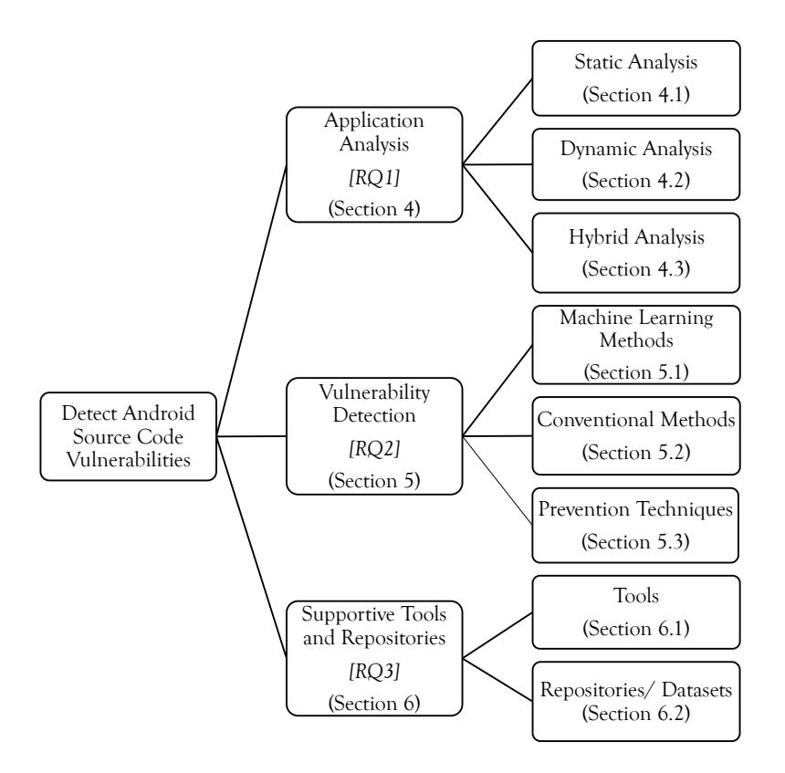
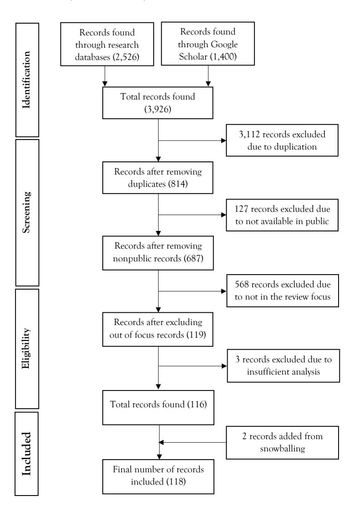
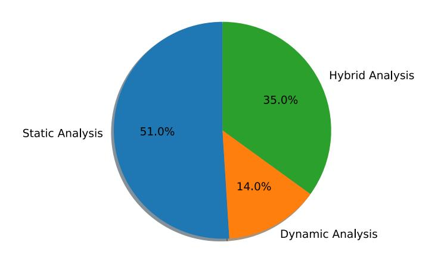
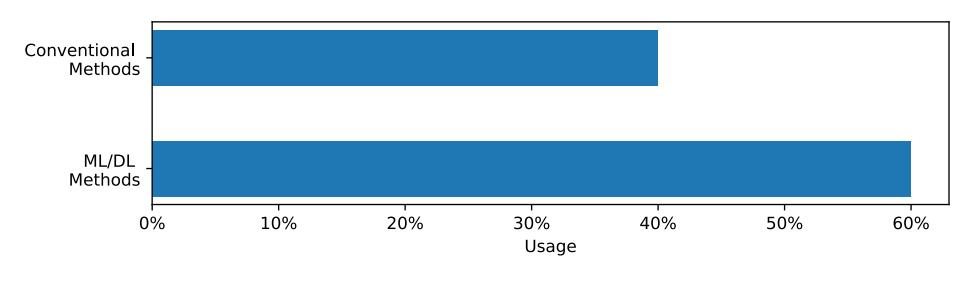
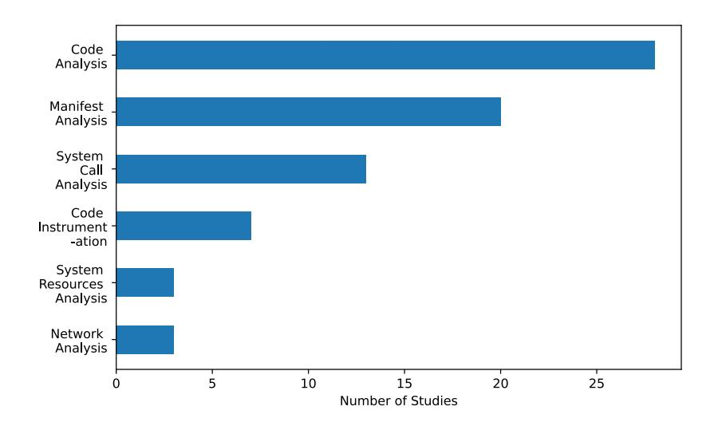
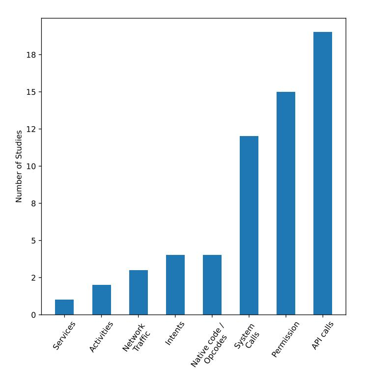
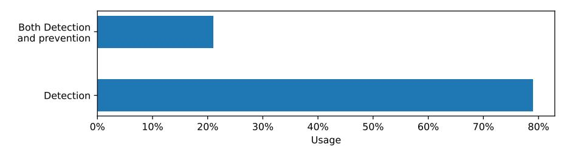

# Android Source Code Vulnerability Detection: A Systematic Literature Review

[JANAKA SENANAYAKE](HTTPS://ORCID.ORG/0000-0003-2278-8671)∗ , Robert Gordon University, UK and University of Kelaniya, Sri Lanka [HARSHA KALUTARAGE,](HTTPS://ORCID.ORG/0000-0001-6430-9558) Robert Gordon University, UK [MHD OMAR AL-KADRI,](HTTPS://ORCID.ORG/0000-0002-1146-1860) Birmingham City University, UK [ANDREI PETROVSKI,](HTTPS://ORCID.ORG/0000-0002-0987-2791) Robert Gordon University, UK [LUCA PIRAS,](HTTPS://ORCID.ORG/0000-0002-7530-4119) Middlesex University, UK

The use of mobile devices is rising daily in this technological era. A continuous and increasing number of mobile applications are constantly offered on mobile marketplaces to fulfil the needs of smartphone users. Many Android applications do not address the security aspects appropriately. This is often due to a lack of automated mechanisms to identify, test, and fix source code vulnerabilities at the early stages of design and development. Therefore, the need to fix such issues at the initial stages rather than providing updates and patches to the published applications is widely recognized. Researchers have proposed several methods to improve the security of applications by detecting source code vulnerabilities and malicious codes. This Systematic Literature Review (SLR) focuses on Android application analysis and source code vulnerability detection methods and tools by critically evaluating 118 carefully selected technical studies published between 2016 and 2022. It highlights the advantages, disadvantages, applicability of the proposed techniques and potential improvements of those studies. Both Machine Learning (ML) based methods and conventional methods related to vulnerability detection are discussed while focusing more on ML-based methods since many recent studies conducted experiments with ML. Therefore, this paper aims to enable researchers to acquire in-depth knowledge in secure mobile application development while minimizing the vulnerabilities by applying ML methods. Furthermore, researchers can use the discussions and findings of this SLR to identify potential future research and development directions.

CCS Concepts: • Security and privacy → Software security engineering; Software reverse engineering; Domain-specific security and privacy architectures; Malware and its mitigation; Vulnerability scanners; Software security engineering; Software reverse engineering; Domain-specific security and privacy architectures; Malware and its mitigation; Mobile platform security; Vulnerability scanners; • Computing methodologies → Machine learning; Machine learning.

Additional Key Words and Phrases: Source Code Vulnerability, Vulnerability Detection, Software Security, Android Security, Machine Learning

#### ACM Reference Format:

Janaka Senanayake, Harsha Kalutarage, Mhd Omar Al-Kadri, Andrei Petrovski, and Luca Piras. 2022. Android Source Code Vulnerability Detection: A Systematic Literature Review. 1, 1 (August 2022), 36 pages. <https://doi.org/10.1145/nnnnnnn.nnnnnnn>

Authors' addresses: [Janaka Senanayake,](https://orcid.org/0000-0003-2278-8671) j.senanayake@rgu.ac.uk, Robert Gordon University, Garthdee Road, Aberdeen, UK, AB10 7QB, janakas@kln.ac.lk and University of Kelaniya, Dalugama, Kelaniya, Western Province, Sri Lanka, 11600; [Harsha Kalutarage,](https://orcid.org/0000-0001-6430-9558) h.kalutarage@rgu.ac.uk, Robert Gordon University, Garthdee Road, Aberdeen, UK, AB10 7QB; [Mhd Omar Al-Kadri,](https://orcid.org/0000-0002-1146-1860) omar.alkadri@bcu.ac.uk, Birmingham City University, Millennium Point, Curzon Street, Birmingham, UK, B4 7XG; [Andrei Petrovski,](https://orcid.org/0000-0002-0987-2791) a.petrovski@rgu.ac.uk, Robert Gordon University, Garthdee Road, Aberdeen, UK, AB10 7QB; [Luca Piras,](https://orcid.org/0000-0002-7530-4119) l.piras@mdx.ac.uk, Middlesex University, The Burroughs, London, UK, NW4 4BT.

© 2022 Association for Computing Machinery.

Manuscript submitted to ACM

Permission to make digital or hard copies of all or part of this work for personal or classroom use is granted without fee provided that copies are not made or distributed for profit or commercial advantage and that copies bear this notice and the full citation on the first page. Copyrights for components of this work owned by others than ACM must be honored. Abstracting with credit is permitted. To copy otherwise, or republish, to post on servers or to redistribute to lists, requires prior specific permission and/or a fee. Request permissions from permissions@acm.org.

#### 1 INTRODUCTION

With technological enhancements and an increase in the usage of mobile devices, a growing number of people depend on mobile phones for their daily activities, both for the personal and professional aspects of their lives. Statista forecast that by 2023, there will be 4.3 billion smartphone users [136]. 71.45% of them use Android as the Operating System (OS) (May 2022) [135]. Because of this worldwide popularity, many application developers are developing various Android mobile applications with rapid development life cycles. However, most of these applications are developed without integrating proper security mechanisms, increasing their vulnerabilities at the development stage. Since Google Play does not extensively validate apps to detect code vulnerabilities when publishing [36], users may experience various issues caused by the lack of security checks [142]. Therefore, it is important to integrate appropriate Android source code vulnerability detection methods and tools when developing the apps.

Studies such as [20, 53, 59, 133, 134] have proposed several methods to detect vulnerabilities in source code, including some automated mechanisms to support the developers when designing and developing secured applications. An increasing number of these supporting methods, such as [45, 48, 89, 93] are based on machine learning and deep learning for automatic early detection of security issues and vulnerabilities, which can support the software engineers to improve software security. Studies in [10, 18, 116, 164] employ alternative techniques, to identify vulnerabilities. A thorough understanding of these existing methods is essential for developing Android applications by applying security best practices. Moreover, further research also can be conducted to enhance those methods. Therefore, researchers and the application development community can use this state-of-the-art SLR to fully understand the strengths and weaknesses of existing source code vulnerability detection methods and thus identify future research directions.

As discussed in Section 2, several limitations, including not covering recent proposals, relatively narrow scopes, and lack of critical appraisals of suggested detection methods, have been identified in these existing literature reviews on Android vulnerability detection and prevention methods. The lack of a thorough analysis of ML or Deep Learning (DL) based methods when detecting vulnerabilities was also a limitation of existing works. This SLR addresses these limitations by critically evaluating 118 carefully selected technical studies while answering the formulated research questions. Therefore this work is unique, which addresses the research gap in this area.

#### 1.1 Research Questions

This systematic review aims to answer the following research questions.

#### RQ1: What are the existing methods for source code and application analysis?

Many research studies considered various source code analysis methods, including application reverse engineering. Moreover, byte-code-based analysers are also used since Android apps can be easily reverse engineered to source code. The static analysis techniques were mainly used on a broad scale, while also applying dynamic and hybrid analysis techniques to analyse source code. These methods are discussed in Section 4.

## RQ2: What are existing Android source code vulnerability detection methods, and how to use them to prevent vulnerabilities?

When detecting Android source code vulnerabilities, ML methods and some conventional methods were applied in various studies. Among them, applying ML methods has been popular in recent years among the research community. Therefore, many studies applied various ML methods. In contrast, few studies applied conventional non-ML-based methods. Detecting vulnerabilities alone is not sufficient when boosting the security of Android

Fig. 1. Structure of this Systematic Literature Review paper

source code. Ways to prevent security issues by integrating the detection techniques into software development environments should also be studied. These detection and prevention methods are discussed in Section 5.

## RQ3: Which tools and repositories can be used to detect vulnerabilities in Android apps?

Exploring tools, repositories, and datasets that can be used to analyse source code and detect vulnerabilities is also essential. Identifying their characteristics and usage is beneficial for conducting new research studies. Therefore, those facts are discussed in Section 6.

## 1.2 Organization of the Review

The SLR is structured as presented in Fig. 1 to answer the formulated research questions in three main sections.

The rest of this paper is organised as follows. Background and related literature are discussed in Section 2, followed by a detailed description of the review methodology in Section 3. The experimental studies reviewed in this SLR are categorised into three main sections: application analysis, code vulnerability detection, supportive tools and repositories. As the initial step of vulnerability detection, applications should be analysed, and three types of analysis techniques (static analysis, dynamic analysis, and hybrid analysis) are used. Studies related to this application analysis are reviewed in Section 4. Code vulnerability detection related studies are reviewed in Section 5, which discusses the ML-based Manuscript submitted to ACM

methods and conventional methods. It further discusses how the existing prevention techniques can be integrated with the identified detection methods. Section 6 reviews supportive tools and repositories which can be used in application analysis, vulnerability detection and prevention. Section 7 discusses the threats to the validity of the review. Finally, Section 8 concludes the paper.

#### 2 BACKGROUND AND RELATED LITERATURE REVIEWS

This section discusses the background related to the security of Android applications and the vulnerabilities associated with them. It provides a high-level overview of the Android layered architecture, its security implications, Android application vulnerabilities, and potential mistakes made by users and developers that can lead to security and privacy issues. It also explains the ML process since the paper focuses more on ML-based vulnerability detection mechanisms. Then, it would be helpful for all the readers to understand the content easily. Furthermore, the existing literature reviews are also discussed in this section.

#### 2.1 Background

2.1.1 Layered Architecture and Security Implication of Android. Android has a layered architecture that provides a systematic way to communicate with device components, software applications, and its users. Android OS is built on top of the Linux kernel [125]. It provides drivers and mechanisms for networking and manages virtual memory, device power, and security. On top of the Linux kernel layer, hardware abstraction layer, native C/C++ libraries layer, and Android runtime layer, Java Application Programming Interface (API) framework layer are stacked [12].

Each of these layers performs unique tasks while interacting with other layers. The study in [125] provided a layered approach for Android application development, which uses the layered architecture. In this approach, a server interacts with the Hypertext Transfer Protocol (HTTP) layer, while the API layer interacts with the HTTP layer. The API layer interacts with the generic data layer, and that interacts with the platform-dependent data layer. The User Interface (UI) layer interacts with the platform-dependent layer. Many of the source code vulnerabilities can be identified in the top layer, which contains user and system apps since the regular app developers mainly focus on that layer. However, the understanding of the layered architecture is beneficial to mitigating some of the vulnerabilities.

Android platform security has been defined with several rules in the Android security model [94]. They are multiparty consent, open eco-system access, security and compatibility requirements, factory restores the device to a safe state, and applications' security principles. The study in [165] identified three main security mechanisms, including 1) process sandbox, which is the sandbox environment of Android; 2) signature mechanism, which can digitally sign applications with the private key before being released; 3) permission mechanism, which defines the ability of an app to access protected APIs and resources. The sandbox environment of Android does not allow the use of one application resource by the other. Sandboxes are developed using Linux, and only they can access the core functionalities of the OS. Monitoring system calls and acknowledging them is a responsibility of the Sandbox [125], and they are used to prevent malicious applications which request access for system functionalities through vulnerable source code.

Mobile devices can easily be lost or stolen, connect with several networks on the go, and contain more privacy-related data since they are close to the users [131]. Therefore, limiting to traditional security mechanisms will not be sufficient for mobile devices. Malicious actions including gaining physical access to the device, connecting with un-trusted networks, installing and running untrusted applications, executing untested code blocks and contents are identified as some of the threats [94], which can occur in an Android mobile device. Thus, security measures should be tightened though mitigating vulnerabilities to safeguard the data in Android devices. Manuscript submitted to ACM

Therefore, implementing proper security measurements is a must to improve the security of Android devices and their applications. Hence, detecting vulnerabilities of Android applications and their source code should be performed when implementing the security best practices.

2.1.2 Vulnerabilities of Android Applications. Many of the Android applications are freely available to download from app markets. Therefore the usage of these free applications is very high. Hackers may try to penetrate these applications and grab user data on a massive scale or perform illegal activities if there are no proper security mechanisms in place in the application [130]. Therefore, the app developer should carefully check for proper security measures. Issues in Secure Sockets Layer (SSL), Transport Layer Security (TLS) commands, permissions, web views, key stores, fragments, encryptions, intents, intent filters, and leaks were identified as common causes for vulnerabilities of Android mobile apps [47]. Attacks from the Internet and Wireless Personal Area Networks (WPAN), and malware transmitted through personal computers can exploit these vulnerabilities. The study related to Android vulnerability [165], identified SSL/TLS protocol vulnerabilities, forged signature vulnerabilities, and some of the common vulnerabilities in Input/ Output (I/O) operations, intents, permissions, web views.

There are several types of vulnerabilities categorised in CyBOK [101]. They are memory management vulnerabilities, structured output generation vulnerabilities, race condition vulnerabilities, API vulnerabilities, and side-channel vulnerabilities. Safe languages, spatial vulnerabilities, temporal vulnerabilities, code corruption attacks, control-flow hijack attacks, information leak attacks, data-only attacks were identified as memory management vulnerabilities. It has classified Structured Query Language (SQL) injections, command injection vulnerabilities, script injection vulnerabilities, stored injection vulnerabilities, high-order injection vulnerabilities as structured output generation vulnerabilities. It has listed concurrency bugs and time-of-check to time-of-use issues as race condition vulnerabilities. Correct use and implementation were also recognised as cases where API vulnerabilities can evolve while mentioning side-channel vulnerabilities as the other category of vulnerabilities. Under this software-based side channel, covert channels, microarchitectural effects, and fault injection attacks were considered. Some of these vulnerabilities are related to Android, and they can be mapped with Common Vulnerabilities and Exposures (CVE) [33] and Common Weakness Enumeration (CWE) [34], which is possible to use as the starting point to categorise vulnerable source code.

The study in [49] identified 563 Android-related vulnerabilities, including gain privileges and information, memory corruption, Denial of Services (DoS), malicious code execution, overflow, and bypass security measures. Further, it has analysed trends of those vulnerabilities from 2009 to 2019, and the peak period of vulnerabilities was started in 2016. The empirical study conducted in [82] discussed the types of Android-related vulnerabilities, the layers and subsystems of Android which could be affected by vulnerabilities, and the survivability of vulnerabilities. This study consists of 660 vulnerabilities from the CVE Details [33] and the official Android Security Bulletins [11]. It was identified that most of the vulnerabilities could happen from data processing issues, access controls, memory buffers, and improper input validation, primarily due to vulnerable code lines. Most of them can be reduced by following secure coding practices.

2.1.3 User and Developer Mistakes. Mistakes can happen when using an application by the users or when developing applications by the developers. Sometimes users allow permissions when installing or running an application without knowing the exact need, leading to some vulnerabilities. Hackers and malicious app developers also try to steal data from users by forcing them to allow specific permissions. Authors in [92] identified that most security issues in mobile applications occurred due to the actions of the users. These issues can be minimised if the applications are developed with less vulnerable source code.

Developers also make mistakes by not following an extensive testing and validation process from the initial stage of the app development life cycle. When developing mobile applications, many mobile app developers are still not focusing on writing secure codes even though there are mechanisms in place [100]. Due to these developer mistakes, some of the vulnerabilities have occurred. Instances such as mentioning unwanted permissions in the AndroidManifest.xml file can also lead to arise vulnerabilities of the mobile applications. If these permissions are dangerous level permissions, users will have to grant those also, which can cause rejections of the app by some users [25]. These vulnerabilities may not be detected when publishing apps to Google Play, since Google Play itself could not thoroughly analyse the code of the mobile applications when publishing it, such as in Apple App-Store [51]. Therefore, proper source code vulnerability detection mechanisms should be integrated with coding.

2.1.4 Machine Learning Processes. The use of ML methods for vulnerability detection has been increased in recent years [53]. Therefore, comprehending the ML processes is beneficial to understanding ML-based source code vulnerability detection studies.

The ML lifecycle includes data extraction, preprocessing, feature selection, model training, evaluation, and deployment steps [8] and ML consists of supervised learning, unsupervised learning, semi-supervised learning, reinforcement learning, and deep learning. A labelled dataset is used to train the model in supervised learning to solve classification and regression problems. Algorithms such as Naive Bayes (NB), Logistic Regression (LR), Linear Regression, Support Vector Machine (SVM), Decision Tree (DT), Random Forest (RF), and k-Nearest Neighbors (kNN) can be applied for supervised learning. Unsupervised learning identifies hidden patterns in data using clustering, association and dimensionality reduction. A labelled dataset is not required to train the model. K-means clustering, Principal Component Analysis (PCA), and autoencoders are some methods that can be applied for unsupervised learning. A mix of supervised and unsupervised learning techniques is applied in semi-supervised learning and used in the case of limited labelled data in the used dataset. The model parameters are updated with the feedback from the environment in reinforcement learning where no training data is involved. This ML method proceeds as prediction and evaluation cycles. DL is defined as learning and improving by analysing algorithms independently, which consists of a higher or deeper number of processing layers. Convolutional Neural Network (CNN), Long Short Term Memory Network (LSTM), Recurrent Neural Network (RNN), Generative Adversarial Network (GAN), and Multilayer Perceptron (MLP) are some of the popular DL algorithms [21].

#### 2.2 Related Literature Reviews

Previous reviews [1, 2, 38, 50, 72, 80, 86, 127, 132] discussed various security-related studies, including vulnerability detection methods for Android applications and the ways to prevent them. With the rapid focus on software security, most of these studies and experiments were conducted after 2015.

The security in the Android platform was studied in [1]. It reviewed the studies on several threats to Android, such as information leakage, privilege escalation, repackaging apps, denial of service attacks, and colluding. It has also reviewed Crowdroid [24], Kirin [40], AndroSimilar [42], RiskRanker [55], RiskMon [67], FireDroid [123], Aurasium [161], DroidScope [162], RecDroid [166], and DroidRanger [168] methods. Those studies were reviewed with objectives such as the assessment, the source code analysis method (i,e. static or dynamic analysis), and detection mechanisms. However, there are limitations in this review, such as following an informal review approach and not covering comprehensive details on vulnerability detection and prevention mechanisms.

It is crucial to identify the duplicate codes in several places in a program. When identifying bugs in a program, code repetition places also should be identified as all the places should be revised. The study in [2] reviewed various studies related to code clone detection. This study has systematically reviewed 54 studies under six categories: textual approaches, lexical approaches, tree-based approaches, metric-based approaches, semantic approaches, and hybrid approaches. Twenty-six clone detection tools were also identified in this review, and found that many of the tools and models can be applied in Java/ C++ codes. However, since this review contained papers from 2013 to 2018, it is better to review the latest code clone detection methods proposed after 2018.

Authors in [38] analysed 55 studies from 2015 to 2021 related to software vulnerability detection. The selected articles were grouped into several categories across various vulnerability detection evaluation criteria such as neural network, machine learning, static and dynamic analysis, code clone, classification models and frameworks. Based on the analysis, it has been identified that many researchers used machine learning strategies to detect vulnerability in software since a large volume of data can be analysed easily with machine learning. Though some of the reviewed studies have overlaps with vulnerability detection of source code written in C and Java, a further review should be conducted specifically for Android source code vulnerability detection.

The study in [50] reviewed Android security assessments, including trends and patterns of different analysis approaches, analysis techniques, code representation tools, and applicable frameworks by analysing about 200 studies from 2013 to 2020. It has also focused on privacy leaks, cryptographic issues, app cloning, permission misuse, code verification, malware detection, test case generation, and energy consumption. It discussed sensitivity analysis, data structures, and code representations in the reviewed literature under the static analysis techniques. Kernel level, application level, and emulator level inspections were also considered under taint analysis and anomaly-based approaches in dynamic analysis techniques. The review highlighted that many research studies were conducted related to Android vulnerabilities and leaks. Moreover, This study systematically reviewed several android assessments techniques and identified call graphs, control flow graphs, and inter-procedural control flow graphs as the used data structures. However, the studies related to preventing vulnerabilities were not discussed. Moreover, reviewing studies on non-ML-based methods to detect and prevent vulnerabilities is possible since this review considered only ML methods.

Related studies on automated testing mechanisms of Android applications were systematically reviewed in [72] from 2010 to 2016. This paper discussed three functional testing types: black-box, white-box, and grey-box by analysing Android related studies, including test-related objectives, targets, levels, and techniques, along with their validation depths. The considered test objectives were bugs, defects, compatibility, energy, performance, security, and concurrency. Under test targets, it considered inter-component communication, inter-application component, graphical user interface, and events. System, integration, and regression were considered for the test levels while testing types, testing environment, and testing methods were listed as used test techniques. Further, executing tests using emulators and real devices was also discussed. It examined testing methods including mutation, concolic, A/B, fuzzing, random, search-based, and model-based. This review considered frequently used essential tools such as AndroidRipper [9], Monkey [14], Silkuli [61], Robotium [119], EMMA [121], and Roboelectric [158]. Though it has reviewed Android app testing comprehensively till 2016, the recent studies are not considered.

The review in [80] analysed 124 research studies from 2011 to 2015 intending to identify static analysis mechanisms for Android applications. It identified that static analysis was used in many research studies related to privacy and security, and taint analysis was the widely applied technique in those studies. According to that, Soot (a framework for analyzing, instrumenting, optimizing, transforming and visualizing Java and Android applications) [76], and Jimple (an intermediate representation that can simplify analysis and transformation of Java bytecode) [151] were the widely Manuscript submitted to ACM

used tools and formats, and a few studies considered path-sensitivity. After analysing, this review identified that leaks and vulnerabilities are the primary concerns addressed by the other research studies. Moreover, this review found permission misuse, energy consumption, clone detection, test case generation, code verification, and cryptographic implementation issues. Some of the novel techniques, including ML related studies, were not reviewed since this review focused on research from 2011 to 2015.

The work in [86] systematically reviewed DL-based Android malware defence by answering three primary research questions: 1) aspects of Android malware defences applied when using DL, 2) approaches developed for malware defences, and 3) emerging and potential research trends for DL-based Android malware defences. The review considered the technical studies from 2014 to November 2021. The review identified that while many of the reviewed studies mainly consider DL-based on Android malware detection, some defence approaches were based on non-DL based methods. It has also been identified that static program analysis is widely used to collect features, and semantic features are frequently occurring. Moreover, it concluded that most of the approaches were performed as a supervised classification task. This review identified that many studies were conducted to detect malware, and other types of more detailed analyses on malicious apps are receiving increasing attention. Nevertheless, it was not comprehensively reviewed how the other types, such as malicious code detection and code vulnerability detection, can be performed.

The systematic review conducted in [127] discussed ML and DL-based Android malware detection methods, along with a comparison of methods and their accuracies. This review analysed many studies from 2017 to 2021 and identified that static, dynamic, and hybrid analysis could be used with ML/ DL models to detect malware. Furthermore, it identified that static analysis is the widely used technique in the reviewed studies. It has been found out that RF, SVM, NB, kNN, LSTM, and AdaBoost (AB) were the widely used ML/DL models in this context. Further to the malware detection method, this review briefly discussed Android software vulnerability identification. It reviewed the methods and techniques to identify source code vulnerabilities. The critiqued studies have identified that hybrid analysis techniques were widely used to identify Android source code vulnerabilities. The main focus of this review was Android malware detection using ML/ DL. Therefore, it is still essential to review code vulnerability detection methods to a great extent.

Studies related to the Android security framework, its security mechanisms assessments, and mitigation strategies were reviewed in [132]. Under the security mechanisms, user interfaces, file access, memory management, type safety, mobile carrier, application permissions, component encapsulation, and application signing were reviewed. It has reviewed the security analysis studies related to Android framework cornerstone layers, application-level permissions, installing applications, mobile web browsers, SQL injections, connectivity and communication, hardware, software updates, malware in Linux environment, and malware related to Java. Under mechanisms, studies related to anti-malware tools, firewalls, intrusion detection and prevention methods, access controls, permission management applications, encryption methods, and spam filters were reviewed. Though this review discussed the studies conducted under Android security by following an informal and non-systematic approach, it does not consider security issues such as API vulnerabilities, concurrency bugs, and the latest OS-related bugs due to the considered period in the review.

Though the existing reviews provide in-depth details of the related studies, reviews such as [72, 80] did not cover the recent works conducted in this area. Reviews such as [2, 132] did not thoroughly review the studies on Android-specific vulnerability detection using various experiments performed in source code analysis. Therefore, it is required to conduct a comprehensive review of recent studies related to Android source code vulnerability detection and prevention mechanisms. Table 1 summarises and compares the related reviews with this work's contribution.

| Paper                      | Focus of the Review                                                                            | Period        | Review Approach                                                            | Number Re of viewed Studies | Android Specific | Static Analysis | Dynamic Analysis | Hybrid Analysis | ML-based code vul nerability detection | Non ML-based code vul nerability detection | Code vul nerability preven tion | Supportive tools and reposito ries |
|----------------------------|------------------------------------------------------------------------------------------------|---------------|----------------------------------------------------------------------------|-----------------------------------------|---------------------|--------------------|---------------------|--------------------|-------------------------------------------------|--------------------------------------------------------|------------------------------------------|---------------------------------------------|
| Ahmed et al. [1]        | Security in Android associated platform, threats, and malicious application growth | 2010- 2017 | Informal                                                                   | 14                                      | ✓                   | ✓                  | ✓                   | ✓                  | x                                               | x                                                      | x                                        | x                                           |
| Ain et al. [2]          | Code clone detection for vulnerabilities                                                    | 2013- 2018 | Systematic search (Budgen [23] and [71] Kitchenham guidelines) | 54                                      | x                   | ✓                  | ✓                   | ✓                  | x                                               | ✓                                                      | x                                        | x                                           |
| Eberendu et al. [38]    | Various methods for de tecting software vulner abilities                                 | 2015- 2021 | Systematic search - (PRISMA model [109])                             | 55                                      | x                   | ✓                  | ✓                   | ✓                  | ✓                                               | x                                                      | x                                        | x                                           |
| Grag et al. [50]        | Android security asse ments and application analysis methods                             | 2013- 2020 | Systematic search (Kitchenham guide lines [71])                      | 200                                     | ✓                   | ✓                  | ✓                   | ✓                  | ✓                                               | x                                                      | x                                        | ✓                                           |
| Kong et al. [72]        | testing Automated mechansims for An droid                                             | 2010- 2016 | Systematic search (Kitchenham guide lines [71])                      | 103                                     | ✓                   | ✓                  | ✓                   | x                  | x                                               | x                                                      | x                                        | ✓                                           |
| Li et al. [80]          | Static analysis for An droid apps                                                           | 2011- 2015 | Systematic search (Kitchenham guide lines [71])                      | 124                                     | ✓                   | ✓                  | x                   | x                  | x                                               | ✓                                                      | x                                        | x                                           |
| Liu et al. [86]         | Malware and malicious code detection with DL                                                | 2014- 2021 | Systematic search (Kitchenham guide lines [71])                      | 132                                     | ✓                   | ✓                  | ✓                   | ✓                  | ✓                                               | x                                                      | x                                        | x                                           |
| Senanayake et al. [127] | Malware detection and malicious code detec tion with ML                                  | 2017- 2021 | Systematic search model (PRISMA [109])                            | 106                                     | ✓                   | ✓                  | ✓                   | ✓                  | ✓                                               | x                                                      | x                                        | x                                           |
| Shabtai et al. [132]    | Android security frame work and security as sessment                                     | 2007- 2009 | Informal                                                                   | 42                                      | ✓                   | x                  | x                   | x                  | x                                               | ✓                                                      | x                                        | x                                           |
| This work               | Android code vulner ability detection and prevention                                     | 2016- 2022 | Systematic search - (PRISMA model) [109])                            | 118                                     | ✓                   | ✓                  | ✓                   | ✓                  | ✓                                               | ✓                                                      | ✓                                        | ✓                                           |

Table 1. Summary of Related Reviews

### 3 METHODOLOGY

The Preferred Reporting Items for Systematic reviews and Meta-Analysis (PRISMA) model [109] was used in this review to report and analyse the research studies conducted in this domain. Based on the objective of this study, initially, the search strategy was defined to identify the conducted studies which can be used to answer the research questions. The database usage, and the inclusion and exclusion criteria were also defined. The study selection, data extraction and synthesis were conducted as the next stage to identify studies aiming to answer the formulated research questions. Threats to the validity of this SLR, and the mechanism to reduce the bias and other factors that could have influenced the outcomes of this study were also identified.

## 3.1 Search Strategy

As the initial step of the review process, existing literature reviews on Android malicious code detection and vulnerability detection were analysed to identify the research gap. Once the research gap was identified, the search string was used to extract and identify the technical studies related to the review's focus.

The search strategy involves outlining the most relevant bibliographic sources and terms of search. This review used several top research repositories including ACM Digital Library, IEEEXplore Digital Library, Science Direct, Web of Science, and Springer Link as primary sources to identify studies. The search string to browse through Manuscript submitted to ACM

| Search Term                  | ACM    | IEEEXplore | Science Direct | Web of Science | Springer | Total Count |
|------------------------------|--------|------------|----------------|----------------|----------|-------------|
| vulnerability detection      | 428    | 377        | 264            | 557            | 496      | 2,122       |
| source code vulnerability    | 10     | 13         | 17             | 11             | 36       | 87          |
| code vulnerability detection | 9      | 10         | 8              | 12             | 20       | 59          |
| vulnerability analysis       | 381    | 331        | 2,456          | 1,632          | 740      | 5,540       |
| vulnerable code              | 282    | 99         | 88             | 103            | 201      | 773         |
| static analysis              | 5,596  | 2,210      | 2,609          | 3,390          | 4,729    | 18,534      |
| dynamic analysis             | 2,652  | 1,947      | 3,048          | 2,197          | 2,695    | 12,539      |
| hybrid analysis              | 175    | 88         | 150            | 132            | 257      | 802         |
| vulnerability dataset        | 22     | 10         | 24             | 10             | 41       | 107         |
| android                      | 12,482 | 8,942      | 5,331          | 9,942          | 12,618   | 49,315      |
| machine learning             | 54,996 | 88,735     | 146,255        | 215,080        | 85,194   | 590,260     |
| deep learning                | 24,316 | 72,742     | 66,147         | 127,016        | 48,450   | 338,671     |
| formal methods               | 3,488  | 1,335      | 1,686          | 3,859          | 5,844    | 16,212      |
| heuristic methods            | 760    | 1,271      | 3,261          | 1,635          | 3,445    | 10,372      |
| Complete Search String       | 688    | 146        | 582            | 255            | 855      | 2,526       |

Table 2. Search Results Distribution across Primary Sources for each Search Term

research repositories is ((("vulnerability detection") OR ("source code vulnerability") OR ("vulnerable code") OR ("code vulnerability detection") OR ("vulnerability analysis") OR ("static analysis") OR ("dynamic analysis") OR ("hybrid analysis") OR ("vulnerability dataset")) AND ("android") AND (("machine learning") OR ("deep learning") OR ("formal methods") OR ("heuristic methods"))).

A few years later from the initial release of Android in 2008, security concerns were discussed with the increasing popularity of Android applications [135]. Methods to detect and prevent vulnerabilities by improving software security using ML and non-ML-based methods were also proposed in several studies. There was a boost in applying various techniques to improve application security in the last five years [85], and vulnerability detection in mobile applications using ML techniques-related trends increased from 2016 [53]. Hence, many researchers are involved in identifying novel ML-based methods to enhance software security. Considering these reasons, technical studies from 2016 to June 2022 were reviewed. The search results distribution across primary sources for each search term is listed in Table 2.

Google Scholar was also used as another source to identify research studies published in quality venues since it can be used to identify research studies not published in primary repositories. "Android source code vulnerability detection" was used as the search query. The range of publication years was set to 2016-2022. Though the search results included about 17,500 records, only the top 200 (sorted by relevance) results for each year were considered, resulting in 1,400 studies.

#### 3.2 Study Selection, Data Extraction and Synthesis

Initially, through the research database search in the top research repositories, 2,526 research papers and from Google Scholar, 1,400 were identified. 3,112 were excluded from these 3,926 papers because of duplicate entries, and another 127 were excluded because they were not publicly available. 687 studies remained after the initial screening. Research Manuscript submitted to ACM

Fig. 2. PRISMA method: collection of papers for the review

repository search engines often list irrelevant results presence articles [23]. Therefore, the collected list of relevant studies was consolidate by manually going through all the papers and examining the title and abstract to ensure that they align with the focus of this review. After these steps, 119 studies were eligible, but 3 more articles were excluded due to data analysis and experiment issues in the given context, which remains 116 studies. The snowballing process [159] was also performed, considering all the references presented in the retrieved papers and evaluating all the papers referencing the retrieved ones, which resulted in 2 additional relevant papers. The same process was applied as for the retrieved papers. Once all these steps were performed, the remaining 118 articles were reviewed in this study. The results were cross-validated by performing peer-verification process by all the authors. Fig. 2 shows a summary of the paper selection method for this systematic review.

#### 4 APPLICATION ANALYSIS

Applications or source code should be analysed as the first step in detecting vulnerabilities [63]. There are two analysis approaches: analysing the reverse-engineered source code of Android Application Packages (APKs), and analysing the source code simultaneously when writing the code. Most of the research studies have been conducted related to the reverse-engineering approach. However, the second approach has more advantages for the developers to detect code vulnerabilities at the early stages of development life cycle. Reviewing studies on both approaches is vital since their methodologies have many overlaps.

It is required to extract features as the initial step of analysing the source code of a given application. These features can be extracted through three analysis techniques named as static, dynamic, and hybrid analysis [6, 32, 87]. Reversed engineered APKs, application's source code, or byte code can be analysed using static analysis. However, it is impossible to identify all the bugs and failures using static analysis only since it does not cover the vulnerabilities that can occur during the execution time of the app. Features can be generated by executing applications in runtime when performing the dynamic analysis. The runtime behaviour is monitored while using specific input parameters. However, it is possible to crash the run time environment due to severe vulnerabilities, and there are possibilities that some vulnerabilities remain undetected [115]. The hybrid analysis technique contains characteristics of both static and dynamic analysis techniques. Therefore, this approach can analyse the source code as well as run time behaviour of the application [10].

#### 4.1 Static Analysis

Native Android applications can be developed using Java or Kotlin, and Java is the widely-used programming language for this purpose. Frameworks such as React Native and Xamarin can also be used to develop Android mobile applications [15]. However, these mobile applications also contain Extensible Markup Language (XML) files such as the Android Manifest, User Interface (UI) layouts, and resources among the application files. Therefore, it is required to identify the issues in both source code files and XML files. Static analysis can analyse both of these files without executing them. There are two static analysis methods: manifest analysis and code analysis. These two methods differ based on feature extraction. Some studies use either manifest analysis or code analysis, while a few use both [73].

The manifest analysis is a widely used static analysis method. It can extract package names, permissions, activities, services, intents, and providers from the AndroidManifest.xml file. The AndroidManifest file contains all the permissions used in a particular application, categorised as dangerous, signature and normal. Twenty-two permissions have been identified as significant permissions in SigPID in [78], and they were identified by developing a three-level data purring method. Those three levels were support-based permission ranking, permission mining with association rules, and permission ranking with a negative rate. The second method of the static analysis is code analysis which considers about the source code files. Features such as API calls, information flow, taint tracking, native code, clear-text analysis, and opcodes can be extracted with code analysis. The MaMaDroid [107] method provides an example for API calls analysis. It abstracted apps' API call executions to create regular classes or packages using static code analysis techniques and then determined the call graph using the Markov chain.

Authors in [50] proposed five aspects for static analysis: analysis techniques, sensitivity analysis, code representation, data structures, and inspection level. The analysis techniques are symbolic execution, taint analysis, program slicing, abstract interpretation, type checking, and code instrumentation. Objects, contexts, fields, paths, and flows are considered for sensitivity analysis. Smali [57], Dex-Assembler [111], Jimple [151], Wala-IR [153], and Java Byte code/ Java class are

used for code representation while Call Graph, Control Flow Graph, Inter-Procedural Control Flow Graph are data structures. Kernels, applications, and emulators are considered for the inspection levels.

#### 4.2 Dynamic Analysis

The second technique is dynamic analysis, which is used to analyse the application by executing it in a sandbox runtime environment. A completed product (i.e., APK) is required to apply this method. Therefore, it is widely used to detect vulnerabilities and malware in developed applications.

Five feature extraction techniques were identified for the dynamic analysis in [50], and they were network traffic analysis, code instrumentation, system call analysis, system resources analysis, and user interaction analysis. Networkrelated features, process-related features, usage-related details, and component interactions were extracted using those five methods. Under the network-related features, uniform resource locators, internet protocols, network protocols, network certificates, and network traffic were considered while considering non-encrypted data, Java classes, intents, and system call for process-related features. Usage-related features such as processor, memory, battery, network, and process reports were also considered. Additionally, buttons, icons, actions, and events were considered for user interaction analysis features.

Authors in [52] used dynamic analysis techniques to identify Android vulnerabilities. It contained three modules: network traces collection, network feature extraction, and network feature detection. Network activities of running apps were periodically recorded and monitored in the traces collection module. Feature extraction module extracted network features used in applications such as origin-destination-based features, domain name system-based features, transmission control protocol-based features, and hypertext transfer protocol-based features and performed the vulnerability detection process.

#### 4.3 Hybrid Analysis

The hybrid analysis uses both static and dynamic features to analyse a given application. The study in [99] used static features, including permissions and intents and dynamic features, including IPs, emails, and URLs, to extract various information related to applications. The APKTool [150] was used to decompile the APK as the initial step. After extracting the data, it used disassembled dex files to create the feature vector for further analysis. The APK files were executed in an emulator to extract the behaviours of the dynamic features.

The model proposed in [143] used a hybrid analysis to identify Android security vulnerabilities. It can analyse metadata and data flow using static analysis and API hooks and executable scripts using dynamic analysis. The static analysis technique of this work was able to identify eight vulnerable categories: unrestricted component, insecure JavaScript in WebView, sensitive data processed in plaintext, privacy leak by log, dynamically loading a file, insecure password, intent exposure, Structured Query Language (SQL) inject. The dynamic analysis technique was able to identify the unverified inputs vulnerability category. However, it may fail if the app uses specific security measures such as signature verification. Hence, false-positive results can be expected sometimes. Nevertheless, the overall analysis can perform within 93 seconds on average with approximately 95% accuracy. Issues in SSL/ TLS are also essential to identify, and they can be analysed using hybrid analysis. The DCDroid framework in [154] used hybrid analysis techniques to identify them, and the study found that 360 out of 2213 applications contained security issues related to SSL certificates/ TLS.

#### 5 CODE VULNERABILITY DETECTION

Mobile applications can be misused to breach the security mechanisms [53] due to the source code vulnerabilities. However, developing applications with zero defects or vulnerabilities is impossible but can be achieved to a certain extent, and vulnerabilities of the source code must be detected to accomplish that. Several methods including machine learning, deep learning, heuristic-based methods, and formal methods can be applied to detect source code vulnerabilities with the use of static analysis, dynamic analysis and hybrid analysis.

#### 5.1 Machine Learning Methods

ML and DL methods such as NB, LR, DT, RF, GB, LSTM, RNN, and MLP were applied in the studies related to vulnerability detection. To train such ML or DL methods, features should be identified in the Android application by following a suitable analysis technique: static, dynamic, or hybrid.

5.1.1 Machine Learning with Static Analysis. ML methods can be applied with static analysis techniques when detecting code vulnerabilities if the source code is formulated into a generalised form. Abstract Syntax Tree (AST) is a popular way of generalising the code [110]. The rate of false alarms on vulnerabilities depends on the accuracy of formulating the AST and its generalisation mechanism, in addition to the quality of features, selected dataset and trained algorithms. Studies such as [53] proved the possibility of employing ML and DL-based methods on a generalised architecture of source code such as AST to detect Android code vulnerabilities. Therefore, improvements to feature generation methods like AST building are identified as a research gap in this area to employ ML techniques to the problem.

Some studies applied static analysis techniques in various ways with ML methods to detect malicious code and vulnerabilities. The WaffleDetector [138] is a static analysis approach to detect malicious code and vulnerabilities in Android applications by using sensitive permissions, program features, and API calls. Extreme Learning Machine (ELM) was used in this for further analysis. In [45], vulnerability detection and patching framework was proposed named as Vulvet. This framework used static analysis approaches to detect vulnerabilities in Android applications along with a multi-tier multi-pronged analysis technique. Further, this framework proposed an automated patch generation process for vulnerabilities. Augmented control-flow analysis, and Android-specific component validation approaches were also proposed to avoid false positives. The Vulvet framework used some features in the Soot framework, such as data-flow analysis, call-graph analysis, intermediate code scanning, taint analysis, parameter analysis, API analysis, and return value analysis. It used vulnerability resolution, control-flow instrumentation, methods/parameters reconstruction, secure method call augmentation, manifest modification, and code elimination. This model can detect vulnerabilities with 95.23% precision and 0.975 F-Measure on 3,700 apps from the benchmark and other Android market places. It has also been identified that 10.46% of evaluated apps were vulnerable to various exploits. Though this is a comprehensive model, there are some limitations, such as not analysing and patching vulnerabilities in native code, not supporting Java reflecting and dynamic code loading, and marking all the files read from external storage as malicious which needs to be overcome with further studies.

Analysing data flow is also important to detect malicious code and applications. The study in [163] proposed a mining method for topic-specific data flow signatures to characterise malicious Android apps. It identified that the topic-specific data flow signatures are much better than the overall data flow signatures to characterise malicious and vulnerable apps. Descriptions and sensitive data flow patterns were obtained from 3,691 benign and 1,612 malicious apps for analysis. Once the features were extracted, a topic model was built using adaptive Latent Dirichlet Allocation Manuscript submitted to ACM

(LDA) with Genetic Algorithms (GA). An optimal number of topics was determined with GA. After that, a topic-specific data flow signature was generated by computing the information gain ratio of each piece of data flow information. Then the information gain ratio of the piece of data flow information was generated, and it was used to characterise the apps. Though this study considered a high number of apps, their representative is not considered, which might decrease the process accuracy. That limitation could be overcome by analysing more representative apps and ensuring the sample sizes of each topic.

Source code can be retrieved from the APK file or Portable Executable (PE) file to perform the static analysis. In [70], an automated method to classify malicious codes and secure codes using PE structure. It used static analysis with RF, GB, DT, and CNN models and achieved 98.77% detection accuracy. The model built in [20] was able to predict software code vulnerabilities before the release of the application. The code was represented using an AST to analyse it, and ML models were applied. It used Python, C, and C++ source codes taken from well-known datasets such as NIST [103], SAMATE [104], SATE IV Juliet Test Suites [105], and Draper VDISC [122] for the training purpose. One main drawback of this approach was the inability to locate the specific place of the vulnerable code segment.

The developed mechanism in [31] classifies the C language functions into vulnerable or non-vulnerable using ML methods. The first step was to prepare the AST. After that, data pre-processing, feature extraction, feature selection, and classification tasks were performed by applying ML algorithms. This study used National Vulnerability Dataset (NVD) [103] to collect code blocks written in C language and their known vulnerabilities. Another automated vulnerability detection system was proposed in [122], which uses C and C++ source codes. It used ML with deep feature representation learning and compared the findings with Bag of Words, RF, RNN, and CNN. It used existing datasets, and the Drapper dataset [122] complied using GitHub [124] and Drebin [16] repositories which contain open source functions and carefully selected labels. Though these studies ([20, 31, 70, 122]) considered Python C or C++ codes, with methodically proven the possibilities of using these proposed approaches to detect code vulnerabilities in Android source code written in Java should be further studied.

5.1.2 Machine Learning with Dynamic Analysis. Dynamic analysis techniques also can be applied to generated features to train ML models to detect vulnerabilities at the execution time. The study [91] discussed a dynamic analysis approach that used NB, K-Star, RF, DT, and Simple Logistic ML models to detect vulnerabilities and malicious applications. Features were extracted while executing the APKs in an emulator. Simple Logistic performed well with 0.997 precision and 0.996 recall in this model. However, some applications crashed when running in an emulator due to their dynamic behaviour. The used dataset requires fine-tuning to increase accuracy since some shared permissions exist between malicious and benign applications, which might get incorrectly classified.

A dynamic analysis technique was used in [160], and it discussed a code vulnerability detection mechanism by applying DL. It compared CNN, LSTM, CNN-LSTM and identified that CNN-LSTM has a detection accuracy of 83.6%. It has been identified that Deep Neural Networks (DNN) also can predict vulnerable source code. To classify the vulnerable classes with high precision, recall, and accuracy, the model proposed in [112], can be used. This model was evaluated using Android apps written in Java. N-gram analysis and statistical feature selection to construct feature vector were performed in this model. Another study in [59] discussed a ML-based vulnerability detection rules extraction method with dynamic analysis. The J48 ML algorithm performed with 96% accuracy compared with another thirty-two supervised ML algorithms considered in this study. A context-aware intrusion detection system was proposed in 6th Sense [134], and it used NB, Markov chain, and Logistic Model Tree (LMT) to detect vulnerabilities. This study observed

changes in sensor-related data in the mobile device by integrating dynamic analysis methods. The model still requires some fine-tuning to the followed dynamic analysis approach to widen vulnerability detection.

The dynamic analysis based method proposed in [93] detect anomalies of system calls with ML by considering type, sequence, and frequency. It can detect Android security vulnerabilities by identifying benign and malicious apps. Further, this work has created system call time-series datasets used in vulnerable and regular applications. The Zygote process of Android, which handles the forking of new processes, was used together with Android Debug Bridge (ADB) to trace every new activity and its processes. Dynamic Register Broadcast Receiver, Electronic Code Book (ECB) block cypher, fragment injection, weak permissions, and privilege escalation were the common vulnerabilities in the selected application dataset. Finally, a consolidated dataset was created after transforming unstructured time-series data. It was used to perform the machine learning operations while computing precision, recall, and F-Score using kNN, LSTM, and the Genetic Algorithm LSTM. All three ML algorithms performed well with over 85% F-Score, while Genetic Algorithm LSTM performed slightly better than the others. Currently, this model can detect only nine vulnerabilities. Therefore, more vulnerabilities should be considered and verified by keeping the same level of accuracy by enhancing the model in subsequent studies.

5.1.3 Machine Learning with Hybrid Analysis. The use of hybrid analysis with ML methods is also widespread since the detection approach can be enhanced with both static and dynamic features. The study conducted in [169] proposed an ML-based vulnerability detection mechanism, using hybrid analysis techniques and studied Android Intent mechanisms, along with the composition of Intents. Further, Android-Intent-related security detection was discussed by applying several ML algorithms such as DT, ID3, C4.5, NB, and AB. One hundred fifty applications were collected to test the model with Android Intent mechanism security vulnerabilities and another 150 applications without them and performed the training and testing. The average accuracy was 77% of the proposed model. Limitations such as fewer samples and low performance were identified as points to be further improved.

The study in [48] proposed a parallel-classifier scheme for Android vulnerability detection. This study explained the possibilities of using distinctive parallel classifiers to detect zero-day malware and highly elusive vulnerabilities in Android with an accuracy of 98.27%. It has also identified some issues in static and dynamic analysis approaches such as inefficiency, code obfuscation, and similarity score issue of signature-based detection. This model extracts static features such as permissions, API calls, version, services, used libraries, broadcast receivers while extracting dynamic features such as system calls, network calls of the mobile applications. It proposed the best combination of most efficient ML algorithms such as SVM, Pruning Rule-Based Classification Tree (PART), MLP, and Ripple Down Rule Learner (RIDOR). While employing parallel classifiers, this method also considered upgrading the precision and recall when detecting malware or vulnerabilities. Based on the results of the initial part of the research, it was identified that the MLP performed better than the other classifiers with a 96.11% detection rate. The next part of the study was conducted using a composite model where the results from the initial part are executed in parallel to estimate the efficiency of the cumulative approach. Average probabilities, Product of probabilities, Maximum probabilities, Majority vote, were considered ensemble techniques. As per the final results, MaxProb was the best parallel classifier. It is better to consider and create more parallel classifiers to increase the model's accuracy while employing deep learning techniques.

Models such as [66] studied the possibilities of employing ML algorithms with both static analysis and dynamic analysis to analyse the source code in a hybrid manner. Identifying malware and benign applications was the main focus of this by considering their vulnerabilities. After extracting from APK files using Androguard [44] tool, it converted Manifest data to a JSON file in static analysis approach. Then datasets from Kaggle [68] and MalGenome [167] were Manuscript submitted to ACM

used to train the ML models such as LR, SVM, and kNN. Finally, another JSON file was prepared and identified the code vulnerabilities. After that, the APKs were dynamically analysed by executing them to find the vulnerabilities.

The model described in [77] used a hybrid analysis mechanism to identify malware and vulnerabilities using ML models. This model had an accuracy of 80% in the static analysis approach and 60% accuracy in the dynamic analysis approach. According to the findings, combining both of these methods will increase detection accuracy. However, it is better to provide a methodical approach to prove the increase in accuracy when using the hybrid analysis. Another model in [139] used a hybrid analysis mechanism to detect vulnerabilities and malware. It has proposed a Tree-Augmented Naive Bayesian Network (TAN) based mechanism for this using features such as permissions, system and API calls. The output relationships were modelled as a TAN, and it used datasets such as AZ [7], Drebin [16], Android Malware Dataset (AMD) [74], and GitHub [124]. The model performed well with an accuracy of 97%. The main limitation of the study is considering only two features. It could be expanded with more features and train the dataset to get a more reliable outcome. The possibility of combining into one model rather than training separately can also be checked.

Though there are several proposed ML/DL based methods, many of them lack the code vulnerability detection capability at the app development time. A summary of some useful ML/DL-based models used in Android code vulnerability detection is compared in Table 3. It summarises the methodology, analysis technique, used ML/DL methods or framework, used tools and dataset, and the overall model's accuracy.

#### 5.2 Conventional Methods

Conventional methods, including heuristic-based methods, formal methods,and other non-ML-based methods also can be applied to detect code vulnerabilities with analysis techniques. These studies are discussed in this section.

5.2.1 Conventional Methods with Static Analysis. Several studies have used static analysis with conventional methods to detect code vulnerabilities. A formal model to detect security issues in Android permission protocol in Alloy (a language based on first-order relational logic) was introduced in [18] which automatically analysed and identified potential flows in the protocol with static analysis techniques. It identified three types of vulnerabilities in the protocol: URI permission vulnerability, improper delegation vulnerability, and custom permission vulnerability. This model can also cater to the dynamic permission process and identifies that widely used permission is signature-based. It has been identified that out of four content types in Android, the receiver has the highest frequency. An experimental study was also conducted to confirm the relationship between potential flaws and security vulnerability. It also assessed the scalability of the formal analysis approach. It is possible to apply this model to other mobile operating systems by conducting fewer configurations. By finetuning, the model can overcome the limitation of detecting a few vulnerabilities.

Another static analysis approach to identify vulnerabilities in an Android application was proposed as a vulnerability parser model proposed in [28]. This architecture consists of APK decompressor, Manifest.xml parser, vulnerability vector, and DexParser sub components. APK decompression was carried out as the first step using a python script. The Manifest file was parsed to decompress and decompile the APK file using the Manifest parser. This Manifest parser could parse the Manifest to an understandable format with security aspects. DEX parser is used to parse the decompressed source files. Under the vulnerability vector, file access and exported component vulnerabilities were identified. The detection results were categorised as critical, warning, notice, and advice. It is better if this model can be increased further by considering more vulnerable categories since, at the moment, it is limited.

Vulnerabilities in third-party libraries also cause problems to the application. Therefore, it is essential to identify them too. ATVHunter was proposed in [164] for reliable version detection of third-party libraries. This model provided Manuscript submitted to ACM

| Study                                                                           | Summary of the Methodology                                                                                                                                                                                                                                                                                                       | Analysis Technique | ML/DL Used Methods/ Frameworks | Used Datasets/ Tools/ Methods Accuracy of the                                                                                                               | Model  |
|---------------------------------------------------------------------------------|----------------------------------------------------------------------------------------------------------------------------------------------------------------------------------------------------------------------------------------------------------------------------------------------------------------------------------|-----------------------|-----------------------------------------|-------------------------------------------------------------------------------------------------------------------------------------------------------------|--------|
| et al., Pang, Conf., ICDLT 2017 [112]                            | Deep neural network algorithm is employed on features based on mining source code, which is generated with N-gram. The algorithm is based on rectified linear units trained with the stochastic gradient descent method and batch normalization.                                                                        | Static Analysis    | DNN                                     | Dataset is generated by down loading APKs from F-Droid [58].                                                                                          | 92.87% |
| Wu, et al., ICCC 2017 Conf., [160]                                     | Function call collection of 9872 sequences is collected as fea tures to represent the patterns of binary programs during their execution. Then DL models are applied to predict the vulnera bilities of these binary programs based on the collected data.                                                              | Dynamic Analysis   | LSTM, CNN, CNN and LSTM     | Dataset is generated from 9872 sequence of function calls. VDis cover tool [56] is also used.                                                         | 83.6%  |
| et al., Zhuo ICISCE Conf., 2017 [169]                               | APKs are decompiled, and static analysis is performed on the manifest file to obtain the components/ permissions. Then sys tem status is obtained, and fuzzy testing is performed with dynamic analysis. Then ML algorithms are executed to detect intent-based security issues.                                     | Hybrid Analysis    | AB and DT                               | Dataset is generated by down loading 300 APKs from major app stores.                                                                                  | 77%    |
| et al., Grag Computers Electrical & Engineering, 2019 [48] | APKs are decompiled, and features are selected for static analy sis. Then the APKs are executed in an emulator, and log files are generated from system calls for the dynamic analysis. Then the vector space is generated, and ML algorithms are executed as parallel classifiers.                                  | Hybrid Analysis    | SVM, MLP, and PART, RIDOR   | Dataset is generated by down loading APKs from Google Play [64], Wandoujia [147], AMD [74], and Androzoo [4].                                      | 98.37% |
| Bulgin et al., Access, IEEE 2020 [20]                                  | ML-based analysis is performed to differentiate vulnerable and non-vulnerable source code by extracting and then converting the AST of a given source code fragment into a numerical array representation while preserving structural and semantic infor mation contained in the source code.                        | Hybrid Analysis    | MLP and a cus tomised model          | The public Draper VDISC Dataset [122] is used. Pro posed model is compared with code2vec [5] method.                                               | 70.1%  |
| Gupta et al., System Assur ance Eng. and 2021 Manag., [59]       | The most efficient human-readable vulnerability detection rules are generated after selecting the best ML algorithm to detect Lawofdemeter, BeanMemberShouldSerialize, and LocalVariable couldBeFinal vulnerabilities. The tenFold cross-validation was performed, and analyzed the result with performance metrics. | Static Analysis    | J48 and JRip                            | Dataset is generated from An droid Universal Image Loader project [144] and JHotDraw project [46]. PMD tool is used to analyse the source code. | 96%    |
| et al., Kim MDPI Symme try, 2021 [70]                               | PE data extraction module and the image generation module are used to generate input data for each module. Then each model individually judges whether it is malicious with ML algorithms by receiving images generated from the image generation mod ule as input data.                                             | Static Analysis    | CNN                                     | Dateset is generated from Win dows portable program files and using Microsoft Malware Classi fication Challenge dataset [96].                      | 98.77% |

| Table 3. ML/DL-based Android Vulnerability Detection Mechanisms |  |  |  |
|-----------------------------------------------------------------|--|--|--|
|-----------------------------------------------------------------|--|--|--|

detailed information on vulnerabilities and libraries by pinpointing the vulnerability in library versions and extracting the control flow graphs and opcodes. A dataset contained 189,545 unique third-party libraries with 3,006,676 versions, and it contained 1180 common-vulnerable enumerations. Further, it created additional 224 security bugs to analyse this model. The steps included in the detection process were pre-processing, module decoupling, feature generation, library identification, and vulnerable libraries version identification. The ATVHunter model detects the vulnerabilities with 98.58% precision, 88.79% recall at the library level, 90.55% precision, and 87.16% recall at version level. Focusing only on Java libraries, using only static analysis, detecting only the known vulnerabilities, and using only free apps for the study are identified as limitations of this study that can be further improved.

Android web view objects can also lead to vulnerabilities. A way to detect them by following a static analysis approach named WebVSec framework was proposed in [39]. This study mainly considered four types of vulnerabilities: Interface to Interface vulnerabilities, Interface to WebViewClient vulnerabilities, WebViewClient to WebViewClient vulnerabilities, and Reverse vulnerabilities. This framework was implemented on top of the Androguard tool. AndroZoo Manuscript submitted to ACM

was used as the dataset to perform analysis. The WebVSec framework contains five main steps: decompilation, interface and WebWiewClient class identification, methods identification, method abstraction, and path analysis to identify the above four vulnerabilities. The experiments analysed 2000 Android apps and detected 48 applications with the above four types of vulnerabilities. On average, this can analyse an application in 49 seconds. The framework still requires improvements, such as analysing the WebView vulnerabilities generated through Java codes since it considers only Javascript.

The DroidRA model proposed in [79] designed and implemented an approach that aims at boosting existing static analysis for Android by taming reflection in apps. It can resolve the targets of reflective calls through a constraint solving mechanism by instrumenting Android apps to augment reflective calls with their explicit standard Java calls. The analysis was supported by three modules: Jimple pre-processing module, reflection analysis module, and booster module. The model considered a random set of 100 real-world apps that contain reflective calls and at least one sensitive data leak to validate the static analysis results. The main advantage of this model is the possibility of uncovering dangerous code such as sensitive data leaks and sensitive API calls, which is not visible in other static analysis based analysis mechanisms. However, the single entry-point method may not cover all the reflective calls as identified as a limitation that should be further explored. Applying these boosting mechanisms to other static analysis techniques used in Android vulnerability detection approaches would be interesting for further studies.

5.2.2 Conventional Methods with Dynamic Analysis. Few studies considered dynamic analysis also with the conventional methods. The study in [116], Android app vulnerability detection was discussed, and it was inspired by a case study of web functions' vulnerabilities. Android app categories including browsers, shopping, and finance were investigated for security by downloading and examining 6,177 apps. It analysed four vulnerabilities: Alibaba Cloud OSS credential disclosure vulnerability, improper certificate validation, Web-View remote code execution vulnerability, Web-View bypass certificate validation vulnerability (from China National Vulnerability Database [27], CVE list[33] and CWE list[34]). A heuristic vulnerability search algorithm was used in proposed method named VulArcher to verify the accuracy of the analysis. All sensitive APIs and methods that may cause vulnerabilities in the app, a collection of rules for vulnerability fixes and a set of rules that the vulnerability triggers were the inputs for this algorithm, and it provides detailed code snippets of the vulnerability and the path where vulnerabilities are located as the output. The possibility of detecting vulnerabilities on both packed and unpacked apps was an essential feature of the proposed model, which contains decompilation, packer identification, unpacking (if packed), building taint path, and detection steps. This model can perform with high average accuracy with a detection rate of 91% with high efficiency, low computing cost, and high scalability. Some limitations identified in this were the usage of an old dataset and integrating third-party tools, which can be revised to get higher accuracy when detecting newer vulnerabilities.

Another dynamic analysis based Android vulnerability detection tool was proposed in [165] named VScanner, which can detect all known system-level vulnerabilities. The framework of this tool was based on a scalable Lua script engine, a lightweight scripting language. Exploiting was used for dynamic detection and feature matching for static detection in the VScanner. It can detect vulnerabilities with a high efficiency and a low false alarm rate (nearly 100% detection accuracy) using 18 implemented plugins. Due to the high scalability of the proposed system, it was easy to add new vulnerability triggers. Once a vulnerability is triggered via an API call, code execution, or database exploit, a feature matching database will be used with scan components (information collection and feedback) in the Lua engine and provide reports and logs. This research has proposed a vulnerability taxonomy by Proof of Concept and Attack Surface (POCAS) since existing taxonomies are still immature, specific to Android. In POCAS, vulnerabilities were divided into Manuscript submitted to ACM

native layer vulnerabilities (i.e., memory corruption, permission management, kernel escalation, input validation) and Java layer vulnerabilities (i.e., component exposure, file management, information disclosure, logic error). The model was applied for two case studies which were FakeSMS and CVE-2014-1484 in National Vulnerability Database [103]. VScanner was tested in fifteen Google simulators, five Android smartphones, eight Genymotion emulators, and seven third-party customised Android systems and provided high accuracy and efficient results. Increasing the number of plugins used for vulnerability detection and optimising the structures to enhance efficiency can improve the quality of the proposed framework.

5.2.3 Conventional Methods with Hybrid Analysis. Several conventional methods used hybrid analysis techniques to detect vulnerabilities. The empirical study conducted in [133] detected eight common vulnerabilities in Android with hybrid analysis from randomly selected twenty-nine apps in the EATL app store [37] and six apps from the Google Play store. Those eight common vulnerabilities were related to storage access, web views, SQLite database encryption, intents, advertisement module, outdated or sensitive APIs, short messages, phone calls, and Android debug mode. The study chose three quality tools: AndroBugs [81], SandDroid [106], and Qark [84] to test and uncover those vulnerabilities. This study further discussed the countermeasures for those vulnerabilities, such as using web views more securely, keeping essential files and backups in the internal storage instead of external storage, and turning the debug mode off when releasing the apps. This study could consider further analysis on apps and more vulnerabilities by increasing the sample size.

The application vulnerability mining method proposed in [29] uses a hybrid approach, first performing static analysis and then following it up with dynamic analysis. This model improved the mining accuracy by using fuzzy dynamic testing technology with static analysis while performing reverse analysis on the application. In the static analysis, APK files were de-compiled to get the source files using Dex2Jar and JD-GUI tools and libraries [111]. Then the feature vector of API functions, privileges, components, and library files was created by the feature extraction process. The scan engine consisted of data flow analysis, regular expressions matching, and file detection using a vulnerability rule base to get the analysis results. Fuzzy testing was used to perform dynamic analysis in a natural machine environment with taint analysis. It was conducted after the static analysis by executing the application with test cases, semi-effective data, execution data, taint tracking, and monitoring the exceptions. This model was able to detect vulnerabilities with an over 95% detection rate which can be optimised further by expanding the number of detectable vulnerabilities by enhancing the analysis techniques.

Another hybrid analysis based approach was proposed in AndroSheild [10], that focused on building a hybrid analysis approach to detect vulnerabilities in Android applications. This model was evaluated against various applications for various security flaws. It can also detect information leaks, insecure network requests, and commonly detectable flaws that can harm users, such as intent crashes and exported Android components. The proposed model contains three-layer architecture (application, presentation, data) with a methodology of APK reverse engineering, manifest file decoding, meta-data extracting, static analysis performing, dynamic analysis performing, and report generating. It also can generate a detailed report with the overall application risk level and the identified vulnerabilities in it. Some limitations identified in this publically available framework are not detecting deprecated and vulnerable libraries, not analysing native libraries, and not applying the model to apps written in other programming languages such as Kotlin.

A summary of studies related to the conventional models used in vulnerability detection methods is compared in Table 4. It summarises the considered vulnerabilities, findings/ capabilities, limitations, used datasets, used tools, and used methods of these works.

| Table 4. Conventional Methods of Android Vulnerability Detection |  |  |  |
|------------------------------------------------------------------|--|--|--|
|------------------------------------------------------------------|--|--|--|

| Study                                                                        | Considered Vulnerabilities                                                                                                                                                                                      | Findings/ Capabilities                                                                                                                                                                                           | Limitations                                                                                               | Used Datasets/ Tools/ Methods                                                                              |  |
|------------------------------------------------------------------------------|-----------------------------------------------------------------------------------------------------------------------------------------------------------------------------------------------------------------|------------------------------------------------------------------------------------------------------------------------------------------------------------------------------------------------------------------|-----------------------------------------------------------------------------------------------------------|---------------------------------------------------------------------------------------------------------------|--|
| DroidRA, ISSTA Conf., 2016 [79]                                        | Vulnerabilities from sensitive data leaks and API calls                                                                                                                                                      | A large portion of Android apps relies on reflective calls and they are usually used with some common patterns.                                                                                            | May not possible to uncover all re flective calls due to the used single entry-point method.        | Google Play [64], An droZoo [4]                                                                            |  |
| Shezan, et al., NSysS Conf., 2017 [133]                                | Vulnerabilities in storage access, web views, SQLite database encryption, in tents, advertisement module analysis, out dated or sensitive APIs, short messages and phone calls, Android debug mode. | It discusses the countermeasures for the detected vulnerabilities.                                                                                                                                            | Sample size is limited. AndroBugs [81], Sand Droid [106], Qark [84]                                 |                                                                                                               |  |
| VScanner, Conf., NSS 2017 [165]                                     | Vulnerabilities in native layer and Java layer                                                                                                                                                               | It can detect all known system-level vul nerabilities. It also proposes a vulnera bility taxonomy by Proof of Concept and Attack Surface.                                                               | Using a limited number of plugins for vulnerability detection.                                         | Lua Scripts Engine                                                                                            |  |
| et Bagheri, Formal al., of Aspects Computing, 2018 [18] | URI permissions, Improper delegations, Custom permissions                                                                                                                                                 | It identifies signature-based permission as the widely used permission, and the receiver has the highest frequency out of four content types of Android.                                                | Only a few vulnerabilities can be detected.                                                            | Alloy [65]                                                                                                    |  |
| AndroShield, MDPI Infor mation, 2019 [10]                           | Information leaks, Insecure network requests, Intent crashes                                                                                                                                              | It generates a detailed report with the overall application risk level and the identified vulnerabilities.                                                                                                 | Unable to detect vulnerable li braries, and unable to analyse na tive libraries.                    | [13], ApkAnalyzer FlowDroid [17]                                                                        |  |
| Qin, et al., IEEE Access, 2020 [116]                                   | Alibaba Cloud OSS credential disclosure, Improper certificate validation, Web-View remote code execution, Web-View bypass certificate validation                                                       | It can detect vulnerabilities in packed and unpacked apps with a low comput ing cost. The average accuracy, detec tion rate, efficiency, and scalability are also high.                              | Using an old APK set and integrat ing third-party tools.                                               | dataset down APK loaded from Wandoujia [147], Qihoo 360app [126] and Huawei [62] App Stores |  |
| DCDroid, of Journal Systems and Software, 2020 [154]          | SSL/TLS Certificate vulnerabilities                                                                                                                                                                             | It identifies the potential security risks of apps in implementing SSL/TLS with static analysis and identifies the vulner ability status of apps to man in the mid dle attacks and phishing attacks. | Unable to verify the apps with com plex method implementations, lead ing to false-negative results. | dataset down APK from Qihoo loaded 360app [126] app mar ket and Google Play [64]      |  |
| WebVSec, Computers Security, & 2021 [39]                         | Interface–Interface, Interface–WebViewClient, WebViewClient–WebViewClient, Reverse vulnerability                                                                                                       | It can analyse an application within 49 seconds.                                                                                                                                                              | Unable to analyse the WebView vul nerabilities generated other than through Javascript.             | BabelView [120]                                                                                               |  |

#### 5.3 Prevention Techniques

Preventing code vulnerabilities at the early stages of app development is more advantageous than detecting them once the app has been developed. Therefore, prevention techniques can be integrated as frameworks, tools and plugins to the development environments as additional support to the app developers with automated vulnerability detection methods. The analysis of experimental results in [141] identified the need for automated code vulnerability detection support when developing secure applications to perform well. Android developers had to play the role of participants and they had to propose an appropriate fix to given vulnerable code samples, such as SQL injections, encryption issues, and hard-coded credentials. Moreover, the stitch in time mechanism proposed in [100] described vulnerability detection methods in Android apps at the development time. Developers can enter source code and continue the development process while the model checks for known security-oriented issues. If there are such issues, developers are informed accordingly. Therefore, developers get the benefit of developing less vulnerable source code. However, this method uses only known vulnerabilities. Therefore, the ML/DL-based method could be applied to adapt to the changing nature of source code-related issues. The model could be modified further to learn from user mistakes and bugs.

It is always better to inform the app developer about the severity level of identified vulnerabilities in addition to raising an alert. Android Lint is a valuable method to discover vulnerabilities using static analysis in given Android source code [54]. It can detect 339 security, performance, correctness, usability, internationalisation, and accessibility issues. Android Lint uses either an AST or an Universal AST generated through source code. There are other Linters also available such as Infer, PMD, FindBugs, CheckStyle, Detekt, and Ktlint, as discussed in [60]. The OASSIS study introduced a method to prioritise warnings generated from Android Lint with static analysis. This method used app user reviews and sentiment analysis to identify app issues. Because of the prioritised warnings, developers can take action accordingly to fix the vulnerability issues. A way to indicate this to the developer is using a similar approach like in [156].

The model in [88] proposed a mechanism to integrate static analysis with development environments named as MagpieBridge. Though it is possible to integrate this plugin with code editors such as Eclipse, IntelliJ, PyCharm, Jupyter, and Submile text, integrating with Android studio was not discussed. Meanwhile, the DevKnox plugin [75] for Android Studio can detect and resolve security issues while writing codes to develop Android applications. FixDroid [100] can be used to get security-oriented suggestions and fixes to overcome vulnerabilities when developing Android applications. It also can be integrated with Android studio, and it can be improved further by integrating ML to provide suggestions.

Another framework proposed in [117] guided the app developers to detect, prioritise and mitigate vulnerabilities using secure development guidelines, and named SOURCERER, and it used static analysis techniques. When the framework is applied, developers can get to know a concise list of vulnerabilities. It has a three-phase process: asset identification, vulnerability to asset mapping, and mitigation. The authors tested this framework with 36 Android financial apps, and there were three developers involved in this experiment. Based on the findings, when using this framework, developers spent an average of 15, 30, and 20 minutes for asset identification, vulnerability detection and prioritisation, and finding mitigations, respectively. This framework did not complicate the security testing process of Android apps. Issues such as the limited number of sample apps, limited developer involvement in the experiments, and developers' prior knowledge could affect the performance of this framework. Some of these limitations could be overcome by proposing an automated process.

The VuRLE tool [89] can be used to detect and repair vulnerabilities in source code automatically. It assists developers in dealing with various vulnerabilities. Initially, the model was trained and clustered similar edit blocks into groups using a training set of repair examples. Repair templates were generated for each group, and repaired templates to identify vulnerable groups by applying transformative edits. Traversal of a generated AST was used in this together with 10-fold cross-validation. This model repaired 101 out of 183 detected vulnerabilities from 48 real-world apps (Android, web, word-processing, and multimedia apps) written in Java. However, some of the vulnerabilities were unable to repair due to unsuccessful placeholder resolution, lack of repair examples, and partial repairs. The low repair rate of this, which was 65.69%, can be increased by having a well-trained model with more vulnerable code samples.

#### 5.4 Discussion on Vulnerability Detection Methods

Based on the reviewed studies, it is identified that 51% of studies used static analysis as the application analysis method, and 35% of studies used hybrid analysis. The rest of 14% used the dynamic analysis method. This is illustrated in Fig 3. The increased usage of static analysis may be due to its advantages for code-level analysis approaches since they focus more on code features. Apart from that, the cost involved in static analysis is lower when compared with the other two methods. Dynamic analysis requires additional resources such as emulators or real devices to run the source code, and it will not be possible to uncover many vulnerabilities as in static analysis. Moreover, the need for APKs or compilable Manuscript submitted to ACM

Fig. 3. Application/ source code analysis techniques used in the reviewed studies

Fig. 4. Vulnerability detection methods

packages could be another reason for having fewer studies conducted for vulnerability detection with dynamic analysis. In terms of percentage, hybrid analysis is in the middle since it has the characteristics of the other two analysis types.

Based on the reviewed studies, applying machine learning-based methods were higher than conventional methods. This is illustrated in Fig 4. Before 2016, conventional methods were popular among the research community compared to ML methods. However, with the boost in ML techniques, researchers tried to apply ML methods to solve problems [53]. Therefore, due to this popularity, the ability to provide high accuracy results, ease of handling complex problems, and scalability are suspected as the reasons for the high usage of these ML/ DL methods in studies on Android vulnerabilities detection in the considered period of the review.

Many code vulnerability detection studies used the code analysis method as the feature extraction method. The Manifest analysis and the system call analysis methods are the other widely used methods. Fig 5 illustrates those feature extraction methods used in the reviewed studies. It is possible to detect many vulnerabilities by analysing source codes rather than analysing permissions or other features. That may be the reason for the highest usage of code analysis. Using manifest analysis can also identify vulnerabilities to a certain extent, such as the type of permissions used in applications. The vulnerabilities can be detected based on the required permissions of the application, such as the Manuscript submitted to ACM

Fig. 5. Feature extraction methods used in the reviewed studies

requirement of the dangerous level permissions. That may be the reason for having a somewhat high number of studies conducted. A considerable number of studies uses system call analysis since it is possible to detect vulnerabilities to a certain level by analysing the system calls. Code instrumentation, system resources analysis and network analysis were used in a limited number of studies since it is not easy to detect vulnerabilities by analysing them.

API calls were the most widely extracted feature for vulnerability analysis and detection in Android source code. Fig 6 illustrates along with the other extracted features in the reviewed studies. Many static and hybrid analysis methods extracted API calls as the feature to perform the analysis. A thorough understanding of vulnerabilities can be received by analysing API calls, which could explain the high usage of this as the extracted feature. Permission is the second prominent feature that was extracted in the reviewed studies. When conducting manifest analysis, permission is the main feature to be extracted. Since the manifest analysis was also widely used, it could be the reason for this high extraction rate. System calls are also a highly extracted feature in those studies since they can detect many vulnerabilities by analysing them. Native code or opcodes, intents, network traffic, activities and services were also extracted as features, but their usage is not highly visible.

It is identified that very few studies considered prevention mechanisms which supported by the detection techniques as tools, plugins in Android source code vulnerabilities. Many of the studies considered only the detection as illustrated in Fig 7. It is valuable for the Android application developers if proper mechanisms are available that use various advanced techniques to prevent vulnerabilities. Therefore, as a finding of this review, the need to build such a prevention mechanism is recognised.

Fig. 6. Extracted features in the reviewed studies

Fig. 7. Availability of detection and prevention methods

## 6 SUPPORTIVE TOOLS AND REPOSITORIES

Application and source code analysis tools, and frameworks are beneficial to perform several analysis processes. Once the analysis is completed, vulnerability detection tools can be applied to identify the vulnerable source code. Furthermore, it is essential to identify existing datasets and repositories to build ML models.

#### 6.1 Tools

The surveys and interviews conducted related to intervention for long-term software security in [157], have identified the importance of having an automated code analysis tool to recognise vulnerabilities. The study [118] considered six main characteristics to compare these security analysis tools. They are 1) tools vs framework, 2) free vs commercial, 3) maintained vs unmaintained, 4) vulnerability detection vs malicious behaviour detection, 5) static analysis vs dynamic analysis, and 6) local vs remote. This study compared sixty-four solutions and considered supported Android versions, multiple operational modes, supported API levels, only applicable categories of vulnerabilities, the existence of vulnerabilities, and provided inputs as required by the tools. Another study in [118] reviewed 64 tools and empirically evaluated 14 vulnerability detection tools for 42 known vulnerabilities identified in [97] and found out that only 30 vulnerabilities from those 42 can be detected. These 42 known vulnerabilities were categorised into seven which are, 1) Crypt - 4 vulnerabilities, 2) Inter-Component Communication (ICC) - 16 vulnerabilities, 3) networking - 2 vulnerabilities, 4) permission - 1 vulnerability, 5) storage - 6 vulnerabilities, 6) system - 4 vulnerabilities, and 7) web - 9 vulnerabilities. This study used AndroZoo [4] as the source of real-world Android apps which contains around 5.8 million APKs.

The empirical analysis conducted in [3] identified the static software metrics' correlation and the most informative metrics which can be used to find code vulnerability related to Android source codes. The AndRev tool proposed in [113] extracted the permissions using static analysis by reverse engineering APKs with a batch-scripted tool. Extracted features are stored in a feature vector, and it was analysed to identify patterns of the permission by considering the app category. This tool tried to remove unwanted permissions for the app by reverse engineering and rebuilding. Security analysis was also performed to identify the vulnerabilities by integrating a tool named Quixxi. According to this study, there are more medium-risk vulnerabilities than low and high-risk vulnerabilities. The tool's accuracy can be further validated using a large dataset, as this study has used a limited dataset of 50 apps to perform the initial analysis.

Some of the tools and frameworks which can be executed in local machines to analyse applications, to analyse source code and to detect vulnerabilities in Android are compared in Table 5. It compares the tool's capabilities, limitations, analysis method, and usage.

#### 6.2 Repositories and Datasets

Datasets and Repositories are useful to perform various ML or conventional vulnerability detection methods. There are several datasets such as Drebin [16], Google Play [64], AndroZoo [4], AppChina [146], Tencent [148], YingYongBao [140], Contagio [149], Genome/MalGenome [167], VirusShare [152], IntelSecurity/MacAfee [137], MassVet [30], AMD [74], APKPure [145], Anrdoid Permission Dataset [35], Andrototal [90], Wandoujia [147], Kaggle [68], CICMaldroid [102], AZ [7], and Github [124] whic can be used to perform these experiments.

In [97], an open-source repository of benchmarks called as Ghera was introduced. It captured 25 known vulnerabilities in Android apps. Further, this has also presented some common characteristics of vulnerability benchmarks and repositories. The main reason for this research is to find Android-specific vulnerability benchmarks to evaluate available tools that can help the app developers. It identified that there were neither test suites nor benchmarks to evaluate the vulnerability detection techniques reasonably. Many of them used the regular data and apps available in Google Play. During the retrospection stage, eleven characteristics were identified as vulnerability benchmark characteristics. They were 1) tool and technique agnostic, 2) authentic, 3) feature specific, 4) contextual, 5) ready to use, 6) easy to use, 7) version-specific, 8) well documented, 9) contain both vulnerability and a corresponding exploit, 10) open to the community, and 11) comprehensive. This repository contains information on the Android Framework's inter-component

| Framework Name/ Tool | Year | Capabilities                                                                                                                                                                                                          | Limitations                                                                                                                                                                                               | Analysis Technique Usage |            |
|-------------------------|------|-----------------------------------------------------------------------------------------------------------------------------------------------------------------------------------------------------------------------|-----------------------------------------------------------------------------------------------------------------------------------------------------------------------------------------------------------|--------------------------|------------|
| FlowDroid [17]          | 2014 | Ability to statically computes data flows.                                                                                                                                                                            | Assumes that the entire contents remain tainted, even if an untainted value overwrites the single array element.                                                                                    | Static Analysis          | Academic   |
| COVERT [19]             | 2015 | Ability to perform compositional analysis of inter app vulnerabilities.                                                                                                                                            | Unable to identify native code-related vulnerabili ties and Permission leakages.                                                                                                                       | Static Analysis          | Academic   |
| DIALDroid [22]          | 2017 | Ability to identify privilege escalations and inter app collusion [69].                                                                                                                                            | Unable to resolve reflective calls if their arguments do not contain string constants and may fail to compute some ICC links due to ignoring over approximated regular expressions.              | Static Analysis          | Academic   |
| HornDroid [26]          | 2016 | Ability to perform static analysis of information flows, and ability to soundly abstract the semantic of Android apps to compose security properties.                                                           | Over-approximates the life-cycle of fragments by executing all the fragments along with the con taining activity in a flow-insensitive way, which might lead to precision problems in real apps. | Static Analysis          | Academic   |
| MalloDroid [41]         | 2012 | Ability to identify broken SSL certification valida tion using Androgurd framework [44].                                                                                                                           | The analysis might fail if the app is obfuscated and cannot test the entire workflow.                                                                                                                  | Static Analysis          | Academic   |
| JAADAS [43]             | 2016 | Ability to analyse API misuse, inter-procedure style taint flows, local-denial-of-services, and in tent crashes.                                                                                                | May crash when analysing obfuscated apps and JSON output file is not visualising the scale of potential problems.                                                                                   |                          | Industrial |
| DevKnox [75]            | 2016 | Ability to detect and resolve security issues while writing codes.                                                                                                                                                 | Unable to detect novel vulnerabilities and does not support for latest Android environments.                                                                                                           | Static Analysis          | Industrial |
| AndroBugs [81]          | 2015 | Ability to find potential Android security vulnera bilities, and check the code for security best prac tices and dangerous shell commands.                                                                      | Unable to provide a complete and detailed descrip tion to help solve any potential security issues.                                                                                                    | Static Analysis          | Industrial |
| MARVIN [83]             | 2015 | Ability to assess the maliciousness of previously unknown apps with ML techniques and creates an accurate snapshot of malware behaviour that it can leverage to assess the risk associated with apps.        | Unable to intercept apps when downloading from marketplaces, the apps need to be submitted to the MARVIN manually.                                                                                  | Static Analysis          | Industrial |
| QARK [84]               | 2015 | Ability to find security-related vulnerabilities in Android applications either in APKs or source code.                                                                                                            | Unable to analyse heavily obfuscated apps and re quire high CPU consumption when decompiling.                                                                                                          | Static Analysis          | Industrial |
| FixDroid [100]          | 2017 | Ability to provide security-oriented suggestions and fixes to overcome vulnerabilities.                                                                                                                            | Relying on a relatively small sample set and not focusing on improving data flow analysis except leveraging the existing features of IntelliJ IDEA.                                                 | Static Analysis          | Academic   |
| MobSF [108]             | 2015 | Ability to perform static analysis, hybrid analysis, penetration testing, and provides a REST API for integration with development environments.                                                                | Unable to perform API testing and occur some issues in the emulator when executing apps in hybrid analysis.                                                                                         | Hybrid Analysis          | Industrial |
| APKTool [150]           | 2010 | Ability to decompile the APK with the support of a static analyser [95] and ability to reverse engineer Android apps by decoding to nearly original form and rebuild the app after performing modifications. | Fails to decompile and analyse heavily obfuscated APKs.                                                                                                                                                | Static Analysis          | Industrial |
| Amandroid [155]         | 2014 | Ability to analyse the inter-component data flow for security vetting.                                                                                                                                             | Unable to detect security issues where exceptions can occur and unable to handle reflections and concurrency.                                                                                       | Static Analysis          | Academic   |

|  |  |  |  |  |  |  | Table 5. Tools and Frameworks for Android Application Analysis and Vulnerability Detection |  |
|--|--|--|--|--|--|--|--------------------------------------------------------------------------------------------|--|
|--|--|--|--|--|--|--|--------------------------------------------------------------------------------------------|--|

communication, storage, system, and web vulnerabilities. However, in Ghera, vulnerabilities related to networking, sensors in the Android Framework were not covered. Nevertheless, none of them provided a benchmark dataset specifically for Android source code vulnerability detection. Therefore, it is better to cover more areas while expanding the repositories with more real-world apps.

The work in [49], identified that the CVE details [33] as one of the sources for data analysis which provides details on vulnerability statistics on products, versions, and vendors. CVE details were prepared using the National Vulnerability Database (NVD) [103]. Mean impact scores of vulnerabilities and the number of instances were considered when assessing vulnerabilities. A dataset to fix open-source software code vulnerabilities by identifying security-related commits in a given source code was introduced in [114]. This dataset was prepared by manually curating. The study in [98] created a repository named AndroVul, which contains Android security vulnerabilities. It includes high-risk shell Manuscript submitted to ACM

command vulnerabilities, security code smells, and dangerous permissions. An Android code vulnerability dataset was proposed in [128], named LVDAndro [129], which contains vulnerable and non-vulnerable source code with their CWE [34] details. The proof-of-concept of this work identified the applicability of the dataset to train ML models to detect Android code vulnerabilities.

For the source code analysis purpose, fifteen tools and five tools that can detect vulnerabilities in Android were identified. The review also identified that 19 datasets and repositories are available for source code analysis and vulnerability detection. However, the majority of these datasets and repositories are not purely based on Android source code vulnerabilities. Therefore, the need to have a proper dataset is one key finding in this SLR. Furthermore, using such datasets, it is also important to consider developing new source code vulnerability detection tools for Android since very few comprehensive tools are available to detect vulnerabilities.

#### 7 THREATS TO VALIDITY OF THE REVIEW

Even though this systematic review was conducted by following a well-established methodology [109], results are not guaranteed to cover all relevant studies due to some limitations during the review process. Thus, this section discusses possible threats to the validity and measures taken to minimise them under construct, internal, external, and conclusion validity.

#### 7.1 Construct Validity

Threats to construct validity can arise because of search term-based queries performed on repositories. There can still be good papers that were not reviewed in this study since they were not available in the research repositories, including ACM Digital Library, IEEEXplore Digital Library, Science Direct, Web of Science, and Springer Link. Google Scholar was used as another source to capture such missing studies to minimise this. However, some relevant publications may still be missing in the collected studies. The additional aspect of the construct validity is the possibility of having a few errors in the process, filtering out the studies by inclusion or exclusion criteria. The list of publications was analysed by cross-checking the primary studies to avoid these errors.

#### 7.2 Internal Validity

Internal validity is related to data extraction and analysis, primarily related to the soundness of the proposed review process. There was a heavy workload in data extraction and data analysis. Hence, data was also collected by crosschecking and obtained after all the authors agreed on the comparison results. However, it is still possible to make a few mistakes in extracting and analysing data. If possible, original authors could be involved in verifying to reduce mistakes.

#### 7.3 External Validity

External validity is about the summary of the results obtained from the primary studies. The analysis based on this review was performed on the research publications collected from 2016 to June 2022 to cover Android code vulnerability detection methods to date. ML techniques for vulnerability detection have increased significantly during this period due to recent advances in software security and artificial intelligence. The trends may also vary for different time-period. Therefore, this work may not capture some comprehensive studies conducted before the period.

#### 7.4 Conclusion Validity

The bias and the other factors affecting the review study were tried to minimise when searching for the papers. Research papers written only in English were considered. Because of this limitation, this work may have overlooked some crucial works written in other languages such as Chinese, German, and Spanish. Moreover, the threat may also occur due to consideration of studies with individual reviewers' bias. It may lead to flaws and biases in this study. Furthermore, positive results are more likely to be reported than negative results [71]. However, many papers that reported negative effects were also captured in this study since a peer-verified systematic review process was followed. Cross-checking mechanism was also applied to maintain the focus of the SLR, where a thorough examination was done when reviewing the papers. All the authors were constantly involved in the study selection and reviewing process to ensure this.

#### 8 CONCLUSION AND FUTURE WORKS

Mobile app developers continuously develop Android applications to fulfil the need of the rapid demand. When developing these applications, the security concepts also should be adequately addressed. Several vulnerability detection methods could be applied to do that. Based on the available literature, this systematic review of the state-of-the-art Android source code vulnerability detection techniques covered the latest research from 2016 to June 2022. It discussed three steps to increase the security of an Android application by considering analysing, detecting, and preventing vulnerabilities. Applications and code analysis techniques, static analysis, dynamic analysis, and hybrid analysis and the tools used were reviewed in this, along with ML/DL and conventional methods applied to detect vulnerabilities. Possible prevention mechanisms were also discussed in this. The work identified the potential gaps in previous research and possible future research directions to enhance the security of Android OS.

After conducting the review, static analysis was identified as the widely used technique to detect Android vulnerabilities, and the code analysis technique is more useful when performing it. Another critical finding is that API calls, permissions and system calls were the widely extracted features in feature extraction. It was also identified ML/DL-based techniques are widely used to detect vulnerabilities. Though a couple of malware related datasets were identified, a properly labelled dataset on Android source code vulnerability is also required. Once such a dataset is introduced, it can be used for further experiments to train ML models to detect and predict code vulnerabilities with high accuracy. A comprehensive code analysis mechanism that can identify security issues at the development time can be introduced. Furthermore, just having detection mechanisms will not be sufficient for the app development community. Further research should also be conducted to identify the possible ways of integrating the detection methods into Android app development environments as tools or plugins. By utilizing them, developers can validate the security throughout the application without waiting for the complete application. Moreover, the lack of an automated mechanism for identifying the reasons for the vulnerabilities was also identified. Further research can be conducted to integrate the explainable AI techniques with Android source code vulnerability detection mechanisms to overcome this.

Both Android vulnerabilities and their detection techniques are evolving. Therefore, similar future reviews are also necessary to cover the studies on these emerging threats and their detection methods. As per the understating through the review, novel ML methods, DL methods, and reinforcement learning methods are also emerging to detect and prevent vulnerabilities. Therefore further reviews also can be carried out.

#### ACKNOWLEDGMENTS

We thank Robert Gordon University - United Kingdom, University of Kelaniya - Sri Lanka, and Accelerating Higher Education Expansion and Development (AHEAD) grant of Sri Lanka for their support.

#### REFERENCES

- [1] Omar M Ahmed and Amira B Sallow. 2017. Android security: a review. Academic Journal of Nawroz University 6, 3 (2017), 135–140. [https:](https://journals.nawroz.edu.krd/index.php/ajnu/article/view/99) [//journals.nawroz.edu.krd/index.php/ajnu/article/view/99](https://journals.nawroz.edu.krd/index.php/ajnu/article/view/99)
- [2] Qurat Ul Ain, Wasi Haider Butt, Muhammad Waseem Anwar, Farooque Azam, and Bilal Maqbool. 2019. A Systematic Review on Code Clone Detection. IEEE Access 7 (2019), 86121–86144. <https://doi.org/10.1109/ACCESS.2019.2918202>
- [3] Mamdouh Alenezi and Iman Almomani. 2018. Empirical analysis of static code metrics for predicting risk scores in android applications. In 5th International Symposium on Data Mining Applications. Springer, Springer International Publishing, Cham, 84–94. [https://doi.org/10.1007/978-3-](https://doi.org/10.1007/978-3-319-78753-4_8) [319-78753-4\\_8](https://doi.org/10.1007/978-3-319-78753-4_8)
- [4] Kevin Allix, Tegawendé F. Bissyandé, Jacques Klein, and Yves Le Traon. 2016. AndroZoo: Collecting Millions of Android Apps for the Research Community. In Proceedings of the 13th International Conference on Mining Software Repositories (Austin, Texas) (MSR '16). ACM, New York, NY, USA, 468–471. <https://doi.org/10.1145/2901739.2903508>
- [5] Uri Alon, Meital Zilberstein, Omer Levy, and Eran Yahav. 2019. code2vec: Learning distributed representations of code. Proceedings of the ACM on Programming Languages 3, POPL (2019), 1–29. <https://doi.org/10.1145/3291636>
- [6] Ebtesam J Alqahtani, Rachid Zagrouba, and Abdullah Almuhaideb. 2019. A Survey on Android Malware Detection Techniques Using Machine Learning Algorithms.. In 2019 Sixth International Conference on Software Defined Systems (SDS). IEEE, IEEE, Rome, Italy, 110–117. [https:](https://doi.org/10.1109/SDS.2019.8768729) [//doi.org/10.1109/SDS.2019.8768729](https://doi.org/10.1109/SDS.2019.8768729)
- [7] Alsayra. 2020. Intelligence and Security Informatics Data Sets. <https://www.azsecure-data.org> Accessed: 2021-09-19.
- [8] Jafar Alzubi, Anand Nayyar, and Akshi Kumar. 2018. Machine learning from theory to algorithms: an overview. In Journal of physics: conference series, Vol. 1142. IOP Publishing, IOP Publishing, Bangalore, India, 012012. <https://doi.org/10.1088/1742-6596/1142/1/012012>
- [9] Domenico Amalfitano, Anna Rita Fasolino, Porfirio Tramontana, Salvatore De Carmine, and Atif M. Memon. 2012. Using GUI ripping for automated testing of Android applications. In 2012 Proceedings of the 27th IEEE/ACM International Conference on Automated Software Engineering. IEEE, Essen, Germany, 258–261. <https://doi.org/10.1145/2351676.2351717>
- [10] Amr Amin, Amgad Eldessouki, Menna Tullah Magdy, Nouran Abdeen, Hanan Hindy, and Islam Hegazy. 2019. AndroShield: automated android applications vulnerability detection, a hybrid static and dynamic analysis approach. Information 10, 10 (2019), 326. [https://doi.org/10.3390/](https://doi.org/10.3390/info10100326) [info10100326](https://doi.org/10.3390/info10100326)
- [11] Android. 2021. Android Security Bulletins. <https://source.android.com/security/bulletin> Accessed: 2021-10-02.
- [12] Android. 2021. Platform Architecture. <https://developer.android.com/guide/platform> Accessed: 2021-08-19.
- [13] Android. 2022. Apkanalyzer. <https://developer.android.com/studio/command-line/apkanalyzer> Accessed: 2022-04-12.
- [14] Developers Android. 2022. UI/App Exerciser Monkey. <https://developer.android.com/studio/test/other-testing-tools/monkey> Accessed: 2022-04-12.
- [15] Luca Ardito, Riccardo Coppola, Giovanni Malnati, and Marco Torchiano. 2020. Effectiveness of Kotlin vs. Java in android app development tasks. Information and Software Technology 127 (2020), 106374. <https://doi.org/10.1016/j.infsof.2020.106374>
- [16] Daniel Arp, Michael Spreitzenbarth, Malte Hubner, Hugo Gascon, Konrad Rieck, and CERT Siemens. 2014. Drebin: Effective and explainable detection of android malware in your pocket.. In Ndss, Vol. 14. NDSS, San Diego, CA, USA, 23–26. <https://prosec.mlsec.org/docs/2014-ndss.pdf>
- [17] Steven Arzt, Siegfried Rasthofer, Christian Fritz, Eric Bodden, Alexandre Bartel, Jacques Klein, Yves Le Traon, Damien Octeau, and Patrick McDaniel. 2014. FlowDroid: Precise Context, Flow, Field, Object-Sensitive and Lifecycle-Aware Taint Analysis for Android Apps. In Proceedings of the 35th ACM SIGPLAN Conference on Programming Language Design and Implementation (Edinburgh, United Kingdom) (PLDI '14). Association for Computing Machinery, New York, NY, USA, 259–269. <https://doi.org/10.1145/2594291.2594299>
- [18] Hamid Bagheri, Eunsuk Kang, Sam Malek, and Daniel Jackson. 2018. A formal approach for detection of security flaws in the android permission system. Formal Aspects of Computing 30, 5 (2018), 525–544. <https://doi.org/10.1007/s00165-017-0445-z>
- [19] Hamid Bagheri, Alireza Sadeghi, Joshua Garcia, and Sam Malek. 2015. COVERT: Compositional Analysis of Android Inter-App Permission Leakage. IEEE Transactions on Software Engineering 41, 9 (2015), 866–886. <https://doi.org/10.1109/TSE.2015.2419611>
- [20] Zeki Bilgin, Mehmet Akif Ersoy, Elif Ustundag Soykan, Emrah Tomur, Pinar Çomak, and Leyli Karaçay. 2020. Vulnerability Prediction From Source Code Using Machine Learning. IEEE Access 8 (2020), 150672–150684. <https://doi.org/10.1109/ACCESS.2020.3016774>
- [21] Giuseppe Bonaccorso. 2017. Machine learning algorithms. Packt Publishing Ltd, Birmingham, UK.
- [22] Amiangshu Bosu, Fang Liu, Danfeng (Daphne) Yao, and Gang Wang. 2017. Collusive Data Leak and More: Large-Scale Threat Analysis of Inter-App Communications. In Proceedings of the 2017 ACM on Asia Conference on Computer and Communications Security (Abu Dhabi, United Arab Emirates) (ASIA CCS '17). Association for Computing Machinery, New York, NY, USA, 71–85. <https://doi.org/10.1145/3052973.3053004>
- [23] David Budgen and Pearl Brereton. 2006. Performing Systematic Literature Reviews in Software Engineering. In Proceedings of the 28th International Conference on Software Engineering (Shanghai, China) (ICSE '06). Association for Computing Machinery, New York, NY, USA, 1051–1052. [https:](https://doi.org/10.1145/1134285.1134500) [//doi.org/10.1145/1134285.1134500](https://doi.org/10.1145/1134285.1134500)

#### Android Source Code Vulnerability Detection: A Systematic Literature Review 31

- [24] Iker Burguera, Urko Zurutuza, and Simin Nadjm-Tehrani. 2011. Crowdroid: Behavior-Based Malware Detection System for Android. In Proceedings of the 1st ACM Workshop on Security and Privacy in Smartphones and Mobile Devices (Chicago, Illinois, USA) (SPSM '11). Association for Computing Machinery, New York, NY, USA, 15–26. <https://doi.org/10.1145/2046614.2046619>
- [25] Paolo Calciati, Konstantin Kuznetsov, Alessandra Gorla, and Andreas Zeller. 2020. Automatically Granted Permissions in Android apps: An Empirical Study on their Prevalence and on the Potential Threats for Privacy. In Proceedings of the 17th International Conference on Mining Software Repositories. Association for Computing Machinery, New York, NY, United States, Seoul Republic of Korea, 114–124. <https://doi.org/10.1145/3379597.3387469>
- [26] Stefano Calzavara, Ilya Grishchenko, and Matteo Maffei. 2016. HornDroid: Practical and Sound Static Analysis of Android Applications by SMT Solving. In 2016 IEEE European Symposium on Security and Privacy (EuroS P). IEEE, Saarbruecken, Germany, 47–62. [https://doi.org/10.1109/EuroSP.](https://doi.org/10.1109/EuroSP.2016.16) [2016.16](https://doi.org/10.1109/EuroSP.2016.16)
- [27] National Computer Network Emergency Technology Coordination Center. 2021. China National Vulnerability Database. <https://www.cnvd.org.cn/> Accessed: 2021-10-02.
- [28] Yingxian Chang, Bin Liu, Lianri Cong, Hua Deng, Jiaming Li, and Yuanzhe Chen. 2019. Vulnerability Parser: A Static Vulnerability Analysis System for Android Applications. Journal of Physics: Conference Series 1288 (aug 2019), 012053. <https://doi.org/10.1088/1742-6596/1288/1/012053>
- [29] Wang Chao, Li Qun, Wang XiaoHu, Ren TianYu, Dong JiaHan, Guo GuangXin, and Shi EnJie. 2020. An Android Application Vulnerability Mining Method Based On Static and Dynamic Analysis. In 2020 IEEE 5th Information Technology and Mechatronics Engineering Conference (ITOEC). IEEE, Chongqing, China, 599–603. <https://doi.org/10.1109/ITOEC49072.2020.9141575>
- [30] Kai Chen, Peng Wang, Yeonjoon Lee, XiaoFeng Wang, Nan Zhang, Heqing Huang, Wei Zou, and Peng Liu. 2015. Finding unknown malice in 10 seconds: Mass vetting for new threats at the google-play scale. In 24th {USENIX} Security Symposium ({USENIX} Security 15). USENIX Association, Washington, D.C., 659–674. <https://www.usenix.org/conference/usenixsecurity15/technical-sessions/presentation/chen-kai>
- [31] Boris Chernis and Rakesh Verma. 2018. Machine learning methods for software vulnerability detection. In Proceedings of the Fourth ACM International Workshop on Security and Privacy Analytics. Association for Computing Machinery, New York, NY, USA, 31–39. [https://doi.org/10.](https://doi.org/10.1145/3180445.3180453) [1145/3180445.3180453](https://doi.org/10.1145/3180445.3180453)
- [32] Mahima Choudhary and Brij Kishore. 2018. HAAMD: hybrid analysis for Android malware detection. In 2018 International Conference on Computer Communication and Informatics (ICCCI). IEEE, IEEE, Coimbatore, India, 1–4. <https://doi.org/10.1109/ICCCI.2018.8441295>
- [33] The MITRE Corporation. 2021. Common Vulnerability and Exposures. <https://www.cve.org/> Accessed: 2021-10-02.
- [34] The MITRE Corporation. 2021. Common Weakness Enumeration. <https://cwe.mitre.org/> Accessed: 2021-10-02.
- [35] Mendeley Data. 2020. Anrdoid Permission Dataset. <https://data.mendeley.com/datasets/b4mxg7ydb7/3> Accessed: 2021-09-19.
- [36] Biniam Fisseha Demissie, Mariano Ceccato, and Lwin Khin Shar. 2018. AnFlo: Detecting Anomalous Sensitive Information Flows in Android Apps. In 2018 IEEE/ACM 5th International Conference on Mobile Software Engineering and Systems (MOBILESoft). IEEE, Gothenburg, Sweden, 24–34. <https://ieeexplore.ieee.org/abstract/document/8543427>
- [37] Ethics Advanced Technology Ltd. (EATL). 2021. EATL App Store. <http://eatlapps.com/apps/store> Accessed: 2021-10-02.
- [38] Adanma Cecilia Eberendu, Valentine Ikechukwu Udegbe, Edmond Onwubiko Ezennorom, Anita Chinonso Ibegbulam, Titus Ifeanyi Chinebu, et al. 2022. A Systematic Literature Review of Software Vulnerability Detection. European Journal of Computer Science and Information Technology 10, 1 (2022), 23–37. <https://tudr.org/id/eprint/284>
- [39] Mohamed A. El-Zawawy, Eleonora Losiouk, and Mauro Conti. 2021. Vulnerabilities in Android webview objects: Still not the end! Computers & Security 109 (2021), 102395. <https://doi.org/10.1016/j.cose.2021.102395>
- [40] William Enck, Machigar Ongtang, and Patrick McDaniel. 2009. On Lightweight Mobile Phone Application Certification. In Proceedings of the 16th ACM Conference on Computer and Communications Security (Chicago, Illinois, USA) (CCS '09). Association for Computing Machinery, New York, NY, USA, 235–245. <https://doi.org/10.1145/1653662.1653691>
- [41] Sascha Fahl, Marian Harbach, Thomas Muders, Lars Baumgärtner, Bernd Freisleben, and Matthew Smith. 2012. Why Eve and Mallory Love Android: An Analysis of Android SSL (in)Security. In Proceedings of the 2012 ACM Conference on Computer and Communications Security (Raleigh, North Carolina, USA) (CCS '12). Association for Computing Machinery, New York, NY, USA, 50–61. <https://doi.org/10.1145/2382196.2382205>
- [42] Parvez Faruki, Vijay Ganmoor, Vijay Laxmi, M. S. Gaur, and Ammar Bharmal. 2013. AndroSimilar: Robust Statistical Feature Signature for Android Malware Detection. In Proceedings of the 6th International Conference on Security of Information and Networks (Aksaray, Turkey) (SIN '13). Association for Computing Machinery, New York, NY, USA, 152–159. <https://doi.org/10.1145/2523514.2523539>
- [43] Flankerhqd. 2016. JAADAS: Joint Advanced Application Defect Assessment for Android Application. <https://github.com/flankerhqd/JAADAS> Accessed: 2021-08-21.
- [44] Python Software Foundation. 2019. Androguard. <https://pypi.org/project/androguard/> Accessed: 2021-09-19.
- [45] Jyoti Gajrani, Meenakshi Tripathi, Vijay Laxmi, Gaurav Somani, Akka Zemmari, and Manoj Singh Gaur. 2020. Vulvet: Vetting of Vulnerabilities in Android Apps to Thwart Exploitation. Digital Threats: Research and Practice 1, 2, Article 10 (May 2020), 25 pages. <https://doi.org/10.1145/3376121> [46] Erich Gamma. 2022. JHotDraw. <https://sourceforge.net/projects/jhotdraw/> Accessed: 2022-04-12.
- 
- [47] Jun Gao, Li Li, Pingfan Kong, Tegawendé F. Bissyandé, and Jacques Klein. 2021. Understanding the Evolution of Android App Vulnerabilities. IEEE Transactions on Reliability 70, 1 (2021), 212–230. <https://doi.org/10.1109/TR.2019.2956690>
- [48] Shivi Garg and Niyati Baliyan. 2019. A novel parallel classifier scheme for vulnerability detection in Android. Computers & Electrical Engineering 77 (2019), 12–26. <https://doi.org/10.1016/j.compeleceng.2019.04.019>
- [49] Shivi Garg and Niyati Baliyan. 2020. Machine Learning Based Android Vulnerability Detection: A Roadmap. In Information Systems Security, Salil Kanhere, Vishwas T. Patil, Shamik Sural, and Manoj S. Gaur (Eds.). Springer International Publishing, Cham, 87–93. [https://doi.org/10.1007/978-3-](https://doi.org/10.1007/978-3-030-65610-2_6) [030-65610-2\\_6](https://doi.org/10.1007/978-3-030-65610-2_6)
- [50] Shivi Garg and Niyati Baliyan. 2021. Android security assessment: A review, taxonomy and research gap study. Computers & Security 100 (2021), 102087. <https://doi.org/10.1016/j.cose.2020.102087>
- [51] Shivi Garg and Niyati Baliyan. 2021. Comparative analysis of Android and iOS from security viewpoint. Computer Science Review 40 (2021), 100372. <https://doi.org/10.1016/j.cosrev.2021.100372>
- [52] Shree Garg, Sateesh K Peddoju, and Anil K Sarje. 2017. Network-based detection of Android malicious apps. International Journal of Information Security 16, 4 (2017), 385–400. <https://doi.org/10.1007/s10207-016-0343-z>
- [53] Seyed Mohammad Ghaffarian and Hamid Reza Shahriari. 2017. Software vulnerability analysis and discovery using machine-learning and data-mining techniques: A survey. ACM Computing Surveys (CSUR) 50, 4 (2017), 1–36. <https://doi.org/10.1145/3092566>
- [54] Olivier Le Goaër. 2020. Enforcing green code with Android lint. In Proceedings of the 35th IEEE/ACM International Conference on Automated Software Engineering Workshops. Association for Computing Machinery, New York, NY, USA, 85–90. <https://doi.org/10.1145/3417113.3422188>
- [55] Michael Grace, Yajin Zhou, Qiang Zhang, Shihong Zou, and Xuxian Jiang. 2012. RiskRanker: Scalable and Accurate Zero-Day Android Malware Detection. In Proceedings of the 10th International Conference on Mobile Systems, Applications, and Services (Low Wood Bay, Lake District, UK) (MobiSys '12). Association for Computing Machinery, New York, NY, USA, 281–294. <https://doi.org/10.1145/2307636.2307663>
- [56] Gustavo Grieco, Guillermo Luis Grinblat, Lucas Uzal, Sanjay Rawat, Josselin Feist, and Laurent Mounier. 2016. Toward Large-Scale Vulnerability Discovery Using Machine Learning. In Proceedings of the Sixth ACM Conference on Data and Application Security and Privacy (New Orleans, Louisiana, USA) (CODASPY '16). Association for Computing Machinery, New York, NY, USA, 85–96. <https://doi.org/10.1145/2857705.2857720>
- [57] Ben Gruver. 2022. Smali. <https://github.com/JesusFreke/smali> Accessed: 2022-04-12.
- [58] Ciaran Gultnieks. 2022. F-Droid Free and Open Source Android App Repository. <https://f-droid.org/> Accessed: 2022-04-12.
- [59] Aakanshi Gupta, Bharti Suri, Vijay Kumar, and Pragyashree Jain. 2021. Extracting rules for vulnerabilities detection with static metrics using machine learning. International Journal of System Assurance Engineering and Management 12, 1 (2021), 65–76. <https://doi.org/10.1007/s13198-020-01036-0>
- [60] Sarra Habchi, Xavier Blanc, and Romain Rouvoy. 2018. On adopting linters to deal with performance concerns in android apps. In 2018 33rd IEEE/ACM International Conference on Automated Software Engineering (ASE). IEEE, IEEE, Montpellier, France, 6–16. <https://doi.org/10.1145/3238147.3238197>
- [61] Raimund Hocke. 2022. RaiMan's Sikulix. <http://sikulix.com/> Accessed: 2022-04-12.
- [62] Huawei. 2022. AppGallery. <https://appgallery.huawei.com/Featured> Accessed: 2022-04-12.
- [63] Jalal B Hur and Jawwad A Shamsi. 2017. A survey on security issues, vulnerabilities and attacks in Android based smartphone. In 2017 International Conference on Information and Communication Technologies (ICICT). IEEE, IEEE, Karachi, Pakistan, 40–46. <https://doi.org/10.1109/ICICT.2017.8320163> [64] Google Inc. 2020. Google Play. <https://play.google.com/> Accessed: 2021-09-19.
- [65] Daniel Jackson. 2012. Software Abstractions: logic, language, and analysis. MIT press, Cambridge, Massachusetts, London, England.
- [66] Umme Sumaya Jannat, Syed Md Hasnayeen, Mirza Kamrul Bashar Shuhan, and Md Sadek Ferdous. 2019. Analysis and detection of malware in Android applications using machine learning. In 2019 International Conference on Electrical, Computer and Communication Engineering (ECCE). IEEE, IEEE, Cox'sBazar, Bangladesh, 1–7. <https://doi.org/10.1109/ECACE.2019.8679493>
- [67] Yiming Jing, Gail-Joon Ahn, Ziming Zhao, and Hongxin Hu. 2014. RiskMon: Continuous and Automated Risk Assessment of Mobile Applications. In Proceedings of the 4th ACM Conference on Data and Application Security and Privacy (San Antonio, Texas, USA) (CODASPY '14). Association for Computing Machinery, New York, NY, USA, 99–110. <https://doi.org/10.1145/2557547.2557549>
- [68] Kaggle. 2020. Google Playstore Appsin Kaggle. <https://www.kaggle.com/gauthamp10/google-playstore-apps> Accessed: 2021-09-19.
- [69] Harsha Kumara Kalutarage, Hoang Nga Nguyen, and Siraj Ahmed Shaikh. 2017. Towards a threat assessment framework for apps collusion. Telecommunication systems 66, 3 (2017), 417–430. <https://doi.org/10.1007/s11235-017-0296-1>
- [70] Sungjoong Kim, Seongkyu Yeom, Haengrok Oh, Dongil Shin, and Dongkyoo Shin. 2021. Automatic Malicious Code Classification System through Static Analysis Using Machine Learning. Symmetry 13, 1 (2021), 35. <https://doi.org/10.3390/sym13010035>
- [71] Barbara Kitchenham. 2004. Procedures for performing systematic reviews. Keele, UK, Keele University 33, 2004 (2004), 1– 26. [https://www.researchgate.net/profile/Barbara-Kitchenham/publication/228756057\\_Procedures\\_for\\_Performing\\_Systematic\\_Reviews/links/](https://www.researchgate.net/profile/Barbara-Kitchenham/publication/228756057_Procedures_for_Performing_Systematic_Reviews/links/618cfae961f09877207f8471/Procedures-for-Performing-Systematic-Reviews.pdf) [618cfae961f09877207f8471/Procedures-for-Performing-Systematic-Reviews.pdf](https://www.researchgate.net/profile/Barbara-Kitchenham/publication/228756057_Procedures_for_Performing_Systematic_Reviews/links/618cfae961f09877207f8471/Procedures-for-Performing-Systematic-Reviews.pdf)
- [72] Pingfan Kong, Li Li, Jun Gao, Kui Liu, Tegawendé F. Bissyandé, and Jacques Klein. 2019. Automated Testing of Android Apps: A Systematic Literature Review. IEEE Transactions on Reliability 68, 1 (2019), 45–66. <https://doi.org/10.1109/TR.2018.2865733>
- [73] Vasileios Kouliaridis and Georgios Kambourakis. 2021. A Comprehensive Survey on Machine Learning Techniques for Android Malware Detection. Information 12, 5 (2021), 185. <https://doi.org/10.3390/info12050185>
- [74] Argus Lab. 2020. Android Malware Dataset. <http://amd.arguslab.org/> Accessed: 2021-09-19.
- [75] XYSEC Labs. 2016. Devknox Security plugin for Android Studio. <https://devknox.io/> Accessed: 2021-08-21.
- [76] Patrick Lam, Eric Bodden, Ondrej Lhoták, and Laurie Hendren. 2011. The Soot framework for Java program analysis: a retrospective. [http://soot](http://soot-oss.github.io/soot/)[oss.github.io/soot/](http://soot-oss.github.io/soot/) Accessed: 2022-04-12.
- [77] Matthew Leeds, Miclain Keffeler, and Travis Atkison. 2017. A comparison of features for android malware detection. In Proceedings of the SouthEast Conference. Association for Computing Machinery, New York, NY, USA, 63–68. <https://doi.org/10.1145/3077286.3077288>

#### Android Source Code Vulnerability Detection: A Systematic Literature Review 33

- [78] Jin Li, Lichao Sun, Qiben Yan, Zhiqiang Li, Witawas Srisa-An, and Heng Ye. 2018. Significant permission identification for machine-learning-based android malware detection. IEEE Transactions on Industrial Informatics 14, 7 (2018), 3216–3225. <https://doi.org/10.1109/TII.2017.2789219>
- [79] Li Li, Tegawendé F. Bissyandé, Damien Octeau, and Jacques Klein. 2016. DroidRA: Taming Reflection to Support Whole-Program Analysis of Android Apps. In Proceedings of the 25th International Symposium on Software Testing and Analysis (Saarbrücken, Germany) (ISSTA 2016). Association for Computing Machinery, New York, NY, USA, 318–329. <https://doi.org/10.1145/2931037.2931044>
- [80] Li Li, Tegawendé F. Bissyandé, Mike Papadakis, Siegfried Rasthofer, Alexandre Bartel, Damien Octeau, Jacques Klein, and Le Traon. 2017. Static analysis of android apps: A systematic literature review. Information and Software Technology 88 (2017), 67–95. [https://doi.org/10.1016/j.infsof.](https://doi.org/10.1016/j.infsof.2017.04.001) [2017.04.001](https://doi.org/10.1016/j.infsof.2017.04.001)
- [81] Yu-Cheng Lin. 2015. AndroBugs. <https://github.com/AndroBugs/> Accessed: 2021-08-21.
- [82] Mario Linares-Vásquez, Gabriele Bavota, and Camilo Escobar-Velásquez. 2017. An Empirical Study on Android-Related Vulnerabilities. In 2017 IEEE/ACM 14th International Conference on Mining Software Repositories (MSR). IEEE, Buenos Aires, Argentina, 2–13. [https://doi.org/10.1109/MSR.](https://doi.org/10.1109/MSR.2017.60) [2017.60](https://doi.org/10.1109/MSR.2017.60)
- [83] Martina Lindorfer, Matthias Neugschwandtner, and Christian Platzer. 2015. MARVIN: Efficient and Comprehensive Mobile App Classification through Static and Dynamic Analysis. In 2015 IEEE 39th Annual Computer Software and Applications Conference, Vol. 2. IEEE, Taichung, Taiwan, 422–433. <https://doi.org/10.1109/COMPSAC.2015.103>
- [84] LinkedIn. 2015. Quick Android Review Kit (QARK). <https://github.com/linkedin/qark/> Accessed: 2021-08-21.
- [85] Kaijun Liu, Shengwei Xu, Guoai Xu, Miao Zhang, Dawei Sun, and Haifeng Liu. 2020. A Review of Android Malware Detection Approaches Based on Machine Learning. IEEE Access 8 (2020), 124579–124607. <https://doi.org/10.1109/ACCESS.2020.3006143>
- [86] Yue Liu, Chakkrit Tantithamthavorn, Li Li, and Yepang Liu. 2022. Deep Learning for Android Malware Defenses: A Systematic Literature Review. <https://doi.org/10.1145/3544968> Just Accepted.
- [87] João Lopes, Carlos Serrão, Luís Nunes, Ana Almeida, and João Oliveira. 2019. Overview of machine learning methods for Android malware identification. In 2019 7th International Symposium on Digital Forensics and Security (ISDFS). IEEE, IEEE, Barcelos, Portugal, 1–6. [https://doi.org/10.](https://doi.org/10.1109/ISDFS.2019.8757523) [1109/ISDFS.2019.8757523](https://doi.org/10.1109/ISDFS.2019.8757523)
- [88] Linghui Luo, Julian Dolby, and Eric Bodden. 2019. MagpieBridge: A General Approach to Integrating Static Analyses into IDEs and Editors (Tool Insights Paper). In 33rd European Conference on Object-Oriented Programming (ECOOP 2019). Schloss Dagstuhl-Leibniz-Zentrum fuer Informatik, Schloss Dagstuhl–Leibniz-Zentrum fuer Informatik, Dagstuhl, Germany, 21:1–21:25. <https://doi.org/10.4230/LIPIcs.ECOOP.2019.21>
- [89] Siqi Ma, Ferdian Thung, David Lo, Cong Sun, and Robert H Deng. 2017. Vurle: Automatic vulnerability detection and repair by learning from examples. In European Symposium on Research in Computer Security. Springer, Springer International Publishing, Cham, 229–246. [https:](https://doi.org/10.1007/978-3-319-66399-9_13) [//doi.org/10.1007/978-3-319-66399-9\\_13](https://doi.org/10.1007/978-3-319-66399-9_13)
- [90] Federico Maggi, Andrea Valdi, and Stefano Zanero. 2013. Andrototal: A flexible, scalable toolbox and service for testing mobile malware detectors. In Proceedings of the Third ACM workshop on Security and privacy in smartphones & mobile devices. Association for Computing Machinery, New York, NY, USA, 49–54. <https://doi.org/10.1145/2516760.2516768>
- [91] Arvind Mahindru and Paramvir Singh. 2017. Dynamic permissions based android malware detection using machine learning techniques. In Proceedings of the 10th innovations in software engineering conference. Association for Computing Machinery, New York, NY, USA, 202–210. <https://doi.org/10.1145/3021460.3021485>
- [92] Javvad Malik. 2020. Making sense of human threats and errors. Computer Fraud & Security 2020, 3 (2020), 6–10. [https://doi.org/10.1016/S1361-](https://doi.org/10.1016/S1361-3723(20)30028-2) [3723\(20\)30028-2](https://doi.org/10.1016/S1361-3723(20)30028-2)
- [93] Yasir Malik, Carlos Renato Salim Campos, and Fehmi Jaafar. 2019. Detecting Android Security Vulnerabilities Using Machine Learning and System Calls Analysis. In 2019 IEEE 19th International Conference on Software Quality, Reliability and Security Companion (QRS-C). IEEE, Sofia, Bulgaria, 109–113. <https://doi.org/10.1109/QRS-C.2019.00033>
- [94] René Mayrhofer, Jeffrey Vander Stoep, Chad Brubaker, and Nick Kralevich. 2021. The Android Platform Security Model. ACM Trans. Priv. Secur. 24, 3, Article 19 (April 2021), 35 pages. <https://doi.org/10.1145/3448609>
- [95] Jeffrey Mcdonald, Nathan Herron, William Glisson, and Ryan Benton. 2021. Machine Learning-Based Android Malware Detection Using Manifest Permissions. In Proceedings of the 54th Hawaii International Conference on System Sciences. HICSS, USA, 6976. <https://doi.org/10.24251/HICSS.2021.839>
- [96] Microsoft. 2022. Microsoft Malware Classification Challenge (Big 2015). <https://www.kaggle.com/c/malware-classification/> Accessed: 2022-04-12.
- [97] Joydeep Mitra and Venkatesh-Prasad Ranganath. 2017. Ghera: A Repository of Android App Vulnerability Benchmarks. In Proceedings of the 13th International Conference on Predictive Models and Data Analytics in Software Engineering (Toronto, Canada) (PROMISE). Association for Computing Machinery, New York, NY, USA, 43–52. <https://doi.org/10.1145/3127005.3127010>
- [98] Zakeya Namrud, Sègla Kpodjedo, and Chamseddine Talhi. 2019. AndroVul: a repository for Android security vulnerabilities. In Proceedings of the 29th Annual International Conference on Computer Science and Software Engineering. IBM Corp., USA, 64–71. [https://dl.acm.org/doi/abs/10.5555/](https://dl.acm.org/doi/abs/10.5555/3370272.3370279) [3370272.3370279](https://dl.acm.org/doi/abs/10.5555/3370272.3370279)
- [99] Aqeel Nawaz et al. 2021. Feature Engineering based on Hybrid Features for Malware Detection over Android Framework. Turkish Journal of Computer and Mathematics Education (TURCOMAT) 12, 10 (2021), 2856–2864. <https://www.turcomat.org/index.php/turkbilmat/article/view/4931>
- [100] Duc Cuong Nguyen, Dominik Wermke, Yasemin Acar, Michael Backes, Charles Weir, and Sascha Fahl. 2017. A Stitch in Time: Supporting Android Developers in WritingSecure Code. In Proceedings of the 2017 ACM SIGSAC Conference on Computer and Communications Security (Dallas, Texas, USA) (CCS '17). Association for Computing Machinery, New York, NY, USA, 1065–1077. <https://doi.org/10.1145/3133956.3133977>

- [101] University of Bristol. 2021. Cyber Security Body of Knowledge. <https://www.cybok.org/tree/#sps> Accessed: 2021-10-01.
- [102] University of New Brunswick. 2020. CICMaldroid Dataset. <https://www.unb.ca/cic/datasets/maldroid-2020.html> Accessed: 2021-09-19.
- [103] National Institute of Standards and Technology. 2021. National Vulnerability Database. <https://nvd.nist.gov/vuln> Accessed: 2021-08-21.
- [104] National Institute of Standards and Technology. 2021. Software Assurance Metrics And Tool Evaluation (SAMATE). [https://www.nist.gov/itl/ssd/](https://www.nist.gov/itl/ssd/software-quality-group/samate) [software-quality-group/samate](https://www.nist.gov/itl/ssd/software-quality-group/samate) Accessed: 2021-08-21.
- [105] National Institute of Standards and Technology. 2021. Static Analysis Tool Exposition (SATE) IV. [https://www.nist.gov/itl/ssd/software-quality](https://www.nist.gov/itl/ssd/software-quality-group/static-analysis-tool-exposition-sate-iv)[group/static-analysis-tool-exposition-sate-iv](https://www.nist.gov/itl/ssd/software-quality-group/static-analysis-tool-exposition-sate-iv) Accessed: 2021-08-21.
- [106] Botnet Research Team of Xi'an Jiaotong University. 2022. SandDroid An automatic Android application analysis system. [http://sanddroid.xjtu.](http://sanddroid.xjtu.edu.cn/) [edu.cn/](http://sanddroid.xjtu.edu.cn/) Accessed: 2022-04-12.
- [107] Lucky Onwuzurike, Enrico Mariconti, Panagiotis Andriotis, Emiliano De Cristofaro, Gordon Ross, and Gianluca Stringhini. 2019. MaMaDroid: Detecting Android malware by building Markov chains of behavioral models (extended version). ACM Transactions on Privacy and Security (TOPS) 22, 2 (2019), 1–34. <https://doi.org/10.1145/3313391>
- [108] OpenSecurity. 2015. Mobile Security Framework (MobSF). <https://github.com/MobSF/Mobile-Security-Framework-MobSF> Accessed: 2021-08-21.
- [109] Matthew J Page, Joanne E McKenzie, Patrick M Bossuyt, Isabelle Boutron, Tammy C Hoffmann, Cynthia D Mulrow, Larissa Shamseer, Jennifer M Tetzlaff, Elie A Akl, Sue E Brennan, Roger Chou, Julie Glanville, Jeremy M Grimshaw, Asbjørn Hróbjartsson, Manoj M Lalu, Tianjing Li, Elizabeth W Loder, Evan Mayo-Wilson, Steve McDonald, Luke A McGuinness, Lesley A Stewart, James Thomas, Andrea C Tricco, Vivian A Welch, Penny Whiting, and David Moher. 2021. The PRISMA 2020 statement: an updated guideline for reporting systematic reviews. BMJ 372 (2021), 1–9. <https://doi.org/10.1136/bmj.n71>
- [110] Fabio Palomba, Dario Di Nucci, Annibale Panichella, Andy Zaidman, and Andrea De Lucia. 2017. Lightweight detection of android-specific code smells: The adoctor project. In 2017 IEEE 24th international conference on software analysis, evolution and reengineering (SANER). IEEE, IEEE, Klagenfurt, Austria, 487–491. <https://doi.org/10.1109/SANER.2017.7884659>
- [111] Bob Pan. 2022. dex2jar. <https://github.com/pxb1988/dex2jar> Accessed: 2022-04-12.
- [112] Yulei Pang, Xiaozhen Xue, and Huaying Wang. 2017. Predicting vulnerable software components through deep neural network. In Proceedings of the 2017 International Conference on Deep Learning Technologies. Association for Computing Machinery, New York, NY, USA, 6–10. [https:](https://doi.org/10.1145/3094243.3094245) [//doi.org/10.1145/3094243.3094245](https://doi.org/10.1145/3094243.3094245)
- [113] Manisha Patil and Dhanya Pramod. 2021. AndRev: Reverse Engineering Tool to Extract Permissions of Android Mobile Apps for Analysis. In Computer Networks and Inventive Communication Technologies. Springer Singapore, Singapore, 1199–1207. [https://doi.org/10.1007/978-981-15-](https://doi.org/10.1007/978-981-15-9647-6_95) [9647-6\\_95](https://doi.org/10.1007/978-981-15-9647-6_95)
- [114] Serena Elisa Ponta, Henrik Plate, Antonino Sabetta, Michele Bezzi, and Cédric Dangremont. 2019. A manually-curated dataset of fixes to vulnerabilities of open-source software. In 2019 IEEE/ACM 16th International Conference on Mining Software Repositories (MSR). IEEE, IEEE, Montreal, QC, Canada, 383–387. <https://doi.org/10.1109/MSR.2019.00064>
- [115] Ivan Pustogarov, Qian Wu, and David Lie. 2020. Ex-vivo dynamic analysis framework for Android device drivers. In 2020 IEEE Symposium on Security and Privacy (SP). IEEE, IEEE, San Francisco, CA, USA, 1088–1105. <https://doi.org/10.1109/SP40000.2020.00094>
- [116] Jiawei Qin, Hua Zhang, Jing Guo, Senmiao Wang, Qiaoyan Wen, and Yijie Shi. 2020. Vulnerability Detection on Android Apps–Inspired by Case Study on Vulnerability Related With Web Functions. IEEE Access 8 (2020), 106437–106451. <https://doi.org/10.1109/ACCESS.2020.2998043>
- [117] Muhammad Sajidur Rahman, Blas Kojusner, Ryon Kennedy, Prerit Pathak, Lin Qi, and Byron Williams. 2021. So U R CERER: Developer-Driven Security Testing Framework for Android Apps. In 2021 36th IEEE/ACM International Conference on Automated Software Engineering Workshops (ASEW). IEEE, Melbourne, Australia, 40–46. <https://doi.org/10.1109/ASEW52652.2021.00020>
- [118] Venkatesh-Prasad Ranganath and Joydeep Mitra. 2020. Are free android app security analysis tools effective in detecting known vulnerabilities? Empirical Software Engineering 25, 1 (2020), 178–219. <https://doi.org/10.1007/s10664-019-09749-y>
- [119] Renas. 2016. RobotiumTech/robotium: Android UI Testing. <https://github.com/RobotiumTech/robotium> Accessed: 2022-04-12.
- [120] Claudio Rizzo, Lorenzo Cavallaro, and Johannes Kinder. 2018. Babelview: Evaluating the impact of code injection attacks in mobile webviews. In International Symposium on Research in Attacks, Intrusions, and Defenses. Springer, Springer International Publishing, Cham, 25–46. [https:](https://doi.org/10.1007/978-3-030-00470-5_2) [//doi.org/10.1007/978-3-030-00470-5\\_2](https://doi.org/10.1007/978-3-030-00470-5_2)
- [121] Vlad Roubtsov. 2005. EMMA: a free Java code coverage tool. <http://emma.sourceforge.net/> Accessed: 2022-04-12.
- [122] Rebecca Russell, Louis Kim, Lei Hamilton, Tomo Lazovich, Jacob Harer, Onur Ozdemir, Paul Ellingwood, and Marc McConley. 2018. Automated vulnerability detection in source code using deep representation learning. In 2018 17th IEEE international conference on machine learning and applications (ICMLA). IEEE, IEEE, Orlando, FL, USA, 757–762. <https://doi.org/10.1109/ICMLA.2018.00120>
- [123] Giovanni Russello, Arturo Blas Jimenez, Habib Naderi, and Wannes van der Mark. 2013. FireDroid: Hardening Security in Almost-Stock Android. In Proceedings of the 29th Annual Computer Security Applications Conference (New Orleans, Louisiana, USA) (ACSAC '13). Association for Computing Machinery, New York, NY, USA, 319–328. <https://doi.org/10.1145/2523649.2523678>
- [124] Virus Samples. 2020. Github Malware Dataset. <https://github.com/topics/malware-dataset> Accessed: 2021-09-19.
- [125] Anirban Sarkar, Ayush Goyal, David Hicks, Debadrita Sarkar, and Saikat Hazra. 2019. Android Application Development: A Brief Overview of Android Platforms and Evolution of Security Systems. In 2019 Third International conference on I-SMAC (IoT in Social, Mobile, Analytics and Cloud) (I-SMAC). IEEE, Palladam, India, 73–79. <https://doi.org/10.1109/I-SMAC47947.2019.9032440>
- [126] 360 Security. 2022. Qihoo. <http://zhushou.360.cn/> Accessed: 2022-04-12.

#### Android Source Code Vulnerability Detection: A Systematic Literature Review 35

- [127] Janaka Senanayake, Harsha Kalutarage, and Mhd Omar Al-Kadri. 2021. Android Mobile Malware Detection Using Machine Learning: A Systematic Review. Electronics 10, 13 (2021), 1606. <https://doi.org/10.3390/electronics10131606>
- [128] Janaka Senanayake, Harsha Kalutarage, Mhd Omar Al-Kadri, Andrei Petrovski, and Luca Piras. 2022. Developing Secured Android Applications by Mitigating Code Vulnerabilities with Machine Learning. In Proceedings of the 2022 ACM on Asia Conference on Computer and Communications Security (Nagasaki, Japan) (ASIA CCS '22). Association for Computing Machinery, New York, NY, USA, 1255–1257. <https://doi.org/10.1145/3488932.3527290>
- [129] Janaka Senanayake, Harsha Kalutarage, Mhd Omar Al-Kadri, Andrei Petrovski, and Luca Piras. 2022. LVDAndro : Labelled Vulnerability Dataset on Android Source Code. <https://github.com/softwaresec-labs/LVDAndro> Accessed: 2022-04-12.
- [130] Janaka Senanayake and Nadeeka Pathirana. 2021. LYZGen: A mechanism to generate leads from Generation Y and Z by analysing web and social media data. In 2021 International Research Conference on Smart Computing and Systems Engineering (SCSE), Vol. 4. IEEE, Colombo, Sri Lanka, 59–64. <https://doi.org/10.1109/SCSE53661.2021.9568333>
- [131] JMD Senanayake and WMJI Wijayanayake. 2018. Applicability of crowd sourcing to determine the best transportation method by analysing user mobility. International Journal of Data Mining & Knowledge Management Process 8, 4/5 (2018), 27–36. <https://doi.org/10.5121/ijdkp.2018.8503>
- [132] A. Shabtai, Y. Fledel, U. Kanonov, Y. Elovici, and S. Dolev. 2009. Google Android: A State-of-the-Art Review of Security Mechanisms. arXiv[:0912.5101](https://arxiv.org/abs/0912.5101) [cs.CR]
- [133] Faysal Hossain Shezan, Syeda Farzia Afroze, and Anindya Iqbal. 2017. Vulnerability detection in recent Android apps: An empirical study. In 2017 International Conference on Networking, Systems and Security (NSysS). IEEE, Dhaka, Bangladesh, 55–63. <https://doi.org/10.1109/NSysS.2017.7885802>
- [134] Amit Kumar Sikder, Hidayet Aksu, and A Selcuk Uluagac. 2017. 6thsense: A context-aware sensor-based attack detector for smart devices. In 26th {USENIX} Security Symposium ({USENIX} Security 17). USENIX Association, Vancouver, BC, 397–414. [https://www.usenix.org/conference/](https://www.usenix.org/conference/usenixsecurity17/technical-sessions/presentation/sikder) [usenixsecurity17/technical-sessions/presentation/sikder](https://www.usenix.org/conference/usenixsecurity17/technical-sessions/presentation/sikder)
- [135] Statcounter. 2021. Mobile Operating System Market Share Worldwide. <https://gs.statcounter.com/os-market-share/mobile/worldwide/%20> Accessed: 2022-06-02.
- [136] Statista. 2021. Number of mobile phone users worldwide from 2016 to 2023 (in billions). [https://www.statista.com/statistics/330695/number-of](https://www.statista.com/statistics/330695/number-of-smartphone-users-worldwide/)[smartphone-users-worldwide/](https://www.statista.com/statistics/330695/number-of-smartphone-users-worldwide/) Accessed: 2021-11-10.
- [137] Steppa. 2020. Intel Security/ MacAfee. <https://steppa.ca/portfolio-view/malware-threat-intel-datasets/> Accessed: 2021-09-19.
- [138] Yuxia Sun, Yunlong Xie, Zhi Qiu, Yuchang Pan, Jian Weng, and Song Guo. 2017. Detecting Android malware based on extreme learning machine. In 2017 IEEE 15th Intl Conf on Dependable, Autonomic and Secure Computing, 15th Intl Conf on Pervasive Intelligence and Computing, 3rd Intl Conf on Big Data Intelligence and Computing and Cyber Science and Technology Congress (DASC/PiCom/DataCom/CyberSciTech). IEEE, IEEE, Orlando, FL, USA, 47–53. <https://doi.org/10.1109/DASC-PICom-DataCom-CyberSciTec.2017.24>
- [139] Roopak Surendran, Tony Thomas, and Sabu Emmanuel. 2020. A TAN based hybrid model for android malware detection. Journal of Information Security and Applications 54 (2020), 102483. <https://doi.org/10.1016/j.jisa.2020.102483>
- [140] Shenzhen Tencent Computer System. 2018. YingYongBao. <https://android.myapp.com/> Accessed: 2021-09-19.
- [141] Mohammad Tahaei, Kami Vaniea, Konstantin Beznosov, and Maria K Wolters. 2021. Security Notifications in Static Analysis Tools: Developers' Attitudes, Comprehension, and Ability to Act on Them. In Proceedings of the 2021 CHI Conference on Human Factors in Computing Systems. Association for Computing Machinery, New York, NY, USA, 1–17. <https://doi.org/10.1145/3411764.3445616>
- [142] Mohammed Talal, AA Zaidan, BB Zaidan, Osamah Shihab Albahri, MA Alsalem, Ahmed Shihab Albahri, AH Alamoodi, Miss Laiha Mat Kiah, FM Jumaah, and Mussab Alaa. 2019. Comprehensive review and analysis of anti-malware apps for smartphones. Telecommunication Systems 72, 2 (2019), 285–337. <https://doi.org/10.1007/s11235-019-00575-7>
- [143] Junwei Tang, Ruixuan Li, Kaipeng Wang, Xiwu Gu, and Zhiyong Xu. 2020. A novel hybrid method to analyze security vulnerabilities in Android applications. Tsinghua Science and Technology 25, 5 (2020), 589–603. <https://doi.org/10.26599/TST.2019.9010067>
- [144] Sergey Tarasevich. 2022. Android Universal Image Loader. <https://github.com/nostra13/Android-Universal-Image-Loader> Accessed: 2022-04-12. [145] APKPure Team. 2020. APKPure. <https://m.apkpure.com/> Accessed: 2021-09-19.
- [146] Tracxn Technologies. 2021. AppChina. <https://tracxn.com/d/companies/appchina.com/> Accessed: 2021-09-19.
- [147] Beijing Zhuoyixunchang Technology. 2020. Wandoujia App Market. <https://www.wandoujia.com/apps/> Accessed: 2021-09-19.
- [148] Tencent. 2020. Tencent PC Manager. <https://www.pcmgr-global.com/> Accessed: 2021-09-19.
- [149] Impact Cyber Trust. 2020. Contagio. [https://www.impactcybertrust.org/dataset\\_view?idDataset=1273](https://www.impactcybertrust.org/dataset_view?idDataset=1273) Accessed: 2021-09-19.
- [150] Connor Tumbleson and Ryszard Wiśniewski. 2010. Apktool V2.5.0 A tool for reverse engineering Android apk files. [https://ibotpeaches.github.](https://ibotpeaches.github.io/Apktool/) [io/Apktool/](https://ibotpeaches.github.io/Apktool/) Accessed: 2021-08-21.
- [151] Raja Vallee-Rai and Laurie J. Hendren. 1998. Jimple: Simplifying Java Bytecode for Analyses and Transformations.
- [152] VirusShare. 2020. VirusShare Because Sharing is Caring. <https://virusshare.com/> Accessed: 2021-09-19.
- [153] Wala. 2022. T.J. Watson Libraries for Analysis. <http://wala.sourceforge.net/> Accessed: 2022-04-12.
- [154] Yingjie Wang, Guangquan Xu, Xing Liu, Weixuan Mao, Chengxiang Si, Witold Pedrycz, and Wei Wang. 2020. Identifying vulnerabilities of SSL/TLS certificate verification in Android apps with static and dynamic analysis. Journal of Systems and Software 167 (2020), 110609. <https://doi.org/10.1016/j.jss.2020.110609>
- [155] Fengguo Wei, Sankardas Roy, Xinming Ou, and Robby. 2014. Amandroid: A Precise and General Inter-Component Data Flow Analysis Framework for Security Vetting of Android Apps. In Proceedings of the 2014 ACM SIGSAC Conference on Computer and Communications Security (Scottsdale, Arizona, USA) (CCS '14). Association for Computing Machinery, New York, NY, USA, 1329–1341. <https://doi.org/10.1145/2660267.2660357>

- [156] Lili Wei, Yepang Liu, and Shing-Chi Cheung. 2017. OASIS: prioritizing static analysis warnings for Android apps based on app user reviews. In Proceedings of the 2017 11th Joint Meeting on Foundations of Software Engineering. Association for Computing Machinery, New York, NY, USA, 672–682. <https://doi.org/10.1145/3106237.3106294>
- [157] Charles Weir, Ingolf Becker, James Noble, Lynne Blair, M Angela Sasse, and Awais Rashid. 2020. Interventions for long-term software security: Creating a lightweight program of assurance techniques for developers. Software: Practice and Experience 50, 3 (2020), 275–298. [https://doi.org/10.](https://doi.org/10.1002/spe.2774) [1002/spe.2774](https://doi.org/10.1002/spe.2774)
- [158] Christian Williams. 2017. Roboelectric. <http://robolectric.org/> Accessed: 2022-04-12.
- [159] Claes Wohlin. 2014. Guidelines for snowballing in systematic literature studies and a replication in software engineering. In Proceedings of the 18th international conference on evaluation and assessment in software engineering. Association for Computing Machinery, New York, NY, USA, 1–10. <https://doi.org/10.1145/2601248.2601268>
- [160] Fang Wu, Jigang Wang, Jiqiang Liu, and Wei Wang. 2017. Vulnerability detection with deep learning. In 2017 3rd IEEE International Conference on Computer and Communications (ICCC). IEEE, IEEE, Chengdu, China, 1298–1302. <https://doi.org/10.1109/CompComm.2017.8322752>
- [161] Rubin Xu, Hassen Saïdi, and Ross Anderson. 2012. Aurasium: Practical Policy Enforcement for Android Applications. In 21st USENIX Security Symposium (USENIX Security 12). USENIX Association, Bellevue, WA, 539–552. [https://www.usenix.org/conference/usenixsecurity12/technical](https://www.usenix.org/conference/usenixsecurity12/technical-sessions/presentation/xu_rubin)[sessions/presentation/xu\\_rubin](https://www.usenix.org/conference/usenixsecurity12/technical-sessions/presentation/xu_rubin)
- [162] Lok Kwong Yan and Heng Yin. 2012. DroidScope: Seamlessly Reconstructing the OS and Dalvik Semantic Views for Dynamic Android Malware Analysis. In 21st USENIX Security Symposium (USENIX Security 12). USENIX Association, Bellevue, WA, 569–584. [https://www.usenix.org/](https://www.usenix.org/conference/usenixsecurity12/technical-sessions/presentation/yan) [conference/usenixsecurity12/technical-sessions/presentation/yan](https://www.usenix.org/conference/usenixsecurity12/technical-sessions/presentation/yan)
- [163] Xinli Yang, David Lo, Li Li, Xin Xia, Tegawendé F. Bissyandé, and Jacques Klein. 2017. Characterizing malicious Android apps by mining topic-specific data flow signatures. Information and Software Technology 90 (2017), 27–39. <https://doi.org/10.1016/j.infsof.2017.04.007>
- [164] Xian Zhan, Lingling Fan, Sen Chen, Feng We, Tianming Liu, Xiapu Luo, and Yang Liu. 2021. ATVHunter: Reliable Version Detection of Third-Party Libraries for Vulnerability Identification in Android Applications. In 2021 IEEE/ACM 43rd International Conference on Software Engineering (ICSE). IEEE, Madrid, ES, 1695–1707. <https://doi.org/10.1109/ICSE43902.2021.00150>
- [165] Jiayuan Zhang, Yao Yao, Xiaoqi Li, Jian Xie, and Gaofei Wu. 2017. An android vulnerability detection system. In International Conference on Network and System Security. Springer, Springer International Publishing, Cham, 169–183. [https://doi.org/10.1007/978-3-319-64701-2\\_13](https://doi.org/10.1007/978-3-319-64701-2_13)
- [166] Yu Zhao, Tingting Yu, Ting Su, Yang Liu, Wei Zheng, Jingzhi Zhang, and William G.J. Halfond. 2019. ReCDroid: Automatically Reproducing Android Application Crashes from Bug Reports. In 2019 IEEE/ACM 41st International Conference on Software Engineering (ICSE). IEEE, Montreal, QC, Canada, 128–139. <https://doi.org/10.1109/ICSE.2019.00030>
- [167] Yajin Zhou and Xuxian Jiang. 2012. Dissecting android malware: Characterization and evolution. In 2012 IEEE symposium on security and privacy. IEEE, IEEE, San Francisco, CA, USA, 95–109. <https://doi.org/10.1109/SP.2012.16>
- [168] Yajin Zhou, Zhi Wang, Wu Zhou, and Xuxian Jiang. 2012. Hey, you, get off of my market: detecting malicious apps in official and alternative android markets.. In NDSS, Vol. 25. NDSS, Montreal, QC, Canada, 50–52.
- [169] Lv Zhuo, Guo Zhimin, and Chen Cen. 2017. Research on Android intent security detection based on machine learning. In 2017 4th International Conference on Information Science and Control Engineering (ICISCE). IEEE, IEEE, Changsha, China, 569–574. <https://doi.org/10.1109/ICISCE.2017.124>