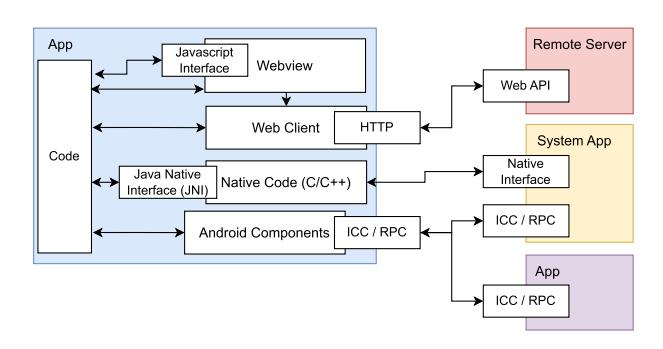
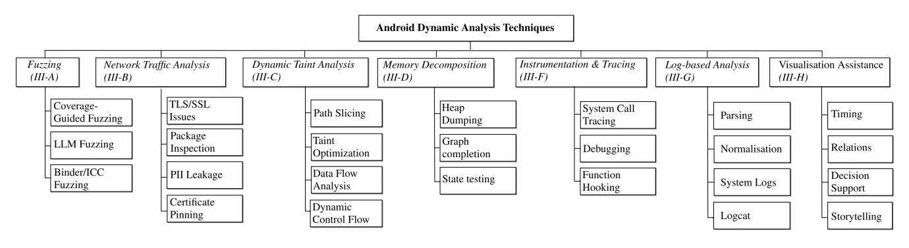
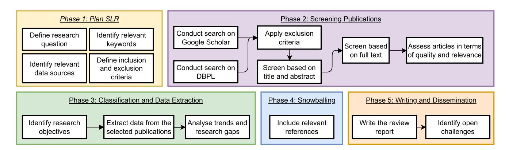
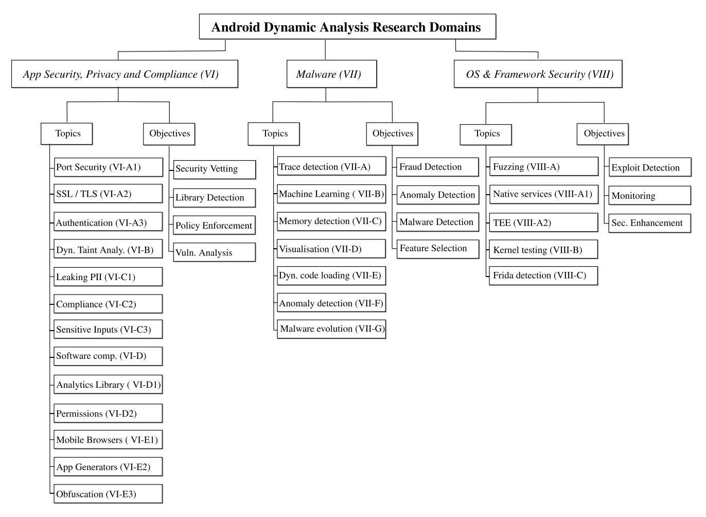
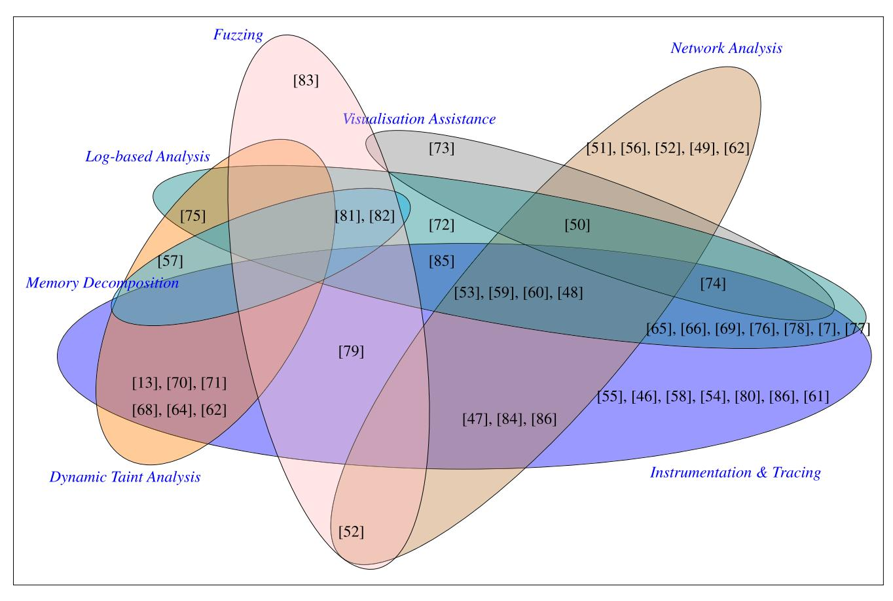
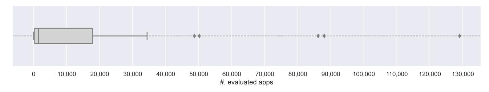
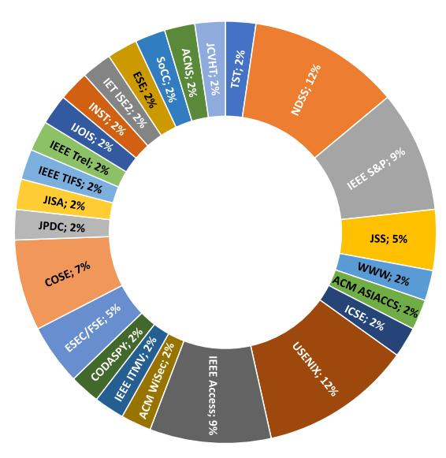

Received 22 March 2024, accepted 13 April 2024, date of publication 17 April 2024, date of current version 26 April 2024. *Digital Object Identifier 10.1109/ACCESS.2024.3390612*

# Dynamic Security Analysis on Android: A Systematic Literature Review

#### THOMAS SUTTE[R](https://orcid.org/0000-0003-2649-3299) 1,2[, T](https://orcid.org/0000-0003-4052-475X)IMO KEHRE[R](https://orcid.org/0000-0002-2582-5557) 1 , MARC RENNHARD [2](https://orcid.org/0000-0001-5105-3258) , BERNHARD TELLENBACH [3](https://orcid.org/0000-0002-5008-1107) , AND JACQUES KLEIN 4 , (Member, IEEE)

1 Institute of Computer Science, University of Bern, 3012 Bern, Switzerland

2 Institute of Computer Science, Zürich University of Applied Sciences, 8401 Winterthur, Switzerland

3Armasuisse Science and Technology, Cyber-Defense Campus, 8005 Zürich, Switzerland 4 Interdisciplinary Centre for Security, Reliability and Trust, University of Luxembourg, 1855 Luxembourg, Luxembourg

Corresponding author: Thomas Sutter (suth@zhaw.ch)

This work was supported in part by Armasuisse Science and Technology, Cyber-Defense Campus, Switzerland, through the Research Program Cyberspace by the Project Security Analysis of Firmware of Mobile Devices, under Grant ARAMIS Nr. AR-F03-003.

**ABSTRACT** Dynamic analysis is a technique that is used to fully understand the internals of a system at runtime. On Android, dynamic security analysis involves real-time assessment and active adaptation of an app's behaviour, and is used for various tasks, including network monitoring, system-call tracing, and taint analysis. The research on dynamic analysis has made significant progress in the past years. However, to the best of our knowledge, there is a lack in secondary studies that analyse the novel ideas and common limitations of current security research. The main aim of this work is to understand dynamic security analysis research on Android to present the current state of knowledge, highlight research gaps, and provide insights into the existing body of work in a structured and systematic manner. We conduct a systematic literature review (SLR) on dynamic security analysis for Android. The systematic review establishes a taxonomy, defines a classification scheme, and explores the impact of advanced Android app testing tools on security solutions in software engineering and security research. The study's key findings centre on tool usage, research objectives, constraints, and trends. Instrumentation and network monitoring tools play a crucial role, with research goals focused on app security, privacy, malware detection, and software testing automation. Identified limitations include code coverage constraints, security-related analysis obstacles, app selection adequacy, and non-deterministic behaviour. Our study results deepen the understanding of dynamic analysis in Android security research by an in-depth review of 43 publications. The study highlights recurring limitations with automated testing tools and concerns about detecting or obstructing dynamic analysis.

**INDEX TERMS** Android, dynamic analysis, security, software testing, vulnerabilities, instrumentation, fuzzing, monitoring, tracing, machine learning.

# **I. INTRODUCTION**

The smartphone has emerged as one of the most indispensable devices in our everyday life. Smartphones are equipped to carry out diverse tasks such as instant messaging, emailing, navigation, web browsing, capturing photographs, and many more. Users inadvertently expose substantial amounts of personal information to software and hardware providers.This Personally Identifiable Information (PII) includes sensitive data such as residential addresses, dates of birth, and

The associate editor coordinating the review of this manuscript and approving it for publication was Peter Langendoerfer [.](https://orcid.org/0000-0002-6209-9048)

photos and videos, all of which are commonly stored in the smartphone's storage, thereby increasing the risk of inadvertent exposure to eavesdropping applications.

Several legislative authorities have recognised the paramount importance of safeguarding PII from exploitation and misuse by companies and corporations. Consequently, multiple regulations such asthe European General Data Protection Regulation (GDPR) [\[1\]](#page-22-0) and the California Consumer Privacy Act (CCPA) [\[2\]](#page-22-1) have been enacted. In response to these regulations, large tech conglomerates have gradually imposed more and more stringent restrictions on the access and usage of PII data.

Concurrently, for over a decade, researchers have explored various novel ideas to detect and prevent attacks on Android and its users to foster smartphone security. In the scientific literature, there are mainly two classes of approaches for Android security testing, commonly referred to as *static* and *dynamic* analysis. In static analysis, a program is examined without actually executing the code in a real or emulated environment. Instead, the program code is studied by techniques such as taint analysis (e.g., FlowDroid [\[3\]\),](#page-22-2) where the data flow of the program under test is examined to identify potential vulnerabilities or privacy issues. Besides the general limitations of static analysis [\[4\], on](#page-22-3)e specific limitation is that certain Android apps incorporate functions that enable the loading and execution of code at runtime, rendering it infeasible to statically determine a program's behaviour [\[5\]. D](#page-23-0)ynamic analysis tackles this problem by executing a program in a monitored environment to collect runtime data (e.g., memory- and file access, network traffic, or system call traces [\[6\]\) w](#page-23-1)hich are then analysed for various purposes (e.g., to determine if PII is sent to a remote server [\[7\]\). A](#page-23-2) particular challenge is to guide dynamic analysis techniques towards an exhaustive exploration of possible program paths [\[8\],](#page-23-3) [\[9\],](#page-23-4) [\[10\],](#page-23-5) [\[11\],](#page-23-6) [\[12\].](#page-23-7) *Hybrid* approaches combine both static and dynamic analyses, and have been shown to outperform solutions that rely solely on either of both approaches in certain cases [\[13\].](#page-23-8)

Either way, there has been a tremendous amount of publications on Android security research. With the overwhelming volume of publications, it is time-consuming for both researchers and practitioners to stay abreast of the latest cutting-edge techniques, and to identify the most relevant publications for their research domain or application context. This calls for a secondary study on Android security testing for synthesising existing knowledge, identifying future research directions, and supporting decision-making. However, previous secondary studies have mainly focused on reviewing static analysis techniques [\[14\],](#page-23-9) [\[15\]](#page-23-10) or specific research domains, such as mobile malware analysis [\[16\],](#page-23-11) [\[17\],](#page-23-12) [\[18\].](#page-23-13)

This research paper employs a systematic and retrospective analysis of articles published in the last five years to provide a comprehensive overview of the most recent advances in Android security research, focusing primarily on dynamic analysis techniques. Our systematic literature review (SLR) sheds light on innovative testing methods for Android apps. It highlights the most prevalent trends in dynamic analysis, including use cases, techniques, datasets, and novel methods. After applying our SLR inclusion and exclusion criteria, we obtained 43 publications for which we conducted an in-depth analysis to answer the following research questions.

- *RQ*1 Which novel tools and techniques were published? We determine for every publication in our corpus if a novel tool was developed and made publicly available.
- *RQ*2 What were the underlying objectives and intentions driving the utilisation of dynamic analysis techniques?

We identify the primary purpose of every publication and summarise their ideas and findings.

- *RQ*3 What are the prevalent constraints and shortcomings inherent in the dynamic analysis techniques? To identify possible open research questions, we investigate if there are any commonly mentioned limitations or unresolved challenges, and discuss possible future work on the topics.
- • *RQ*4 Which areas of research have exhibited prominent trends and gained significant attention in recent years? We categorise the literature into topics based on their research objectives and analyse which open problems are faced by multiple researchers.

The primary objective of this study is to establish a thorough understanding of the latest advancements in dynamic analysis methods and techniques. Key contributions of this research include the following:

- We construct a taxonomy specifically for Android dynamic security analysis, categorising publications based on this taxonomy and the applied dynamic analysis methods.
- • We identify three main security research domains and classify the selected publications according to the developed taxonomy and applied dynamic analysis technique.
- • We offer an initial overview of dynamic security techniques and methodologies for Android by reviewing 330 publications. Subsequently, we focus on a detailed examination of a selection subset, providing an in-depth analysis of 43 publications from premier software engineering and security venues, where we comprehensively list objectives, techniques, and tools.
- We determine trends for dynamic analysis techniques and identify the most and least common techniques of the last five years.

In Section [II,](#page-1-0) we first give an overview of methods to test Android apps dynamically. Section [III](#page-3-0) gives an introduction into the core concepts of dynamic analysis on Android. Section [IV](#page-5-0) presents details about the methodology of our SLR. Section [V](#page-7-0) introduces a taxonomy for dynamic analysis security research. Sections [VI](#page-7-1) to [VIII](#page-16-0) give an in-depth review of publications in dynamic analysis. We discuss the findings from this SLR in Section [IX.](#page-18-0) In Section [XI](#page-21-0) the threats to validity and open research questions are discussed. In Section [XII](#page-21-1) related work is presented. Section [XIII](#page-22-4) concludes this SLR with a short summary of our findings.

# **II. BACKGROUND ON TESTING ANDROID APPS**

It is only logical that automated Android app testing plays a crucial role in most dynamic security analysis approaches as it is one of the fundamental building blocks for collecting data points. To fully grasp the capabilities of an Android app, it is necessary to interact with the app's Graphical User Interface (GUI) as well as with the APIs offered by the Android framework.

| Tool Name       | Dataset used                                | Tools/Algorithms benchmarked                                                                                                                 | Number of Apps Tested (Range) | <b>Test Environment</b>        | Test Run Time (minutes) | Number of Runs |
|-----------------|---------------------------------------------|----------------------------------------------------------------------------------------------------------------------------------------------|----------------------------------|--------------------------------|----------------------------|-------------------|
| Monkey $[19]$   | Not applicable                              | Not applicable                                                                                                                               | Not applicable                   | Not applicable                 | Not applicable             | Not applicable    |
| ACVTool [20]    | Not applicable                              | JaCoCo, Sapienz                                                                                                                              | 250-1000                         | Emulator                       | 180min                     | 5                 |
| TimeMachine [8] | AndroTest                                   | Monkey, Stoat, Sapienz                                                                                                                       | 100-250                          | VirutalBox, Android-x86 OS  | 300 min         | 5                 |
| WCTester [21]   | WeChat app only                             | Previous version of their tool                                                                                                               | $1-20$                           | <b>Physical Device</b>         |                            |                   |
| Sapienz [9]     | AndroTest, Google Play Store             | DynoDroid, Monkey                                                                                                                            | 1,000-2,000                      | Physical Device                | 60 min          |                   |
| Stoat $[10]$    | AndroTest. F-Droid. Google Play Store | PUMA, Monkey, Sapienz, A3E, MobiGUITAR                                                                                                    | 1,000-2,000                      | Emulator                       | 60min, 180min              |                   |
| Toller [22]     | Google Play Store                           | Chimp, WCTester, Stoat                                                                                                                       | $1-20$                           | Emulator                       | 60 min          |                   |
| Ares $[23]$     | AndroTest                                   | OpenAI Gym, Q-Learn (algorithm), DDPG (algorithm), Rand (algorithm), SAC (algorithm), TD3 (algorithm), TimeMachine, Sapienz, Monkey | $20 - 50$                        | Emulator                       | 60 min          | 10                |
| Q-Testing [24]  | AndroTest. Open Source Apps              | Sapienz, Monkey, Stoat                                                                                                                       | 50-100                           | Emulator                       | 60 min          | 4                 |
| Chimp $[12]$    | AndroTest, Google Play Store             | Monkey                                                                                                                                       | 50-100                           | Android-x86 OS, <b>OEMU</b> | 6 min           | 10                |
| AndroTest [11]  | AndroTest                                   | SwiftHand, PUMA, GuiRipper, A3E, DynoDroid, ACTEeve, Monkey                                                                               | 50-100                           | Emulator, VirutalBox        | 60 min          | 10                |

**TABLE 1.** Overview of reviewed publications providing software testing tools for automated Android app testing.

**FIGURE 1.** Brief overview of interfaces in an Android app.

Android apps make use of a wide variety of interfaces and can share data via services, content providers, or broadcast listeners. Figure [1](#page-2-0) illustrates an example Android app with possible communication partners to give an overview of frequently used interfaces. Android apps can include native code via the Java Native Interface (JNI) or JavaScript code via the webview interface as shown in Figure [1.](#page-2-0) Apps can directly communicate with companion apps to exchange data or interact with system services via Inter-Component-Communication (ICC) and it is as well possible for apps to use JNI to interact with native system services.

The usage of these interfaces in combination with ICC often makes an in-depth analysis of Android apps challenging because these dependent components need to be analysed in addition to the app under test.

#### A. TESTING QUALITY METRICS

To evaluate and compare the performance of Android testing tools, two quality metrics have been primarily used in the past: code coverage and number of detected faults (crashes or bugs).

*Code coverage* is the primarily used metric to measure which parts of the code have been executed during testing. In addition to line coverage sometimes the class, activity, or method coverage are measured as well.

*Fault detection* is the other main metric applied when comparing testing tools. It is used to determine if a tool is capable of generating an input so that the Application under test (AUT) would crash or enter an unwanted state.

#### B. STATE-OF-THE-ART ANDROID APP TESTING TOOLS

Many dynamic analysis methods heavily rely on a number of testing tools from industry and academia. These tools are often the basis for security researchers to test certain states of an application. Thus, we give a brief overview of common Android app testing tools and their limitations in Table [1.](#page-2-1) The tools were chosen after a thorough review of publications on Android app testing, but the list is not comprehensive.

One of the main tools used is *Monkey* [\[19\]. I](#page-23-14)t sends pseudo-random streams of user- and system events for testing and does not track the state of the app, which makes Monkey a relatively fast and stateless testing tool. Monkey is actively maintained and considered to be one of the stateof-the-art testing tools in industry, even though academic papers have shown better testing performances with other tools [\[8\],](#page-23-3) [\[23\],](#page-23-15) [\[24\].](#page-23-16)

There have been several studies on enhancing the capabilities of Monkey [\[8\],](#page-23-3) [\[21\]. N](#page-23-17)otably, Dong et al. [8] [int](#page-23-3)roduced *TimeMachine*, which proposes to find pertinent app states by going back to previously observed states instead of focusing on following a number of promising states showing better

**FIGURE 2.** Dynamic security analysis techniques.

code coverage. Alternative solutions to Monkey are *Stoat* [\[10\]](#page-23-5) and *Sapienz* [9] [tha](#page-23-4)t have comparable performance, but use a search-/model-based approach.

Many studies in the testing domain mainly focused on improving testing algorithms to enhance code coverage. However, Wang et al. [\[22\]](#page-23-18) demonstrated that solely focusing on improving the testing algorithms may not be sufficient. Instead, their approach, named *TOLLER*, focused on improving the testing infrastructure, which is often based on *UI Automator* [\[25\], t](#page-23-19)o improve the effectiveness of different testing tools.

Moreover, several machine learning-based solutions have demonstrated promising testing results and are likely to outperform Monkey, Stoat, and Sapienz [\[23\],](#page-23-15) [\[24\].](#page-23-16) Notably, Q-Testing by Pan et al. [\[24\],](#page-23-16) and ARES by Romdhana et al. [\[23\]](#page-23-15) are based on the idea of reinforcement learning (RL) and show promising results.

All of the aforementioned tools can be used to dynamically test Android apps. It should be mentioned that testing Android apps dynamically is often limited due to external dependencies. For instance, a chat application might need to interact with another chat client to reach some specific states during testing, or the testing environment might not send specific system events to the AUT. However, it is often not possible for researchers to analyse all dependent components, thus limiting security analysis as we will discuss in Section [IX.](#page-18-0)

# **III. DYNAMIC SECURITY ANALYSIS TECHNIQUES**

Figure [2](#page-3-1) gives an overview of the dynamic analysis techniques for Android with frequently mentioned topics. In this section, we explain the main concepts of these dynamic analysis techniques and give practical examples for Android.

# A. FUZZING

Fuzzing or fuzz testing feeds the target program with a large number of inputs to see how the target programs behaves. The main idea of fuzzing is to send inputs that trigger unexpected behaviours, program faults or vulnerabilities by sending random, invalid, or unexpected inputs. Fuzzing techniques such as concolic execution, probabilistic grammar fuzzing, mutation-based fuzzing, or search-based fuzzing have widely been used to detect vulnerabilities and have proven to be efficient testing methods. For instance, the OSS-Fuzz [\[26\]](#page-23-20) project has reported over 25,000 bugs [\[27\]](#page-23-21) in open-source projects by fuzzing.

On Android, fuzzing has dominantly been used to test native components of the operating system as many fuzzing techniques show excellent results in detecting memory corruption bugs [\[26\]. N](#page-23-20)evertheless, memory-safe languages such as Java can also undergo fuzzing, as demonstrated by tools like Jazzer [\[28\].](#page-23-22) Erroneous behaviour in these languages has the potential to result in similar harm as memory corruption bugs.

# B. NETWORK TRAFFIC ANALYSIS

To monitor or intercept the network traffic of an Android device or app, it is often necessary to reroute the network traffic over a proxy that is controlled by the analyst. In many cases it is necessary for the analyst to disable or work around existing security mechanisms in order to be able to proxy the traffic create by an Android app. Two of the main security mechanisms that researchers need to work around are Certificate pinning (CP) [\[29\]](#page-23-23) and Transport Layer Security (TLS).

Nowadays, Android enforces TLS encryption by default for network connections of Android apps. To perform a deep packet inspection, the traffic needs to be redirected over a proxy. To do so, a common technique is to load a custom Certificate Authority (CA) into the trusted certificate store of the device. By installing a custom CA certificate, the network traffic can be redirected to a proxy without breaking the TLS encryption, which allows analysts to read or modify the network packets. However, solely rerouting the traffic is often not sufficient if the AUT uses CP.

CP is a security practice to prevent man-in-the-middle attacks on TLS. The main idea of CP is to ensure the authenticity of digital certificates by including a set of public key properties (for example, hashes) that the client (e.g., an Android app or web browser) can verify. When an app uses CP, solely adding a custom CA certificate isn't sufficient to proxy the network traffic because the Android app might check which CA certificate is used and then refuses connections (in case a custom CA is detected). Two common approaches to work around CP on Android are instrumenting to disable the CP checks during runtime or patching the Android app to remove the CP checks completely from the code. As a client-side security mechanism, CP can only secure the connection and is not resistant to patching the app or against instrumentation. Therefore, working around CP is a common technique that researchers need to master in order to be able to analyse the traffic of an Android app.

# C. DYNAMIC TAINT ANALYSIS

In taint analysis, the execution path (flow) of a program is tracked to identify the propagation of potentially untrusted or malicious data (tainted flows). To identify such tainted flows, static analysis uses a set of functions where data enters the program (sources) and follows the execution path to a point within the program (sinks) that could cause harm or unintended behaviour. Taint analysis then attempts to identify if there is a path from one of the source functions to the sinks. In case there is a path, the system can further be checked for inputs that follow the path.

Taint analysis has various use cases. For instance, vulnerability detection, where a tainted flow might indicate a vulnerability. This analysis technique has shown to be effective for vulnerability detection but has some known limitations; It is not trivial to define sources and sinks for all kind of applications, it can be very computation intensive depending on the size of the program, and it does not allow to automatically identify if a detected vulnerability is exploitable.

Dynamic taint analysis is an extension to its static counterpart and attempts to overcome some of these limitations. For instance, additional execution paths can be detected during runtime in cases where code is dynamically loaded, which can help in identifying additional paths. Such additional paths can lead to previously unseen vulnerabilities. Overall, the main idea is to use the data collected during runtime to have a more accurate and powerful taint analysis.

# D. MEMORY DECOMPOSITION

Detecting fileless malware, also referred to as memory-only malware, is one of the objectives of memory-based analysis techniques [\[30\].](#page-23-24) The possibility to read and modify the memory of a program at runtime opens opportunities for novel testing methods. The decomposition of the memory at runtime is often challenging as an in-depth knowledge about the internal structure of the memory is necessary to fully understand the state of a program. In addition, the timing of the analysis is often crucial, as the memory of a program is frequently changing. Memory-based techniques usually dump the stack or heap memory of a program at given points in time to gain additional information about the internal state of the program. These dumps are then used to facilitate other dynamic testing techniques or to inject code into the memory at runtime to trigger specific code blocks.

# E. SYSTEM CALLS AND TRACING

System call tracing is a way of collecting run-time information about a process. During tracing, system calls and signals of a process are intercepted and recorded by a tracer. The main goal of the tracing process is to observe what resources a process is requesting from the kernel with which arguments. Commonly used methods for system call tracing on Linux are the command line tool, *strace* [\[31\], o](#page-23-25)r the *ptrace* [\[32\]](#page-23-26) system call.

Typical use cases for system call tracing are debugging, performance analysis, or security auditing. In addition, the analysis of system calls has been a major subject for many malware detection systems as we will further discuss in Section [VII.](#page-12-0)

On Android, apps use mainly IPC events to initiate system calls. When an app wants to access a system service, it needs to request the corresponding permissions. In cases, where the permission was given, an app sends a broadcast message with an intent action (e.g., ''ACTION\_SETTINGS'') to request the execution of a system call. Apps on Android are sandboxed, meaning that based on the permission an app has, access to specific system services is granted or denied. The sandbox concept reduces the attack surface significantly, however, it leads to the fact that system call tracing needs to consider system events. When an app uses IPC messages to trigger system calls, the system call is likely executed by a system service rather than the app itself. Consequently, it is often necessary to trace parts of the framework in order to understand which system calls are triggered by an app.

An approach that has been used to trace apps is to attach strace to the Zygote process [\[33\]. A](#page-23-27)s all app processes are forks from Zygote on Android, it is possible to use strace on Zygote to record the traces of an app. However, tracing Zygote is noisy as it generate a large fraction of records that are not created by the app itself. Moreover, using strace on Zygote requires root privileges which might not be available on all devices.

# F. DYNAMIC BINARY INSTRUMENTATION

Dynamic binary instrumentation (DBI) [\[34\],](#page-23-28) [\[35\],](#page-23-29) [\[36\],](#page-23-30) [\[37\],](#page-23-31) [\[38\]](#page-23-32) is a valuable approach for reverse engineering or security testing Android apps. DBI frameworks are tools for supplementary analysis, debugging, or profiling, as well as for incorporating optimisations without the need to recompile or access to the source code. Instrumentation can be a powerful tool for reverse engineering, as it allows to circumvent client-side security checks (e.g., CP).

The key idea of instrumentation is to change the control flow of the application by injecting assembly instructions (e.g., JMP), which is often referred to as *hooking*. DBI injects code into the running target process to facilitate the analysis process. Sophisticated DBI frameworks use Just-In-Time (JIT) compilers to update the code at runtime, which allows the injection at anytime during execution. Depending on the use case, the control flow is changed so that it is possible to overwrite existing functions or to monitor the arguments of a function call.

Many DBI frameworks with support for Android exists. To name some examples: Frida [\[36\],](#page-23-30) Valgrind [\[35\],](#page-23-29) DynamoRIO [\[38\],](#page-23-32) or QBDI [\[37\].](#page-23-31) Most of these instrumentation frameworks allow researchers to inject custom scripts into the target process at runtime by setting up some communication channel (e.g., RPC) to a DBI service running on the target device. An external agent can then communicate with the DBI service to control the execution of the instrumented process.

Installing the DBI service often needs privileged access on the device under test. However, some DBI frameworks have developed other methods for deployment of the DBI service that do not need root access. For example, one method involves the injection of a shared library gadget. In this approach, the application undergoes a decompilation process, and subsequently, a shared library containing an initial call is introduced into the decompiled code. This library contains all the necessary gadgets to enable code injection into the application and is loaded upon the application's initiation. Acting as a DBI service, the library establishes communication with an external agent to receive commands. The decompiled application is then repackaged into an APK file and signed with a self-signed certificate before being launched. However, a notable drawback of this method is that it necessitates modifying the AUT to facilitate instrumentation.

# G. LOG-BASED ANALYSIS

Most applications and services log errors, warnings and informational events to a log facility. What exactly is logged is not standardised; however, it is often information that helps diagnose and reproduce erroneous behaviour of an application or information that is needed for audit purposes, e.g. requests for access to protected resources. Therefore, the extent to which the logs provide insight into the processes during the execution of the application and whether this insight is sufficient for the respective analysis goal depends strongly on the individual application.

On Android, app logs are stored in circular memory buffers by default and can be access via the command line tool Logcat [\[39\]. A](#page-23-33)pp logs are considered sensitive because they can contain all kinds of information, including sensitive data (e.g., device identifiers, passwords, etc.). By default the access to app logs on Android is only granted to privilege processes and app logs should only be accessible when an app is in debug mode.

# H. VISUALISATION ASSISTANCE

Visualisation assistance involves utilising tools, techniques, or technologies to enhance the comprehension and interpretation of data through visual representation. This approach is employed to communicate and analyse extensive and intricate information effectively. By visualising data, methods are applied to simplify complexity and highlight specific relationships, aiding in a clearer understanding of the information at hand.

These techniques can support decision making. For instance, for malware analysts they may help in detecting specific code patterns that can be used for the classification of malicious apps.

# **IV. LITERATURE REVIEW METHODOLOGY**

Figure [3](#page-6-0) gives an overview of our SLR selection and reviewing process inspired by the guidelines from Kitchenham and Brereton [\[40\]. W](#page-23-34)e summarise in Table [2](#page-7-2) every step of the selection process and explain the details of every step hereafter.

First, we defined the following exclusion and selection criteria to limit our study to peer-reviewed publications:

- 1) Language: Papers must be written in English.
- 2) Time: Only publications published between 2017 to 2023
- 3) Type of publication: Only peer-reviewed publications that were published in computer science conferences or journals. No patents, books, or demo publications.
- 4) Topic: Publications pertinent to our subject matter, which revolves around Android dynamic security analysis. In this context, ''relevance'' denotes the degree to which publications align with the specific focus of our study. Therefore, we will only include publications that directly contribute to or address aspects relevant to Android dynamic security analysis.

Secondly, to identify publications pertinent to our topic, we conducted iterative test searches on Google Scholar. Through multiple iterations, we identified search terms that consistently produced relevant outcomes, as evidenced by the relevance of the first 100 search results. Our primary search term is ''Android,'' employed in conjunction with a set of secondary terms detailed in Table [3.](#page-7-3)

Third, we conducted keyword searches on Google Scholar and exported the results to machine-readable files. For this purpose we use the tool *Publish or Perish* [\[41\]. P](#page-23-35)revious studies [\[42\]](#page-23-36) have demonstrated that the usage of Google Scholar is sufficient to find relevant publications from top computer science conferences and journals. In addition, using Google Scholar prevents a bias towards a specific publisher and identifies publications based on a scoring system.

Fourth, we apply our selection criteria to filter out irrelevant publications by year, language, and article form (only peer reviewed articles, no books, etc.) to reduce the number of search results. Following the application of filter criteria, we reviewed the top 1,000 search results, scanning for potentially relevant publications based on their titles and abstracts. This selection of the initial 1,000 results aimed to balance comprehensiveness with relevance, taking into account the practical consideration of managing a sizeable

**FIGURE 3.** Methodology of the systematic literature review.

**FIGURE 4.** Taxonomy of Android dynamic security analysis research.

dataset for thorough analysis. Additionally, this number was chosen to ensure a broad exploration of the literature landscape while maintaining feasibility in terms of manual screening efforts. As a result, we identified 177 potential publications.

Fifth, we review the methodology and results section of the potential publications to identify articles on Android dynamic security analysis. In case, we find a fitting article, we conduct an in-depth review and add it to the SLR.

Sixth, the authors delve into the scope, quality, and relevance of the publications. This is done to prevent any potential bias from a single author's perspective. If a situation arises where most of the authors identify an inconsistency in relation to a particular publication, a decision is reached

# **TABLE 2.** SLR Methodology for the selection of publications.

| <b>SLR Step Description</b>                                                                                                                                      | Google Scholar | <b>DBLP</b>            |  |
|------------------------------------------------------------------------------------------------------------------------------------------------------------------|----------------|------------------------|--|
| Initial Search                                                                                                                                                   | 19'500         | 9,676,565              |  |
| Exclusion by venue (Only peer reviewed journals and conferences) Exclusion by language and publication year (only English and publications from 2017 to 2023) | 17'300         | 6.325.901 2,395,797 |  |
| Selection by relevance score or keyword matching                                                                                                                 | 1.000          | 3014                   |  |
| Exclusion by topic match (skim title and abstract)                                                                                                               | 177            | 155                    |  |
|                                                                                                                                                                  | Merged         |                        |  |
| Merge datasets (removing duplicates)                                                                                                                             | 330            |                        |  |
| Exclusion by topic relevance (dynamic analysis related)                                                                                                          | 36             |                        |  |
| Exclusion by discussion (scope, quality, and relevance)                                                                                                          | $-1$           |                        |  |
| Inclusion by snowballing (forward and backwards)                                                                                                                 | $+8$           |                        |  |
| Total                                                                                                                                                            | 43             |                        |  |

#### **TABLE 3.** Overview of keywords used for the search process.

| Description | Keywords                                                                                                                 |
|-------------|--------------------------------------------------------------------------------------------------------------------------|
| Primary     | Android:                                                                                                                 |
| Secondary   | Analy*; dynamic; fuzz*; security testing; DAST; dynamic application security testing; App Security Testing: Hybrid |

regarding its inclusion or exclusion. This determination is based on a majority vote among the authors.

To identify additional relevant publications, we conducted a secondary search on top computer science and security venues to ensure that we do not miss relevant publications. To do so, we use the computer science bibliography DLBP [\[43\]](#page-23-37) as additional data source. Table [5](#page-8-0) shows the top computer science venues according to Google Scholar [\[44\],](#page-23-38) [\[45\].](#page-24-0) Google Scholar uses as a metric for ranking these venues, the h5-index. The ranking was retrieved on the January 31, 2023. Within DLBP, we search for publications from the top computer science venues listed in Table [5](#page-8-0) and apply the same selection process as with Google Scholar. As result, we identify 155 publications as potential relevant for this SLR.

As last step, we perform forward- and backward snowballing to include papers with high relevance or novelty. We include 8 publications by snowballing into the SLR.

# **V. TAXONOMY OF ANDROID SECURITY RESEARCH**

By analysing the publications in our dataset, three primary research domains can be identified in the realm of dynamic security analysis of Android Apps: (i) App Security, Privacy and Compliance, (ii) Malware, and (iii) OS & Framework. We use these three domains to group research publications with similar use cases and objectives. Figure [4](#page-6-1) illustrates an overview of our taxonomy. It shows the three main research domains and their connections to related security topics. It should be noted that many studies have overlapping use cases or objectives and may fit into more than one category. However, we assigned publications to the most fitting category based on their main use-case or objective.

- **App security, privacy and compliance** (ASPC) encompasses publications that are primarily centred around the development of innovative techniques for conducting security testing on Android applications. Furthermore, it includes publications that explore specific categories of Android apps, such as, for instance, in-depth analyses of vulnerabilities in mobile banking apps.
- **Malware** includes publications on methods for detecting fraudulent or malicious applications and how to extract or collect features from apps for classification tasks that can be used for detection techniques.
- **OS & Framework** (OSF) is mainly about publications that study the Android framework and its components from a security perspective. This also includes research about the security of the Android operating system.

Table [4](#page-8-1) lists our 43 papers selected for in-depth review (s. Section [IV\)](#page-5-0) classified by both category and year. 21, 12 and 10 papers fall into the categories (i), (ii) and (iii), respectively.

In the following Sections [VI](#page-7-1) to [VIII,](#page-16-0) we provide a detailed overview of the publications grouped by research domains. We primarily explain the aim and methodology of the publications. The data source(s) used by the publications, dynamic analysis techniques, tools used, and other factors are not explicitly discussed in the text but are recorded in the tables for the respective subsection. At the end of each section, we summarise the main takeaways and discuss the most important limitations.

# **VI. APP SECURITY, PRIVACY AND COMPLIANCE RESEARCH**

Table [6](#page-9-0) shows the list of selected publications for the App Security, Privacy and Compliance domain. We analysed these publications in terms of the used dynamic analysis technique, testing methodology, data sources, as well as number of tested apps.

# A. NETWORK ANALYSIS

There have been several methods described to test the used network protocols and to identify implementation errors in

| Topic                                   | 2017 | 2018                             | 2019                                | 2020                                       | 2021 | 2022            | 2023                                       | <b>Total</b> |
|-----------------------------------------|------|----------------------------------|-------------------------------------|--------------------------------------------|------|-----------------|--------------------------------------------|--------------|
| App Security, Privacy and Compliance | [46] | $[47]$ , $[48]$ , $[49]$         | [50], [51], [52] $[53]$ , $[54]$ | $[55]$ , [56], [57], [58]                  | [59] | $[60]$ , $[13]$ | $[7]$ , $[61]$ , $[62]$ $[63]$ , $[64]$ | 21           |
| Malware                                 |      | $[65]$ , $[66]$ , $[67]$ [68] | [69]                                | [70], [71], [72], [73] [74], [75], [76] |      |                 | [77]                                       | 12           |
| OS & Framework Security                 |      | [78]                             | [79]                                | [80], [81], [82] $[83]$ , $[84]$        | [85] | [86]            | [87]                                       | 10           |
|                                         |      |                                  |                                     |                                            |      |                 | Total                                      | 43           |

#### **TABLE 4.** Overview of chosen publications by year and research domain.

#### **TABLE 5.** List of top conferences and journals by h5-index.

| Rank | Name                                                                                                      | h5-index | h5-median |
|------|-----------------------------------------------------------------------------------------------------------|----------|-----------|
|      | Computer Security & Cryptography                                                                          |          |           |
| 1.   | ACM Symposium on Computer and Communications Security                                                     | 98       | 146       |
| 2.   | IEEE Transactions on Information Forensics and Security                                                   | 94       | 135       |
| 3.   | IEEE Symposium on Security and Privacy                                                                    | 89       | 134       |
| 4.   | <b>USENIX Security Symposium</b>                                                                          | 84       | 136       |
| 5.   | Computers & Security                                                                                      | 78       | 117       |
| 6.   | Network and Distributed System Security Symposium (NDSS)                                                  | 72       | 146       |
| 7.   | IEEE Transactions on Dependable and Secure Computing                                                      | 63       | 97        |
| 8.   | International Conference on Theory and Applications of Cryptographic Techniques (EUROCRYPT)               | 59       | 96        |
| 9.   | International Cryptology Conference (CRYPTO)                                                              | 55       | 98        |
| 10.  | International Conference on Financial Cryptography and Data Security                                      | 50       | 82        |
| 11.  | Journal of Information Security and Applications                                                          | 47       | 65        |
| 12.  | IEEE European Symposium on Security and Privacy                                                           | 46       | 70        |
| 13.  | IACR Transactions on Cryptographic Hardware and Embedded Systems                                          | 46       | 69        |
| 14.  | Security and Communication Networks                                                                       | 44       | 60        |
| 15.  | International Conference on The Theory and Application of Cryptology and Information Security (ASIACRYPT) | 42       | 72        |
| 16.  | ACM Asia Conference on Computer and Communications Security                                               | 38       | 60        |
| 17.  | IEEE International Conference on Biometrics: Theory Applications and Systems (BTAS)                       | 36       | 59        |
| 18.  | <b>IEEE Security &amp; Privacy</b>                                                                        | 35       | 58        |
| 19.  | Symposium On Usable Privacy and Security                                                                  | 35       | 51        |
| 20.  | Designs, Codes and Cryptography                                                                           | 33       | 45        |
| 1.   | Software Systems ACM/IEEE International Conference on Software Engineering                             | 76       | 113       |
| 2.   | IEEE Transactions on Software Engineering                                                                 | 66       | 108       |
| 3.   | Journal of Systems and Software                                                                           | 61       | 102       |
| 4.   | Information and Software Technology                                                                       | 59       | 83        |
| 5.   | ACM SIGSOFT International Symposium on Foundations of Software Engineering                                | 57       | 93        |
| 6.   | <b>Empirical Software Engineering</b>                                                                     | 56       | 85        |
| 7.   | Proceedings of the ACM on Programming Languages                                                           | 55       | 71        |
| 8.   | <b>IEEE</b> Software                                                                                      | 47       | 79        |
| 9.   | IEEE/ACM International Conference on Automated Software Engineering (ASE)                                 | 47       | 77        |
| 10.  | ACM SIGPLAN Conference on Programming Language Design and Implementation (PLDI)                           | 47       | 66        |
| 11.  | Mining Software Repositories                                                                              | 45       | 68        |
| 12.  | Symposium on Operating Systems Principles                                                                 | 42       | 102       |
| 13.  | International Conference on Software Analysis, Evolution, and Reengineering (SANER)                       | 42       | 68        |
| 14.  | Software & Systems Modeling                                                                               | 40       | 64        |
| 15.  | International Symposium on Software Testing and Analysis                                                  | 39       | 72        |
| 16.  | IEEE International Conference on Software Maintenance and Evolution                                       | 36       | 52        |
| 17.  | International Conference on Tools and Algorithms for the Construction and Analysis of Systems (TACAS)     | 35       | 45        |
| 18.  | Software: Practice and Experience                                                                         | 34       | 55        |
| 19.  | IEEE Annual Computer Software and Applications Conference (COMPSAC)                                       | 30       | 45        |
| 20.  | IEEE International Requirements Engineering Conference                                                    | 30       | 44        |
|      |                                                                                                           |          |           |

common security mechanisms such as TLS. In this section we discuss studies with a strong focus on network analysis and summarise their objectives and findings.

#### 1) OPEN PORTS

Wu et al. [\[51\]](#page-24-1) conducted an in-depth study of open ports on Android. 3,293 users in 136 countries worldwide contributed to their research by allowing the researchers to continuously monitor open ports on their smartphones. By installing an Android network monitoring app the researchers were able to detect and analyse open ports for vulnerabilities and identified five vulnerable patterns for open ports. Consequently, the researchers found vulnerabilities in several popular Android apps (e.g., Instagram, Samsung Gear, Skype) due to open ports. Moreover, Wu et al. found out that many of the open ports are solely from SDKs integrated into these apps, which raises the concern that the app developers are unaware of these open ports.

#### 2) SSL/TLS VERIFICATION

SSL/TLS is a fundamental security mechanism that provides a secure transmission channel. Implementation errors in SSL/TLS can expose the risk of man-in-the-middle (MITM) attacks. To counter these implementation error, Google introduce the network security configuration [\[89\], w](#page-25-0)hich is basically a configuration file for apps to configure the **TABLE 6.** Overview of selected app security, privacy and compliance publications. I = instrumentation & tracing, N = network analysis, V = visualisation assistance, L = log-based analysis, D = dynamic taint analysis, M = memory decomposition, F = fuzzing, H = hybrid (static + dynamic), A = automated testing, SC = source code available, DS = data source, NA = number of tested apps (per experiment), ST = supporting tools, TE = testing environment, TD = target Description.

| Tools / Publications     |   | N | V | L            | D | M | $\mathbf{F}$ | H | $\mathbf{A}$ | <b>SC</b> | <b>DS</b>                                            | <b>NA</b>                                     | <b>ST</b>                          | <b>TE</b>                      | TD                      |
|--------------------------|---|---|---|--------------|---|---|--------------|---|--------------|-----------|------------------------------------------------------|-----------------------------------------------|------------------------------------|--------------------------------|-------------------------|
| Tang et al. [55]         | ✓ |   |   |              |   |   |              |   | ✓            |           | Drebin, Google Play Store, Chinese App Stores  | 5.547 (Drebin), 10,151 (App Stores)        | UI Automator, Robotium, Cafe |                                | Vulnerability detection |
| Luo et al. $[50]$        |   |   |   | √            |   |   |              |   | ✓            |           | Google Play Store                                    | 351                                           |                                    |                                | Mobile browsers         |
| Oltrogge et al. [47]     |   |   |   |              |   |   |              |   | ✓            |           | Google Play Store                                    | 2.291.898                                     |                                    |                                | Online app generators   |
| NetMon, OPTool [51]      |   |   |   |              |   |   |              |   |              |           | System Apps, Mutliple App Stores                  | 1.650                                         |                                    | Physical Device                | Open ports              |
| DCDroid [56]             |   |   |   |              |   |   |              |   | √            |           | Google Play Store, 360app                         | 2,213                                         | Apktool                            | Physical Device                | SSL/TLS                 |
| Android Tester [48]      |   |   |   | J            |   |   |              |   | √            |           | Google Play Store                                    | 13,820                                        |                                    | Emulator                       | <b>SSL/TLS</b>          |
| MoSSOT [52]              |   |   |   |              |   |   |              |   | √            |           | Wandoujia, Apkpure                                | 550                                           |                                    | Emulator                       | Single sign-on          |
| Heapster [57]            |   |   |   |              | √ | √ |              |   |              |           | Google Play Store                                    | 49                                            | Soot, Spark                     | Physical Device                | Heap snapshots          |
| Reardon et al. [53]      |   |   |   | ✓            |   |   |              |   |              |           | Google Play Store                                    | 88,000                                        | Monkey                             | Emulator                       | App Permissions         |
| gdpr-consent [59]        |   |   |   | $\checkmark$ |   |   |              |   |              | ✓         | Google Play Store                                    | 86,163                                        |                                    | Physical Device                | App Consent             |
| Papageorgiou et al. [49] |   | √ |   |              |   |   |              |   |              |           | Google Play Store                                    | 20                                            |                                    |                                | Mobile Health apps      |
| UiRef [46]               | ✓ |   |   |              |   |   |              |   |              |           | PlayDrone (Google Play Store)                     | 50.162                                        |                                    | Mixed (Physical + Emulator) | Sensitive UI inputs     |
| Alde, ALManager [58]     | √ |   |   |              |   |   |              |   |              |           | Wandoujia, Google Play Store                      | 300                                           | Xposed, AndroidViewClient       | Physical Device                | Third party libraries   |
| Reaper [54]              | ✓ |   |   |              |   |   |              |   | √            |           | Google Play Store                                    | 5,457                                         | AXPLORER, Raccoon               | Mixed (Physical + Emulator) | Permissions             |
| PackDiff [60]            |   |   |   | $\checkmark$ |   |   |              |   | ✓            |           | Google Play Store, F-Droid. Chinese App Stores | 246                                           |                                    | Physical Device                | Code packers            |
| Fsaflow [13]             |   |   |   |              |   |   |              |   | $\checkmark$ |           | Google Play Store, Huawei App Store               | 150                                           | <b>VirusTotal</b>                  | <b>Physical Device</b>         | Taint tracking          |
| Lyons et al. [7]         | ✓ |   |   |              |   |   |              |   |              |           | Gamba et al. [88]                                    | 5,000                                         | apktool Monkey                  | Physical Device                | App log analysis        |
| Schnitzler et al. [62]   |   | √ |   |              |   |   |              |   |              |           | Instant messenger apps                               |                                               | tPacketCapture adb              | Physical Device                | Instant messengers      |
| ViaLin [64]              | ✓ |   |   |              | √ |   |              |   | ✓            |           | Google Play Store DroidICCBench                   | 209 (DroidICCBench) 16 (Google Play Store) | android-touch- record-replay    | <b>Physical Device</b>         | Taint tracking          |
| <b>T-Recs</b> [63]       |   |   |   |              | √ |   |              |   |              |           | Google Play Store Anzhi DroidBench             | 254                                           | apktool <b>NumPy</b>            | Physical Device                | Taint tracking          |

SSL/TLS settings, and added additional policies to Google Play to block insecure apps.

Wang et al. [\[56\]](#page-24-2) developed DCDroid; a hybrid testing tool optimised for UI exploration to test 2,213 apps from Google Play and the 360app [\[90\]](#page-25-1) store for SSL/TLS bugs. Wang et al. found 245 (11.07%) apps were actually vulnerable to MITM attacks due to implementation errors or only opportunistic security approaches like, for instance, accepting self-signed certificates.

Similar Liu et al. [\[48\]](#page-24-3) focused in particular on hybrid mobile apps and their error-handling code for SSL/TLS. Testing 13,820 apps with static analysis resulted in 1,360 apps with potential vulnerabilities. Liu et al. confirmed with dynamic analysis that 711 apps were exploitable and demonstrated that MITM attack are still a problem.

Both studies are similar in their methodology and used hybrid approaches to identify vulnerabilities. First potential vulnerabilities were identified with static analysis and then dynamic analysis was used to confirm apps that are truly vulnerable. Both studies show that SSL/TLS implementation errors are still common bugs on Android.

#### 3) AUTHENTICATION FUZZING

The MoSSOT [\[52\]](#page-24-4) tool developed by Shi et al. demonstrates how to automate the testing of single sign on (SSO) authentication for Android apps. MoSSOT is a blackbox approach that uses the PyModel [\[91\]](#page-25-2) library to generate formal test cases (state-machine testing) for the OAuth SSO protocol. Analysing the OAuth protocol is challenging due to it's complexity, and moreover, due the fact that the protocol can be customised. Therefore, Shi et al. developed routines to dynamically detect SSO logins (at runtime) and to extract a model from the network requests of an app to determine app-specific customisation's.

Using the test cases generated by PyModel allowed Shi et al. to identify vulnerabilities in the OAuth implementation of several apps. Evaluating MoSSOT against more than 500 Android applications from US and Chinese app markets showed that around 72.4% of the tested applications incorrectly implemented SSO and were vulnerable to at least one vulnerability on either the client (app) or server side. Some of these vulnerabilities were indeed exploitable. Therefore, Shi et al. illustrated that their fuzzing approach is effective in identifying issues related to the implementation of complex authentication protocols in Android apps.

#### B. DYNAMIC TAINT ANALYSIS

Taint analysis has some limitations when it comes to be sound, precise, and performing. For instance, the usage of reflection. in Android apps makes static taint analysis incomplete in terms that it cannot fully determine how the program is executed at runtime. To overcome such limitations, dynamic taint analysis can be used to some extent. For instance, Benz et al. [\[57\]](#page-24-5) developed a method based on heap snapshots and extended the static taint analysis tool FlowDroid [\[3\]](#page-22-2) to be more efficient. A heap snaphot contains a representation of the program objects at runtime at a selected point in time. The challenge when using heap snapshots is how to determine when to take a snapshot and to determine which objects can be used to boost the taint analysis. Benz et al. experimented with different numbers of snapshots and proposed a method on how and when to use heap snapshots. In summary, Benz et al. found out that using multiple snapshots is beneficial for the performance of the taint analysis and that heap snapshots in general can enhance the precision of taint analysis.

Similar, Yang et al. [\[13\]](#page-23-8) developed a hybrid solution, named FSAFlow, that has better precision than the static analysis tool FlowDroid or the dynamic approach Taint-Droid [\[92\].](#page-25-3) FSAFlow uses a finite state machine for monitoring the execution paths of an AUT and provides a state-reduction strategy to optimise the analysis process.

The usage of memory decomposition techniques like heap snapshots are novel ideas that might help to further enhance dynamic taint-analysis. However, not many solutions for experimentation on Android like FSAFlow exist.

#### C. PRIVACY AND COMPLIANCE RELATED STUDIES

So far, we have mainly focused on studies that use specific dynamic analysis techniques to identify vulnerabilities or to test specific security mechanisms. In this section, we focus on publications that aim on identifying problems with regulations or the users privacy.

#### 1) LEAKING PII

There are numerous ways to leak PII data of users. One of the more obvious ways is to send PII information over the network to a remote server were it can be used for various purposes such as, for instance, advertising. Network traffic is often monitored by researchers and practitioners to identify privacy violations. Therefore, some apps come-up with clever solutions to hide their PII data harvesting from the user.

For instance, Reardon et al. [\[53\]](#page-24-6) found evidence that some large Chinese enterprises use covered- or side-channels to harvest PII (e.g., IMEI). In their study, Reardon et al. analysed 88,000 Android apps from the US Google Play store and identified various apps that circumvented the Android permission system. They used static analysis to figure out which apps should not be able to access specific data (due a lack of permissions) and then monitored the network traffic to identify when permission-protected data was sent over the wire. Using this hybrid observation approach allowed them to identify various apps that extracted personal information and are likely not compliant with the FTC or the GDPR as they have no consent from the users. In any case, the study shows how far enterprises would go to harvest the PII data and attempt to stay undetected.

# 2) USER CONSENT NOT GIVEN

Compliance is a wide topic that needs in-depth knowledge about regulations and best-practices and it is often challenging to identify violations without an in-depth analysis. The Android permission framework facilitates the detection of breaches in privacy to some extend. In cases where a user has not provided explicit authorisation for an app, yet access to data safeguarded by the requisite permission is still obtained, the occurrence of a violation may be inferred. Violations can occur through the exploitation of permission system loopholes or the use of UI dark patterns to deceive users.

A simple way to test for missing user consent was demonstrated by Nguyen et al. [\[59\]. B](#page-24-7)y just starting an app and not interacting with it at all, it allowed the researchers to assume that at no point in time consent was given by the user. Using a similar approach as Reardon et al. (by monitoring the network traffic), Nguyen et al. were able to show that the users consent was often not given before personal data was sent to third parties. Nguyen et al. analysed 86,163 apps for their compliance with the GDPR and found out that 24,838 apps did violate the GDPR by sending data to third-parties when the apps were started (without any user interaction). Moreover, developers confronted with the violations were mostly unaware of these violations and showed often a lack in knowledge about what is considered personal data under the GDPR. In a different investigation, Papageorgiou et al. [\[49\]](#page-24-8) assessed the GDPR compliance of 20 widely-used mobile health apps, yielding comparable conclusions. Employing the Fiddler [\[93\]](#page-25-4) proxy in their research, Papageorgiou et al. monitored network traffic and identified several instances where apps violated user privacy by sharing data without explicit consent.

# 3) IDENTIFYING SENSITIVE INPUTS

Andow et al. [\[46\]](#page-24-9) introduced a method for the inadvertent disclosure of user inputs, such as account passwords. UiRef represents a hybrid approach, wherein static analysis for the identification of application layouts is used, and subsequently dynamic analysis through on-device rendering of these layouts. The efficacy of UiRef was assessed across a corpus of 50,162 applications sourced from the PlayDrone dataset [\[94\], a](#page-25-5)n archival collection of the Google Play Store circa 2014. The method proficiently segregated user inputs into a taxonomy of nine distinct categories, each signifying a particular class of sensitive information. The empirical outcomes of this study underscore the recurrent necessity of user input for critical data within Android apps and underscore the feasibility of detecting such inputs by means of information extraction from the GUI.

# D. SOFTWARE DECOMPOSITION ANALYSIS

One of the concerns that have been raised by researchers is the inclusion of advertising third-party libraries into Android apps as it might expose users to additional security and privacy risks. While the inclusion of such libraries is perfectly legitimate - after all, financing an app through advertising is a valid business model - the legally compliant implementation of the associated data collection is not easy. In addition, for financial reasons, there is an incentive to go as far as is permissible. Because crossing the line is therefore likely, there is a lot of related work on detecting the use of such libraries. In general, these works focus on novel methods for software decomposition analysis (e.g., detection of used library versions) or on identifying the implications of the integration of a specific third-party library (e.g., policy violations). Thus, in this section we focus on publications that use dynamic analysis approaches to identify Android libraries and their implications for software engineering.

# 1) ANALYTICS LIBRARIES

Liu et al. [\[58\]](#page-24-10) analysed eight widely used analytic libraries on a set of 300 popular apps from Google Play and Chinese app markets. To gather the necessary data for their study, Liu et al. instrumented API endpoints in combination with static taint analysis to monitor the access to PII. Consequently, their investigation revealed instances wherein certain analytic libraries were inadvertently disclosing PII. This study thus substantiates the notion that the incorporation of analytic libraries carries noteworthy implications for application developers. Moreover, it underscores the potential lack of awareness among app developers concerning these associated risks.

# 2) THIRD-PARTY LIBRARY PERMISSIONS

Starting with Android version 6, app developers are required to request dangerous permissions at runtime. However, it is not possible for users to figure out what part of the code of an application requested the permission - code from a third-party library or code from the author of the application. This fact lead Diamantaris et al. [\[54\]](#page-24-11) to study how frequently third-party libraries would request permissions. Their approach, named Reaper, is able to trace permissions in realtime in order to map which permissions are used by third-party libraries. Diamantaris et al. evaluated Reaper on 5,000 apps and found out that 65% of the permissions were requested by third-party libraries and that 37.3% of the evaluated libraries have connections to ads, tracking, and analytics.

# E. RESEARCH WITH FOCUS ON SPECIFIC GROUPS OF APPS

Testing Android apps for specific security claims often requires to combine several analysis techniques. For instance, the combination of network monitoring techniques together with DBI is primarily used to trigger specific features within the code or to monitor what is sent over the network. To give some more examples, we present publications that focus on analysing a specific group of apps as their main objective.

# 1) MOBILE WEB BROWSERS

Luo et al. [\[50\]](#page-24-12) developed a test suite with 395 test cases for mobile web browsers. Their goal was to evaluate the security-mechanism support of the 20 most popular Android mobile web browsers. To dynamically test these mobile browsers, Luo et al. used Hindsight [\[95\]; A](#page-25-6) tool, which is able to install and control an Android mobile browsers. As result, Luo et al. found out that most browsers have continuously added more support for security-mechanisms over the years but need more time to adjust than traditional web browser on desktop computers. They discovered as well a lack in anti-clickjacking directives in many browsers and concluded that the use of mobile browsers is less secure than that of desktop browsers overall.

# 2) ONLINE APP GENERATORS

In recent years, there was a demand in no-code and low-code technologies that allow users without technical knowledge to create their own software. Such technologies usually use pre-defined code blocks and are limited in their functionality. However, users can configure these modules to build simple software modules which makes them an alternative to hire a professional software developer. On Android, there have been companies offering no-code or low-code online tools to develop simple apps. When using such online generators, the users trust that these generators construct secure code.

Oltrogge et al. [\[47\]](#page-24-13) questioned how secure the apps generated by these online generators were and conducted an in-depth examination of their security methods. Analysing 2,291,898 apps Oltrogge et al. found out that around 11.1% of the apps in their dataset were generated with online generators. Oltrogge et al. analysed the network traffic and file access of these generated apps. Their findings show that some apps use dynamically loaded configuration files at runtime. These configuration files were sent in some cases via HTTP in plain without any protection, leading to potential reconfiguration vulnerabilities. Oltrogge et al. conclude that the usage of online generators has a negative effect on the security of the ecosystem because as these generators produce the same code blocks for thousands of apps, one security vulnerability can lead to affect thousands of generated apps. However, in contrast, the security of the ecosystem can be positively influenced in case were these online generators have high security standards. Consequently, the online generator service is responsible to generate secure code.

# 3) OBFUSCATED AND PACKED APPS

App developers often rely on app packers to hinder reverse engineering and to enhance the security of their apps in general. Packers usually encrypt strings and obfuscate the apps code. They also try to hinder dynamic analysis by introducing runtime checks to prevent debugging or instrumentation. For app developers, it is often opaque what is actually packed into their app, as many packer services are closed source.

To gain more transparency and figure out what is actually integrated, Dong et al. [\[60\]](#page-24-14) studied seven commercial app packers (free versions), that were used on billions of apps. Reverse engineering these apps to figure out what protection mechanisms (e.g., anti-reversing techniques) these packers integrate is challenging and time consuming. To efficiently analyse the apps, Dong et al. developed a tool, PackDiff, to efficiently analyse the protection mechanisms and to monitor the packers. Examining 200 apps from these seven packers showed that the majority of packers introduced performance and compatibility issues. Moreover, Dong et al. found out that some packers were collecting unnecessary data, such as device information (e.g., MAC address, device model, system version) and app permissions, which lets open the question if these services respect the privacy of their users. To conclude, the study by Dong et al. demonstrates that transparency should be a key factor for integrating packers into an app as these packers might have unexpected sideeffects.

# F. SUMMARY AND MAIN FINDINGS

Dynamic analysis is used for various purposes as we have discussed in the last sections. The objectives are mainly to identify vulnerabilities and privacy related concerns. We summarised in Table [6](#page-9-0) the used dynamic analysis techniques and testing methodologies. As shown, the majority of publications use instrumentation, tracing and network traffic analysis for their research as these techniques are reasonable to understand what data an Android app is processing.

To analyse the network traffic, most researchers rely on proxy tools such as *mitmproxy*, *burp* and *fiddler*. When it comes to instrumentation tooling most researchers rely on custom tools or use the Xposed and Frida frameworks. Instrumentation is mainly used in combination with other analysis techniques to circumvent security checks or to hook Java APIs that might allow to monitor the leakage of privacy related data. In addition, for unpacking and repacking of apps researchers mainly use the apktool.

Publications in this domain mainly use up-to-date industrial apps for their studies. The primary data source are apps downloaded from app stores (mainly Google Play) rather than using any datasets of existing studies. The selection of apps differs widely in terms of the chosen app categories and number of apps. However, all of the selected publications rely on blackbox testing for their studies. We now summarise the most frequently mentioned limitations for the App Security, Privacy and Compliance domain:

#### 1) LIMITATIONS INTRODUCED BY AUTOMATED TESTING TOOLS

As previously mentioned in Section [II,](#page-1-0) a well known limitation is the fact that the automated testing tools might not reach the desired state of an app. Researchers were well aware of this fact and would often develop custom or enhancement tools for automated testing.

# 2) LIMITATIONS BY STATIC ANALYSIS TOOLS

Hybrid analysis solutions frequently mention that their solutions rely on the reliability of the static analysis tools. Thus, limitations of the static analysis tools would often apply as well for hybrid analysis.

# 3) SECURITY MEASURES DETECT OR HINDER THE DYNAMIC ANALYSIS

Android apps might implement security mechanisms (e.g., root- or re-package detection) to prevent the dynamic analysis (e.g., instrumentation) of an app. These hardened apps require extra effort of the researchers (e.g., manual analysis) to be tested. Thus, researchers would exclude sometimes these apps from their studies if they are not mandatory for their objectives.

# 4) OBFUSCATION MIGHT INTRODUCE FALSE NEGATIVES

Especially when it comes to analysing network traffic, a general concern and limitation is the obfuscation of the data in transit. Cases where the traffic is encoded or encrypted with an unknown mechanisms might lead to the fact that the researchers would miss the transmission of interesting data.

## 5) APP SELECTION NOT REPRESENTATIVE

The selected apps for evaluating the solution (or building the ground truth) might not be representative for all Android apps or versions. Selections are mainly made by downloading apps from an app store, and shared datasets are not frequently used in this domain. As a result, making a fair and sound comparison is often impossible, and the study results are not comparable. Moreover, the dependency on external components (e.g., server) hinders the repeatability of many experiments.

# **VII. MALWARE RESEARCH**

One of the main use cases for static and dynamic analysis is the examination and detection of fraudulent apps (mainly referred to as malware). The definition of what is considered to be malware is often blur. Solely analysing the capabilities of a program is not sufficient to determine if an application is considered malicious or not. As malware has many facets and uses similar or even the same capabilities as genuine programs, it is often hard to categorising malware. Consequently, different classification definitions for malware exist. For instance, CARO [\[96\], M](#page-25-7)AEC [\[97\], t](#page-25-8)he Kaspersky classification schema [\[98\],](#page-25-9) or the Google Play Protect schema [\[99\]. T](#page-25-10)hese standards have their own definitions on how to categorise and identify malware. For this study, when we talk about a specific malware type we refer mainly to the definitions by the Google Play Protect schema for Potentially Harmful Applications (PHAs).

**TABLE 7.** Overview of the selected publications in the malware research domain. I = Instrumentation & tracing, N = network analysis, V = visualisation assistance, L = log-based Analysis, D = dynamic taint analysis, M = memory decomposition, F = fuzzing, H = hybrid (static + dynamic), A = automated testing, SC = source code available, DS = data source, NA = Number of tested apps (genuine/malicious), ST = supporting tools, TE = testing environment, TD = target description.

| Tool / Publication   | 1 | N | V | L | D | M | $\mathbf F$ | H            | $\boldsymbol{A}$ | SC           | <b>DS</b>                                                                  | <b>NA</b>                  | <b>ST</b>                                   | TE       | TD                                    |
|----------------------|---|---|---|---|---|---|-------------|--------------|------------------|--------------|----------------------------------------------------------------------------|----------------------------|---------------------------------------------|----------|---------------------------------------|
| StaDart [70]         | ✓ |   |   |   | √ |   |             | ✓            | √                | $\checkmark$ | Google App Store, Drebin                                                | 1,000/1,000                | Monkey, Droidbot                         | Physical | Dynamic code loading Reflection    |
| EspyDroid+[71]       | ✓ |   |   |   | √ |   |             | $\checkmark$ | ✓                | √            | F-Droid. Ripple, Virustotal, MalGenome                            | 660                        | Robotium (custom)                        | Emulator | Dynamic code loading Reflection    |
| DL-Droid [72]        |   |   |   | ✓ |   |   |             |              | √                |              | McAfee Labs                                                                | 19,620/11,505              | Monkey, DroidBot, DynaLog             | Physical | DL input generation                   |
| D'Angelo et al. [73] |   |   |   | √ |   |   |             |              | ✓                |              | Contagion, MalGenome, VirusShare, Playdrone, Google Play Store | 25,500/23,200              | MSF, Matlab                              | Unknown  | API-images and autoencoders        |
| VizMal [74]          | ✓ |   | ✓ |   |   |   |             |              |                  |              | Drebin, Google Play Store                                               | 250/250                    | Monkeyrunner                                | Physical | Visualisation of traces               |
| Droidcat [65]        | ✓ |   |   | ✓ |   |   |             |              | ✓                | ✓            | AndroZoo, VirusShare. Google Play Store, Drebin, MalGenome     | 17,365/16,978              | Monkey, DroidFax. VirusTotal. Soot | Emulator | ICC and method call classification |
| SAMADroid [66]       | ✓ |   |   | ✓ |   |   |             | ✓            | ✓                |              | Drebin, MalGenome                                                       | 123,453/5560               | <b>AAPT</b> backsmali. MonkeyRunner   | Physical | Multiple folds                        |
| EnDroid [68]         | ✓ |   |   | ✓ |   |   |             |              | ✓                |              | Google Play Store, Drebin. AndroZoo                                  | 8,806/5,213 5,000/5,000 | Droidbox. MonkeyRunner                   | Emulator | Ensemble learning                     |
| <b>DAMBA</b> [75]    |   |   |   | ✓ |   | ✓ |             | $\checkmark$ | ✓                |              | Genome. Contagion, Baidu App Store                                   | 1,000/564                  |                                             | Emulator | ORGB                                  |
| Bernardi et al. [69] | ✓ |   |   | ✓ |   |   |             |              | ✓                |              | Genoma. Drebin, Google Play                                          | 200/1.801                  | Droidchameleon, <b>ADAM</b>              | Emulator | Process mining                        |
| Cai et al. [76]      | ✓ |   |   |   |   |   |             |              | √                |              | AndroZoo. VirusShare, Google Play Store                              | 15,451/15,183              | Money, Droidfax                          | Emulator | Run-time evolution                    |
| Bhat et al. [77]     | ✓ |   |   |   |   |   |             | ✓            | ✓                |              | CICMalDroid 2020                                                           | 1,795/9,803                | CopperDroid                                 | Emulator | Ensemble learning                     |

Table [7](#page-13-0) summarises the features of 12 distinct publications, encapsulating the employed tools, datasets, and methodologies. This analysis serves to delineate the manner in which dynamic analysis has been harnessed for the purpose of malware detection. In the following, we review the selected publications and discuss their objectives and methodology to further understand the researchers motives to use dynamic analysis. We group publications in this domain by their main detection techniques (e.g., tracing) to give a more comprehensive overview of the domain but it should be noted that many solutions use several detection techniques in combination, thus rendering the grouping inherently imperfect.

#### A. TRACE-BASED DETECTION

Malware detection based on system call logs is a form of behavioural model analysis. The key idea behind such detection mechanisms is that malicious behaviour is represented by a sequence of system calls. It is based on the assumption that genuine and malicious apps have distinguishable system call sequences. Identifying the potential malicious sequences is subject to research and many classification systems and models have been proposed. For instance, Bernardi et al. [\[69\]](#page-24-15) proposed to collect information from processes to abstract a detection model. Such a detection model is then used to identify the malware family of a sample.

#### B. MACHINE LEARNING-BASED DETECTION

Comprehensive investigations have concentrated on the examination of ML algorithms employed and the subsequent comparison of their performances [\[16\],](#page-23-11) [\[17\],](#page-23-12) [\[100\].](#page-25-11) Nevertheless, in order to address the research questions pertaining to this domain of research, our focus lies on publications that present innovative concepts for dynamic analysis techniques, rather than solely evaluating their performance against existing methods.

#### 1) NEURAL NETWORKS AND DEEP LEARNING-BASED DETECTION

Predominantly employed attributes for the training of machine learning-based classifiers geared towards malware detection encompass permissions, logs of function call activities (referred to as API logs), and records of intent actions or events. These attributes are typically collected during runtime, followed by the application of selection algorithms to gauge the significance of each attribute. The adoption of a feature selection algorithm is intended to ensure the inclusion of solely the most pertinent attributes, thereby optimising the classification process.

In their study [\[72\], A](#page-24-16)lzaylaeea et al. undertook an in-depth analysis of API call logs and permissions for the purpose of training a deep neural network classifier, denominated as DL-Droid, employing Droidbot and Monkey as testing tools, DL-Droid exhibited superior performance compared to five alternative machine learning-based detection solutions, as demonstrated on a dataset comprising 31,125 Android applications. Alzaylaeea et al. operationalized the InfoGain feature ranking algorithm from the WEKA toolkit as their selection mechanism. Concurrently, D'Angelo et al. proposed an alternate approach leveraging API call logs [\[73\]. T](#page-24-17)heir innovation revolves around the conversion of API call sequences into sparse matrices, a distinctive strategy they deem sufficiently distinctive for app fingerprinting. Subsequently, D'Angelo et al. explored the conversion of these app fingerprints into two-dimensional matrices, denoted as API images, which were then employed as input for training a neural network equipped with autoencoders, aimed at classifying instances of malware.

Cai et al. [\[65\]](#page-24-18) (Droidcat) measured execution traces (relative occurrence frequencies and distribution) to characterise malicious apps. As result, Cai et al. defined three dimensions for possible dynamic features: structure, ICC, and security. For every of these three dimensions, they identified metrics that then were used as features for a Random Forest classifier. Droidcat is insofar a novel approach as it showed good results on obfuscated apps without using system calls as features.

#### 2) LINEAR SUPPORT VECTOR MACHINE-BASED DETECTION

Arshad et al. [\[66\]](#page-24-19) performed manual user testing in order to collect accurate system call logs. Their solution, called SAMADroid, performs a hybrid analysis using a Support Vector Machine (SVM) classifier. SAMADroid traced ten different system calls (open, ioctl, brk, read, write, close, sendto, sendmsg, recvfrom, recvmsg) and combined them with static features (mainly permissions and API calls) to create feature vectors. Evaluating their approach on the Drebin [\[101\]](#page-25-12) dataset with four different classifiers (SVM, random forest, decision tree, and naives bayes) showed that SVM and random forest performed best in their experiment.

#### 3) ENSEMBLE LEARNING-BASED DETECTION

It is often challenging for researchers to decide which classifier performs best overall for detection purposes. Thus, Feng et al. [\[68\]](#page-24-20) experimented how ensemble learning could be applied. In their study, Feng et al. tested on two distinct datasets the outcome of ensemble learning with majority voting and stacking to develop a tool called EnDroid. Stacking uses a meta-classifier to better generalise a model. It performed on both datasets better than using a single classifier or majority voting. As feature vectors for the ensemble learning were the dynamic features provided by Droidbox in combination with system call logs provided by strace used. Feng et al. used the chi-square method for feature selection and evaluated their approach on two datasets of 8,806/5,213 and 5,000/5,000 apps.

### C. MEMORY-BASED DETECTION

Pattern or signature matching has been used for decades to detect vulnerabilities or malware samples. Many anti-virus solutions use textual or binary signatures to detect known malware patterns, for example, by using YARA [\[102\].](#page-25-13) In such cases, a malware analyst generates unique signatures for specific malware attributes, such as textual features, that are then used to identify the sample during scanning. Using these signatures, anti-virus scanners can fast and reliably detect known malicious files. Pattern matching (e.g., by hashing) is often trivial to circumvent by adversaries because many pattern-matching algorithms can only detect previously known patterns and lack the capability of detecting novel, previously unseen attack patterns. To overcome such limitations, more sophisticated dynamic analysis approaches were proposed.

As an illustration, Zhang et al. [\[75\]](#page-24-21) employed the conceptual framework of object reference graph birthmarks (ORGB) in their research endeavors. Their method, referred to as DAMBA, derives its analytical foundation from heap dumps. In the context of their experimentation, heap memory snapshots are captured at the time when malicious code is loaded into memory. These heap memory snapshots encompass a comprehensive repertoire of insights pertaining to the Java objects instantiated during runtime. Such insights encompass diverse relationship attributes including the referee, referrer, and reference time. Zhang et al. harnessed this repository of information to construct an object reference graph (ORG), whereupon they formulated an algorithm tailored to the detection of subgraph isomorphism. Their approach core lies in the discernment of recognisable patterns characteristic of known malware lineages, even in the face of code obfuscation. This discernment is facilitated by means of ORGB-to-ORG comparisons. To this end, Zhang et al. developed a dedicated algorithm for the task of subgraph matching and demonstrate applicability with high accuracy.

#### D. RUNTIME VISUALISATION

In general, most ML classifiers are not capable of giving details on why a specific app was classified as malicious because ML algorithms are widely seen as blackbox models. This limitation leads to the fact that the localisation of malicious features or code within an app is less discussed even when it is crucial for analysts to check whether the classification is correct.

Lorenzo et al. [\[74\]](#page-24-22) propose a system (VizMal) to address exactly this localisation limitations; helping analysts to identify when malicious behaviour occurs. Using a Long Short-Term Memory (LSTM) neuronal network trained on execution traces, Lorenzo et al. proposed a graphical representation of traces over time that allows to identify malicious behaviour during runtime. Their system VizMal classifies traces and generates images from the output to help analysts detect the exact time when a malicious trace was detected.

# E. REFLECTION & DYNAMIC CODE LOADING

In Java, the reflection and classloader APIs allow an app to load and execute code during run-time from various sources, such as, for example, strings, files, or remote servers. Loading code at run-time allows app developers to implement plugin systems and to optimise the performance of an app. Even though Google discourages the usage of dynamically loaded code (DCL) [\[103\],](#page-25-14) it is a widely used on Android. It's a well-known fact that malware developers use DCL to circumvent detection–mainly by static analysis tools. Stateof-the-art static analysis tools are capable of analysing if specific Java APIs for reflection or class loading are used to some extent, however, they often lack the capabilities to analyse what is loaded during run-time. This is mainly due to the fact, that the code might only get downloaded when triggered or the code is obfuscated and only accessible after loading into the memory.

Another problem that arises with DCL is the possibility for privilege escalation vulnerabilities. Threat actors might hijack files before loading and inject code to elevate their privileges. Beginning with Android 14, additional security controls for DCL on Android 14 [\[104\]](#page-25-15) were introduced, which enforce that all dynamically loaded files need to be flagged as read-only in order to be allowed to get loaded into the memory.

The detection of DCL can help analysts to reveal hidden code. For instance, Ahmad et al. [\[70\]](#page-24-23) developed StaDART, a tool for the purpose of detecting DCL calls in Android apps. StaDART uses method call graphs to detect malware that loads code during run-time. Using Droidbot as testing tool, StaDART combines static- and dynamic techniques to analyse the arguments of Java reflection calls. They key idea of StaDART is to create a method call-graph (MCG) with static analysis tools and extend the MCG during dynamic analysis. The resulting MCG is then analysed to detect malicious behaviour.

It is crucial for malware analysts that the potential malicious functionality is executed during dynamic analysis. Since all testing tools have limited code coverage, the methods of interest might not get executed at testing and the malicious behaviour stays undetected. As mentioned before, one of such methods of interest might be the execution of reflection API calls as it is a known technique to hide potential malicious program code. Gajrani et al. developed EspyDroid+ [\[71\]](#page-24-24) with the objective in mind that reflection API calls might be missed during testing. A principal ambition underlying their endeavour was the formulation of a tool equipped to engage with reflection calls throughout testing procedures. Central to their approach is the strategic slicing of execution paths that do not lead in a reflection API, thus rendering their method promising in that it facilitates the manipulation of app behaviour, propelling the invocation of reflection calls during testing. Evidently, EspyDroid+ possesses the potential to unveil previously concealed code segments and thereby boasts the capacity to enhance the coverage of code segments activated during runtime.

# F. ANONMALY-BASED DETECTION

Suárez-Tangil et al. [\[78\]](#page-24-25) experimented with an anomaly detection approaches. Subsequently, they devised a detection model named CoME, which harnessed the principles of multivariate statistical network monitoring (MSNM) to discern deviations from the norm within the behaviour of the Android mediaserver. Their idea was to extract data for detection by monitoring Android with CopperDroid [\[105\].](#page-25-16) The mediaserver was often a target for attacks in the past and Suárez-Tangil et al. demonstrated with CoME that it is possible to detect mediaserver exploits, which could led to detection of malicious apps attempting to exploit specific Android services.

As most anomaly detection models, one of the main limitation of CoME is that the model needs to be trained on a normality model of the service before it is able to detect unusual behaviour. However, the development of anomaly detection methods is not as common as classical malware detection approaches but shows promising results for novel defence mechanisms.

# G. LONGITUDINAL STUDIES

Cai et al. [\[76\]](#page-24-26) examined the structure of 15,451 benign and 15,183 malicious apps in a longitudinal study to characterise how benign and malicious apps behave on different Android versions over a time span of eight years. Analysing static- and dynamic features of malicious apps gave them unique insight into how frequent different Android components or features were use in benign or malicious apps. Cai et al. found out that callbacks were not often invoked in malicious apps or that the amount of third party code is not a good metric for classification as there seems no major difference in between benign- and malicious samples.

# H. SUMMARY AND MAIN FINDINGS

6 of the malware publications used ML techniques. In general, the usage of ML is much more common than in the other two research domains. As shown in Table [7,](#page-13-0) all of the selected publications built their detection methods based on automated testing tools. The researchers in this domain are well ware of the limitations of tools such as Monkey. To overcome some of these limitations, the usage of customised automation scripts, extended testing tools, or the combination of multiple automated testing tools is common.

Moreover, we analysed the number of apps used for evaluation and report in Table [7](#page-13-0) which datasets or sources were used. Mainly apps from the Drebin, Genoma, Androzoo, VirusShare, and Contagion datasets were use in combinations with apps from the Google Play Store. The number of used apps varies and usually similar numbers of genuine and malicious apps were selected for the evaluations. We now summarise some key limitations of dynamic analysis in the malware domain.

#### 1) LACK IN LONG-TERM TESTING

We considered for how long researchers would test individual apps with dynamic analysis and none of the selected publications tested for more than three hours. It is a well known fact that malware uses conditional checks (triggers), such as time- or location checks [\[106\],](#page-25-17) to circumvent detection by static analysis tools. Thus, it is therefore surprising that most detection solutions do not apply long-term dynamic analysis testing. In-the-lab experiments would mainly rely on testing times below ten minutes, which is likely due to the high time-effort necessary to scale automated tests over days or even weeks.

#### 2) TRIGGERING MALICIOUS BEHAVIOUR

The limitations introduced by the used automated testing tools greatly limits the trust in the detection methods. Researchers would often need to run an apps several times to trigger malicious behaviour, which limits reproducible. Another concern is the fact that the testing environment might influence the AUT in a way that would prevent the app from executing it's malicious behaviour.

#### **VIII. ANDROID OS AND FRAMEWORK RESEARCH**

In this section, we will discuss novel analysis techniques that focus on examining the Android OS and parts of the framework for security purposes with dynamic analysis techniques. Table [8](#page-17-0) shows an overview of chosen publications for this research domain.

#### A. FUZZING OS AND FRAMEWORK COMPONENTS

Analysing the framework's permission is a challenging task as there are several hurdles to overcome. 1) Permissions frequently change from one Android version to another, making it elaborate to keep track of new permissions as there exists over 600 permissions [\[107\]](#page-25-18) by default. 2) The framework itself is a large code base which makes it challenging to map the guarded functions to the specific permissions and to verify that the guarded function cannot be reached without having the correct permissions at runtime. 3) Smartphone vendors customise the Android framework and integrate custom permissions into the framework which makes it challenging to have generic tooling.

Generating tests to detect permission re-delegation vulnerabilities is challenging as the Android framework is too large to be instrumented with standard tools. Therefore, several researchers have proposed solutions for test generation and fuzzing. For instance, Demissie et al. [\[80\]](#page-24-27) used a combination of genetic algorithms, natural language processing, and instrumentation for test generation.

VOLUME 12, 2024 57277

The Dynamo tool [\[85\]](#page-25-19) takes a different approach by developing a testing service as a standalone fuzzing app. Their approach uses Frida in combination with their fuzzing app to test the API of the framework. This approach allows to fuzz-test the API at runtime and in parallel on several devices. Limitations of Dawoud et al. approach are: the analysis is time-consuming (multiple weeks), needs root rights on the testing device, and has an unknown error rate as there exists so far no ground truth for the exact number of framework APIs and their permissions.

#### 1) NATIVE SYSTEM SERVICES

Liu et al. [\[81\]](#page-24-28) developed a fuzzer, named *Fans*, for Android native system services. On Android, system services are mainly implemented in Java or C++ and we differentiate between native (implemented in C++) and normal system services (implemented in Java). One of the challenges Liu et al. address is how to extract the interfaces of native system services and perform generative fuzzing on these interfaces. Fans was able to identify 30 unique vulnerabilities in native system services during a 30 days fuzzing run. In addition, 138 unique Java exceptions were found, which could indicate further vulnerabilities. These results emphasis that fuzzing on Android is an effective but performance and engineering intense way of finding vulnerabilities.

#### 2) TRUSTED EXECUTION ENVIRONMENTS

Many Android components are not simple to test as there exist no public available tools for the dynamic analysis that could be used out of the box. Therefore, researchers often develop their own tools for analysing specific components and make them publicly available for other researchers. This is insofar important as many of the security-critical components, such as for instance, trusted execution environments (TEE), are usually closed-source and can only be tested in black-box settings, which makes fuzzing these components challenging.

Trusted execution environments are in particular interesting for security research as many fundamental security concepts rely on them to execute cryptographic functions securely (e.g., secure boot). As TEEs are widely used in billions of Android devices, it is important that TEEs are independently tested to detect vulnerabilities and make them more secure. As most Android devices are based on ARM technology, TEE implementations based on TrustZone are frequent.

To test TEEs, Harrison et al. [\[82\]](#page-24-29) developed PartEmu, an emulator capable of emulating TEE implementations based ARM's TrustZone. By developing their own emulator (based on QEMU and PANDA), Harrison and Vijayakumar et al. were able to apply feedback-driven fuzz-testing (using AFL) to identify vulnerabilities in four different implementations of TrustZone. Several of the found vulnerabilities are not theoretical and could be exploited by adversaries, demonstrating that testing these close-source components is feasible and important.

**TABLE 8.** Overview of selected OS & framework publications. I = instrumentation & tracing, N = network analysis, V = visualisation assistance, L = log-based analysis, D = dynamic taint analysis, M = memory decomposition, F = fuzzing, H = hybrid (static + dynamic), A = automated testing, SC = source code available, DS = data source, NA = number of tested android apps, ST = supporting tools, TE = testing environment, TD = target description.

| Tool / Publication      |              |              |              | D | M            |              | Н            | A            | SC           | DS                                  | <b>NA</b>                | <b>ST</b>                                          | TE                             | TD                                      |
|-------------------------|--------------|--------------|--------------|---|--------------|--------------|--------------|--------------|--------------|-------------------------------------|--------------------------|----------------------------------------------------|--------------------------------|-----------------------------------------|
| CoMe [78]               | √            |              | √            |   |              |              |              | ✓            |              | Zimperium                           | 15,000                   | <b>MEDA</b> <b>MSNM</b>                         | Emulator                       | Android media server and media files |
| Dynamo [85]  | ✓            |              | √            |   |              | √            |              | $\checkmark$ | ✓            | Android images                      | ٠                        | Arcade ARF Pscout Kratos                  | Mixed (Physical + Emulator) | Android framework                       |
| <b>PREV [80]</b>        | $\checkmark$ |              |              |   |              |              | ✓            | ✓            | √            | Google Play Store                   | 1,258 595             | Weka IccTA Covert                            | Emulator                       | Android framework (permissions)      |
| Fans [81]               |              |              | √            |   | $\checkmark$ | $\checkmark$ | $\checkmark$ | ✓            | $\checkmark$ | Android images                      |                          |                                                    | Physical Device                | Android framework (native services)  |
| Partemu [82] |              |              | $\checkmark$ |   | ✓            | $\checkmark$ |              | $\checkmark$ |              | <b>TEE</b>                          | ٠                        | Panda <b>QEMU</b> <b>LLVM</b> TriforceAFL | Emulator                       | <b>Trusted Execution Environments</b>   |
| Sifter [79]             | $\checkmark$ |              |              |   |              | √            |              | $\checkmark$ | √            | <b>Public CVEs</b>                  |                          |                                                    | <b>Physical Device</b>         | Android Kernel                          |
| EASIER [83]             |              |              |              |   |              | √            |              | $\checkmark$ |              | 62 drivers                          |                          |                                                    | <b>Evasion Kernel</b>          | Android Kernel (drivers)                |
| DaVinci [84]            | $\checkmark$ | $\checkmark$ |              |   |              |              |              | $\checkmark$ |              | Hardened apps                       | 14                       | RootBeer                                           | Mixed (Physical + Emulator) | App detection and evasion techniques |
| Teezz [87]              | √            |              |              |   |              | $\checkmark$ | √            | $\checkmark$ | $\checkmark$ | TEE from devices                    | ٠                        | adb vendor test suite                           | Physical                       | <b>Trusted Execution Environments</b>   |
| $U2-I2[61]$             | ✓            |              |              |   |              |              | ✓            | ✓            | $\checkmark$ | Android images (popular devices) | $\overline{\phantom{a}}$ | adb                                                | Physical                       | User-unresettable Identifiers           |
| Gopper [86]             | ✓            |              |              |   |              |              |              | ✓            | ✓            |                                     |                          |                                                    | Unknown                        | Detecting Frida                         |

#### B. KERNEL AND DRIVER TESTING

Kernel vulnerabilities have often high severity as they might give an attacker privileged access rights. Thus, kernel security is an important research domain that focus on specific mitigation techniques for securing the kernels APIs such as system calls.

For instance, a recent study by Hung et al. [\[79\]](#page-24-30) introduce a novel method to minimise the attack surface of kernel modules. As kernel modules such as drivers are often developed by third party vendors it is challenging to test and secure them effectively against adversaries. Therefore, Hung et al. developed Sifter, a filter based approach to mitigate kernel module vulnerabilities. Surprisingly, filter policies seem to be an effective way to mitigate attacks as Hung et al. showed that implementing a filter system could defeat many system call based exploits without any prior knowledge about the exploits.

Pustogarov et al. [\[83\]](#page-25-20) describes another method to analyse kernel drivers by loading them into a so called *evasion kernel*. On Android, many drivers are loadable Linux modules. Testing Linux drivers come often with the hurdle that researchers need to possess the hardware to fully test a driver at runtime. Pustogarov et al. tested the possibility of loading drivers from foreign hosts into a Linux kernel to test the drivers without having to rely on the hardware. Their analysis tool, Easier, inherits routines to handle incompatibilities or dependencies on soft- and hardware requirements. Combining fuzzing and symbolic execution techniques, Easier demonstrates that it is feasible to test Android drivers with an evasion kernel method to some extend; 48/62 (77%) drivers from three Android kernels were successfully tested.

# C. DETECTING INSTRUMENTATION

Cutting-edge fortification techniques employed in Android apps, such as obfuscation and packers, often impose a substantial time investment when attempting to comprehend the inner workings of an Android app through reverse engineering. Furthermore, analysts commonly rely on tools like Frida and Xposed for instrumentation, aiding in the reversal process. Nonetheless, as these tools have become frequently used, applications have started implementing detection mechanisms in an endeavour to thwart instrumentation. For example, Soriano-Salvador and Guardiola-Múzquiz [\[86\]](#page-25-21) describe diverse Frida detection methods, such as inspecting loaded libraries, verifying package signatures, and detecting artefacts in both disk and memory.

Instrumentation techniques are mainly executed in the user-world. Thus, making it possible for other applications to detect them. To overcome the possibility for detection, Druffel and Heid [\[84\]](#page-25-22) propose to use a kernel model, called DaVinci, for instrumentation instead. Using a kernel module has the benefit that apps executed in the user-world are unlikely to detect the instrumentation because of the lack in privileges and the possibility of the kernel to better hide its activities. However, the main disadvantage is that the analyst needs root access to load the kernel module, which is in some cases not feasible. DaVinci include a couple of techniques to hide its present. For instance, filtering network traffic, hiding specific files, and creating virtual filesystem overlays.

#### D. SUMMARY AND MAIN FINDINGS

The usage of fuzzing techniques is common in this domain as most of the selected publications have a strong focus on developing and applying fuzzing techniques to native Android services. The research targets have a broader scope than in the other domains because the Android OS and framework have a large number of components that are interesting for security research and are not solely focused on Android apps. However, analysing the Android framework and it's permission system seems to be one of the frequently discussed topics and there have been various ideas to further enhance existing permission mapping techniques. Following we discuss the common limitations of the selected publications of this domain.

# 1) HARDWARE/VENDOR SUPPORT

A common limitation that researcher face, is that it is often necessary for them to invest significant amount of time to develop supporting tools in order to test specific components for their research. The lack of public documentation and the nature of close-source software often makes it challenging to develop these tools. In addition, it was frequently mentioned that vendor customisation's makes it elaborate to support different devices or versions.

# 2) LIMITED FUZZING SUPPORT

Most studies are focusing to test existing software components and do not have access to the source-code. The lack of source-code access limits the usage of specific fuzzing techniques (e.g., coverage-guided fuzzing).

# 3) PERFORMANCE AND REPRODUCIBILITY

Implementing custom tools for instrumentation or other analysing techniques often introduces a runtime overhead, which many researchers see as limiting factor of their studies. In addition, as the testing of specific software components can be non-deterministic the results some experiments might change over time and are not repeatable which greatly limits the possibility to replicate the studies results.

# 4) LACK OF PUBLIC EXPLOITS/VULNERABILITIES FOR VERIFICATION

Studies that attempt to enhance existing security controls mostly have the problem that their approach needs to be tested against exploits to evaluate if their new security control is effective. However, collecting enough fitting exploits is often not trivial, due the lack of public disclosed exploits, which makes it often not possible to really evaluate how effective these novel ideas are in practice.

# **IX. DISCUSSION**

In this Systematic Literature Review (SLR), we provide an overview of the current state of research in the domain of dynamic analysis applied to the Android platform, with a specific focus on publications employing dynamic analysis for security research. To answer our research questions, it is assumed that the reviewed publications are representative. Our examination encompassed 43 publications, wherein we sought to identify innovative methodologies, tools, and conceptual frameworks. Additionally, we aimed to elucidate common limitations and identify research gaps within the field. The establishment of a taxonomy and a classification scheme, detailed in Section [V,](#page-7-0) enabled the categorisation of identified works into three primary research domains.

To assemble our dataset, we conducted searches on the Google Scholar and DLPB databases, targeting peer-reviewed conferences and journals as delineated in Section [IV.](#page-5-0) Figure [7](#page-20-0) presents a visual representation of the distribution of publications across various conferences and journals, offering a comprehensive overview of the selected venues. In total, our inclusive approach covered publications from 28 distinct venues, comprising 13 journals and 15 conferences.

# *RQ*1 *Which novel tools and techniques were published?*

Instrumentation and monitoring tools are the primary focal point within the community's interest. The community concentrates on the advancement of custom-made instrumentation tools or the adoption of pre-existing solutions for the purpose of measurement and tracing. Tables [1](#page-2-1) and [6](#page-9-0) to [8,](#page-17-0) present an overview of cutting-edge publications alongside the designations of newly formulated dynamic analysis solutions and tools. In contrast to static analysis, which exhibits frequent utilisation of specific tools in research endeavours, the realm of dynamic analysis in the context of Android security lacks a dominant set of supportive tools. Prominent among the dynamic analysis tools repeatedly referenced are Frida, XPOSED, mitmproxy, and fiddler. Nonetheless, a majority of publications rely upon automated software testing tools, with Monkey serving as the principal choice for testing purposes.

Moreover, we list which of the novel tools were made publicly available and which datasets or sources were used for the evaluation of the studies.

Frida, XPOSED, mitmproxy, and fiddler are commonly used pre-existing testing tools for security analysis purposes. Monkey is still one of the most prominent solutions applied as testing tool, despite the fact that other testing solutions exist.

# *RQ*2 *What were the underlying objectives and intentions driving the utilisation of dynamic analysis techniques?*

We developed a taxonomy and classified the publications into three main security research domains. For every domain, topics and objectives were summarised and overview was illustrated (see Figure [4\)](#page-6-1). The number of reviewed and selected papers shows clearly that most research in the past years have focused on app security and especially on malware detection techniques.

Dynamic analysis techniques are mainly applied to overcome limitations by static analysis techniques or to gain a more in-depth view of the internal behaviour of an Android system.

**FIGURE 5.** Venn diagram of selected publications and their applied dynamic analysis techniques.

*RQ*3 *What are the prevalent constraints and short-comings inherent in the dynamic analysis techniques?*

To answer this question, we listed for every research domain the most frequently mentioned limitations (see sections [VI-F,](#page-12-1) [VII-H](#page-15-0) and [VIII-D\)](#page-17-1)). We summarise the main shortcomings and concerns overall as follows.

- **Limited code coverage.** Several studies attempt to overcome this shortcoming by implementing additional testing routes. However, the majority of studies relies on existing automated testing tools and is well aware of the fact that these tools have limited testing abilities.
- **Security measures hinder the analysis.** Client hardening techniques, such as packing and obfuscation

are common problems that researchers face and have to overcome. In cases, where the aim of the study is not focused on these hardened apps, they are frequently removed from studies. Mainly, because the ratio between effort and gain is too small for the researchers.

• **Selection of apps might not be sufficient.** The majority of research endeavours depend upon applications sourced from the Google Play Store. Additionally, a subset of applications extracted from research datasets, is incorporated into the analysis. Due to uncertainty regarding the adequacy of the chosen subset with respect to the research aims, it is commonly acknowledged

**FIGURE 7.** Distribution conferences and journals for the publication selection.

that the efficacy of the devised methodology may not be universally transferable to alternative Android applications.

• **Non-deterministic behaviour.** Researchers are well aware that Android apps have dependencies and might react differently between test runs depending on the environment or network conditions. Moreover, it is a wide concern that malicious apps might behave differently when tested on an emulator.

One of the most common mentioned shortcomings is the limitations introduced by automated testing tools or the concern that the dynamic analysis is detected or hindered by the AUT.

*RQ*4 *Which areas of research have exhibited prominent trends and gained significant attention in the recent years?*

To better answer this question, we illustrate an overview of used dynamic analysis methodologies in Figure [5.](#page-19-0) The venn diagram shows an overview of the selected publications and the applied dynamic analysis techniques. It can be seen that Instrumentation & Tracing are most commonly used, followed by network- and log-based analysis approaches. Surprisingly, fuzzing techniques are not that popular when it comes to analysing Android apps. We assume this is due the fact that fuzzing native code is said to be a more effective way to detect memory corruption bugs than to fuzz Java code, where memory corruption vulnerabilities are unlikely to be found. In addition, publications that use the heap memory or visualisation approaches are less common.

Furthermore, Figure [6](#page-19-1) illustrated the distribution of evaluated Android apps of the selected publications. It shows that the number of apps varies but the majority of publications used between 1 and 18k of Android apps and the median is 1,564. The highest number of evaluated apps was used by Oltrogge et al. [\[47\]](#page-24-13) with 2,291,898 apps.

Instrumentation & Tracing are the most widely applied dynamic analysis techniques for Android in the past years. It is mainly applied in combination with network traffic and log-based analysis techniques.

# **X. FUTURE DIRECTIONS AND RECOMMENDATIONS**

Based on the reviewed papers, we discuss where researchers see potential for future work. We summarise the main directions and trends frequently mentioned by researchers as follows:

- **Evasion:** Techniques that change the behaviour of the AUT pose significant limitations for many security studies on Android. Especially, for the Malware research domain where advisories often attempt to hide their activities. Methods that are able to detect evasion techniques hold still considerable potential to significantly impact the field for both researchers and practitioners.
- **Context-awareness:** Privacy and vulnerability methodologies frequently employ black-box models, rendering them context-unaware; in other words, they lack metadata about the AUT. For example, the purpose of the app is typically unknown before testing. Consequently, many methodologies are tailored for specific sets of apps but falter in generalisation. For instance, techniques utilising risk metrics for mobile health apps may not be suitable for analysing social media apps. Overall, there appears to be significant potential in methodologies capable of context awareness and generalisation in this field, especially because many studies focus on similar approaches on different data samples.
- **Machine-Learning:** One evident trend observed across all three research domains is the utilisation of ML-based techniques. The use of ML is particularly intriguing for the testing domain described in Section [II,](#page-1-0) as there are already tools like Q-Testing [\[24\]](#page-23-16) demonstrating superior code coverage compared to their predecessors. We believe it is likely that this trend will continue to influence security testing in the near future.

One aspect left open for future work in our study is the in-depth analysis of the root causes for certain limitations. Given that common limitations across all research domains have been identified, it would make sense to further extend our work into an in-depth analysis of common root causes and potential solutions.

# A. ETHICAL CONSIDERATIONS

As certain tools or methods can be misused for illegal or unethical purposes, such as unauthorised access to an Android app or exploiting PII for monetary gain, it is pertinent to consider how researchers report their security findings. While our study does not primarily focus on this aspect, we will discuss some ethical considerations in this section for the sake of completeness, leaving a detailed analysis for future research.

Based on Section [VI](#page-7-1) the research community in this particular field has a strong focus on studies that research on the ethically and legality of certain privacy or data collecting aspects, for instance, how PII is used in general. Studies in this field often discuss and report their findings and give recommendations.

The focus of other domains (see Sections [VI](#page-7-1) and [VII\)](#page-12-0) may place less emphasis on ethical considerations, but from our perspective, responsibility in action is still crucial. For example, researchers often adhere to responsible disclosure practices or intentionally omit certain details in their publications to prevent the abuse of their methods. However, upon reviewing the publications, it is evident that there is in general a lack of proactive discussion on the potential abuse of the developed methods or tools, which we consider an area for potential improvement in future studies.

#### B. RECOMMENDATIONS

We propose certain key points to help researchers in using dynamic security analysis for their studies in the following.

- **Multiple testing tools:** Monkey-based and manual testing are frequently used in studies, despite the fact that the latest software testing tools for Android show superior code coverage compared to Monkey– This might be due to the ease of setting up Monkey, but it can greatly limit the exploration space. Therefore, we recommend the usage of multiple tools in combination to further strengthen the automated testing of Android apps.
- **Multiple test runs:** Given that non-deterministic behaviour can influence the testing of Android apps, it is crucial to establish a baseline through multiple test runs to minimise the margin of error in the results. While most reviewed publications suggest testing duration's ranging from 5 to 60 minutes, it is advisable to aim for a minimum of 60 minutes per test run, or to target a specific level of code coverage as an alternative approach.
- **App selection:** Well-established and frequently updated projects, that allow the open and free sharing of Android apps for research (like, for instance, Androzoo [\[108\]\)](#page-25-23), should be used in favour of creating custom, closedsource, or outdated datasets for studies. This allows the research to be reproducible to a certain degree and helps studies compare their results.

#### **XI. THREATS TO VALIDITY**

A systematic literature review gives only insights into a small subset of available publications and has a limited scope. We reviewed in this SLR publications using or developing dynamic analysis techniques for Android. To the best of our knowledge, we critically selected only publications that have novel and innovative approaches from top computer science conferences or journals. As described in Section [IV,](#page-5-0) we followed strictly the defined SLR methodology and included only publications according to our selection criteria. Nevertheless, since our search strategy is based on keywords and snowballing references, it is possible that we may have missed some relevant publications. In addition, since some of the selection criteria are relative to the reviewers assessments, it is as well possible that we have made errors in the selection process by including or excluding some primary publications.

We used Google Scholar and the DBLP computer science bibliography to prevent a bias towards one of the computer science conferences or journals. We conducted a backward and forward reference search to identify additional publications and several reviewers have crossed-checked the included/excluded publications to minimise the risk of errors. We selected 43 publications, which is a reasonable size for an SLR in software engineering as discussed by Wang et al. [\[109\].](#page-25-24) Figure [7](#page-20-0) shows the distribution of the venues they were published in. It can be seen that even if some publication venues are more strongly represented, there is no specific preference for certain publication venues. A possible bias due to the focus on individual venues can therefore be ruled out. However, one limitation of our selection process is that less common tools, frameworks, techniques, or theoretical approaches might not have been found by our keyword based search. Thus, certain topics might not be discussed in-detail due to their frequency in the dataset.

#### **XII. RELATED WORK**

To the best of our knowledge, there has not been any systematic literature review or survey focusing on Android dynamic security analysis. Our study is the first to systematically analyse dynamic security testing. However, several secondary studies exists with a focus on static analysis, malware or vulnerability detection and following we discuss some selected studies.

*Security Testing.* Li et al. [\[14\]](#page-23-9) conducted a systematic literature review of static analysis techniques for Android app analysis. Their work has a strong focus on static analysis concepts and their implementation for security research on Android apps. Li et al. reviewed 124 research publications and explained many still state-of-the-art static analysis techniques.

Senanayake et al. [\[110\]](#page-25-25) studied 118 papers that focus on Android source code vulnerability detection. The authors evaluate the effectiveness of existing vulnerability detection techniques and tools and investigate mainly ML-based methods. Comparable Garg and Baliyan [\[111\]](#page-25-26) have reviewed papers from 2013 to 2020 to identify the state-of-the-art vulnerability detection approaches for Android.

*Android malware analysis.* There have been several systematic literature reviews about different aspects of Android malware detection techniques [\[16\],](#page-23-11) [\[17\],](#page-23-12) [\[100\],](#page-25-11) [\[112\],](#page-25-27) [\[112\],](#page-25-27) [\[113\],](#page-25-28) [\[114\],](#page-25-29) [\[115\],](#page-25-30) [\[116\],](#page-25-31) [\[117\],](#page-25-32) [\[118\].](#page-25-33) For instance, Senanayake et al. [\[16\]](#page-23-11) wrote about ML techniques in general, whereas Liu et al. [\[100\]](#page-25-11) and Qiu et al. [\[112\]](#page-25-27) focused on comparing deep learning detection techniques. Pan et al. [\[17\]](#page-23-12) set their research focus on static-analysis techniques. Ehsan et al. [\[114\]](#page-25-29) also analysed static-analysis techniques but set their main objective on studying methods that use app permissions for detection.

In contrast, Yan and Yan [\[116\]](#page-25-31) carried out a systematic review of articles that focus on dynamic malware detection techniques. More recently, Sharma and Rattan [\[113\]](#page-25-28) analysed 380 research articles and identified the most common static and dynamic features used for detection. In addition, the paper analysed as well the used ML algorithms and compared their performance over the years on the Drebin dataset. Similarly, Dave and Rathod [\[115\]](#page-25-30) reviewed articles from 2017 to 2020 and assessed which features were mainly used in previous studies and Acharya et al. [\[118\]](#page-25-33) studied malware articles with an emphasis on stealth techniques.

Razgallah et al. [\[117\]](#page-25-32) examined peer-reviewed publications from 2009 to 2020, analysing 22 articles to compare their methodologies. From their analysis, the researchers identified ways to improve the tools, methods, and evaluation approaches used in these articles, and they summarised their findings in 16 recommendations for future research on the topic.

*Privacy and third-party libraries.* As discussed in Section [VI-D,](#page-10-0) there have been several studies on third-party library detection and the implications on privacy and security of using third-party libraries in Android apps. Zhan et al. [\[119\]](#page-25-34) identified 74 articles and analysed the articles in four research dimensions (research objectives, targeted libraries, type of third-party libraries, type of program analysis). They reviewed research articles from 2012 to 2020 and they came to the conclusion that current research on third-party vulnerability detection is very limited. In addition, future research should focus more on the detection of native third-party libraries and their isolation approaches from the main app.

*GUI-based test automation for Android.* Nie et al. [\[120\]](#page-25-35) identified the main research communities with publications in graphical user interface testing. Within their study, Nie et al. selected 114 primary research articles and determined the most influential authors by calculating and adjusting citation scores. Kong et al. [\[121\]](#page-25-36) reviewed user interface testing approaches until 2016 and found out that most publications in their literature selection used real devices for testing.

Nass et al. [\[122\]](#page-25-37) studied a set of 49 publications for graphical user interface testing approaches. Their systematic literature review identified the main challenges that have been reported by researchers in the past twenty years. Demonstrating that some of the challenges for GUI-based test automation are still unsolved and relevant for web- and mobile applications.

#### **XIII. CONCLUSION**

In this systematic literature review (SLR), we conducted a thorough exploration of dynamic analysis in Android security research, illuminating significant trends and key aspects within the field. We give an overview of the applied analysis techniques in the field and show which techniques are frequently combined. By meticulously examining 43 carefully selected publications from diverse venues, we identified and analysed innovative methodologies, tools, and ideas related to dynamic analysis for security purposes. The development of a taxonomy yielded three primary research domains, providing a structured framework for comprehending the dynamic analysis landscape in Android security.

- 1) App Security, Privacy and Compliance.
- 2) Malware Research Domain. Publications in this domain have a strong focus on malware detection, evasion or reverse-engineering techniques.
- 3) Android OS and Framework. Publications in this domain primarily revolve around kernel testing, fuzzing OS components, and detection methods for instrumentation.

To give an overview of the latest research and analysis techniques for these domains, we examined 21 publications for the first domain, 12 for the second, and 11 for the third domain.

In general, the research objectives observed across the selected publications predominantly revolve around enhancing app security, detecting malware, and automating software testing. For each research line, we pinpointed and summarised main challenges and areas ripe for improvement, including code coverage, security measures impeding analysis, representative datasets, and the handling of nondeterministic behaviour.

The analysis of dynamic analysis techniques revealed that instrumentation & tracing stands out as the prevailing choice, often complemented by other methodologies. Notably, fuzzing techniques have seen limited adoption in Android app research, potentially due to their constrained effectiveness when applied to Java code. However, we anticipate a potential shift in this landscape as fuzzing techniques demonstrate improvements across various research domains.

As a comprehensive resource, this study offers valuable insights for researchers and practitioners in the domain. It serves as a reference point for prevailing trends, challenges, and potential directions for future studies, providing added value to the ongoing discourse in dynamic analysis for Android security.

#### **REFERENCES**

- [\[1\] P](#page-0-0)roton AG. (2023). *Complete Guide to GDPR Compliance*. MISC. Accessed: Apr. 26, 2023. [Online]. Available: https://gdpr.eu/
- [\[2\] P](#page-0-1)State of California Department of Justice. (2023). *California Consumer Privacy Act (CCPA)*. MISC. Accessed: Apr. 26, 2023. [Online]. Available: https://www.oag.ca.gov/privacy/ccpa
- [\[3\] S](#page-1-1). Arzt, S. Rasthofer, C. Fritz, E. Bodden, A. Bartel, J. Klein, Y. Le Traon, D. Octeau, and P. McDaniel, ''FlowDroid: Precise context, flow, field, object-sensitive and lifecycle-aware taint analysis for Android apps,'' *ACM SIGPLAN Notices*, vol. 49, no. 6, pp. 259–269, 2014.
- [\[4\] L](#page-1-2). Wartschinski, Y. Noller, T. Vogel, T. Kehrer, and L. Grunske, ''VUDENC: Vulnerability detection with deep learning on a natural codebase for Python,'' *Inf. Softw. Technol.*, vol. 144, Apr. 2022, Art. no. 106809.
- [\[5\] Y](#page-1-3). Zhauniarovich, M. Ahmad, O. Gadyatskaya, B. Crispo, and F. Massacci, ''StaDynA: Addressing the problem of dynamic code updates in the security analysis of Android applications,'' in *Proc. 5th ACM Conf. Data Appl. Secur. Privacy*. New York, NY, USA: Association for Computing Machinery, Mar. 2015, pp. 37–48, doi: [10.1145/2699026.2699105.](http://dx.doi.org/10.1145/2699026.2699105)
- [\[6\] S](#page-1-4). Kumar, D. Mishra, B. Panda, and S. K. Shukla, ''InviSeal: A stealthy dynamic analysis framework for Android systems,'' *Digital Threats*, vol. 4, no. 1, pp. 1–13, Mar. 2023, doi: [10.1145/3567599.](http://dx.doi.org/10.1145/3567599)
- [\[7\] A](#page-1-5). Lyons, J. Gamba, A. Shawaga, J. Reardon, J. Tapiador, S. Egelman, and N. Vallina-Rodriguez, ''Log: It's big, it's heavy, it's filled with personal data! Measuring the logging of sensitive information in the Android ecosystem,'' in *Proc. Usenix Secur. Symp.*, 2023, pp. 2115–2132.
- [\[8\] Z](#page-1-6). Dong, M. Böhme, L. Cojocaru, and A. Roychoudhury, ''Time-travel testing of Android apps,'' in *Proc. IEEE/ACM 42nd Int. Conf. Softw. Eng. (ICSE)*, Oct. 2020, pp. 481–492, doi: [10.1145/3377811.3380402.](http://dx.doi.org/10.1145/3377811.3380402) [Online]. Available: https://github.com/DroidTest/TimeMachine
- [\[9\] K](#page-1-6). Mao, M. Harman, and Y. Jia, ''Sapienz: Multi-objective automated testing for Android applications,'' in *Proc. 25th Int. Symp. Softw. Test. Anal.* New York, NY, USA: Association for Computing Machinery, Jul. 2016, pp. 94–105, doi: [10.1145/2931037.2931054.](http://dx.doi.org/10.1145/2931037.2931054)
- [\[10\]](#page-1-6) T. Su, G. Meng, Y. Chen, K. Wu, W. Yang, Y. Yao, G. Pu, Y. Liu, and Z. Su, ''Guided, stochastic model-based GUI testing of Android apps,'' in *Proc. 11th Joint Meeting Found. Softw. Eng.* New York, NY, USA: Association for Computing Machinery, Aug. 2017, pp. 245–256, doi: [10.1145/3106237.3106298.](http://dx.doi.org/10.1145/3106237.3106298)
- [\[11\]](#page-1-6) S. R. Choudhary, A. Gorla, and A. Orso, ''Automated test input generation for Android: Are we there yet? (E),'' in *Proc. 30th IEEE/ACM Int. Conf. Automated Softw. Eng. (ASE)*, Nov. 2015, pp. 429–440.
- [\[12\]](#page-1-6) M. Almeida, M. Bilal, A. Finamore, I. Leontiadis, Y. Grunenberger, M. Varvello, and J. Blackburn, ''CHIMP: Crowdsourcing human inputs for mobile phones,'' in *Proc. World Wide Web Conf.*, 2018, pp. 45–54.
- [\[13\]](#page-1-7) Z. Yang, Z. Yuan, S. Jin, X. Chen, L. Sun, X. Du, W. Li, and H. Zhang, ''FSAFlow: Lightweight and fast dynamic path tracking and control for privacy protection on Android using hybrid analysis with statereduction strategy,'' in *Proc. IEEE Symp. Secur. Privacy (SP)*, May 2022, pp. 2114–2129.
- [\[14\]](#page-1-8) L. Li, T. F. Bissyande, M. Papadakis, S. Rasthofer, A. Bartel, D. Octeau, J. Klein, and L. Traon, ''Static analysis of Android apps: A systematic literature review,'' *Inf. Softw. Technol.*, vol. 88, pp. 67–95, Aug. 2017.
- [\[15\]](#page-1-8) Z. Wu, X. Chen, and S. U.-J. Lee, ''A systematic literature review on Android-specific smells,'' *J. Syst. Softw.*, vol. 201, Jul. 2023, Art. no. 111677. [Online]. Available: https://www.sciencedirect.com/ science/article/pii/S0164121223000729
- [\[16\]](#page-1-9) J. Senanayake, H. Kalutarage, and M. O. Al-Kadri, ''Android mobile malware detection using machine learning: A systematic review,'' *Electronics*, vol. 10, no. 13, p. 160, 2021. [Online]. Available: https://www.mdpi.com/2079-9292/10/13/1606
- [\[17\]](#page-1-9) Y. Pan, X. Ge, C. Fang, and Y. Fan, ''A systematic literature review of Android malware detection using static analysis,'' *IEEE Access*, vol. 8, pp. 116363–116379, 2020.
- [\[18\]](#page-1-9) H. Rathore, S. Chari, N. Verma, S. K. Sahay, and M. Sewak, ''Android malware detection based on static analysis and data mining techniques: A systematic literature review,'' in *Broadband Communications, Networks, and Systems*, W. Wang and J. Wu, Eds. Cham, Switzerland: Springer, 2023, pp. 51–71.
- [\[19\]](#page-0-2) Google. (2023). *UI/Application Exerciser Monkey*. MISC. Accessed: Apr. 26, 2023. [Online]. Available: https://developer.android.com/studio/ test/monkey.html
- [\[20\]](#page-0-2) A. Pilgun, O. Gadyatskaya, Y. Zhauniarovich, S. Dashevskyi, A. Kushniarou, and S. Mauw, ''Fine-grained code coverage measurement in automated black-box Android testing,'' *ACM Trans. Softw. Eng. Methodol.*, vol. 29, no. 4, pp. 1–35, Oct. 2020. [Online]. Available: https://github.com/pilgun/acvtool
- [\[21\]](#page-0-2) H. Zheng, D. Li, B. Liang, X. Zeng, W. Zheng, Y. Deng, W. Lam, W. Yang, and T. Xie, ''Automated test input generation for Android: Towards getting there in an industrial case,'' in *Proc. IEEE/ACM 39th Int. Conf. Softw. Eng., Softw. Eng. Pract. Track (ICSE-SEIP)*, May 2017, pp. 253–262.
- [\[22\]](#page-0-2) W. Wang, W. Lam, and T. Xie, ''An infrastructure approach to improving effectiveness of Android UI testing tools,'' in *Proc. 30th ACM SIGSOFT Int. Symp. Softw. Test. Anal.* New York, NY, USA: Association for Computing Machinery, Jul. 2021, pp. 165–176, doi: [10.1145/3460319.3464828.](http://dx.doi.org/10.1145/3460319.3464828)
- [\[23\]](#page-0-2) A. Romdhana, A. Merlo, M. Ceccato, and P. Tonella, ''Deep reinforcement learning for black-box testing of Android apps,'' *ACM Trans. Softw. Eng. Methodol.*, vol. 31, no. 4, pp. 1–29, Jul. 2022, doi: [10.1145/3502868.](http://dx.doi.org/10.1145/3502868)
- [\[24\]](#page-0-2) M. Pan, A. Huang, G. Wang, T. Zhang, and X. Li, ''Reinforcement learning based curiosity-driven testing of Android applications,'' in *Proc. 29th ACM SIGSOFT Int. Symp. Softw. Test. Anal.* New York, NY, USA: Association for Computing Machinery, Jul. 2020, pp. 153–164, doi: [10.1145/3395363.3397354.](http://dx.doi.org/10.1145/3395363.3397354)
- [\[25\]](#page-3-2) Google. (2023). *Write Automated Tests With UI Automator*. MISC. Accessed: Apr. 26, 2023. [Online]. Available: https://developer. android.com/training/testing/other-components/ui-automator
- [\[26\]](#page-3-3) Google. (2023). *OSS-FUZZ: Continuous Fuzzing for Open Source Software*. MISC. Accessed: Apr. 26, 2023. [Online]. Available: https://github.com/google/oss-fuzz
- [\[27\]](#page-3-4) Google. (Mar. 2021). *Fuzzing Java in OSS-FUZZ*. MISC. Accessed: Apr. 26, 2023. https://security.googleblog.com/2021/03/fuzzing-java-inoss-fuzz.html
- [\[28\]](#page-3-5) (2023). *Jazzer*. MISC. Accessed: Jan. 31, 2023. [Online]. Available: https://github.com/CodeIntelligenceTesting/jazzer
- [\[29\]](#page-3-6) (2023). *OWASP: Certificate and Public Key Pinning*. MISC. Accessed: Jan. 31, 2023. [Online]. Available: https://owasp.org/wwwcommunity/controls/Certificate\_and\_Public\_Key\_Pinning
- [\[30\]](#page-4-0) I. Kara, ''Fileless malware threats: Recent advances, analysis approach through memory forensics and research challenges,'' *Exp. Syst. Appl.*, vol. 214, Mar. 2023, Art. no. 119133. [Online]. Available: https://www.sciencedirect.com/science/article/pii/S0957417422021510
- [\[31\]](#page-4-1) Strace.io. (2023). *Strace—Linux Syscall Tracer*. MISC. Accessed: Apr. 26, 2023. [Online]. Available: https://strace.io/
- [\[32\]](#page-4-2) Man7.org. (2023). *Ptrace—Linux Manual Page*. MISC. Accessed: Apr. 26, 2023. [Online]. Available: https://man7.org/linux/manpages/man2/ptrace.2.html
- [\[33\]](#page-4-3) (2023). *Android Developer: Share Memory*. MISC. Accessed: Jan. 31, 2023. [Online]. Available: https://developer.android.com/topic/ performance/memory-overview#SharingRAM
- [\[34\]](#page-4-4) B. Buddhdev, R. Bhan, M. S. Gaur, and V. Laxmi, ''DynaDroid: Dynamic binary instrumentation based app behavior monitoring framework,'' in *Proc. 8th Int. Conf. Secur. Inf. Netw.* New York, NY, USA: Association for Computing Machinery, Sep. 2015, pp. 322–325, doi: [10.1145/2799979.2800036.](http://dx.doi.org/10.1145/2799979.2800036)
- [\[35\]](#page-4-4) N. Nethercote and J. Seward, ''Valgrind: A framework for heavyweight dynamic binary instrumentation,'' *ACM SIGPLAN Notices*, vol. 42, no. 6, pp. 89–100, Jun. 2007, doi: [10.1145/1273442.1250746.](http://dx.doi.org/10.1145/1273442.1250746)
- [\[36\]](#page-4-4) O. A. V. Ravnås and H. Sørbø. (Jul. 2014). *Frida Source Code*. [Online]. Available: https://github.com/frida/frida
- [\[37\]](#page-4-4) Quarkslab. (2023). *Quarkslab Dynamic Binary Instrumentation*. MISC. Accessed: Apr. 26, 2023. [Online]. Available: https://qbdi.quarkslab.com/#about
- [\[38\]](#page-4-4) MIT. (2023). *Dynamorio*. MISC. Accessed: Apr. 26, 2023. [Online]. Available: https://dynamorio.org/
- [\[39\]](#page-5-1) Google. (2023). *Logcat Command-Line Tool*. MISC. Accessed: Apr. 26, 2023. [Online]. Available: https://developer.android.com/tools/logcat
- [\[40\]](#page-5-2) B. Kitchenham and P. Brereton, ''A systematic review of systematic review process research in software engineering,'' *Inf. Softw. Technol.*, vol. 55, no. 12, pp. 2049–2075, Dec. 2013. [Online]. Available: https://www.sciencedirect.com/science/article/pii/S0950584913001560
- [\[41\]](#page-5-3) Anne-Wil Harzing. (2022). *Publish or Perish*. MISC. Accessed: Apr. 26, 2023. [Online]. Available: https://harzing.com/resources/publish-orperish/
- [\[42\]](#page-5-4) A. Yasin, R. Fatima, L. Wen, W. Afzal, M. Azhar, and R. Torkar, ''On using grey literature and Google scholar in systematic literature reviews in software engineering,'' *IEEE Access*, vol. 8, pp. 36226–36243, 2020.
- [\[43\]](#page-7-4) (2023). *DBLP Computer Science Bibliography*. MISC. Accessed: Jan. 31, 2023. [Online]. Available: https://dblp.org/xml/release/
- [\[44\]](#page-7-5) (2023). *Google Scholar: Top Publications Software Systems*. MISC. Accessed: Jan. 31, 2023. [Online]. Available: https://scholar.google. com/citations?view\_op=top\_venues&hl=en&vq=eng\_softwaresystems
- [\[45\]](#page-7-5) (2023). *Google Scholar: Top Publications Computer Security & Crypography*. MISC. Accessed: Jan. 31, 2023. [Online]. Available: https://scholar.google.com/citations?view\_op=top\_venues&hl=en&vq= eng\_computersecuritycryptography
- [\[46\]](#page-0-2) B. Andow, A. Acharya, D. Li, W. Enck, K. Singh, and T. Xie, ''UiRef: Analysis of sensitive user inputs in Android applications,'' in *Proc. 10th ACM Conf. Secur. Privacy Wireless Mobile Netw.* New York, NY, USA: Association for Computing Machinery, Jul. 2017, pp. 23–34, doi: [10.1145/3098243.3098247.](http://dx.doi.org/10.1145/3098243.3098247)
- [\[47\]](#page-0-2) M. Oltrogge, E. Derr, C. Stransky, Y. Acar, S. Fahl, C. Rossow, G. Pellegrino, S. Bugiel, and M. Backes, ''The rise of the citizen developer: Assessing the security impact of online app generators,'' in *Proc. IEEE Symp. Secur. Privacy (SP)*, May 2018, pp. 634–647.
- [\[48\]](#page-0-2) Y. Liu, C. Zuo, Z. Zhang, S. Guo, and X. Xu, ''An automatically vetting mechanism for SSL error-handling vulnerability in Android hybrid web apps,'' *World Wide Web*, vol. 21, no. 1, pp. 127–150, Jan. 2018.
- [\[49\]](#page-0-2) A. Papageorgiou, M. Strigkos, E. Politou, E. Alepis, A. Solanas, and C. Patsakis, ''Security and privacy analysis of mobile health applications: The alarming state of practice,'' *IEEE Access*, vol. 6, pp. 9390–9403, 2018.
- [\[50\]](#page-0-2) M. Luo, P. Laperdrix, N. Honarmand, and N. Nikiforakis, ''Time does not heal all wounds: A longitudinal analysis of security-mechanism support in mobile browsers,'' in *Proc. Netw. Distrib. Syst. Secur. Symp.*, 2019, pp. 1–9.
- [\[51\]](#page-0-2) D. Wu, D. Gao, R. K. C. Chang, E. He, E. K. T. Cheng, and R. H. Deng, ''Understanding open ports in Android applications: Discovery, diagnosis, and security assessment,'' in *Proc. Netw. Distrib. Syst. Secur. Symp.*, 2019, pp. 1–16.
- [\[52\]](#page-0-2) S. Shi, X. Wang, and W. C. Lau, ''MoSSOT: An automated blackbox tester for single sign-on vulnerabilities in mobile applications,'' in *Proc. ACM Asia Conf. Comput. Commun. Secur.* New York, NY, USA: Association for Computing Machinery, Jul. 2019, pp. 269–282, doi: [10.1145/3321705.3329801.](http://dx.doi.org/10.1145/3321705.3329801)
- [\[53\]](#page-0-2) J. Reardon, A. Feal, P. Wijesekera, A. E. B. On, N. Vallina-Rodriguez, and S. Egelman, ''50 ways to leak your data: An exploration of apps' circumvention of the Android permissions system,'' in *Proc. 28th USENIX Secur. Symp.*, Santa Clara, CA, USA, Aug. 2019, pp. 603–620. [Online]. Available: https://www.usenix. org/conference/usenixsecurity19/presentation/reardon
- [\[54\]](#page-0-2) M. Diamantaris, E. P. Papadopoulos, E. P. Markatos, S. Ioannidis, and J. Polakis, ''REAPER: Real-time app analysis for augmenting the Android permission system,'' in *Proc. 9th ACM Conf. Data Appl. Secur. Privacy*, 2019, pp. 37–48.
- [\[55\]](#page-0-2) J. Tang, R. Li, K. Wang, X. Gu, and Z. Xu, ''A novel hybrid method to analyze security vulnerabilities in Android applications,'' *Tsinghua Sci. Technol.*, vol. 25, no. 5, pp. 589–603, 2020.
- [\[56\]](#page-0-2) Y. Wang, G. Xu, X. Liu, W. Mao, C. Si, W. Pedrycz, and W. Wang, ''Identifying vulnerabilities of SSL/TLS certificate verification in Android apps with static and dynamic analysis,'' *J. Syst. Softw.*, vol. 167, Sep. 2020, Art. no. 110609.
- [\[57\]](#page-0-2) M. Benz, E. K. Kristensen, L. Luo, N. P. Borges, E. Bodden, and A. Zeller, ''Heaps'n leaks: How heap snapshots improve Android taint analysis,'' in *Proc. IEEE/ACM 42nd Int. Conf. Softw. Eng. (ICSE)*. New York, NY, USA: Association for Computing Machinery, Oct. 2020, pp. 1061–1072.
- [\[58\]](#page-0-2) X. Liu, J. Liu, S. Zhu, W. Wang, and X. Zhang, ''Privacy risk analysis and mitigation of analytics libraries in the Android ecosystem,'' *IEEE Trans. Mobile Comput.*, vol. 19, no. 5, pp. 1184–1199, May 2020.
- [\[59\]](#page-0-2) T. T. Nguyen, M. Backes, N. Marnau, and B. Stock, ''Share first, ask later (or never?) Studying violations of GDPR's explicit consent in Android apps,'' in *Proc. 30th USENIX Secur. Symp.*, Aug. 2021, pp. 3667–3684. [Online]. Available: https://www.usenix. org/conference/usenixsecurity21/presentation/nguyen
- [\[60\]](#page-0-2) Z. Dong, H. Liu, L. Wang, X. Luo, Y. Guo, G. Xu, X. Xiao, and H. Wang, ''What did you pack in my app? A systematic analysis of commercial Android packers,'' in *Proc. 30th ACM Joint Eur. Softw. Eng. Conf. Symp. Found. Softw. Eng.* New York, NY, USA: Association for Computing Machinery, Nov. 2022, pp. 1430–1440, doi: [10.1145/3540250.3558969.](http://dx.doi.org/10.1145/3540250.3558969)
- [\[61\]](#page-0-2) M. H. Meng, Q. Zhang, G. Xia, Y. Zheng, Y. Zhang, G. Bai, Z. Liu, S. G. Teo, and J. S. Dong, ''Post-GDPR threat hunting on Android phones: Dissecting OS-level safeguards of user-unresettable identifiers,'' in *Proc. Netw. Distrib. Syst. Secur. Symp. (NDSS)*, 2023, pp. 1–18.
- [\[62\]](#page-0-2) (2023). *Hope Felivery: Extracting User Locations From Mobile Instant Messengers*. [Online]. Available: https://www.ndss-symposium.org/wpcontent/uploads/2023/02/ndss2023\_s188\_paper.pdf
- [\[63\]](#page-0-2) H. Inayoshi, S. Kakei, and S. Saito, ''Execution recording and reconstruction for detecting information flows in Android apps,'' *IEEE Access*, vol. 11, pp. 10730–10750, 2023.
- [\[64\]](#page-0-2) K. Ahmed, Y. Wang, M. Lis, and J. Rubin, ''ViaLin: Path-aware dynamic taint analysis for Android,'' in *Proc. ACM Joint Eur. Softw. Eng. Conf. Symp. Found. Softw. Eng. (FSE)*, 2023, pp. 1598–1610.
- [\[65\]](#page-0-2) H. Cai, N. Meng, B. Ryder, and D. Yao, ''DroidCat: Effective Android malware detection and categorization via app-level profiling,'' *IEEE Trans. Inf. Forensics Security*, vol. 14, no. 6, pp. 1455–1470, Jun. 2019.
- [\[66\]](#page-0-2) S. Arshad, M. A. Shah, A. Wahid, A. Mehmood, H. Song, and H. Yu, ''SAMADroid: A novel 3-level hybrid malware detection model for Android operating system,'' *IEEE Access*, vol. 6, pp. 4321–4339, 2018.
- [\[67\]](#page-0-2) K. Xu, Y. Li, R. H. Deng, and K. Chen, ''DeepRefiner: Multi-layer Android malware detection system applying deep neural networks,'' in *Proc. IEEE Eur. Symp. Secur. Privacy (EuroSP)*, Apr. 2018, pp. 473–487.
- [\[68\]](#page-0-2) P. Feng, J. Ma, C. Sun, X. Xu, and Y. Ma, ''A novel dynamic Android malware detection system with ensemble learning,'' *IEEE Access*, vol. 6, pp. 30996–31011, 2018.
- [\[69\]](#page-0-2) M. L. Bernardi, M. Cimitile, D. Distante, F. Martinelli, and F. Mercaldo, ''Dynamic malware detection and phylogeny analysis using process mining,'' *Int. J. Inf. Secur.*, vol. 18, pp. 257–284, Jan. 2019.
- [\[70\]](#page-0-2) M. Ahmad, V. Costamagna, B. Crispo, F. Bergadano, and Y. Zhauniarovich, ''StaDART: Addressing the problem of dynamic code updates in the security analysis of Android applications,'' *J. Syst. Softw.*, vol. 159, Jan. 2020, Art. no. 110386. [Online]. Available: https://www.sciencedirect.com/science/article/pii/S0164121219301530
- [\[71\]](#page-0-2) J. Gajrani, U. Agarwal, V. Laxmi, B. Bezawada, M. S. Gaur, M. Tripathi, and A. Zemmari, ''EspyDroid+: Precise reflection analysis of Android apps,'' *Comput. Secur.*, vol. 90, Mar. 2020, Art. no. 101688. [Online]. Available: https://www.sciencedirect.com/science/article/pii/ S0167404819302251
- [\[72\]](#page-0-2) M. K. Alzaylaee, S. Y. Yerima, and S. Sezer, ''DL-Droid: Deep learning based Android malware detection using real devices,'' *Comput. Secur.*, vol. 89, Feb. 2020, Art. no. 101663.
- [\[73\]](#page-0-2) G. D'Angelo, M. Ficco, and F. Palmieri, ''Malware detection in mobile environments based on autoencoders and API-images,'' *J. Parallel Distrib. Comput.*, vol. 137, pp. 26–33, Mar. 2020.
- [\[74\]](#page-0-2) A. De Lorenzo, F. Martinelli, E. Medvet, F. Mercaldo, and A. Santone, ''Visualizing the outcome of dynamic analysis of Android malware with VizMal,'' *J. Inf. Secur. Appl.*, vol. 50, Feb. 2020, Art. no. 102423.
- [\[75\]](#page-0-2) W. Zhang, H. Wang, H. He, and P. Liu, ''DAMBA: Detecting Android malware by ORGB analysis,'' *IEEE Trans. Rel.*, vol. 69, no. 1, pp. 55–69, Mar. 2020.
- [\[76\]](#page-0-2) H. Cai, X. Fu, and A. Hamou-Lhadj, ''A study of run-time behavioral evolution of benign versus malicious apps in Android,'' *Inf. Softw. Technol.*, vol. 122, Jun. 2020, Art. no. 106291.
- [\[77\]](#page-0-2) P. Bhat, S. Behal, and K. Dutta, ''A system call-based Android malware detection approach with homogeneous & heterogeneous ensemble machine learning,'' *Comput. Secur.*, vol. 130, Jul. 2023, Art. no. 103277. [Online]. Available: https://www.sciencedirect.com/ science/article/pii/S0167404823001876
- [\[78\]](#page-0-2) G. Suárez-Tangil, S. K. Dash, P. García-Teodoro, J. Camacho, and L. Cavallaro, ''Anomaly-based exploratory analysis and detection of exploits in Android mediaserver,'' *IET Inf. Secur.*, vol. 12, no. 5, pp. 404–413, Sep. 2018, doi: [10.1049/iet-ifs.2017.0460.](http://dx.doi.org/10.1049/iet-ifs.2017.0460)
- [\[79\]](#page-0-2) H.-W. Hung, Y. Liu, and A. A. Sani, ''Sifter: Protecting security-critical kernel modules in Android through attack surface reduction,'' in *Proc. 28th Annu. Int. Conf. Mobile Comput. Netw.* New York, NY, USA: Association for Computing Machinery, Oct. 2022, pp. 623–635, doi: [10.1145/3495243.3560548.](http://dx.doi.org/10.1145/3495243.3560548)
- [\[80\]](#page-0-2) B. F. Demissie, M. Ceccato, and L. K. Shar, ''Security analysis of permission re-delegation vulnerabilities in Android apps,'' *Empirical Softw. Eng.*, vol. 25, no. 6, pp. 5084–5136, Nov. 2020.
- [\[81\]](#page-0-2) B. Liu, C. Zhang, G. Gong, Y. Zeng, H. Ruan, and J. Zhuge, ''FANS: Fuzzing Android native system services via automated interface analysis,'' in *Proc. 29th USENIX Conf. Secur. Symp.*, 2020, pp. 307–323.
- [\[82\]](#page-0-2) L. Harrison, H. Vijayakumar, R. Padhye, K. Sen, and M. Grace, ''PARTEMU: Enabling dynamic analysis of real-world TrustZone software using emulation,'' in *Proc. 29th USENIX Conf. Secur. Symp.*, 2020, pp. 789–806.
- [\[83\]](#page-0-2) I. Pustogarov, Q. Wu, and D. Lie, ''Ex-vivo dynamic analysis framework for Android device drivers,'' in *Proc. IEEE Symp. Secur. Privacy (SP)*, May 2020, pp. 1088–1105.
- [\[84\]](#page-0-2) A. Druffel and K. Heid, ''DaVinci: Android app analysis beyond Frida via dynamic system call instrumentation,'' in *Applied Cryptography and Network Security Workshops*, Rome, Italy. Cham, Switzerland: Springer, 2020, pp. 473–489.
- [\[85\]](#page-0-2) A. Dawoud and S. Bugiel. (2021). *Bringing Balance to the Force: Dynamic Analysis of the Android Application Framework*. [Online]. Available: https://github.com/abdawoud/Dynamo and https://github. com/abdawoud/DynamoTestingApp and https://www.ndss-symposium. org/wp-content/uploads/ndss2021\_2B-1\_23106\_paper.pdf
- [\[86\]](#page-0-2) E. Soriano-Salvador and G. Guardiola-Múzquiz, ''Detecting and bypassing Frida dynamic function call tracing: Exploitation and mitigation,'' *J. Comput. Virol. Hacking Techn.*, vol. 19, no. 4, pp. 503–513, 2022.
- [\[87\]](#page-0-2) M. Busch, A. Machiry, C. Spensky, G. Vigna, C. Kruegel, and M. Payer, ''TEEzz: Fuzzing trusted applications on COTS Android devices,'' in *Proc. IEEE Symp. Secur. Privacy (SP)*, May 2023, pp. 220–235.
- [\[88\]](#page-0-2) J. Gamba, M. Rashed, A. Razaghpanah, J. Tapiador, and N. Vallina-Rodriguez, ''An analysis of pre-installed Android software,'' in *Proc. IEEE Symp. Secur. Privacy (SP)*, May 2020, pp. 1039–1055.
- [\[89\]](#page-8-2) Google. (2023). *Network Security Configuration*. MISC. Accessed: Apr. 26, 2023. [Online]. Available: https://developer.android. com/training/articles/security-config
- [\[90\]](#page-9-1) (2023). *360 App Store*. MISC. Accessed: Jan. 31, 2023. [Online]. Available: https://zhushou.360.cn/
- [\[91\]](#page-9-2) J. Jacky. (2022). *Pymodel*. MISC. Accessed: Apr. 26, 2023. [Online]. Available: https://github.com/zlorb/PyModel
- [\[92\]](#page-10-1) W. Enck, P. Gilbert, S. Han, V. Tendulkar, B.-G. Chun, L. P. Cox, J. Jung, P. McDaniel, and A. N. Sheth, ''TaintDroid: An information-flow tracking system for realtime privacy monitoring on smartphones,'' *ACM Trans. Comput. Syst.*, vol. 32, no. 2, pp. 1–29, Jun. 2014, doi: [10.1145/2619091.](http://dx.doi.org/10.1145/2619091)
- [\[93\]](#page-10-2) (2023). *Fiddler Network Proxy*. MISC. Accessed: Jan. 31, 2023. [Online]. Available: https://www.telerik.com/fiddler
- [\[94\]](#page-10-3) N. Viennot, E. Garcia, and J. Nieh, ''A measurement study of Google play,'' *ACM SIGMETRICS Perform. Eval. Rev.*, vol. 42, no. 1, pp. 221–233, Jun. 2014, doi: [10.1145/2637364.2592003.](http://dx.doi.org/10.1145/2637364.2592003)
- [\[95\]](#page-11-0) M. Luo, O. Starov, N. Honarmand, and N. Nikiforakis, ''Hindsight: Understanding the evolution of UI vulnerabilities in mobile browsers,'' in *Proc. ACM SIGSAC Conf. Comput. Commun. Secur.* New York, NY, USA: Association for Computing Machinery, Oct. 2017, pp. 149–162, doi: [10.1145/3133956.3133987.](http://dx.doi.org/10.1145/3133956.3133987)
- [\[96\]](#page-12-2) Microsoft. (2023). *Malware Names*. MISC. Accessed: Apr. 26, 2023. [Online]. Available: https://learn.microsoft.com/en-us/microsoft-365/ security/intelligence/malware-naming?view=o365-worldwide
- [\[97\]](#page-12-3) MITRE. (2022). *Malware Attribute Enumeration and Characterization (MAEC)*. MISC. Accessed: Apr. 26, 2023. [Online]. Available: https://maecproject.github.io/
- [\[98\]](#page-12-4) Kaspersky. (2023). *Types of Malware*. MISC. Accessed: Apr. 26, 2023. [Online]. Available: https://usa.kaspersky.com/resource-center/ threats/malware-classifications
- [\[99\]](#page-12-5) Google. (2023). *Malware Categories*. MISC. Accessed: Apr. 26, 2023. [Online]. Available: https://developers.google.com/android/playprotect/phacategories
- [\[100\]](#page-13-1) Y. Liu, C. Tantithamthavorn, L. Li, and Y. Liu, ''Deep learning for Android malware defenses: A systematic literature review,'' *ACM Comput. Surv.*, vol. 55, no. 8, pp. 1–36, Dec. 2022, doi: [10.1145/3544968.](http://dx.doi.org/10.1145/3544968)
- [\[101\]](#page-14-0) D. Arp, M. Spreitzenbarth, M. Hübner, H. Gascon, and K. Rieck, ''DREBIN: Effective and explainable detection of Android malware in your pocket,'' in *Proc. NDDS*, vol. 14, 2014, pp. 23–26.
- [\[102\]](#page-14-1) Virustotal. (2023). *Yara in a Nutshell*. MISC. Accessed: Apr. 26, 2023. [Online]. Available: https://github.com/VirusTotal/yara
- [\[103\]](#page-15-1) *Security With Dynamically Loaded Code*. Accessed: Apr. 18, 2024. [Online]. Available: https://developer.android.com/training/articles/ security-tips#DynamicCode
- [\[104\]](#page-15-2) *Safer Dynamic Code Loading*. Accessed: Apr. 18, 2024. [Online]. Available: https://developer.android.com/about/versions/14/behaviorchanges-14#safer-dynamic-code-loading
- [\[105\]](#page-15-3) K. Tam, S. Khan, A. Fattori, and L. Cavallaro, ''CopperDroid: Automatic reconstruction of Android malware behaviors,'' in *Proc. NDSS*, Jan. 2015, pp. 1–15.
- [\[106\]](#page-16-1) Y. Fratantonio, A. Bianchi, W. Robertson, E. Kirda, C. Kruegel, and G. Vigna, ''TriggerScope: Towards detecting logic bombs in Android applications,'' in *Proc. IEEE Symp. Secur. Privacy (SP)*, May 2016, pp. 377–396.
- [\[107\]](#page-16-2) Google. (2023). *Manifest.permission*. MISC. Accessed: Apr. 26, 2023. [Online]. Available: https://developer.android.com/reference/ android/Manifest.permission
- [\[108\]](#page-21-2) K. Allix, T. F. Bissyande, J. Klein, and Y. Le Traon, ''AndroZoo: Collecting millions of Android apps for the research community,'' in *Proc. 13th Int. Conf. Mining Softw. Repositories*, New York, NY, USA, 2016, pp. 468–471, doi: [10.1145/2901739.2903508.](http://dx.doi.org/10.1145/2901739.2903508)
- [\[109\]](#page-21-3) X. Wang, H. Edison, D. Khanna, and U. Rafiq, ''How many papers should you review? A research synthesis of systematic literature reviews in software engineering,'' in *Proc. ACM/IEEE Int. Symp. Empirical Softw. Eng. Meas. (ESEM)*, Oct. 2023, pp. 1–6.
- [\[110\]](#page-21-4) J. Senanayake, H. Kalutarage, M. O. Al-Kadri, A. Petrovski, and L. Piras, ''Android source code vulnerability detection: A systematic literature review,'' *ACM Comput. Surv.*, vol. 55, no. 9, pp. 1–37, Jan. 2023, doi: [10.1145/3556974.](http://dx.doi.org/10.1145/3556974)
- [\[111\]](#page-21-5) S. Garg and N. Baliyan, ''Android security assessment: A review, taxonomy and research gap study,'' *Comput. Secur.*, vol. 100, Jan. 2021, Art. no. 102087. [Online]. Available: https://www. sciencedirect.com/science/article/pii/S0167404820303606
- [\[112\]](#page-21-6) J. Qiu, J. Zhang, W. Luo, L. Pan, S. Nepal, and Y. Xiang, ''A survey of Android malware detection with deep neural models,'' *ACM Comput. Surveys*, vol. 53, no. 6, pp. 1–36, Dec. 2020, doi: [10.1145/3417978.](http://dx.doi.org/10.1145/3417978)
- [\[113\]](#page-21-6) T. Sharma and D. Rattan, ''Malicious application detection in Android— A systematic literature review,'' *Comput. Sci. Rev.*, vol. 40, May 2021, Art. no. 100373. [Online]. Available: https://www.sciencedirect. com/science/article/pii/S1574013721000137
- [\[114\]](#page-21-6) A. Ehsan, C. Catal, and A. Mishra, ''Detecting malware by analyzing app permissions on Android platform: A systematic literature review,'' *Sensors*, vol. 22, no. 20, p. 7928, 2022. [Online]. Available: https://www.mdpi.com/1424-8220/22/20/7928
- [\[115\]](#page-21-6) D. D. Dave and D. Rathod, ''Systematic review on various techniques of Android malware detection,'' in *Computing Science, Communication and Security*, N. Chaubey, S. M. Thampi, and N. Z. Jhanjhi, Eds. Cham, Switzerland: Springer, 2022, pp. 82–99.
- [\[116\]](#page-21-6) P. Yan and Z. Yan, ''A survey on dynamic mobile malware detection,'' *Softw. Quality J.*, vol. 26, no. 3, pp. 891–919, Sep. 2018.
- [\[117\]](#page-21-6) A. Razgallah, R. Khoury, S. Hallé, and K. Khanmohammadi, ''A survey of malware detection in Android apps: Recommendations and perspectives for future research,'' *Comput. Sci. Rev.*, vol. 39, Feb. 2021, Art. no. 100358.
- [\[118\]](#page-21-6) S. Acharya, U. Rawat, and R. Bhatnagar, ''A comprehensive review of Android security: Threats, vulnerabilities, malware detection, and analysis,'' *Secur. Commun. Netw.*, vol. 2022, pp. 1–34, Jun. 2022, doi: [10.1155/2022/7775917.](http://dx.doi.org/10.1155/2022/7775917)
- [\[119\]](#page-22-5) X. Zhan, T. Liu, L. Fan, L. Li, S. Chen, X. Luo, and Y. Liu, ''Research on third-party libraries in Android apps: A taxonomy and systematic literature review,'' *IEEE Trans. Softw. Eng.*, vol. 48, no. 10, pp. 4181–4213, Oct. 2022.
- [\[120\]](#page-22-6) L. Nie, K. S. Said, L. Ma, Y. Zheng, and Y. Zhao, ''A systematic mapping study for graphical user interface testing on mobile apps,'' *IET Softw.*, vol. 17, no. 3, pp. 249–267, 2023.
- [\[121\]](#page-22-7) P. Kong, L. Li, J. Gao, K. Liu, T. F. Bissyandé, and J. Klein, ''Automated testing of Android apps: A systematic literature review,'' *IEEE Trans. Rel.*, vol. 68, no. 1, pp. 45–66, Mar. 2019.
- [\[122\]](#page-22-8) M. Nass, E. Alégroth, and R. Feldt, ''Why many challenges with GUI test automation (will) remain,'' *Inf. Softw. Technol.*, vol. 138, Oct. 2021, Art. no. 106625. [Online]. Available: https://www.sciencedirect. com/science/article/pii/S0950584921000963

THOMAS SUTTER was born in Sankt Gallen, Switzerland, in 1991. He received the B.Sc. and M.Sc. degrees in computer science from Zürich University of Applied Sciences (ZHAW), Zürich, Switzerland, in 2021. He is currently pursuing the Ph.D. degree in computer science with the University of Bern. He is a Research Associate with the Information Security Group, ZHAW. His research interest includes information security, with a focus on mobile security research.

TIMO KEHRER received the Ph.D. degree from the University of Siegen, Germany. He is currently a Professor with the Institute of Computer Science, University of Bern, Switzerland, where he is also chairing the Software Engineering Research and Teaching Group. Previously, he was an Assistant Professor with the Department of Computer Science, Humboldt-Universität zu Berlin, Germany. He was a Postdoctoral Research Fellow with Politecnico di Milano, Italy. His research interest

includes various fields of software engineering, including software testing and analysis.

BERNHARD TELLENBACH was born in Berne, Switzerland, in 1979. He received the master's and Doctor of Science degrees in electrical engineering and information technologies from ETH Zürich, in 2005 and 2012, respectively. He is currently the Head of cyber security with Armasuisse Science and Technology, Cyber-Defence Campus. His research interests include network security, vulnerability research, red- and blue team automation, and operating system security. He leads the

Swiss Cyber Storm Association and represents Switzerland in the Steering Committee of the European Cybersecurity Challenge coordinated by ENISA. He is a member of the Cyber Security Advisory Board of SATW.

MARC RENNHARD received the M.Sc. and Ph.D. degrees in electrical engineering from ETH Zürich. He is currently a Professor of computer science and the Head of the Department of Information Technology, Electrical Engineering and Mechatronics, School of Engineering, Zürich University of Applied Sciences (ZHAW), Winterthur, Switzerland. His research interests include secure software, security engineering, and automated security testing.

JACQUES KLEIN (Member, IEEE) is currently a Full Professor with SnT, University of Luxembourg. He co-leads a group of about 25 researchers focusing on software security, software reliability, and intelligent software. He has standing experience and expertise in successfully running industrial projects; android security, including both static analysis techniques for tracking privacy leaks and machine learning for identifying malware; and program repair. He has

published almost 200 research papers in top journals/conferences.