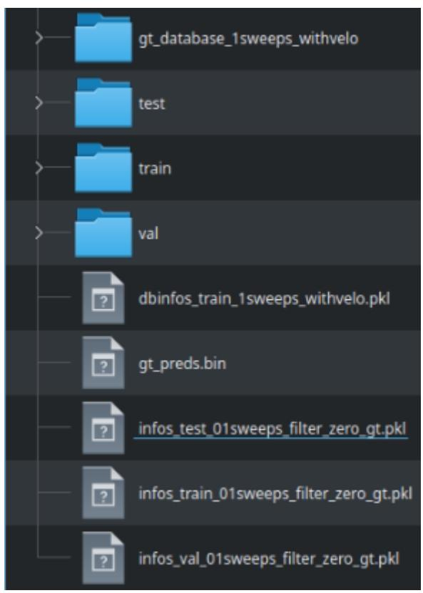

### **FACULTATEA DE AUTOMATICĂ ŞI CALCULATOARE DEPARTAMENTUL CALCULATOARE**

# **Detecția și urmărirea obiectelor 3D în nori de puncte**

LUCRARE DE LICENŢĂ

Absolvent: **Cristian-Carol BUDIUL** Coordonatori științifici: **Prof. Dr. Ing. Sergiu NEDEVSCHI Prof. Dr. Ing. Florin-Ioan ONIGA**

**2024**

#### **FACULTATEA DE AUTOMATICĂ ŞI CALCULATOARE DEPARTAMENTUL CALCULATOARE**

**Prof. dr. ing. Mihaela DÎNȘOREANU**

DECAN, DIRECTOR DEPARTAMENT, **Prof. dr. ing. Rodica POTOLEA**

# Absolvent: **Cristian-Carol BUDIUL**

# **Detecția și urmărirea obiectelor 3D în nori de puncte**

- 1. **Enunțul temei:** *Proiectul își propune implementarea unui sistem de detecție și urmărire a obiectelor 3D bazat pe o rețea neuronală pentru detecția obiectelor și pe un algoritm special pentru urmărirea obiectelor.*
- 2. **Conținutul lucrării:** *Introducere, Obiectivele Proiectului, Studiu Bibliografic, Analiză și fundamentare Teoretică, Proiectare de detaliu și implementare, Testare și validare, Manual de instalare și utilizare, Concluzii, Bibliografie, Lista figurilor, Lista tabelelor, Glosar de termeni.*
- 3. **Locul documentării**: Universitatea Tehnică din Cluj-Napoca, Departamentul Calculatoare
- 4. **Consultanți**:
- 5. **Data emiterii temei:** 1 noiembrie 2023
- 6. **Data predării:** 12 iulie 2024

Coordonatori științifici: Florin-Ioan Oniga

Sergiu Nedevschi

#### **FACULTATEA DE AUTOMATICĂ ŞI CALCULATOARE DEPARTAMENTUL CALCULATOARE**

# **Declarație pe propria răspundere privind autenticitatea lucrării de licență**

Subsemnatul **Budiul Cristian-Carol**, legitimat cu carte de identitate (CI) seria HD nr. 980099 CNP 5020506204963, autorul lucrării Detecția și urmărirea obiectelor 3D în nori de puncte elaborată în vederea susținerii examenului de finalizare a studiilor de licență la Facultatea de Automatică și Calculatoare, Specializarea Calculatoare din cadrul Universității Tehnice din Cluj-Napoca, sesiunea iulie 2024 a anului universitar 2023-2024, declar pe propria răspundere că această lucrare este rezultatul propriei activități intelectuale, pe baza cercetărilor mele și pe baza informațiilor obținute din surse care au fost citate, în textul lucrării, și în bibliografie.

Declar că această lucrare nu conține porțiuni plagiate, iar sursele bibliografice au fost folosite cu respectarea legislației române și a convențiilor internaționale privind drepturile de autor.

Declar, de asemenea, că această lucrare nu a mai fost prezentată în fața unei alte comisii de examen de licență.

In cazul constatării ulterioare a unor declarații false, voi suporta sancțiunile administrative, respectiv, *anularea examenului de licență*.

Data

12.07.2024

Nume, Prenume

Budiul Cristian-Carol

Semnătura

|        | Capitolul 1. Introducere 1                                      |  |
|--------|--------------------------------------------------------------------|--|
|        | Capitolul 2. Obiectivele proiectului3                              |  |
| 2.1.   | Preluarea și configurarea mediului de lucru 3                   |  |
| 2.2.   | Alegerea setului de date3                                          |  |
| 2.3.   | Identificarea și implementarea unei rețele de detecție3            |  |
| 2.4.   | Adaptarea rețelei pentru resursele computaționale disponibile 3 |  |
| 2.5.   | Antrenarea rețelei cu seturi de date diverse 4                  |  |
| 2.6.   | Vizualizarea detecțiilor simple 4                               |  |
| 2.7.   | Identificarea și implementarea unui algoritm de urmărire 4      |  |
| 2.8.   | Crearea datelor de ieșire pentru urmărire 4                     |  |
| 2.9.   | Crearea funcțiilor de vizualizare pentru urmărire4                 |  |
| 2.10.  | Implementarea integrării complete end-to-end4                      |  |
|        | Capitolul 3. Studiu bibliografic 5                              |  |
| 3.1.   | Algoritmi de detecție a obiectelor 3D5                             |  |
| 3.1.1. | Faster R-CNN5                                                      |  |
| 3.1.2. | PillarNet6                                                         |  |
| 3.1.3. | Pillar R-CNN 7                                                  |  |
| 3.2.   | Algoritmi de urmărire a obiectelor 3D detectate 8               |  |
| 3.2.1. | AB3DMOT8                                                           |  |
| 3.2.2. | CenterPoint 8                                                   |  |
| 3.2.3. | SimTrack 9                                                      |  |
| 3.2.4. | CasTrack10                                                         |  |
|        | Capitolul 4. Analiză și fundamentare Teoretică 11               |  |
| 4.1.   | Analiza obiectivelor proiectului 11                             |  |
| 4.1.1. | Cerințe funcționale 11                                          |  |
| 4.1.2. | Cerințe non-funcționale 12                                      |  |
| 4.1.3. | Specificarea use-case-urilor13                                     |  |
| 4.2.   | Componentele și caracteristicile rețelei neuronale 15           |  |
| 4.2.1. | Reader15                                                           |  |
| 4.2.2. | Backbone 15                                                     |  |
| 4.2.3. | Neck15                                                             |  |
| 4.2.4. | Head16                                                             |  |

| 4.2.5.  | Linear16                                                  |  |
|---------|-----------------------------------------------------------|--|
| 4.2.6.  | Batch Normalisation 16                                 |  |
| 4.2.7.  | ReLU 17                                                |  |
| 4.2.8.  | Convoluție 17                                          |  |
| 4.2.9.  | Pooling20                                                 |  |
| 4.2.10. | Dropout20                                                 |  |
| 4.3.    | Funcții de loss (obiectiv) pentru rețeaua neuronală 21 |  |
| 4.3.1.  | Focal Loss21                                              |  |
| 4.3.2.  | Sigmoid Focal Classification Loss21                       |  |
| 4.3.3.  | RegLoss21                                                 |  |
| 4.3.4.  | IouRegLoss22                                              |  |
| 4.4.    | Algoritmi utilizați pentru urmărire 22                 |  |
| 4.4.1.  | Filtru Kalman22                                           |  |
| 4.4.2.  | Metoda de asociere Greedy 23                           |  |
| 4.4.3.  | Calculul hărții de cost23                                 |  |
| 4.5.    | Tehnologii alese pentru implementare24                    |  |
| 4.5.1.  | Python24                                                  |  |
| 4.5.2.  | Conda24                                                   |  |
| 4.5.3.  | Pytorch25                                                 |  |
| 4.5.4.  | Tensorflow25                                              |  |
| 4.5.5.  | CUDA25                                                    |  |
| 4.5.6.  | Open3D25                                                  |  |
| 4.5.7.  | Vedo26                                                    |  |
| 4.5.8.  | OpenCV26                                                  |  |
| 4.6.    | Studiu comparativ al seturilor de date 3D 26           |  |
| 4.6.1.  | KITTI 3D27                                                |  |
| 4.6.2.  | nuScenes28                                                |  |
| 4.6.3.  | Waymo Open Dataset29                                      |  |
| 4.6.4.  | Comparație și concluzii 30                             |  |
|         | Capitolul 5. Proiectare de detaliu și implementare 32  |  |
| 5.1.    | Arhitectura generală a sistemului propus 32            |  |
| 5.1.1.  | Setul de date Waymo33                                     |  |
| 5.1.2.  | Modulul ajutător Smart Copy 33                         |  |
| 5.1.3.  | Rețeaua de detecție a obiectelor 3D 33                 |  |
| 5.1.4.  | Modulul de urmărire a obiectelor 3D 33                 |  |
| 5.1.5.  | Modulul de vizualizare a obiectelor 3D 34              |  |

| Cuprins |
|---------|
|         |

|      | 5.1.6.                                                             | Modulul ajutător ImageToX34                                        |  |  |  |  |
|------|--------------------------------------------------------------------|--------------------------------------------------------------------|--|--|--|--|
| 5.2. |                                                                    | Implementarea rețelei de detecție de obiecte 3D34                  |  |  |  |  |
|      | 5.2.1.                                                             | Arhitectura rețelei de detecție34                                  |  |  |  |  |
|      | 5.2.2.                                                             | Componentele rețelei de detecție35                                 |  |  |  |  |
|      | 5.2.3. Procesul de construcție și rulare a rețelei Pillar R-CNN | 36                                                                 |  |  |  |  |
|      | 5.2.4.                                                             | Configurația rețelei de detecție37                                 |  |  |  |  |
| 5.3. |                                                                    | Implementarea modulului de urmărire a obiectelor 3D38              |  |  |  |  |
|      | 5.3.1. Arhitectura modulului de urmărire                        | 38                                                                 |  |  |  |  |
|      | 5.3.2. Componentele modulului de urmărire                       | 39                                                                 |  |  |  |  |
|      | 5.3.3. Configurația modulului de urmărire                       | 39                                                                 |  |  |  |  |
| 5.4. |                                                                    | Implementarea modulului de vizualizare a rezultatelor40            |  |  |  |  |
|      | 5.4.1. Arhitectura modulului de vizualizare                     | 40                                                                 |  |  |  |  |
|      | 5.4.2. Componentele modulului de vizualizare                    | 41                                                                 |  |  |  |  |
| 5.5. | Alte module ajutătoare dezvoltate                                  | 42                                                                 |  |  |  |  |
|      | 5.5.1.                                                             | Modulul de copiere inteligentă a fișierelor42                      |  |  |  |  |
|      | 5.5.2.                                                             | Modulul de conversie a imaginilor43                                |  |  |  |  |
| 5.6. |                                                                    | Implementarea integrării end-to-end a modulelor43                  |  |  |  |  |
|      | 5.6.1. Scriptul de Integrare                                    | 44                                                                 |  |  |  |  |
|      | 5.6.2.                                                             | Importanța integrării end-to-end45                                 |  |  |  |  |
|      |                                                                    | Capitolul 6. Testare și validare46                                 |  |  |  |  |
| 6.1. | Evaluarea experimentală a rețelei de detecție a obiectelor 3D      | 46                                                                 |  |  |  |  |
|      | 6.1.1.                                                             | Evaluarea calitativă a rezultatelor detecției obiectelor 3D 46  |  |  |  |  |
|      | 6.1.2.                                                             | Evaluarea cantitativă a rezultatelor detecției obiectelor 3D 48 |  |  |  |  |
| 6.2. |                                                                    | Evaluarea experimentală algoritmului de urmărire a obiectelor 3D49 |  |  |  |  |
|      | 6.2.1.                                                             | Evaluarea calitativă a rezultatelor urmăririi obiectelor 3D 49  |  |  |  |  |
|      | 6.2.2.                                                             | Evaluarea cantitativă a rezultatelor urmăririi obiectelor 3D50     |  |  |  |  |
|      | Capitolul 7. Manual de instalare si utilizare                      | 53                                                                 |  |  |  |  |
| 7.1. |                                                                    | Cerințe hardware53                                                 |  |  |  |  |
| 7.2. | Instalarea pachetelor necesare                                     | 53                                                                 |  |  |  |  |
| 7.3. |                                                                    | Importarea setului de date54                                       |  |  |  |  |
| 7.4. | Antrenarea rețelei neuronale de detecție56                         |                                                                    |  |  |  |  |
| 7.5. |                                                                    | Obținerea și vizualizarea rezultatelor detecției56                 |  |  |  |  |
| 7.6. | Obținerea și vizualizarea rezultatelor urmăririi 57             |                                                                    |  |  |  |  |
|      | Capitolul 8. Concluzii                                             | 58                                                                 |  |  |  |  |
| 8.1. | Contribuții personale                                              | 58                                                                 |  |  |  |  |

| 8.2.                               | Rezultate obținute 58    |  |
|------------------------------------|-----------------------------|--|
| 8.3.                               | Dezvoltări ulterioare 58 |  |
| Bibliografie 60                 |                             |  |
| Anexa 1 – Lista figurilor 62 |                             |  |
| Anexa 2 – Lista tabelelor63     |                             |  |
| Anexa 3 –                          | Glosar de termeni64         |  |

# **Capitolul 1. Introducere**

În ultimul deceniu, tehnologiile de scanare 3D și reprezentările geometrice complexe au revoluționat numeroase domenii, de la industria auto și robotică până la realitatea augmentată și siguranța publică. Proiectul de față se înscrie în această tendință de dezvoltare tehnologică, concentrându-se pe una dintre cele mai avansate și promițătoare tehnici utilizate în aceste domenii: detecția și urmărirea obiectelor în nori de puncte 3D. Această metodă nu doar că permite o analiză precisă și detaliată a mediului înconjurător, dar oferă și oportunități nelimitate pentru inovație și îmbunătățirea proceselor existente. Într-un context în care automatizarea și inteligența artificială devin din ce în ce mai relevante, capacitatea de a identifica și urmări obiecte tridimensionale cu mare precizie este esențială pentru dezvoltarea unor aplicații eficiente și sigure.

Norii de puncte 3D sunt seturi dense de puncte în spațiul tridimensional, obținute de obicei prin scanare laser sau tehnologii de fotogrammetrie. Acești nori de puncte furnizează o reprezentare detaliată a suprafețelor și obiectelor, captând informații esențiale despre forma și textura acestora. În contextul detecției și urmăririi obiectelor, aceste date permit identificarea și monitorizarea obiectelor cu o acuratețe impresionantă, chiar și în medii complexe și dinamice.

Detecția obiectelor în nori de puncte implică identificarea și clasificarea diferitelor entități dintr-un set mare de date tridimensionale. Aceasta presupune utilizarea unor algoritmi avansați de procesare a datelor și învățare automată, capabili să distingă între diferitele tipuri de obiecte și să le recunoască pe baza caracteristicilor geometrice și texturale. Urmărirea obiectelor, pe de altă parte, presupune monitorizarea continuă a poziției și orientării acestora în timp real, aspect esențial în aplicații precum navigația autonomă și supravegherea inteligentă.

Progresele recente în tehnologiile de procesare a norilor de puncte au deschis noi perspective pentru implementarea și perfecționarea sistemelor de detecție și urmărire a obiectelor. Algoritmi precum cei de deep learning, modele de rețele neuronale convoluționale 3D și tehnici de clustering au demonstrat capacitatea de a îmbunătăți semnificativ performanța și eficiența acestor sisteme. În consecință, cercetarea continuă în acest domeniu este esențială pentru a valorifica pe deplin potențialul norilor de puncte 3D și pentru a dezvolta soluții inovatoare care să răspundă nevoilor tot mai complexe ale societății moderne.

Deși detecția și urmărirea obiectelor în nori de puncte 3D prezintă numeroase avantaje și aplicații promițătoare, acest domeniu nu este lipsit de provocări semnificative. Una dintre principalele dificultăți constă în volumul mare de date și complexitatea computațională asociată procesării acestor informații tridimensionale. Norii de puncte pot conține milioane de puncte, iar gestionarea și analiza acestora necesită resurse computaționale considerabile și algoritmi extrem de eficienți. În plus, variabilitatea și zgomotul prezent în datele de scanare, cauzate de factori precum condițiile de iluminare, reflexii sau suprafețe texturate, pot afecta acuratețea detecției și urmăririi obiectelor. De asemenea, dinamica mediului, cu obiecte care se deplasează rapid sau interacționează între ele, adaugă un nivel suplimentar de complexitate în identificarea și urmărirea continuă a obiectelor relevante. Astfel, dezvoltarea de metode robuste și scalabile pentru detecția și urmărirea obiectelor în nori de puncte 3D rămâne o provocare esențială pentru cercetători și ingineri.

Aplicabilitatea practică a detecției și urmăririi obiectelor în nori de puncte 3D este vastă și variată, acoperind multiple industrii și domenii. În industria auto, această tehnologie este esențială pentru dezvoltarea vehiculelor autonome, care trebuie să navigheze în siguranță și eficient în medii complexe și dinamice. În robotică, detecția și urmărirea obiectelor 3D permit roboților să interacționeze cu mediul înconjurător și să execute sarcini precise, cum ar fi manipularea obiectelor sau navigarea în spații necunoscute. În plus, în domeniul siguranței publice, tehnologiile de scanare 3D sunt utilizate pentru supravegherea inteligentă și analiza scenei în timp real, contribuind la prevenirea infracțiunilor și gestionarea eficientă a situațiilor de urgență.

Algoritmii de învățare automată joacă un rol crucial în detecția și urmărirea obiectelor în nori de puncte 3D. Utilizarea tehnicilor de deep learning, în special a rețelelor neuronale convoluționale 3D, permite sistemelor să învețe caracteristicile complexe ale obiectelor din datele tridimensionale. Acești algoritmi pot identifica și clasifica obiectele cu o precizie ridicată, chiar și în medii zgomotoase sau variabile. Învățarea automată facilitează, de asemenea, adaptarea rapidă la noi scenarii și medii, oferind flexibilitate și robusteză sistemelor de detecție și urmărire.

Un alt domeniu promițător pentru detecția și urmărirea obiectelor în nori de puncte 3D este integrarea cu realitatea augmentată (AR). Această combinație permite crearea de aplicații interactive și imersive care pot îmbunătăți experiența utilizatorilor în diverse contexte, de la jocuri și divertisment până la educație și formare profesională. Prin utilizarea norilor de puncte 3D, aplicațiile AR pot oferi reprezentări detaliate și precise ale mediului real, suprapunând informații virtuale într-un mod care să fie atât realist, cât și util.

În domeniul construcțiilor și urbanismului, norii de puncte 3D oferă un instrument puternic pentru planificarea și monitorizarea proiectelor. Tehnologiile de scanare 3D permit crearea unor modele detaliate ale terenului și infrastructurii existente, facilitând analiza și optimizarea designului. În timpul construcției, detecția și urmărirea obiectelor în nori de puncte pot monitoriza progresul lucrărilor și detecta eventualele devieri de la planul inițial. Aceasta contribuie la reducerea costurilor și timpului necesar finalizării proiectelor, precum și la îmbunătățirea calității și siguranței construcțiilor.

Tehnologiile de detecție și urmărire în nori de puncte 3D au un impact semnificativ asupra siguranței și navigației autonome. În vehiculele autonome, aceste tehnologii permit identificarea precisă a obstacolelor și a celorlalte participanți la trafic, asigurând o navigare sigură și eficientă. În plus, sistemele de navigație pentru drone și roboți mobili utilizează detecția 3D pentru a evita coliziunile și a naviga prin medii complexe. Îmbunătățirea continuă a acestor tehnologii va contribui la creșterea siguranței și la adoptarea pe scară largă a vehiculelor și dispozitivelor autonome.

În ciuda numeroaselor beneficii, detecția și urmărirea obiectelor în nori de puncte 3D ridică și provocări etice și legale. Utilizarea datelor tridimensionale pentru supravegherea publică poate genera îngrijorări legate de confidențialitate și drepturile individuale. Este esențial ca dezvoltarea și implementarea acestor tehnologii să fie însoțită de reglementări adecvate care să protejeze intimitatea și să asigure utilizarea responsabilă a datelor. De asemenea, trebuie abordate aspectele legale legate de responsabilitatea în caz de erori sau defecțiuni ale sistemelor autonome, pentru a garanta siguranța și drepturile utilizatorilor.

# **Capitolul 2. Obiectivele proiectului**

Proiectul se concentrează pe dezvoltarea unui sistem integrat de detecție și urmărire a obiectelor în nori de puncte 3D, bazat pe preluarea și adaptarea unei rețele de detecție și a unui algoritm de urmărire pentru a forma un sistem integrat end-to-end. Obiectivele acestui proiect includ:

# **2.1. Preluarea și configurarea mediului de lucru**

Asigurarea unui cadru optim de dezvoltare începe cu preluarea și configurarea mediului de lucru. Acest pas implică identificarea și asamblarea componentelor hardware necesare, cum ar fi GPU-uri de înaltă performanță și spațiu de stocare adecvat pentru gestionarea seturilor mari de date. Pe partea de software, este necesară instalarea și configurarea sistemului de operare și a bibliotecilor relevante pentru rețeaua de detecție și algoritmul de urmărire folosit.

## **2.2. Alegerea setului de date**

Alegerea setului de date potrivit este esențială pentru succesul proiectului. Setul de date trebuie să fie suficient de divers și cuprinzător pentru a acoperi toate scenariile posibile de detecție și urmărire. Se va analiza calitatea și volumul datelor disponibile, asigurându-se că acestea includ varietatea necesară de obiecte, texturi și condiții de iluminare. De asemenea, se vor lua în considerare seturi de date publice standardizate pentru a facilita comparabilitatea rezultatelor cu alte studii și pentru a asigura un benchmark solid pentru performanțele rețelei și algoritmului de urmărire.

# **2.3. Identificarea și implementarea unei rețele de detecție**

Pentru a dezvolta o soluție eficientă de detecție, identificarea și implementarea unei rețele de detecție adecvate este crucială. Aceasta presupune evaluarea diferitelor arhitecturi de rețele neuronale disponibile, cum ar fi Faster R-CNN [1], PillarNet [2] sau Pillar R-CNN [3], pentru a determina cea mai potrivită rețea pentru specificațiile și cerințele proiectului nostru. După selecția rețelei, se va trece la implementarea și ajustarea acesteia pentru a optimiza performanța în contextul datelor specifice. Validarea rețelei va implica teste extensive pe seturi de date variate pentru a asigura robustețe și acuratețe în detecție.

### **2.4. Adaptarea rețelei pentru resursele computaționale disponibile**

Pentru a funcționa eficient cu resursele computaționale disponibile, rețeaua de detecție trebuie ajustată. Aceasta presupune optimizarea structurii rețelei pentru a reduce complexitatea computațională, prin ajustarea hiperparametrilor și chiar prin modificarea numărului de layere sau a dimensiunilor filtrelor dacă e necesar. Gestionarea eficientă a memoriei GPU este esențială, implicând ajustarea dimensiunii batch-ului și optimizarea fluxului de date. Testele de performanță și stabilitate vor ajuta la identificarea și eliminarea eventualelor ineficiențe în fluxul de lucru.

# **2.5. Antrenarea rețelei cu seturi de date diverse**

Antrenarea rețelei de detecție necesită utilizarea unor seturi de date diverse. Diverse procentaje din întregul set de date ales vor fi folosite pentru antrenare, folosind atât metode secvențiale, cât și o metoda de eșantionare uniformă a setului de date, pentru a determina impactul asupra performanței. Progresul antrenării va fi monitorizat prin metrici de performanță.

# **2.6. Vizualizarea detecțiilor simple**

Pentru a evalua vizual detecțiile simple realizate de rețea, se va crea un script specializat pentru vizualizare. Acesta va afișa atât punctele 3D, cât și bounding boxurile obiectelor detectate. Obiectele detectate vor fi colorate în funcție de clasă și evidențiate prin contururi sau culori distincte, asigurând compatibilitatea cu fluxul de lucru al rețelei de detecție și facilitând o monitorizare intuitivă.

# **2.7. Identificarea și implementarea unui algoritm de urmărire**

Găsirea și implementarea unui algoritm de urmărire adecvat este crucială. Evaluarea performanțelor diferiților algoritmi, cum ar fi AB3DMOT [4], CenterPoint [5], SimTrack [6] sau CasTrack [7] va determina cel mai potrivit algoritm pentru specificațiile proiectului. Algoritmul selectat va fi integrat cu datele de ieșire ale rețelei de detecție și supus unor teste extensive pentru a evalua performanța combinată și pentru a ajusta parametrii necesari îmbunătățirii rezultatelor.

# **2.8. Crearea datelor de ieșire pentru urmărire**

Datele de ieșire ale rețelei de detecție trebuie create în concordanță cu cerințele algoritmului de urmărire. Acestea trebuie să includă toate informațiile necesare, cum ar fi coordonatele bounding box-urilor, lungimea, lățimea și înălțimea acestora, direcția și alte informații relevante, cum ar fi clasa obiectului, cadrul în care a fost identificat și scorul de încredere al detecției. Consistența și acuratețea acestor date sunt cruciale pentru asigurarea performanței optime a sistemului de urmărire, facilitând monitorizarea și analiza obiectelor detectate în timp real.

# **2.9. Crearea funcțiilor de vizualizare pentru urmărire**

După rularea algoritmului de urmărire pe datele rezultate în urma detecției, acestea trebuie vizualizate. Pentru a monitoriza rezultatele algoritmului de urmărire, se vor dezvolta funcții de vizualizare specializate. Acestea vor include afișarea punctelor 3D și a bounding box-urilor identificate, acestea fiind colorate cu o culoare unică pentru fiecare obiect urmărit. De asemenea, vom include atribute relevante pentru fiecare obiect urmărit cum ar fi identificatorii unici, clasa obiectului si scorul de încredere.

# **2.10.Implementarea integrării complete end-to-end**

Un aspect esențial al proiectului este dezvoltarea unei implementări end-to-end care să integreze toate componentele sistemului, de la încărcarea datelor brute până la vizualizarea finală. Acest script va automatiza întregul proces, gestionând toate etapele intermediare și asigurând o tranziție fluentă între detecție, urmărire și vizualizare. Optimizarea acestuia va minimiza timpul total de procesare, astfel încât rezultatele să fie disponibile într-un interval de timp rezonabil.

# **Capitolul 3. Studiu bibliografic**

Acest capitol va analiza arhitectura și performanțele modelelor state-of-the-art sau inovative în domeniul nostru de interes (detecția și urmărirea de obiecte 3D). De asemenea, uneori vom analiza și rețelele pe care s-au bazat aceste modele de vârf, pentru a înțelege mai bine motivația și arhitectura acestora. De asemenea, vom analiza și seturile de date 3D disponibile, pentru a face o decizie informată cu privire la acestea.

### **3.1. Algoritmi de detecție a obiectelor 3D**

#### 3.1.1. Faster R-CNN

În articolul [1] ne este prezentată rețeaua neuronală Faster R-CNN. Am ales să studiez această rețea deoarece, deși este o rețea mai veche, are o legătură strânsă cu rețeaua Pillar R-CNN [3], pe care am ales să o folosesc în urma studiului bibliografic. Faster R-CNN combină convoluțiile bazate pe regiuni a rețelelor de tip R-CNN cu un deep neural network care propune regiuni de interes către rețeaua R-CNN, astfel îmbunătățind performanțele acesteia.

Pentru a crea această rețea, autorii creat un nou tip de rețea complet convoluțională, numită Region Proposal Network (RPN). Arhitectura RPN-ului constă într-o rețea complet convoluțională, care generează propuneri de regiuni prin calcularea unor scoruri de probabilitate a prezenței obiectelor de interes în imagine. Această rețea este inițial antrenată separat end-to-end, pentru a genera propuneri corecte. După aceea, ea este combinată cu rețeaua de detecție de obiecte Fast R-CNN [8]. Astfel, prin mecanisme de atenție RPN-ul îi spune rețelei Fast R-CNN unde să se uite pentru a detecta obiecte. În urma combinării, performanța rețelei scade vertiginos, deoarece unele straturi convoluționale sunt dublate (se procesează de două ori), deoarece apar atât în RPN, cât și în Fast R-CNN. Pentru a antrena rețeaua combinată în așa fel încât straturile convoluționale să poată fi folosite atât de RPN, cât și de Fast R-CNN, autorii propun trei metode de antrenare:

- Antrenarea alternativă se începe prin antrenarea RPN-ului, iar apoi se antrenează iterativ Fast R-CNN-ul și RPN-ul, folosind rezultatele unuia pentru inițializarea celuilalt. Aceasta e metoda de antrenare folosită în final de autorii rețelei.
- Antrenarea combinată aproximativă se combină cele două rețele în timpul antrenării, și la fiecare iterație pe trecerea înainte se generează predicții prin RPN care sunt furnizate Fast R-CNN-ului ca predicții fixe, precalculate, iar în propagarea înapoi se desfășoară normal, folosindu-se o funcție de loss combinată, formată din loss-ul RPN-ului și din loss-ul Fast R-CNN-ului. Această antrenare este aproximativă deoarece nu ține cont de derivatele față de box-urile propuse deși și acestea sunt produse de o rețea (RPN-ul). Totuși această metodă produce rezultate apropiate de antrenarea alternativă, fiind cu 25-50% mai rapidă decât aceasta în momentul antrenării.
- Antrenarea combinată exactă pentru această metodă, e nevoie de un strat de pooling a regiunii de interes care poate fi derivat. Acestă problemă e netrivială, iar soluția ei nu a fost implementată de autori.

Rezultatele rețelei erau la nivel state-of-the-art la momentul publicării, timpul de inferență fiind mult mai scăzut decât alte rețele cu rezultate comparabile, astfel confirmând performanța Faster R-CNN-ului. Această rețea a fost o componentă esențială pentru multe abordări ulterioare, RPN-ul fiind un tip de rețea foarte folosit în anii ulteriori în cadrul multor altor rețele, printre care și Pillar R-CNN [3].

### 3.1.2. PillarNet

În articolul [2] ne este prezentată rețeaua neuronală de detecție a obiectelor 3D PillarNet. Am ales să studiez această rețea deoarece encoder-ul ei inovativ este o componentă crucială a Pillar R-CNN [3], rețeaua de detecție pe care am ales s-o folosesc în urma studiului bibliografic. PillarNet este o dezvoltare ulterioară a rețelei PointPillars [9], rețelele de acest tip extrăgând informațiile din norul de puncte 3D sub forma unor coloane 2D, care sunt apoi procesate. Arhitectura acesteia este o arhitectură clasică de tip encoder-neck-head, în care fiecare element are un rol specific:

- Encoder-ul extrage trăsături din coloanele 2D folosind straturi succesive de convoluție rară 2D. Acestea fac downsample la harta inițială de coloane 2D pentru a extrage feature-urile necesare. Spre deosebire de alte rețele (cum ar fi PointPillars [9], care nu folosește nici un fel de encoder), acest mod de a extrage feature-uri asigura precizie suplimentara detecției și se poate folosi de progresul rețelelor de detecție de obiecte din imagini 2D, cum ar fi ResNet [10]. În plus, aceste convoluții sparse 2D sunt mai eficiente computațional decât convoluțiile sparse 3D folosite în rețeaua SECOND, ceea ce permite rețelei PillarNet să aibă un neck sau un head mai complex, păstrând aceeași durată de execuție.
- Neck-ul rețelei are rolul de a fuziona feature-urile semantice de nivel înalt cu feature-uri mai fine, de nivel mai scăzut. Această fuziune crește câmpul receptiv pentru a detecta obiecte mai mari și permite detecția mai precisă a obiectelor. Față de PointPillars [9], rețeaua PillarNet folosește un neck mai inteligent, obținut după mai multe iterații succesive de dezvoltare a rețelei. Astfel, neck-ul combină și prelucrează feature-urile detectate pentru a asigura o extragere robustă a feature-urilor. Conform studiilor de ablație, neck-ul modificat îmbunătățește semnificativ acuratețea detecției prin schimbul de informații între feature-urile semantice și cele spațiale.
- Head-ul de detecție este head-ul de detecție din arhitectura CenterPoint, care este un head comun de detecție pentru rețelele de detecție a obiectelor 3D.

Pentru antrenarea rețelei s-a folosit o funcție de loss complexă, care combină diferite funcții de loss:

- O funcție de loss de clasificare bazată pe heatmap-uri.
- O funcție de loss care măsoară diferența dintre locația obiectelor 3D detectate și locația obiectelor 3D reale pe toate cele 3 axe.
- O funcție de loss care măsoară diferența dintre locația obiectelor 3D detectate și locația obiectelor 3D reale doar pe axa Z.
- O funcție de loss care măsoară dimensiunea obiectului 3D detectat.
- O funcție de loss pentru orientarea obiectului 3D detectat.
- O funcție de loss de regresie de tip IoU care decuplează orientarea obiectului de parametrii de regresie, pentru a aborda efectele negative ale deviației centrului și variației dimensiunii asupra regresiei orientării.

Rezultatele rețelei erau la nivel state-of-the-art în momentul publicării, marele avantaj fiind înlocuirea convoluțiilor 3D aplicate direct pe voxeli cu convoluții 2D aplicate pe coloanele 2D generate de encoder. Această strategie a stat la baza multor rețele în anii ulteriori, printre care și Pillar R-CNN [3].

### 3.1.3. Pillar R-CNN

În articolul [3] ne este prezentată rețeaua Pillar R-CNN. Aceasta este este o rețea neuronală inovativă bazată pe fuziunea dintre Faster R-CNN [1] și PillarNet [2]. Această rețea este inovativă deoarece, spre deosebire de alte rețele, ea folosește doar reprezentarea Bird's-Eye View (BEV) pentru a genera propuneri de obiecte 3D., argumentând că această reprezentare conține destule date pentru a genera propunerile, și că alte reprezentări care conțin și punctele 3D în plus față de reprezentarea BEV doar fac pipeline-ul de detecție mai complex și îngreunează antrenarea și inferența folosind acele rețele neuronale.

Această rețea neuronală are o arhitectură formată din două stagii de procesare:

- 1. Backbone-ul rețelei este bazat pe rețeaua PillarNet [2]. Astfel, aceasta convertește punctele 3D în coloane de puncte 2D, care sunt postprocesate folosind un Region Proposal Network, care combină coloanele de puncte 2D de diferite volume pentru a genera hărți de trăsături cu o cantitate mare de informații, care conține și propunerile de obiecte 3D detectate de către rețea. Aceste hărți de trăsături sunt o reprezentare BEV a regiunii de detecție, iar spre deosebire de celelalte rețele sunt singura informație care va fi folosită în pașii următori pentru a detecta obiectele de interes.
- 2. Rafinarea box-urilor 3D se face folosind o arhitectură de tipul Faster R-CNN [1], în care întâi se folosesc conexiuni laterale pentru a densifica hărțile de adâncime, iar apoi se folosește un modul de pooling a regiunii de interes asemănător cu cel din rețeaua Faster R-CNN [1], în care se aleg doar regiunile de interes cele mai importante.

Pentru antrenarea rețelei, se folosește o funcție de loss complexă, care e suma a trei funcții de loss mai simple:

- 1. Funcția de loss a Region Proposal Network-ului, care măsoară cât de bine e antrenat acesta.
- 2. Funcția de loss a rețelei de rafinare a propunerilor, care măsoară cât de bine sunt rafinate box-urile 3D propuse.
- 3. Funcția de loss pentru calibrarea IoU-ului, care ajustează scorurile de clasificare în funcție de precizia localizării box-urilor

Performanțele superioare sunt demonstrate prin comparații riguroase pe seturi de date de mari dimensiuni, cum ar fi Waymo Open Dataset, unde Pillar R-CNN a depășit semnificativ alte metode de detecție 3D atât în termeni de precizie, cât și de eficiență computațională. Rezultatele rețelei sunt la nivel state-of-the-art, depășind toate modelele publicate anterior care folosesc LIDAR și doar un singur cadru pentru detecția obiectelor 3D, demonstrând validitatea presupunerii că reprezentarea Bird's-Eye View conține suficiente date pentru detecția obiectelor 3D.

# **3.2. Algoritmi de urmărire a obiectelor 3D detectate**

### 3.2.1. AB3DMOT

În articolul [4] ne este prezentată rețeaua AB3DMOT, o soluție de bază pentru urmărirea multiplă a obiectelor în 3D (3D Multi-Object Tracking - MOT), cu un accent deosebit pe performanță și simplitate. Am ales să studiez rețeaua AB3DMOT în cadrul studiului bibliografic datorită caracterului său de benchmark în domeniul urmăririi 3D. AB3DMOT nu doar că demonstrează o performanță excepțională și o simplitate de implementare, dar oferă și un standard clar pentru compararea sistemelor de urmărire 3D. Contrar metodelor moderne care tind să fie complexe și consumatoare de resurse, AB3DMOT inovează prin structura simplă și eficientă, care oferă totodată performanțe competitive.

Sistemul AB3DMOT începe prin obținerea detecțiilor 3D dintr-un nor de puncte LiDAR. Apoi, folosește o combinație între un filtru Kalman 3D și Hungarian Algorithm pentru estimarea stării și asocierea datelor. Filtrul Kalman este utilizat pentru a prezice pozițiile obiectelor în timp, în timp ce Hungarian Algorithm realizează asocierea datelor între detecțiile curente și traiectoriile anterioare. Această abordare simplă, dar robustă, permite AB3DMOT să funcționeze în timp real, atingând o rată de 207,4 cadre pe secundă pe dataset-ul KITTI, fiind astfel unul din cele mai rapide sisteme moderne de urmărire 3D.

Pe lângă performanța remarcabilă în timp real, autorii propun și un nou instrument de evaluare a urmăririi 3D, care include trei noi metrici de evaluare: AMOTP (Average Multi-Object Tracking Precision), AMOTA (Average Multi-Object Tracking Accuracy), sAMOTA (scaled Average Multi-Object Tracking Accuracy). Aceste metrici sunt concepute pentru a oferi o evaluare mai cuprinzătoare a performanței sistemelor de urmărire 3D, luând în considerare diferite praguri de încredere ale detecțiilor și oferind o imagine completă a acurateței și performanței unui sistem MOT.

În concluzie, AB3DMOT se evidențiază prin simplitatea și eficiența sa, demonstrând performanțe puternice în urmărirea obiectelor în 3D, fără a compromite viteza de execuție. Acest sistem oferă o bază solidă pentru dezvoltările viitoare în domeniul urmăririi obiectelor 3D, fiind acompaniat de un set de instrumente de evaluare care standardizează măsurătorile performanței în acest domeniu.

# 3.2.2. CenterPoint

În articolul [5] ne este prezentată rețeaua CenterPoint, o metodă inovatoare pentru detectarea și urmărirea obiectelor 3D în datele LiDAR. Am selectat această rețea datorită performanțelor sale superioare în detectarea și urmărirea obiectelor 3D, precum și a eficienței sale computaționale. CenterPoint a demonstrat rezultate de vârf în benchmark-uri precum nuScenes [11] și Waymo [12], având o arhitectură simplificată și eficientă, care utilizează resursele hardware într-un mod optim. Reprezentarea obiectelor ca puncte oferă avantaje semnificative în ceea ce privește acuratețea și robustețea față de metodele tradiționale bazate pe ancore.

CenterPoint utilizează un detector de puncte cheie pentru a identifica centrele obiectelor și a regresa toate atributele acestora, inclusiv dimensiunea 3D, orientarea și viteza. Această metodă oferă un avantaj semnificativ prin reprezentarea obiectelor ca puncte, eliminând necesitatea ancorelor orientate și reducând dramatic spațiul de căutare al detectorului de obiecte.

Arhitectura CenterPoint include două etape principale. Prima etapă folosește o rețea backbone bazată pe LiDAR, cum ar fi Faster R-CNN [1] sau PillarNet [2], pentru a construi o reprezentare a norului de puncte de intrare, care este apoi transformată întro vizualizare de tip overhead map-view. Detectorul de puncte cheie bazat pe imagini localizează centrele obiectelor și regresează atributele acestora de la o caracteristică punctuală la locația centrală.

Etapa de rafinare în două trepte este un aspect inovator al CenterPoint. În prima etapă, modelul produce predicții dense, inclusiv un heatmap specific clasei, dimensiunea obiectului, rafinamentul sub-voxel, rotația și viteza. Aceste date generate sunt utilizate pentru a localiza centrele obiectelor. A doua etapă extrage caracteristici punctuale la centrele 3D ale fiecărei fețe a bounding box-ului estimat al obiectului, recuperând informațiile geometrice locale pierdute și aducând un spor semnificativ de performanță.

Reprezentarea bazată pe centre oferă mai multe avantaje cheie: elimină orientarea intrinsecă a bounding box-urilor, reducând astfel spațiul de căutare al detectorului de obiecte și permițând rețelei backbone să învețe invarianța rotativă a obiectelor și echivarianța rotativă a rotației relative a acestora. De asemenea, simplifică sarcinile ulterioare, cum ar fi urmărirea obiectelor. CenterPoint prezice offset-ul relativ (viteza) al obiectelor între cadre consecutive, care sunt apoi legate folosind o metodă de potrivire greedy. Aceste caracteristici fac din CenterPoint un model eficient și performant pentru detectarea și urmărirea obiectelor 3D în aplicații precum conducerea autonomă.

### 3.2.3. SimTrack

În articolul [6] ne este prezentată rețeaua SimTrack, un model end-to-end pentru urmărirea multi-obiect 3D utilizând nori de puncte LiDAR. SimTrack abordează limitările metodelor tradiționale de urmărire prin detecție (tracking-by-detection) prin eliminarea necesității unui pas euristic de potrivire pentru asocierea detecțiilor. În schimb, propune un model unificat care integrează detecția, urmărirea și gestionarea vieții urmărilor într-un singur proces.

SimTrack introduce conceptul de hartă centrică ("hybrid-time centerness map"), care înregistrează locațiile de prima apariție ale obiectelor într-un fișier de date de intrare. Această hartă permite legarea directă a detecțiilor curente la obiectele urmărite anterior fără necesitatea unui pas suplimentar de potrivire. Pentru fiecare obiect detectat, SimTrack utilizează un heatmap gaussian bidimensional centrată pe locația obiectului pentru a reprezenta probabilitatea existenței acestuia. Această hartă este actualizată continuu printr-o ramură de estimare a mișcării (motion updating branch), care calculează offset-ul obiectelor între cadre consecutive, permițând astfel actualizarea locațiilor acestora.

În timpul inferenței, SimTrack transformă harta centrică actualizată de la momentul de timp anterior în sistemul de coordonate curent, folosind datele de mișcare ale vehiculului (ego-motion). Această hartă este apoi combinată prin mediere cu harta centrică curentă. Obiectele sunt identificate prin citirea directă a identităților din celulele hărții, fără a necesita reguli complexe de potrivire. Obiectele nou-detectate sunt integrate în harta curentă, iar obiectele dispărute sunt eliminate.

SimTrack utilizează backbone-uri flexibile precum Faster R-CNN [1] sau PillarNet [2] pentru a extrage caracteristici din norii de puncte procesați. Rețeaua de detecție a SimTrack generează output-uri precum harta centrică, offset-ul local, dimensiunea obiectului și orientarea acestuia. Pentru antrenare, se utilizează o combinație de pierderi focalizate (focal loss) pentru harta centrică și pierderi L1 pentru ramurile de actualizare a mișcării și de regresie a altor proprietăți ale obiectelor (înălțime, dimensiuni și unghi de direcție).

Evaluările pe seturile de date la scară largă, precum nuScenes [11] și Waymo [12], arată că SimTrack oferă performanțe competitive sau superioare metodelor de ultimă generație, eliminând în același timp necesitatea unor reguli euristice complexe și a gestionării manuale a vieții urmăririlor.

3.2.4. CasTrack

În articolul [7] ne este prezentată rețeaua CasTrack. Aceasta este o rețea de urmărire multi-obiect 3D concepută pentru a urmări mai robust obiectele care sunt temporar omise de detectoare. Rețeaua CasTrack folosește un model de mișcare cu accelerație constantă (CA) pentru a estima pozițiile viitoare și produce o încredere în predicție pentru a ghida asocierea datelor, îmbunătățind conștientizarea calității detecției.

CasTrack constă din patru pași principali în cadrul său de urmărire prin detecție:

- 1. Detecția obiectelor: Obiectele sunt detectate din norii de puncte folosind un detector 3D bazat pe învățare profundă, cum ar fi Faster R-CNN [1] sau PillarNet [2]. Detectorul generează bounding box-uri, caracteristici corespunzătoare norilor de puncte și scoruri de detecție.
- 2. Estimarea stărilor: Posibilele stări curente ale obiectelor urmărite sunt estimate folosind predictorul propus, care se bazează pe un model de mișcare CA și un model care atribuie fiecărei stări prezise un scor de încredere.
- 3. Asocierea datelor: Stările prezise sunt asociate cu stările detectate prin intermediul încrederii în predicție și al unui cost pereche agregat propus. Acest cost include componente de geometrie, apariție și mișcare.
- 4. Actualizarea stărilor: Perechile asociate și stările detectate neasociate sunt actualizate și inițializate ca stări urmărite. Stările prezise neasociate de la detecții temporar omise sunt păstrate, iar urmărirea acestora continuă în cadrul următor.

Componenta de cost pereche agregat este esențială pentru asocierea datelor în CasTrack. Aceasta valorifică caracteristicile de geometrie, apariție și mișcare ale obiectelor din norii de puncte. Costul geometric este definit prin afinitatea geometrică a cutiilor de delimitare 3D, costul de apariție este măsurat folosind caracteristicile extrase din rețeaua backbone a detectorului, iar costul de mișcare este formulat pe baza vectorilor de viteză ai stărilor detectate și prezise.

Evaluările efectuate pe benchmark-urile de urmărire KITTI [13] si Waymo [12] au demonstrat că metoda propusă de CasTrack depășește cu mult metodele de ultimă oră atât în ceea ce privește acuratețea, cât și viteza de urmărire, subliniind importanța conștientizării calității predicției în asocierea datelor și utilizarea eficientă a caracteristicilor norilor de puncte pentru urmărire rapidă și precisă.

# **Capitolul 4. Analiză și fundamentare Teoretică**

În acest capitol, vom explora fundamentele teoretice esențiale pentru sistemul de detecție și urmărire a obiectelor 3D în nori de puncte. Vom începe prin analiza obiectivelor proiectului, care va duce la un set de cerințe funcționale și non-funcționale. După aceea, vom prezenta o specificare a unui use-case pentru actorul principal, cercetătorul. De asemenea, vom analiza în detaliu componentele rețelei neuronale și metricile utilizate pentru antrenarea acesteia, algoritmii utilizați pentru urmărire, precum și tehnologiile pe care le vom folosi pentru implementare, oferind astfel o bază solidă pentru înțelegerea și justificarea soluțiilor tehnice adoptate. Această analiză teoretică este crucială pentru a fundamenta deciziile de proiectare și pentru a demonstra valoarea și eficiența metodologiilor utilizate în cadrul proiectului.

## **4.1. Analiza obiectivelor proiectului**

Această secțiune prezintă specificațiile și cerințele tehnice pentru dezvoltarea sistemului de detecție și urmărire a obiectelor 3D în nori de puncte. Vom descrie cerințele funcționale și non-funcționale ale sistemului, bazate pe obiectivele proiectului și nevoile identificate ale utilizatorilor. De asemenea, vom detalia un use-case specific pentru actorul principal, cercetătorul, și vom include o diagramă de activitate pentru acest scenariu.

### 4.1.1. Cerințe funcționale

Cerințele funcționale ale unui sistem reprezintă descrierea specifică a ceea ce sistemul trebuie să facă pentru a satisface nevoile utilizatorilor și pentru a îndeplini obiectivele proiectului. Aceste cerințe descriu în detaliu funcționalitățile pe care sistemul trebuie să le ofere pentru a răspunde atât cerințelor tehnice, cât și celor de utilizare practică. În continuare, vom detalia aceste cerințe, subliniind importanța fiecărei funcționalități în cadrul sistemului:

- Detectarea obiectelor 3D sistemul trebuie să fie capabil să scaneze norii de puncte 3D și să detecteze obiectele din aceste date. Acesta trebuie să identifice cu precizie obiectele de interes din mediul înconjurător, folosind algoritmi de învățare automată și rețele neuronale specializate. Funcționalitatea de detectare este esențială pentru a obține o reprezentare clară și detaliată a mediului analizat, potrivită pentru algoritmul de urmărire.
- Clasificarea obiectelor detectate sistemul trebuie să fie capabil să clasifice obiectele detectate în diferite categorii. Clasificarea trebuie să se bazeze pe caracteristicile geometrice și texturale ale obiectelor. Aceasta permite identificarea tipurilor specifice de obiecte, cum ar fi vehicule, pietoni sau alte entități relevante pentru aplicația specifică. O clasificare precisă este crucială pentru urmărirea în mod corect a obiectelor 3D, deoarece știind clasa obiectului putem să ne așteptăm la anumite comportamente din partea acestuia.
- Urmărirea obiectelor 3D sistemul trebuie să fie capabil să urmărească în timp real obiectele detectate, actualizând constant poziția și traiectoria acestora pe măsură ce se mișcă. Urmărirea trebuie să fie continuă și precisă, chiar și în condiții de mediu variabile sau cu prezența zgomotului. Sistemul trebuie să gestioneze eficient situațiile în care obiectele urmărite ies

temporar din câmpul de vizualizare și să reia urmărirea lor atunci când reapar.

• Vizualizarea obiectelor 3D – sistemul trebuie să ofere atât o interfață grafică pentru vizualizarea în timp real a obiectelor detectate și urmărite, cât și posibilitatea de înregistrare a vizualizărilor. Vizualizarea trebuie să conțină norii de puncte 3D și să evidențieze obiectele detectate și urmăribile prin contururi sau culori distinctive, însoțite de metricile relevante (clasa obiectului, id-ul obiectului și scorul de detecție. De asemenea, utilizatorul trebuie să aibă posibilitatea de a naviga și explora vizualizarea 3D, inclusiv funcții de zoom și rotație pentru o analiză detaliată.

### 4.1.2. Cerințe non-funcționale

Cerințele non-funcționale ale unui sistem se referă la constrângerile și caracteristicile de calitate care nu privesc funcționalitatea specifică a sistemului, ci modul în care sistemul efectuează funcțiile descrise. Aceste cerințe sunt cruciale pentru a asigura performanța, scalabilitatea, robustețea și modularitatea sistemului, garantând astfel că sistemul va funcționa eficient și fiabil în condiții diverse și complexe. În continuare, vom detalia aceste cerințe non-funcționale, subliniind importanța fiecărei caracteristici în cadrul sistemului:

- Performanță sistemul trebuie să fie capabil să proceseze norii de puncte 3D cu un volum mare de date într-un timp rezonabil. Pentru a asigura performanța necesară, sistemul trebuie să fie optimizat pentru a gestiona volume mari de date cu o latență maximă de la detecție la vizualizare de 100ms. Aceasta este esențială pentru a permite funcționarea în timp real, necesară în aplicații critice cum ar fi vehiculele autonome sau sistemele de supraveghere.
- Scalabilitate sistemul trebuie să fie scalabil pentru a face față creșterii volumului de date și a complexității acestora fără a compromite performanța. Acesta trebuie să fie capabil să se adapteze la cerințele crescânde prin utilizarea resurselor de calcul suplimentare, cum ar fi GPUuri adiționale. Scalabilitatea este importantă pentru a permite extinderea sistemului în funcție de nevoile specifice ale utilizatorilor și pentru a asigura că sistemul va putea gestiona eficient sarcini din ce în ce mai complexe și mai voluminoase.
- Robustețe sistemul trebuie să fie robust, capabil să funcționeze eficient în diverse condiții de mediu și să mențină performanța în prezența zgomotului și a variațiilor de densitate ale norilor de puncte. Sistemul trebuie să gestioneze eficient situațiile imprevizibile și să fie capabil să se recupereze rapid după erori sau întreruperi. Robustețea înseamnă și capacitatea sistemului de a menține un nivel ridicat de acuratețe și fiabilitate, chiar și în condiții de mediu dificile, asigurând astfel continuitatea și consistența operațiunilor.
- Modularitate Sistemul trebuie să fie conceput într-o manieră modulară, permițând dezvoltarea, testarea și întreținerea componentelor sale în mod independent. Modulele principale ale sistemului vor trebui să includă:
	- o Modulul de detecție: responsabil pentru identificarea obiectelor 3D în norii de puncte.
	- o Modulul de urmărire: responsabil pentru monitorizarea și actualizarea poziției obiectelor detectate în timp real.
- o Modulul de vizualizare: responsabil pentru afișarea grafică a obiectelor detectate și urmărite.
- Modularitatea facilitează actualizarea și îmbunătățirea sistemului prin adăugarea sau modificarea modulelor fără a afecta întregul sistem. Aceasta contribuie la flexibilitatea și adaptabilitatea sistemului, permițându-i să răspundă rapid la schimbările cerințelor sau la integrarea noilor tehnologii. Un design modular îmbunătățește, de asemenea, reutilizarea codului și reducerea timpului de dezvoltare pentru viitoarele extinderi și actualizări ale sistemului.

### 4.1.3. Specificarea use-case-urilor

Specificarea unor use-case-uri este esențială pentru a ilustra modul în care utilizatorii vor interacționa cu sistemul și cum acesta va răspunde cerințelor lor. În acest context, vom detalia două scenarii de utilizare pentru actorul principal, cercetătorul: antrenarea sistemului și inferența (utilizarea sistemului pentru detecție și urmărire). Aceste specificații vor include pașii necesari pentru realizarea acestor activități și vor furniza diagrame de activitate pentru a vizualiza fluxul procesului.

- Use-Case 1: Antrenarea sistemului:
	- o Actor principal**:** Cercetătorul
		- o Fluxul principal [\(.](#page-19-1) )**:**

Figura 4.1. Fluxul de bază a use-case-ului de antrenare

- 1. Cercetătorul configurează parametrii de antrenare.
- 2. Cercetătorul încarcă setul de date de antrenare în sistem
- 3. Cercetătorul pornește antrenarea
- 4. Cât timp antrenarea nu e finalizată, sistemul monitorizează progresul antrenării, salvând periodic modelul antrenat
- 5. Sistemul finalizează antrenarea și salvează modelul antrenat.
- o Fluxuri Alternative**:**
	- Eroare la încărcarea setului de date dacă datele încărcate sunt incomplete sau corupte, sistemul notifică cercetătorul și cere reîncărcarea setului de date.
	- Eroare în configurarea parametrilor dacă parametrii de antrenare configurați nu sunt valizi, cercetătorul primește un mesaj de eroare și sugestii pentru corectarea acestora.
	- Eroare în timpul antrenării dacă apare o eroare în timpul antrenării, sistemul oprește procesul, salvează starea curentă și notifică cercetătorul pentru a investiga problema.
- Use-Case 2: Inferența (detecția și urmărirea obiectelor 3D):
	- o Actor principal**:** Cercetătorul
	- o Fluxul principal [\(Figura 4.2\)](#page-20-0)**:**

- 1. Cercetătorul încarcă datele pentru inferență
- 2. Cercetătorul pornește inferența
- 3. Sistemul detectează obiectele 3D
- 4. Sistemul detectează urmărește obiectele 3D
- 5. Sistemul afișează rezultatele urmăririi
- 6. Sistemul salvează rezultatele urmăririi
- o Fluxuri Alternative**:**
- Eroare la încărcarea datelor (pasul 1) Dacă datele încărcate sunt incomplete sau corupte, sistemul notifică cercetătorul și cere reîncărcarea datelor.
- Eroare la pornirea inferenței (pasul 2) Dacă apare o eroare în timpul pornirii inferenței, sistemul oprește procesul și notifică cercetătorul pentru a investiga problema.

# **4.2. Componentele și caracteristicile rețelei neuronale**

Această secțiune detaliază straturile și componentele cheie ale rețelei neuronale folosite pentru detecția și urmărirea obiectelor 3D în nori de puncte. Vom explora rolul fiecărei părți, de la preluarea și preprocesarea datelor, la extragerea și combinarea caracteristicilor, până la producerea predicțiilor finale, evidențiind importanța fiecărei componente în funcționarea eficientă a rețelei.

# 4.2.1. Reader

Reader-ul este prima componentă în pipeline-ul de procesare a norilor de puncte 3D. Acesta este responsabil pentru citirea datelor de intrare din diverse formate, cum ar fi PCD (Point Cloud Data) sau LAS (LIDAR Data Exchange Format). Odată ce datele sunt încărcate, reader-ul normalizează coordonatele punctelor pentru a le alinia într-un interval standardizat, de obicei între -1 și 1, pentru a facilita procesarea ulterioară. Filtrarea zgomotului este o etapă crucială, realizată prin tehnici precum filtre mediane, care elimină punctele izolate, și statistical outlier removal, care elimină punctele care deviază semnificativ de la densitatea medie a norului de puncte. Această etapă asigură calitatea și acuratețea datelor ce vor fi ulterior procesate de rețea.

# 4.2.2. Backbone

Backbone-ul este structura principală a rețelei neuronale, responsabilă de extragerea caracteristicilor esențiale din datele de intrare. În contextul norilor de puncte 3D, backbone-ul utilizează straturi convoluționale 3D care pot captura relații spațiale complexe. Aceste convoluții sunt configurate pentru a parcurge volume tridimensionale și pentru a extrage trăsături de la niveluri variate de abstractizare. În unele abordări, norii de puncte sunt proiectați într-un plan bidimensional, numită și proiecție Bird's Eye View - BEV, unde straturile convoluționale 2D sunt aplicate pentru a reduce complexitatea computațională și a facilita prelucrarea. Straturile de pooling și downsampling (convoluție cu pas mai mare de 1 sau fără padding) sunt esențiale pentru a reduce dimensiunea datelor, eliminând redundanțele și agregând informațiile esențiale, ceea ce permite rețelei să se concentreze pe caracteristicile relevante.

# 4.2.3. Neck

Neck-ul reprezintă o interfață între backbone și head, având rolul de a combina și prelucra caracteristicile extrase de backbone. Acesta fuzionează trăsăturile din multiple niveluri de abstractizare, folosind straturi convoluționale suplimentare și mecanisme de atenție. Aceste mecanisme permit modelului să acorde o importanță variabilă diferitelor părți ale datelor de intrare, îmbunătățind astfel acuratețea detecției și urmăririi. Neck-ul poate include straturi de convoluție cu kernel-uri de diferite dimensiuni pentru a captura atât detalii fine, cât și trăsături globale.

### 4.2.4. Head

Head-ul este componenta finală a rețelei neuronale formată din mai multe straturi, responsabilă de generarea predicțiilor finale. Aceasta include straturi specializate pentru regresia bounding box-urilor și clasificarea obiectelor. Straturile de regresie ajustează coordonatele bounding box-urilor pentru a asigura o aliniere precisă cu obiectele detectate, în timp ce straturile de clasificare (softmax sau sigmoid) transformă ieșirile în probabilități de clasă. Head-ul poate include și straturi suplimentare pentru predicția orientării și dimensiunilor sau chiar pentru urmărirea obiectelor, folosind diferite metrici de loss pentru a optimiza aceste predicții.

### 4.2.5. Linear

Straturile liniare (fully connected layers) joacă un rol esențial în combinarea caracteristicilor extrase de convoluții și reducerea dimensiunii acestora pentru a se potrivi cu spațiul de ieșire necesar. Aceste straturi conectează fiecare neuron din stratul anterior cu fiecare neuron din stratul curent. De asemenea, straturile liniare permit reducerea dimensiunii datelor prin selectarea unui număr mai mic de neuroni în stratul liniar comparativ cu stratul anterior, facilitând astfel calculele ulterioare și reducând complexitatea computațională.

### 4.2.6. Batch Normalisation

Batch Normalisation este o tehnică esențială pentru stabilizarea și accelerarea antrenării rețelelor neuronale. Aceasta normalizează activările unui strat pentru fiecare mini-batch, menținând valorile activărilor într-un interval dorit. În mod standard, normalizarea se face în funcție de media și deviația standard a activărilor din minibatch, setând media la 0 și deviația standard la 1. Totuși, în practică, poate fi benefic ca aceste valori să nu fie fixate la 0 și 1, ci să fie învățate ca parametri ai rețelei. Aceasta înseamnă că, pe lângă normalizarea standard, se adaugă doi parametri învățați pentru fiecare strat: unul pentru scala (gamma) și unul pentru offset (beta), permițând rețelei să ajusteze media și deviația standard în mod optim în funcție de datele de antrenament. Astfel, batch normalization nu doar stabilizează și accelerează antrenarea, dar și permite rețelei să fie mai flexibilă și adaptabilă la diferite seturi de date.

#### 4.2.7. ReLU

Funcția de activare ReLU (Rectified Linear Unit) este utilizată pentru a introduce non-liniarități esențiale în rețea, permițând modelului să învețe relații complexe între date. Funcția ReLU standard este definită ca

$$
f(x) = max(0, x)
$$

unde valorile negative sunt setate la zero, ceea ce ajută la eliminarea problemelor de gradienti explozivi sau vanishing gradients. Sparse ReLU este o variantă a ReLU care este special concepută pentru a eficientiza procesarea datelor sparse, cum ar fi rezultatele convoluțiilor sparse. În Sparse ReLU, activările care sunt zero rămân zero, iar cele nenule sunt procesate ca în ReLU standard, acesta rulând direct pe rezultatul sparse al convoluției. Această abordare economisește resurse computaționale, deoarece se omite un pas de transformare a datelor sparse în date dense, și deoarece doar activările nenule sunt procesate, reducând astfel timpul de calcul și consumul de memorie. Pe lângă ReLU, există și alte funcții de activare precum Leaky ReLU, care permite unui mic gradient să treacă și pentru valorile negative, GeLU (Gaussian Error Linear Unit), care folosește o funcție sigmoidă pentru o tranziție mai lină, și alte funcții, fiecare având avantaje specifice în funcție de tipul de date și aplicația specifică. În sunt prezentate grafic funcțiile ReLU, GeLU și Leaky ReLU, ilustrând comportamentele acestora pentru diferite valori de intrare.

Figura 4.3. Graficele funcțiilor ReLU, GeLU și Leaky ReLU

#### 4.2.8. Convoluție

Straturile de convoluție sunt esențiale pentru extragerea caracteristicilor din datele de intrare. Pentru a înțelege procesul de convoluție, este nevoie să definim convoluția, să detaliem parametrii și modul de funcționare a unei convoluții iar apoi să descriem diferitele tipuri de convoluții.

Convoluția este o operație matematică utilizată pentru a extrage caracteristici dintr-un tensor de intrare. Acest proces implică aplicarea unui kernel (sau filtru) la tensorul de intrare pentru a produce un tensor de ieșire [\(Figura 4.4\)](#page-24-0).

Figura 4.4. Un pas din procesul de convoluție [17]

Parametrii acestei funcții sunt:

- Kernel (Filtru) Kernelul este un tensor de dimensiuni fixe, de regulă pătrat (în cele mai multe cazuri dimensiunile fiind 3x3 sau 5x5) care conține greutăți. Aceste greutăți sunt ajustate în timpul antrenării rețelei neuronale pentru a învăța caracteristicile importante ale datelor. Kernelul este trecut peste tensorul de intrare pentru a calcula produsul punct cu punct, iar rezultatele sunt apoi sumate pentru a obține o valoare unică pentru fiecare poziție a kernelului pe tensorul de intrare.
- Stride Stride-ul reprezintă pasul cu care kernelul se deplasează peste tensorul de intrare. De exemplu, un stride de 1 înseamnă că kernelul se deplasează cu un singur element la fiecare pas, iar un stride de 2 înseamnă că kernelul sare peste un element la fiecare pas. Stride-ul afectează dimensiunea tensorului de ieșire: un stride mai mare reduce dimensiunea ieșirii, deoarece kernelul efectuează mai puține operații de convoluție.
- Padding Padding-ul implică adăugarea de margini cu valori generate în jurul tensorului de intrare pentru a controla dimensiunea tensorului de ieșire. Aceste valori generate pot fi 0 (aceasta fiind cel mai folosit tip de padding) sau poate respecta o anumită logică, cum ar fi reflectarea imaginii pentru a genera padding-ul sau replicarea marginii. În cadrul rețelelor neuronale se folosesc de regulă următoarele tipuri de padding:
	- o Valid Padding (fără padding) Kernelul este aplicat doar pe zonele valide ale tensorului de intrare, rezultând un tensor de ieșire mai mic.
	- o Same Padding (padding cu zero) Margini de valori zero sunt adăugate astfel încât dimensiunea tensorului de ieșire să fie aceeași cu cea a tensorului de intrare. Padding-ul ajută la păstrarea dimensiunii inițiale a datelor, ceea ce poate fi util în anumite aplicații.

Astfel, datorită parametrilor descriși anterior dimensiunea tensorului de ieșire are următoarea formulă de calcul:

$$
O=\Bigl[\frac{W-K+2P}{S}\Bigr]+1
$$

unde:

- este dimensiunea tensorului de ieșire,
- este dimensiunea tensorului de intrare,
- este dimensiunea kernelului,
- este padding-ul,
- este stride-ul.

Odată ce acești parametri sunt stabiliți, procesul de convoluție se desfășoară urmând următorii pași:

- 1. (Opțional) Se aplică padding de dimensiunea dorită de jur împrejurul imaginii
- 2. Kernelul este poziționat la începutul tensorului de intrare.
- 3. Elementele din kernel sunt înmulțite cu elementele corespunzătoare din tensorul de intrare.
- 4. Valorile rezultate sunt adunate pentru a produce un singur element din tensorul de ieșire.
- 5. Kernelul se deplasează la următoarea poziție conform stride-ului specificat.
- 6. Procesul se repetă până când întregul tensor de intrare a fost acoperit de kernel.

Acest proces este de asemenea ilustrat în [Figura 4.5.](#page-25-0)

| U 2                     | U o                  |                |   |   |                  |   |  |    |  |
|----------------------------|-------------------------|----------------|---|---|------------------|---|--|----|--|
| 0                          | $\overline{\mathbf{2}}$ | $\overline{2}$ | 3 | 3 | 3                |   |  |    |  |
|                            |                         |                | 3 |   | 3                |   |  | 6  |  |
| 0 ı                     |                         |                | 0 |   | з                |   |  | 10 |  |
| ı $\boldsymbol{0}$ ı | 3                       | з              | 2 | 1 | $\boldsymbol{2}$ |   |  |    |  |
| 0 ı                     | 3                       | 3              | 0 | 2 | 3                | 0 |  |    |  |
|                            |                         |                |   |   |                  |   |  |    |  |

Figura 4.5. O ilustrare a procesului de convoluție cu padding = 1 și stride = 2 [16]

După natura datelor de intrare, convoluțiile pot fi:

- Convoluții dense acestea procesează toate valorile dintr-un tensor de intrare. În cazul unei convoluții 2D, un kernel de dimensiuni va parcurge întreaga imagine și va aplica operația de convoluție la fiecare poziție, indiferent dacă valorile din fereastră sunt nule sau nenule. Această convoluție este eficientă pentru date dense, cum ar fi imaginile, unde fiecare pixel conține informații semnificative.
- Convoluțiile sparse acestea sunt optimizate pentru date care conțin multe valori zero, cum ar fi norii de puncte 3D. În convoluțiile sparse, operațiile de convoluție sunt aplicate doar pe elementele nenule din tensorul de intrare, economisind astfel resurse computaționale și memorie.

#### 4.2.9. Pooling

Pooling-ul este un timp special de convoluție, care păstrează toți parametrii acesteia (stride, padding, dimensiunea variabila a kernel-ului), dar care în loc să aplice o serie de greutăți peste tensor prin înmulțirea greutăților din kernel cu elementele corespunzătoare din tensorul de intrare aplică o funcție specială de agregare. Această funcție poate fi una foarte simplă (minim, maxim, medie, random) sau poate fi o funcție mai complexă (stochastic, L2, rank). Indiferent de funcția folosită, acest strat este utilizat pentru un singur scop: reducerea dimensiunii tensorului de intrare. [Figura 4.6](#page-26-2) ilustrează modul în care se aplică această operațiile de max pooling și average pe o imagine dată folosind un kernel de dimensiune 2 x 2.

Figura 4.6. Operațiile de max pooling și average pooling. [18]

#### 4.2.10. Dropout

Dropout este o tehnică de regularizare care ajută la prevenirea overfitting-ului. În timpul antrenării, un procentaj aleator de neuroni este dezactivat (setat la zero) la fiecare pas de antrenare, forțând rețeaua să învețe reprezentări mai robuste. Dropout funcționează prin selectarea aleatorie a neuronilor care vor fi dezactivați, așa cum este ilustrat în [Figura 4.7](#page-26-3), ceea ce reduce dependența de anumite neuroni și îmbunătățește capacitatea de generalizare a rețelei. Această tehnică este esențială pentru dezvoltarea unui model care poate performa bine pe date noi, nevăzute în timpul antrenării.

Figura 4.7. O rețea neuronală înainte și după aplicarea operației de dropout

# **4.3. Funcții de loss (obiectiv) pentru rețeaua neuronală**

Această secțiune se concentrează pe metricile utilizate pentru evaluarea performanței rețelei neuronale. Metricile sunt esențiale pentru a măsura eficiența și acuratețea modelului nostru, oferind o bază obiectivă pentru îmbunătățirea și ajustarea acestuia. În acest context, vom discuta următoarele funcții de loss:

#### 4.3.1. Focal Loss

Focal Loss este o funcție de loss utilizată pentru a aborda problema dezechilibrelor de clasă, focalizând învățarea pe exemplele mai dificile prin aplicarea unui factori de focalizare γ.

Metrica Focal Loss este definită astfel:

$$
\mathcal{L}(p_t) = -\alpha_t (1-p_t)^\gamma \log(p_t)
$$

unde:

- este probabilitatea prezisă pentru clasa corectă.
- este un factor de ponderare pentru a gestiona dezechilibrele de clasă.
- este un factor de focalizare care reduce contribuția exemplelor ușor de clasificat și mărește contribuția exemplelor dificil de clasificat.

#### 4.3.2. Sigmoid Focal Classification Loss

Sigmoid Focal Classification Loss este o variantă a Focal Loss care este adaptată pentru probleme de clasificare binară și multi-clasă folosind funcția de activare sigmoidă. Aceasta este utilizată pentru a aborda problema dezechilibrelor de clasă în clasificare, și este definită astfel:

$$
\mathcal{L}(p_t) = -\alpha_t (1 - p_t)^\gamma \log(p_t)
$$

unde:

- = () este probabilitatea prezisă pentru clasa corectă după aplicarea funcției sigmoid, cu fiind ieșirea logistică a modelului = ⋅ + .
- este un factor de ponderare pentru a gestiona dezechilibrele de clasă.
- este un factor de focalizare care reduce contribuția exemplelor ușor de clasificat și mărește contribuția exemplelor dificil de clasificat.

#### 4.3.3. RegLoss

RegLoss, sau Regression Loss, este utilizată pentru a măsura acuratețea predicțiilor de regresie ale rețelei neuronale. Două metrici comune pentru RegLoss sunt Mean Squared Error (MSE) și Mean Absolute Error (MAE), care sunt definite astfel:

$$
MSE = \frac{1}{n} \sum_{i=1}^{n} (y_i - \widehat{y}_i)^2
$$

$$
MAE = \frac{1}{n} \sum_{i=1}^{n} |y_i - \widehat{y}_i|
$$

unde:

- sunt valorile reale.
- ̂ sunt valorile prezise.
- este numărul de exemple.

4.3.4. IouRegLoss

IouRegLoss (Intersection over Union Regression Loss) combină măsurile de regresie și IoU pentru a evalua acuratețea predicțiilor de locație a obiectelor. Funcția IoU măsoară suprapunerea dintre bounding box-urile prezise și cele reale și este definită astfel:

$$
IoU = \frac{A_{intersect}}{A_{union}}
$$

unde:

- este aria de suprapunere dintre bounding box-ul prezis și cel real.
- este aria unificată a ambelor bounding box-uri.

Funcția de pierdere pentru IouRegLoss este definită astfel:

$$
\mathcal{L}_{J\sigma U} = \frac{1 - IoU}{\text{mask.sum()} + 1e - 4}
$$

unde masca este utilizată pentru a filtra doar elementele relevante.

### **4.4. Algoritmi utilizați pentru urmărire**

#### 4.4.1. Filtru Kalman

Filtrul Kalman este un algoritm recursiv de estimare a stării unui sistem dintr-o serie de măsurători zgomotoase. Este folosit pentru urmărirea obiectelor, precum și pentru estimarea parametrilor în diverse domenii. În contextul urmării obiectelor 3D, filtrul Kalman ajută la prezicerea poziției viitoare a obiectelor și la actualizarea acestei predicții pe baza noilor măsurători.

Elementele principale ale unui filtru Kalman sunt:

- Starea: Reprezintă informațiile pe care dorim să le urmărim, de exemplu, poziția și viteza unui obiect. Starea este reprezentată de un vector de stare.
- Modelul de tranziție: Descrie cum evoluează starea în timp, utilizând o matrice de tranziție.
- Covarianța: Reprezintă incertitudinea asociată cu estimarea stării.
- Modelul de măsurare: Descrie cum sunt legate măsurătorile de starea curentă.
- Zgomotul de proces și de măsurare: Reprezintă incertitudinea asociată cu modelul de tranziție și măsurătorile.

Pentru a folosi cu succes filtrul Kalman pentru urmărirea mișcării, se efectuează pentru fiecare detecție următorii pași:

- 1. Predicția acest pas presupune prezicerea stării următoare a sistemului. Acest lucru se efectuează prin calcularea următoarelor valori:
	- o Starea prezisă: Folosind modelul de tranziție, se prezice starea viitoare a sistemului utilizând următoarea formulă:

$$
\hat{x}_{k|k-1} = F\hat{x}_{k-1|k-1} + Bu_{k-1}
$$

unde ̂|−1 este starea prezisă la pasul k, este matricea de tranziție, este matricea de control, iar −1 este vectorul de control (dacă există).

o Covarianța prezisă: Se actualizează covarianța stării pentru a reflecta incertitudinea adăugată prin procesul de tranziție:

$$
P_{k|k-1} = FP_{k-1|k-1}F^{T} + Q
$$

- o unde P|−1 este covarianța prezisă și este covarianța zgomotului de proces.
- 2. Actualizarea acest pas presupune actualizarea stării curente. Acest pas este efectuat calculând următoarele valori:
	- o Câștigul Kalman: Determină cât de mult trebuie ajustată predicția pe baza noilor măsurători:

$$
K_k = P_{k|k-1} H^T (H P_{k|k-1} H^T + R)^{-1}
$$

Unde este câștigul Kalman, este matricea de observație, iar este covarianța zgomotului de măsurare.

o Starea actualizată: Se ajustează starea prezisă folosind măsurătorile curente și câștigul Kalman:

$$
\hat{x}_{k|k} = \hat{x}_{k|k-1} + K_k(z_k - H\hat{x}_{k|k-1})
$$

Unde ̂| este starea actualizată și este măsurătoarea curentă.

o Covarianța actualizată: Se actualizează covarianța stării pentru a reflecta noile informații adăugate prin măsurători:

$$
P_{k|k} = (I - K_{kH}) P_{k|k-1}
$$

#### 4.4.2. Metoda de asociere Greedy

Asocierea greedy este o metodă simplă și rapidă de a împerechea detecțiile curente cu traiectoriile existente, bazându-se pe un principiu de minimizare a costului. Metoda este denumită "greedy" (avidă) deoarece ia decizii locale optime la fiecare pas, fără a reevalua deciziile anterioare.

Pentru a realiza asocierea greedy a detecțiilor cu traiectoriile, se urmează următorii pași:

- 1. Calculul hărții de cost se calculează costurile de asociere între fiecare detecție și fiecare traiectorie activă. Aceasta implică măsurarea distanței și a altor diferențe relevante între detecții și traiectorii.
- 2. Împerechere iterativa, care e alcătuită din următorii pași:
	- o Alege perechea detecție-traiectorie cu costul minim din harta de cost.
	- o Asociază detecția cu traiectoria respectivă.
	- o Elimină acea traiectorie din setul de traiectorii disponibile pentru asocieri ulterioare.
	- o Repetă până când toate detecțiile sunt asociate sau nu mai există traiectorii neasociate.

### 4.4.3. Calculul hărții de cost

Hartă de cost este o matrice care stochează costurile de asociere între fiecare detecție curentă și fiecare traiectorie activă. Costurile sunt calculate folosind mai multe metode, incluzând distanțe geometrice și diferențe de dimensiuni și orientare.

Pentru a calcula harta de cost, se urmează următorii pași:

1. Se calculează distanța Euclidiană între centrele detecțiilor și predicțiilor. Aceasta măsoară distanța directă în spațiul 3D dintre punctele centrale ale cutiilor de delimitare, utilizând formula:

$$
d_{ij} = \sqrt{(x_i - x_j)^2 + (y_i - y_j)^2 + (z_i - z_j)^2}
$$

2. Se calculează diferențele relative între dimensiunile cutiilor de delimitare ale detecțiilor și predicțiilor. Aceasta măsoară cât de mult diferă dimensiunile cutiilor de delimitare între detecții și predicții, normalizând diferențele pentru a evita efectul dimensiunilor absolute mari. Formula utilizată este:

$$
\text{whl\_dis}_{ij} = \frac{|w_i - w_j|}{w_i + w_j + \epsilon} + \frac{|h_i - h_j|}{h_i + h_j + \epsilon} + \frac{|l_i - l_j|}{l_i + l_j + \epsilon}
$$

3. Se calculează diferența de orientare între detecții și predicții. Aceasta măsoară diferența de unghi dintre direcțiile de orientare ale cutiilor de delimitare, folosind funcția cosinus pentru a reflecta similaritatea unghiului, conform formulei:

angle-disij = 1 - cos(
$$
\theta_i - \theta_j
$$
)

4. Costurile individuale sunt combinate pentru a obține costul total de asociere. Aceasta combină toate măsurile de cost pentru a obține o măsură totală a potrivirii între detecții și traiectorii, ponderând diferitele componente pentru a reflecta importanța relativă a fiecăreia. Formula finală este:

$$
cost_{ij} = \alpha \cdot d_{ij} + \beta \cdot \text{whl\_dis}_{ij} + \gamma \cdot \text{angle\_dis}_{ij}
$$

unde , și sunt factori setați manual în funcție de costul final care se pretează pentru urmărirea optimă.

### **4.5. Tehnologii alese pentru implementare**

#### 4.5.1. Python

Python este un limbaj de programare interpretat și de nivel înalt, cunoscut pentru sintaxa sa simplă și ușor de învățat, care promovează lizibilitatea codului și permite dezvoltatorilor să scrie cod clar și concis. Acest limbaj suportă mai multe paradigme de programare, inclusiv programarea orientată pe obiecte, funcțională și procedurală, ceea ce îl face extrem de flexibil. De asemenea, limbajul este foarte utilizat în dezvoltarea de aplicații științifice, inclusiv în machine learning și procesarea datelor. Python dispune de o vastă colecție de biblioteci standard și terțe, cum ar fi NumPy pentru calcul numeric, Pandas pentru manipularea datelor, și Matplotlib pentru vizualizare. Aceste biblioteci oferă funcționalități avansate care simplifică dezvoltarea de aplicații complexe, cum ar fi cele de detecție și urmărire a obiectelor 3D în nori de puncte.

#### 4.5.2. Conda

Conda este un sistem de gestionare a pachetelor și a mediilor de dezvoltare, esențial pentru gestionarea eficientă a dependențelor și a mediilor izolate. Acesta permite utilizatorilor să instaleze și să gestioneze librării și dependențe software pentru diverse limbaje de programare, inclusiv Python și R, fără a crea conflicte între acestea. Un avantaj major al Conda este capacitatea sa de a rezolva incompatibilitățile legate de CUDA, permițând instalarea diferitelor versiuni de CUDA în diferite medii de dezvoltare. Aceasta asigură că aplicațiile funcționează într-un mod consistent, indiferent de versiunea CUDA necesară, facilitând astfel dezvoltarea și testarea aplicațiilor care necesită accelerare hardware specifică.

### 4.5.3. Pytorch

Pytorch este un framework open-source pentru machine learning, derivat din Torch, destinat în special aplicațiilor de învățare profundă (deep learning). Acesta oferă un design dinamic al grafului de calcul, ceea ce permite modificarea structurii rețelei în timpul execuției, un avantaj semnificativ pentru cercetare și prototipare rapidă. Pytorch include module pentru calcul tensorial (similar cu NumPy), accelerare GPU și construcția și antrenarea rețelelor neuronale. Framework-ul suportă optimizări hardware prin intermediul CUDA, oferind performanță crescută și eficiență în antrenarea rețelelor complexe. Biblioteca extinsă de funcții de activare, funcții de pierdere și algoritmi de optimizare fac din Pytorch un instrument ideal pentru dezvoltarea și implementarea sistemelor de detecție și urmărire a obiectelor 3D.

# 4.5.4. Tensorflow

TensorFlow, dezvoltat de Google Brain, este un framework open-source pentru machine learning și deep learning, utilizat pe scară largă atât în cercetare, cât și în producție. Acesta utilizează un grafic static de calcul, care facilitează optimizarea și distribuirea eficientă a modelelor pe diverse platforme hardware. TensorFlow oferă suport pentru o gamă variată de algoritmi și include extensii precum TensorFlow Serving pentru distribuirea modelelor în producție, TensorFlow Lite pentru dispozitive mobile și TensorFlow.js pentru aplicații web. Utilizarea TensorFlow în proiectul de detecție și urmărire a obiectelor 3D permite optimizarea performanței și scalabilității sistemului dezvoltat, asigurând o integrare fluidă și eficientă a componentelor de machine learning.

### 4.5.5. CUDA

CUDA (Compute Unified Device Architecture) este o platformă și un model de programare dezvoltat de NVIDIA, care permite utilizarea plăcilor grafice NVIDIA pentru calculul paralel general. Extensiile la limbajele de programare C, C++ și Fortran permit dezvoltatorilor să scrie cod care rulează direct pe GPU-uri, utilizând capabilitățile masive de paralelizare ale acestora. Utilizarea CUDA poate duce la îmbunătățiri semnificative ale performanței în aplicații care necesită calcule intensive, cum ar fi învățarea profundă și simulările științifice. În contextul proiectului de detecție și urmărire a obiectelor 3D, CUDA este esențială pentru accelerarea algoritmilor, reducând semnificativ timpul de antrenare și inferență al rețelelor neuronale utilizate.

# 4.5.6. Open3D

Open3D este o bibliotecă open-source dedicată procesării și vizualizării datelor 3D. Aceasta oferă un set complet de instrumente pentru manipularea și analiza norilor de puncte, înregistrarea și segmentarea suprafețelor 3D și vizualizarea interactivă a datelor. Open3D este proiectată pentru a fi performantă și flexibilă, suportând optimizări pe GPU și integrându-se ușor cu alte framework-uri de machine learning, cum ar fi TensorFlow și PyTorch. Utilizarea Open3D în proiect permite manipularea eficientă a norilor de puncte și realizarea vizualizărilor complexe necesare pentru monitorizarea și evaluarea detecțiilor și urmăririlor obiectelor 3D.

### 4.5.7. Vedo

Vedo este o bibliotecă Python bazată pe VTK (Visualization Toolkit), care facilitează crearea de aplicații de vizualizare 3D și analize de date. Aceasta oferă un set de instrumente simplu de utilizat pentru vizualizarea interactivă și manipularea datelor 3D, inclusiv norii de puncte și mesh-urile. Vedo permite dezvoltarea rapidă de vizualizări detaliate și personalizate ale datelor 3D, oferind suport pentru diverse tipuri de afișări și animații. În cadrul proiectului, Vedo ajută la crearea de vizualizări intuitive și interactive, esențiale pentru evaluarea și demonstrarea funcționării sistemului de detecție și urmărire a obiectelor 3D.

## 4.5.8. OpenCV

OpenCV (Open Source Computer Vision Library) este o bibliotecă open-source destinată procesării imaginilor și computer vision. Oferind un set larg de funcționalități pentru manipularea și analiza imaginilor, recunoașterea obiectelor, calibrarea camerelor și multe altele, OpenCV este extrem de optimizată și suportă accelerarea hardware prin CUDA și OpenCL. Aceasta este larg utilizată în aplicații industriale și de cercetare pentru dezvoltarea de soluții rapide și eficiente. În proiectul de detecție și urmărire a obiectelor 3D, OpenCV este utilizată pentru preprocesarea imaginilor, detectarea și urmărirea obiectelor, precum și pentru integrarea cu alte tehnologii de machine learning și vizualizare 3D.

# **4.6. Studiu comparativ al seturilor de date 3D**

În această secțiune vom analiza și compara trei seturi de date majore utilizate în detecția și urmărirea obiectelor 3D: KITTI 3D [13], nuScenes [11] și Waymo [12]. Analiza se va concentra pe aspecte precum volumul datelor, calitatea acestora, diversitatea scenariilor incluse, locațiile de colectare a datelor, precum și pe specificațiile tehnice și limitările fiecărui set de date. În final, vom determina care dintre acestea este mai potrivit pentru utilizarea într-un sistem de detecție și urmărire a obiectelor 3D.

### 4.6.1. KITTI 3D

KITTI 3D [\(Figura 4.8\)](#page-33-1) este unul dintre cele mai cunoscute seturi de date utilizate în cercetarea și dezvoltarea algoritmilor de percepție pentru vehicule autonome. Acesta oferă date adunate în timpul conducerii în orașul Karlsruhe, Germania, și cuprinde mai multe subdomenii, inclusiv detecția obiectelor, segmentarea semantică și urmărirea obiectelor.

Figura 4.8. O imagine combinată reprezentând imaginile din setul de date KITTI (sus) și datele LIDAR reprezentate sub forma unui nor de puncte (jos) [24]

Specificații tehnice ale setului de date KITTI sunt:

- Număr de cadre aproximativ 15.000 de cadre LIDAR și 7.481 de imagini etichetate.
- Adnotări include etichete pentru pietoni, vehicule și biciclete, fiecare cu bounding box-uri 3D.
- Senzori imagini stereo RGB, scanări LIDAR, date GPS/IMU.
- Frecvența de captură 10 Hz.
- Locația colectării Karlsruhe, Germania. Avantaje:
- Simplitate este ușor de utilizat și bine documentat.
- Adnotări detaliate include detalii precise pentru detecție și urmărire.
- Diversitate include diverse scenarii de trafic urban.

Limitări:

- Densitatea punctelor LIDAR relativ mai scăzută comparativ cu seturile de date mai recente.
- Diversitatea scenariilor mai puțin divers în ceea ce privește condițiile meteorologice și scenariile de noapte.

### 4.6.2. nuScenes

nuScenes [\(Figura 4.9\)](#page-34-1) este un set de date complex și bine-structurat, care oferă informații bogate și detaliate pentru detecția și urmărirea obiectelor în medii urbane. A fost colectat în Boston și Singapore, oferind o gamă largă de scenarii de trafic.

Figura 4.9. O imagine care reprezintă norii de puncte 3D din cadrul setului de date nuScenes [25]

Specificațiile tehnice a setului de date nuScenes:

- Număr de scene 1.000 de scene de 20 de secunde fiecare, totalizând aproximativ 1.4 milioane de cadre LIDAR.
- Adnotări Include 23 de clase de obiecte, fiecare cu bounding box-uri 3D și atribute precum starea (staționar, în mișcare) și orientarea.
- Senzori Imagini RGB din 6 camere, 5 scanări LIDAR, date radar și GPS/IMU.
- Frecvența de captură 20 Hz pentru LIDAR și 12 Hz pentru camere.
- Locația colectării Boston, SUA și Singapore. Avantaje:
- Densitate mare a punctelor Oferă o rezoluție ridicată și detalii precise.
- Diversitate mare Include variate scenarii de trafic, condiții meteorologice și momente ale zilei.
- Adnotări detaliate Include atribute suplimentare care ajută la antrenarea modelelor de învățare profundă.

Limitări:

- Complexitate Necesită mai multe resurse computaționale pentru procesare.
- Dimensiunea datelor Foarte mare, ceea ce poate fi dificil de gestionat.

### 4.6.3. Waymo Open Dataset

Waymo Open Dataset [\(Figura 4.10](#page-35-1)) este unul dintre cele mai mari și cuprinzătoare seturi de date disponibile, creat de Waymo, o subsidiară a Alphabet. Acesta oferă un volum imens de date și o varietate semnificativă de scenarii de trafic.

Figura 4.10. O imagine care ilustrează norii de puncte 3D din cadrul setului de date Waymo

Specificații tehnice:

- Număr de cadre Peste 200.000 de cadre LIDAR, fiecare cu aproximativ 200.000 de puncte.
- Adnotări Include etichete pentru vehicule, pietoni, biciclete, fiecare cu bounding box-uri 3D și etichete comportamentale.
- Senzori Imagini din 5 camere, 5 scanări LIDAR, date GPS/IMU.
- Frecvența de captură 10 Hz.
- Locația colectării Phoenix, Arizona și San Francisco, California, SUA. Avantaje:
- Densitate extrem de mare a punctelor Oferă detalii foarte precise, esențiale pentru detectarea și urmărirea obiectelor.
- Varietate Include o gamă largă de scenarii de trafic și condiții de iluminare, cum ar fi ziua și noaptea, diferite condiții meteorologice și variate densități ale traficului.
- Adnotări bogate Include date comportamentale și alte atribute relevante, ceea ce ajută la dezvoltarea și testarea algoritmilor de învățare profundă.

Limitări:

- Mărimea setului de date Foarte mare, necesită infrastructură puternică pentru stocare și procesare, ceea ce poate fi un obstacol pentru cercetătorii cu resurse limitate.
- Complexitate Gestionarea și preprocesarea datelor poate fi dificilă, datorită volumului mare de date și diversității adnotărilor.

### 4.6.4. Comparație și concluzii

Pentru a compara cât mai bine cele 3 seturi de date candidat, am alcătuit din punct de vedere a capabilităților pentru sisteme bazate pe nori de puncte 3D:

| <b>Caracteristică</b>      | KITTI 3D                                        | nuScenes                                | <b>Waymo Open</b>                                        |
|----------------------------|-------------------------------------------------|-----------------------------------------|----------------------------------------------------------|
| $\overline{\phantom{a}}$   | Ψ                                               |                                         | <b>Dataset</b> ▼                                      |
|                            | $-15.000$ LIDAR,                                | ~1.4 milioane de                        | Peste 200.000                                            |
| Număr de cadre             | 7.481 imagini                                   | cadre LIDAR                             | cadre LIDAR                                              |
| Adnotări                   | Pietoni, vehicule, 23 clase de biciclete     | objecte                                 | Vehicule, pietoni, biciclete                          |
| Senzori                    | Imagini stereo RGB, LIDAR, <b>GPS/IMU</b> | 6 camere RGB, 5 LIDAR, radar         | 5 camere, 5 LIDAR, GPS/IMU                            |
| Frecvența de captură       | 10 H Z                               | 20 Hz LIDAR, 12 Hz camere            | 10H z                                         |
| Locația colectării         | Karlsruhe, Germania                          | Boston, SUA și Singapore             | Phoenix, Arizona și San Francisco, California, SUA |
| Densitatea punctelor LIDAR | Medie                                           | Mare                                    | Foarte mare                                              |
| Diversitatea scenariilor   | Urban                                           | Variate (urban, meteo, zi/noapte) | Variate (urban, zi/noapte)                            |
| Complexitate               | Scăzută                                         | Medie                                   | Ridicată                                                 |
| Resurse necesare           | Reduse                                          | Moderate                                | Mari                                                     |

Tabelul 4.1. Tabel comparativ cu privire la diferitele seturi de date

Compararea acestor trei seturi de date cu ajutorul tabelului evidențiază următoarele aspecte cheie:

- Volumul de date Waymo oferă cel mai mare volum de date, urmat de nuScenes și KITTI.
- Calitatea datelor Waymo și nuScenes au o densitate mai mare a punctelor LIDAR comparativ cu KITTI, oferind detalii mai precise.
- Diversitatea scenariilor nuScenes și Waymo sunt mai diverse în termeni de condiții meteorologice și scenarii de trafic, pe când KITTI este mai limitat în acest aspect.
- Locațiile de colectare:
	- o KITTI este colectat în Karlsruhe, Germania, oferind o perspectivă europeană.
	- o nuScenes este colectat în două locații distincte, Boston și Singapore, oferind o varietate de scenarii urbane din două continente diferite.
	- o Waymo este colectat în Phoenix și San Francisco, oferind diversitate în condițiile de mediu și traficul urban din SUA.
- Adnotări și atribute nuScenes și Waymo oferă adnotări și atribute mai detaliate, utile pentru antrenarea modelelor avansate.

• Resurse necesare – KITTI este mai accesibil din punct de vedere al resurselor necesare pentru procesare, în timp ce nuScenes și Waymo necesită infrastructură mai puternică.

În concluzie, dacă resursele computaționale și infrastructura necesară nu sunt o problemă, Waymo Open Dataset reprezintă cea mai bună alegere datorită volumului său mare de date, densității ridicate a punctelor și diversității scenariilor. În cazul în care infrastructura este limitată, KITTI 3D poate fi o alternativă viabilă datorită simplității și accesibilității sale. nuScenes oferă un compromis excelent între aceste două extreme, cu date detaliate și diverse, dar și o cerință moderată de resurse, fiind colectat în locații diferite care oferă o mare diversitate de scenarii.

Datorită faptului că Waymo Open Dataset este cea mai bună alegere posibilă, vom alege acest set de date ca setul de date de antrenament, validare și testare al sistemului nostru de detecție și urmărire a obiectelor 3D.

# **Capitolul 5. Proiectare de detaliu și implementare**

Implementarea unui sistem de detecție și urmărire a obiectelor 3D în nori de puncte reprezintă un proces complex ce necesită o abordare sistematică și bine fundamentată. În acest capitol, vom explora în detaliu arhitectura generală a sistemului, arhitecturile și componentele esențiale ale rețelei de detecție, modulului de urmărire, modulului de vizualizare și a modulelor ajutătoare, precum și modalitatea de integrare end-to-end prin care aceste componente sunt integrate pentru a forma un sistem coerent și eficient.

### **5.1. Arhitectura generală a sistemului propus**

Arhitectura generală a aplicației de detecție și urmărire a obiectelor 3D în nori de puncte este complexă și bine structurată, asigurând un flux de date coerent de la preluarea informațiilor brute până la vizualizarea rezultatelor finale. Diagrama bloc prezentată în [Figura 5.1](#page-38-2) oferă o reprezentare vizuală clară a interacțiunilor dintre componentele sistemului. Fiecare componentă are un rol bine definit și contribuie la funcționarea optimă a întregului sistem.

Figura 5.1. Schema bloc a sistemului integrat de detecție și urmărire

Componentele principale ale arhitecturii sunt:

### 5.1.1. Setul de date Waymo

Setul de date Waymo reprezintă sursa principală de date pentru sistemul nostru. Acesta oferă un set de date cuprinzător și detaliat, esențial pentru antrenarea și evaluarea algoritmilor de detecție și urmărire a obiectelor 3D. Datele includ nori de puncte LIDAR, imagini capturate de camere multiple și informații GPS. Pentru această versiune a sistemului, vom utiliza doar norii de puncte 3D pentru detecția și etichetarea obiectelor 3D. Alegerea setului de date Waymo față de alte seturi de date, cum ar fi nuScenes, se datorează dimensiunii sale mai mari și diversității scenariilor capturate. Waymo Open Dataset oferă o acoperire mai vastă a mediilor de trafic și o varietate mai mare de obiecte și situații, ceea ce îl face ideal pentru antrenarea unor modele de învățare automată care trebuie să performeze în condiții reale complexe. De asemenea, setului de date Waymo beneficiază de o calitate superioară a datelor și de un volum mai mare de date etichetate, ceea ce contribuie la îmbunătățirea acurateței și robusteții algoritmilor de detecție și urmărire.

### 5.1.2. Modulul ajutător Smart Copy

Smart Copy este un modul ajutător pentru gestionarea datelor din setul de date Waymo. Acesta permite separarea fracțiilor din setul de date fie în mod secvențial, fie în mod eșantionat. În modul secvențial, Smart Copy copiază un anumit număr de secvențe complete de cadre într-un director de destinație specificat. În modul eșantionat, acesta selectează un cadru dintr-o secvență și sare peste următoarele n cadre pentru a atinge procentajul dorit de date. Această funcționalitate este crucială pentru a crea subseturi de date care să fie utilizate pentru antrenare, validare și testare, facilitând astfel procesul de dezvoltare și evaluare a algoritmilor de detecție și urmărire și permițând testarea performanței rețelei de detecție și a aplicației de urmărire a obiectelor 3D în mod comparativ pe diferite seturi de date de aceeași dimensiune (cu același număr total de cadre).

### 5.1.3. Rețeaua de detecție a obiectelor 3D

Rețeaua de detecție a obiectelor 3D, bazată pe arhitectura Pillar R-CNN, este esențială pentru identificarea și clasificarea obiectelor în norii de puncte. Aceasta utilizează tehnici avansate de învățare automată și convoluții 2D aplicate pe reprezentările Bird's Eye View (BEV) ale norilor de puncte, oferind o detectare precisă și eficientă a obiectelor. Studiul bibliografic asupra Pillar R-CNN evidențiază performanța superioară a acestei arhitecturi în comparație cu alte metode tradiționale, datorită eficienței sale în procesarea datelor sparse și a capacității sale de a captura relațiile spațiale complexe. Arhitectura modulului și componentele sale principale vor fi detaliate în capitolul [5.2.](#page-40-2)

### 5.1.4. Modulul de urmărire a obiectelor 3D

Modulul de urmărire a obiectelor 3D, CasTrack, monitorizează mișcarea obiectelor în timp real, utilizând algoritmi de urmărire avansați. Acest modul preia datele de la detecție și utilizează modele de mișcare și filtre Kalman pentru a prezice și actualiza traiectoriile obiectelor, asigurând o urmărire precisă și continuă. Studiul bibliografic asupra CasTrack relevă importanța utilizării algoritmilor de asociere și a modelelor de predicție precise pentru a menține acuratețea și robustețea în urmărirea obiectelor, chiar și în scenarii complexe și dinamice. Arhitectura modulului și componentele sale principale vor fi detaliate în capitolul [5.3.](#page-44-0)

### 5.1.5. Modulul de vizualizare a obiectelor 3D

Modulul de vizualizare a obiectelor 3D, 3D Detection & Tracking Viewer [14], oferă o interfață intuitivă pentru vizualizarea obiectelor detectate și urmărite. Aceasta permite utilizatorilor să vadă reprezentări grafice ale norilor de puncte și ale obiectelor, facilitând analiza și interpretarea rezultatelor. Arhitectura modulului și componentele sale principale vor fi detaliate în capitolul [5.4.](#page-46-0)

# 5.1.6. Modulul ajutător ImageToX

ImageToX este modulul responsabil pentru generarea videoclipurilor cu vizualizările 3D ale obiectelor detectate și urmărite. Aceste videoclipuri permit o analiză detaliată și o prezentare clară a rezultatelor, oferind o modalitate eficientă de a documenta și evalua performanțele sistemului.

Această arhitectură modulară asigură flexibilitatea și scalabilitatea necesare pentru a aborda diverse provocări legate de detecția și urmărirea obiectelor 3D în nori de puncte. În capitolele următoare, vom intra în detaliu în fiecare dintre aceste module pentru a înțelege mai bine funcționalitatea și integrarea lor în sistem.

# **5.2. Implementarea rețelei de detecție de obiecte 3D**

### 5.2.1. Arhitectura rețelei de detecție

Arhitectura Pillar R-CNN este o abordare de tip Faster R-CNN pentru detecția obiectelor 3D în norii de puncte. Diagrama arhitecturii prezentate în [Figura 5.2](#page-40-4) ilustrează clar fluxul de date prin diferitele componente ale rețelei, evidențiind modul în care sunt generate și rafinate propunerile de obiecte.

Figura 5.2. Arhitectura rețelei Pillar R-CNN [3]

Arhitectura rețelei are următoarele componente:

• Backbone bazat pe piloni – prima componentă a rețelei este Pillar-based Feature Backbone, care convertește norii de puncte în reprezentări bidimensionale folosind piloni. Acest proces implică împărțirea norilor de puncte în celule de dimensiuni fixe și calcularea caracteristicilor pentru fiecare celulă. Caracteristicile rezultate sunt apoi procesate de un set de straturi convoluționale, denumite C1, C2, C3, C4 și C5, cu stride-uri de {1, 2, 4, 8, 16}. Aceste straturi extrag caracteristici la diferite nivele de abstracție, generând hărți de caracteristici dense și sparse.

- Generarea propunerilor de regiuni 3D (RPN) după extragerea caracteristicilor, rețeaua trece la etapa de generare a propunerilor de regiuni 3D, denumită RPN: 3D Proposal Generation. În această etapă, caracteristicile extrase de la diferite niveluri sunt combinate pentru a genera propuneri de regiuni 3D. Straturile P4 și P3 sunt utilizate pentru a construi aceste propuneri, fiecare strat fiind responsabil pentru detectarea obiectelor la diferite scări și rezoluții. Propunerile sunt generate la toate scările relevante pentru clasificare și localizare.
- Rafinarea cutiilor de delimitare (R-CNN) Propunerile generate de RPN sunt apoi rafinate în etapa R-CNN: 3D RoI Refinement. În această etapă, caracteristicile extrase din propunerile de regiuni sunt procesate de straturile P3 și P3/P4 pentru a obține cutii de delimitare 3D rafinate. Acest proces implică utilizarea unei combinații de caracteristici sparse și dense, care sunt fuzionate prin conexiuni laterale (Lateral Connection).
- Supraveghere auxiliară și caracteristici rafinate Etapa finală a arhitecturii implică rafinarea suplimentară a cutiilor de delimitare și supravegherea auxiliară. Caracteristicile dense și sparse sunt combinate pentru a obține predicții finale precise ale cutiilor de delimitare 3D. Supravegherea auxiliară ajută la îmbunătățirea acurateței prin oferirea de feedback suplimentar în timpul antrenamentului.
- Pooling pe planul BEV cu Interpolare Bilineară Hărțile de pooling sunt construite prin conectarea straturilor de caracteristici sparse și dense la o rezoluție gestionabilă. Hărțile de pooling sunt apoi decupate folosind propunerile 3D proiectate pe planul 2D. Extragerea caracteristicilor pentru punctele de pooling pe harta de pooling se realizează folosind interpolarea bilineară. Interpolarea bilineară ajută la extragerea caracteristicilor din punctele de grid apropiate, asigurând o rafinare precisă a propunerilor 3D pe planul BEV.

Diagrama arhitecturii Pillar R-CNN ilustrează clar modul în care datele sunt prelucrate prin diferitele componente ale rețelei, evidențiind importanța fiecărei etape în obținerea unor detecții precise și robuste ale obiectelor 3D.

### 5.2.2. Componentele rețelei de detecție

Rețeaua de detecție Pillar R-CNN este alcătuită din mai multe componente esențiale care colaborează pentru a asigura o detecție precisă și eficientă a obiectelor 3D în norii de puncte. Mai jos sunt prezentate principalele componente ale rețelei și modul în care acestea sunt configurate și utilizate în codul sursă:

- Backbone bazat pe piloni Clasa PillarResNet18 din fișierul PillarResNet.py implementează acest backbone. Aceasta folosește straturi convoluționale sparse pentru a procesa datele și a extrage caracteristici relevante. Configurația pentru acest backbone este definită în fișierul pillarrcnn\_fpn\_centerhead\_waymo.py.
- Generarea propunerilor de regiuni 3D (RPN) Implementarea RPN poate fi găsită în fișierul rpn.py, unde sunt definite straturile convoluționale utilizate pentru generarea propunerilor. Configurația specifică pentru RPN este detaliată în fișierul de configurare pillarrcnn\_fpn\_centerhead\_waymo.py.
- Rafinarea cutiilor de delimitare (R-CNN) Rafinarea cutiilor de delimitare este gestionată de clasele RoIHead, RoIFFNHead și RoIMIXHead definite

în fișierele roi\_head.py, roi\_ffn\_head.py și roi\_mix\_head.py. Aceste clase includ straturi fully connected și normalizare pentru a rafina cutiile de delimitare și a clasifica obiectele.

- Pooling pe planul BEV Pooling-ul pe planul BEV este implementat în fișierul bev\_interpolation.py, unde sunt definite metodele de interpolare și extragere a caracteristicilor. Configurația pentru acest proces este inclusă în fișierul de configurare pillarrcnn\_fpn\_centerhead\_waymo.py.
- Supraveghere auxiliară și caracteristici rafinate Această componentă este gestionată de clasele definite în fișierele roi\_head.py, roi\_ffn\_head.py și roi\_mix\_head.py. Aceste clase includ metode pentru calcularea pierderilor și actualizarea greutăților în timpul antrenamentului.

### 5.2.3. Procesul de construcție și rulare a rețelei Pillar R-CNN

Construirea rețelei Pillar R-CNN implică mai mulți pași esențiali pentru a transforma configurația definită într-o rețea complet funcțională, capabilă să detecteze obiecte 3D în norii de puncte. Acest proces este gestionat de framework-ul det3d [15], care facilitează configurarea, inițializarea și antrenarea rețelei.

Pașii de configurare și rulare a rețelei Pillar R-CNN sunt următorii:

- Definirea configurației Configurația rețelei este definită într-un fișier Python (pillarrcnn\_fpn\_centerhead\_waymo.py). Acest fișier conține detalii despre fiecare componentă a rețelei, inclusiv backbone-ul, RPN-ul, ROI head-ul și modulele de pooling pe planul BEV. Parametrii necesari pentru antrenament, validare și testare sunt, de asemenea, incluși aici.
- Parcurgerea configurației Framework-ul det3d parcurge configurația definită și inițializează componentele specificate. Acest proces implică citirea parametrilor din fișierul de configurare și crearea instanțelor modulelor corespunzătoare. Framework-ul identifică și leagă componentele necesare, asigurându-se că fiecare parte a rețelei este configurată corect.
- Construirea rețelei Componentele sunt conectate pentru a forma rețeaua completă. Acest pas implică configurarea backbone-ului pentru extragerea caracteristicilor din norii de puncte, generarea propunerilor de regiuni 3D prin RPN, rafinarea acestora utilizând modulele ROI head și aplicarea pooling-ului pe planul BEV pentru extragerea caracteristicilor detaliate.
- Pregătirea datelor Setările pentru datele de antrenament, validare și testare sunt definite în configurație. Aceste setări includ calea către date, numărul de sweeps, clasele de obiecte și pipeline-ul de preprocesare. Framework-ul pregătește datele conform acestor setări, aplicând operațiuni de preprocesare necesare, cum ar fi augmentarea datelor și normalizarea.
- Inițializarea antrenamentului Configurația include setările pentru optimizer, pierderi și alți hiperparametri necesari pentru antrenament. Framework-ul inițializează optimizerul pe baza acestor parametri. De exemplu, optimizerul Adam poate fi folosit cu un learning rate specific și un weight decay setat pentru a preveni overfitting-ul.
- Antrenarea rețelei Rețeaua este antrenată pe setul de date specificat, folosind configurația definită. Procesul de antrenament este gestionat de framework-ul det3d, care se ocupă de forward și backward propagation, calculul pierderilor și actualizarea greutăților. Procesul include monitorizarea performanței pe setul de validare și ajustarea hiperparametrilor dacă este necesar.

Acest proces de construcție și rulare asigură că rețeaua Pillar R-CNN este configurată și antrenată corespunzător, utilizând setările definite în fișierul de configurare și framework-ul det3d.

### 5.2.4. Configurația rețelei de detecție

Configurarea Pillar R-CNN implică setarea corectă a hiperparametrilor și ajustarea arhitecturii pentru a optimiza performanța. În fișierul pillarrcnn\_fpn\_centerhead\_waymo.py, aceste setări sunt detaliate pentru a se potrivi datasetului Waymo și cerințelor specifice ale detecției în norii de puncte. În continuare, vom detalia configurările cele mai importante din cadrul rețelei:

- 1. Hiperparametrii RPN:
	- o Ancore Configurația definește ancorele la diferite scări și aspecte pentru a acoperi variabilitatea dimensiunilor obiectelor. De exemplu, pentru vehicule, pietoni și bicicliști, ancorele sunt ajustate pentru a se potrivi acestor clase specifice.
	- o Clasificare și regresie Pragurile de clasificare și pierderile de regresie sunt optimizate pentru a asigura o balanță bună între precizie și recall. De exemplu, se folosește reg\_iou='GIoU' pentru optimizarea cutiilor de delimitare. Generalized Intersection over Union (GIoU) este o metodă avansată de calcul al pierderii pentru cutiile de delimitare, utilizată pentru a îmbunătăți performanța modelelor de detecție a obiectelor. GIoU extinde conceptul de IoU pentru a adăuga penalizări suplimentare atunci când cutiile de delimitare propuse nu se suprapun bine cu cutiile de referință. Acest lucru ajută la corectarea unor limitări ale IoU, cum ar fi sensibilitatea scăzută în cazul cutiilor care nu se suprapun deloc.
- 2. Pooling și rafinare:
	- o Pooling pe planul BEV Configurația folosește BEVStrideFeature cu un grid size de 7 și un out\_stride de 4. Grid size se referă la dimensiunea rețelei folosite pentru pooling, iar out\_stride reprezintă factorul de reducere a rezoluției în timpul pooling-ului. Aceste setări ajută la controlul dimensiunii hărților de caracteristici și la reducerea dimensiunii datelor procesate, menținând în același timp suficiente detalii pentru rafinarea detecțiilor. Hărțile de pooling sunt configurate pentru a decupa caracteristicile folosind propunerile 3D proiectate pe planul 2D.
	- o Rafinare R-CNN Modulul RoIMIXHead este configurat cu mai multe straturi fully connected, Dropout și stratificare laterală. Aceasta permite combinarea eficientă a caracteristicilor dense și sparse pentru rafinarea precisă a propunerilor.
	- 3. Antrenarea rețelei:
		- o Optimizer: Configurația folosește optimizerul Adam, cunoscut pentru viteza sa de convergență și stabilitate în optimizarea rețelelor de învățare profundă. Learning rate-ul maxim este setat la 0.01 pentru a asigura o învățare rapidă inițială, iar decay-ul de weight este setat la 0.01 pentru a preveni overfitting-ul.
		- o Weight decay: Weight decay-ul este o tehnică de regularizare care adaugă un termen suplimentar în funcția de pierdere, penalizând valorile mari ale greutăților. Aceasta ajută la prevenirea overfittingul modelului, forțând greutățile să rămână mici și să nu se adapteze

prea mult la datele de antrenament. În acest caz, weight decay-ul setat la 0.01 este utilizat pentru a asigura că modelul generalizează bine pe date noi, păstrându-și performanțele pe setul de validare și testare.

- o Pipeline de antrenament: Pipeline-ul de antrenament include multiple etape, cum ar fi încărcarea norilor de puncte, preprocesarea, alocarea etichetelor și reformatarea datelor. Augmentarea datelor și tehnici de regularizare sunt incluse pentru a îmbunătăți robustețea modelului. Etapele includ încărcarea norilor de puncte din fișiere, preprocesarea acestora prin aplicarea de zgomot rotativ și scalare globală, alocarea etichetelor și reformatarea datelor pentru a fi utilizate în rețea.
- 4. Configurarea datasetului Configurația specifică setările pentru datasetul Waymo, incluzând calea către datele brute, numărul de treceri și clasele de obiecte. Procesul de preprocesare pentru seturile de date de antrenament și validare include parametri specifici pentru rotire, scalare și eșantionare.
- 5. Alte configurări relevante:
	- o În configurația originală a rețelei, valorile pentru samples\_per\_gpu și workers\_per\_gpu erau setate la 6. Cu toate acestea, pe un PC echipat cu un GPU NVIDIA RTX 3090, aceste setări cauzau probleme de memorie. Astfel, valorile au fost ajustate la 5 pentru a preveni crash-urile și a asigura o funcționare stabilă a sistemului în momentul antrenării.
	- o Class Balanced Grouping and Sampling este o tehnică utilizată pentru a asigura că datele de antrenament sunt echilibrate între diferitele clase de obiecte. Aceasta este importantă în scenarii în care există un dezechilibru mare între clase (de exemplu, mai multe vehicule decât pietoni cum este în cazul Waymo). Setarea use\_cbgs=True asigură că fiecare batch de date de antrenament conține un număr echilibrat de exemple din fiecare clasă, îmbunătățind astfel performanța generală a modelului și prevenind tendințele modelului de a favoriza clasele mai frecvente.

# **5.3. Implementarea modulului de urmărire a obiectelor 3D**

### 5.3.1. Arhitectura modulului de urmărire

Arhitectura CasTrack este proiectată pentru a urmări obiectele 3D în norii de puncte, folosind o combinație de modele de mișcare și costuri agregate pentru asocierea

Figura 5.3. Arhitectura modulului CasTrack [7]

datelor. Arhitectura este prezentată în Figura 1 și este compusă din următoarele componente cheie:

- Detecția obiectelor în fiecare moment t, norul de puncte și informațiile de poziție ( , ) sunt procesate pentru a detecta obiectele 3D folosind rețeaua de detecție. Detecțiile includ cutiile de delimitare și caracteristicile extrase.
- Predicția stărilor stările curente posibile ( ) sunt estimate pe baza stărilor trecute (−1), utilizând un predictor bazat pe un model de mișcare cu accelerație constantă.
- Asocierea datelor stările prezise sunt asociate cu detecțiile curente folosind un algoritm de asociere ghidat de încrederea în predicții.
- Actualizarea stărilor stările asociate sunt actualizate și noile stări sunt inițializate pentru detecțiile recente.
- Gestionarea detecțiilor temporar pierdute stările prezise ale obiectelor temporar pierdute sunt menținute și urmărite în cadrele următoare.

### 5.3.2. Componentele modulului de urmărire

CasTrack include mai multe componente esențiale, fiecare cu un rol specific în procesul de urmărire a obiectelor 3D. În această secțiune, vom descrie cum se reflectă arhitectura descrisă anterior în codul aplicației:

- Predictorul cu accelerație constantă clasa Trajectory din fișierul trajectory.py implementează modelul de mișcare cu accelerație constantă. Aceasta calculează stările prezise ale obiectelor și încrederea în predicții. Stările sunt actualizate utilizând filtrul Kalman pentru a reduce erorile de predicție.
- Costul agregat pentru asocierea datelor algoritmii de calcul al costului sunt implementați în fișierul box\_op.py. Costul agregat include componentele de geometrie, apariție și mișcare, care sunt calculate pentru a asigura o asociere precisă între detecții și traiectorii.
- Algoritmul de asociere algoritmul de asociere este gestionat de clasa Tracker3D din fișierul tracker.py. Aceasta folosește un algoritm greedy pentru a stabili corespondențele între detecțiile curente și traiectoriile existente, bazându-se pe matricea de costuri calculată.
- Actualizarea și inițializarea stărilor metodele de actualizare și inițializare a stărilor sunt implementate în clasa Tracker3D. Stările obiectelor sunt actualizate folosind filtrul Kalman, iar noile traiectorii sunt inițializate pentru detecțiile recente.
- Gestionarea detecțiilor temporar pierdute clasa Trajectory menține stările prezise pentru obiectele care au fost temporar pierdute și le urmărește în cadrele următoare. Aceasta gestionează numărul de cadre consecutive în care un obiect nu a fost detectat și decide când să îl elimine din urmărire.

### 5.3.3. Configurația modulului de urmărire

Configurarea CasTrack este esențială pentru performanța optimă a modulului de urmărire și implică setarea parametrilor pentru predictor, costurile de asociere și algoritmul de actualizare a stărilor. În această secțiune, vom discuta variabilele de configurare posibile și efectul lor asupra modulului:

• Predictorul cu accelerație constantă – configurația predictorului include parametrii modelului de mișcare și ai filtrului Kalman, cum ar fi matricea de covarianță și frecvența de scanare a LiDAR-ului. Acești parametri sunt esențiali pentru predicțiile precise ale pozițiilor viitoare ale obiectelor. De exemplu, o matrice de covarianță mai mică poate duce la predicții mai precise, dar poate fi mai sensibilă la zgomotul din date.

- Parametrii costului agregat configurația costului agregat implică setarea greutăților pentru componentele de geometrie, apariție și mișcare. Aceste greutăți determină importanța relativă a fiecărei componente în procesul de asociere. Ajustarea corectă a acestor greutăți este crucială pentru a asigura o asociere echilibrată și precisă între detecții și traiectorii.
- Algoritmul de asociere și actualizare parametrii algoritmului de asociere includ pragurile de scor pentru inițializarea și actualizarea traiectoriilor. De exemplu, un prag de scor mai ridicat pentru inițializare poate reduce numărul de traiectorii false pozitive, dar poate rata detecțiile reale cu scoruri mai mici. Parametrii de actualizare determină cât de des și cât de mult se ajustează traiectoriile existente pe baza noilor observații.
- Gestionarea detecțiilor temporar pierdute configurația pentru gestionarea detecțiilor pierdute include pragurile pentru numărul maxim de predicții consecutive fără detectare. Acești parametri determină cât timp este menținută urmărirea unui obiect care a ieșit temporar din câmpul vizual. Pragurile trebuie ajustate pentru a maximiza rata de recuperare a obiectelor fără a introduce traiectorii false pozitive.

# **5.4. Implementarea modulului de vizualizare a rezultatelor**

5.4.1. Arhitectura modulului de vizualizare

Figura 5.4. Arhitectura modulului 3D Detection & Tracking Viewer

Modulul de vizualizare a rezultatelor, denumit "3D Detection & Tracking Viewer", este conceput pentru a oferi o interfață interactivă și intuitivă, care permite utilizatorilor să vizualizeze și să analizeze datele rezultate din procesele de detecție și urmărire a obiectelor 3D. Structura generală a modulului este ilustrată în [Figura 5.4](#page-46-2)

Arhitectura acestui modul este structurată în mai multe componente cheie, fiecare având un rol specific în procesarea și afișarea datelor:

- Setul de date**:** Reprezintă sursa de date brute care vor fi procesate și vizualizate. Acesta conține informații despre norii de puncte, detecțiile și urmărirea obiectelor.
- Configurarea vizualizării: Include funcții și setări necesare pentru inițializarea și personalizarea vizualizării, cum ar fi setarea hărții de culori și configurarea mașinii proprii (ego car).
- Managementul datelor: Această componentă gestionează datele în format 2D și 3D, asigurând o procesare corectă și coerentă a informațiilor pentru vizualizare.
- Funcțiile de adăugare a datelor: Permite integrarea diferitelor tipuri de date în modulul de vizualizare, cum ar fi imaginile 2D, boxurile 3D, reprezentările 3D ale mașinilor și norii de puncte.
- Afișarea rezultatelor: Componentele de afișare permit vizualizarea datelor procesate în formate 2D și 3D, oferind utilizatorilor posibilitatea de a analiza și interpreta rezultatele detecțiilor și urmărire a obiectelor.
- Fiecare dintre aceste componente este proiectată pentru a îndeplini o funcție specifică, contribuind astfel la funcționarea generală a modulului de vizualizare. Arhitectura modulară permite gestionarea eficientă a datelor și oferă flexibilitate în vizualizarea diferitelor tipuri de informații.

### 5.4.2. Componentele modulului de vizualizare

Componentele modulului de vizualizare sunt interconectate pentru a oferi o experiență de utilizare fluidă și pentru a asigura că toate datele relevante sunt prezentate într-o manieră clară și comprehensivă. Aceste componente includ:

- Setul de date:
	- o WaymoDataset clasa WaymoDataset este responsabilă pentru încărcarea și gestionarea datelor brute de la setul de date Waymo. Aceasta include informații despre norii de puncte, detecțiile și urmărirea obiectelor. Implementarea acestei clase se găsește în fișierul waymo\_base.py.
- Configurarea vizualizării:
	- o set\_color\_map() funcția generate\_objects\_color\_map este utilizată pentru a seta harta de culori pentru diferitele clase de obiecte, asigurând o vizualizare clară și distinctă a fiecărui tip de obiect. Implementarea se găsește în fișierul color\_map.py.
	- o set\_ego\_car() funcția set\_ego\_car configurează parametrii și locația mașinii proprii, necesari pentru a oferi un punct de referință în vizualizarea datelor. Aceasta este implementată în fișierul viewer.py.
- Managementul datelor:
	- o 2D data management funcția show\_2D gestionează datele în format bidimensional, incluzând prelucrarea și organizarea imaginilor și detecțiilor 2D. Implementarea se găsește în fișierul viewer.py.
	- o 3D data management funcția show\_3D administrează datele tridimensionale, inclusiv norii de puncte și obiectele 3D, asigurând

o vizualizare corectă și coerentă. Implementarea se găsește în fișierul viewer.py.

- Funcțiile de adăugare a datelor:
	- o add\_images() funcția add\_image încarcă și integrează imagini 2D în modulul de vizualizare, permițând analiza detaliată a detecțiilor. Implementarea se găsește în fișierul viewer.py.
	- o add\_3D\_boxes() funcția add\_3D\_boxes adaugă boxuri tridimensionale care reprezintă limitele obiectelor detectate, esențiale pentru vizualizarea corectă a dimensiunilor acestora. Implementarea se găsește în fișierul viewer.py.
	- o add\_3D\_cars() funcția add\_3D\_cars încarcă modele 3D ale mașinilor, care sunt critice pentru aplicațiile de conducere autonomă. Implementarea se găsește în fișierul viewer.py.
	- o add\_points() funcția add\_points integrează norii de puncte 3D, oferind o reprezentare detaliată a mediului înconjurător. Implementarea se găsește în fișierul viewer.py.
	- o add\_spheres() funcția add\_spheres adaugă sfere 3D în norii de puncte, marcând puncte de interes sau locații specifice. Implementarea se găsește în fișierul viewer.py.
- Afișarea rezultatelor:
	- o show\_2D() funcția show\_2D afișează rezultatele detecțiilor în format 2D, permițând utilizatorilor să vizualizeze imaginile și detecțiile în contextul lor original. Implementarea se găsește în fișierul viewer.py.
	- o show\_3D() funcția show\_3D prezintă o vizualizare tridimensională a obiectelor și norilor de puncte, oferind o perspectivă detaliată și comprehensivă asupra mediului înconjurător și a obiectelor detectate. Implementarea se găsește în fișierul viewer.py.
- Funcția principală
	- o waymo\_viewer() funcția waymo\_viewer este punctul central al aplicației. Aceasta încarcă datele folosind WaymoDataset, configurează vizualizarea și gestionează afișarea secvențială a datelor. Implementarea acestei funcții se găsește în fișierul waymo\_tracking\_viewer.py.

# **5.5. Alte module ajutătoare dezvoltate**

Procesarea datelor implică etape esențiale pentru pregătirea, organizarea și vizualizarea acestora. În acest capitol, vom descrie două module importante pentru aceste etape: modulul de copiere inteligentă a fișierelor pentru preprocesarea datelor și modulul de conversie a imaginilor pentru postprocesarea datelor.

5.5.1. Modulul de copiere inteligentă a fișierelor

Modulul de copiere inteligentă a fișierelor, implementat în fișierul smart\_copy.py, permite copierea fișierelor dintr-un director sursă către un director destinație pe baza unor criterii specificate. Acest modul oferă flexibilitate în selecția fișierelor care trebuie copiate, fie pe baza unui interval de secvențe, fie pe baza unui procentaj din totalul fișierelor.

Acest modul are următoarele funcționalități:

- Copierea fișierelor pe baza unui interval de secvențe:
	- o Utilizatorul poate specifica un prefix comun al fișierelor, o limită inferioară și o limită superioară pentru secvențele de fișiere care trebuie copiate.
	- o Funcția copy\_files\_within\_range se ocupă de copierea fișierelor care se încadrează în acest interval.
- Copierea fișierelor pe baza unui procentaj:
	- o Utilizatorul poate specifica un procentaj din totalul fișierelor care trebuie copiate.
	- o Funcția copy\_files\_within\_percentage se ocupă de selecția și copierea fișierelor în funcție de procentajul specificat.

Funcția main din smart\_copy.py gestionează argumentele din linia de comandă și apelează funcțiile corespunzătoare în funcție de parametrii specificați de utilizator. Utilizatorul poate specifica directorul sursă, directorul destinație, prefixul fișierelor, limita inferioară și superioară a secvențelor sau procentajul de fișiere care trebuie copiate.

Aceste funcții asigură o copiere eficientă a fișierelor, permițând utilizatorilor să gestioneze și să preproceseze datele într-un mod flexibil și adaptat dorințelor lor.

### 5.5.2. Modulul de conversie a imaginilor

Modulul de conversie a imaginilor, implementat în fișierul image\_to\_x.py, permite crearea de GIF-uri și videoclipuri dintr-un set de capturi de ecran. Acest modul este util pentru a vizualiza evoluția datelor sau pentru a crea animații din secvențe de imagini.

Acest modul are următoarele funcționalități:

- Crearea de GIF-uri funcția create\_gif permite crearea unui fișier GIF dintro listă de imagini. Utilizatorul poate specifica durata dintre cadre pentru a controla viteza animației.
- Crearea de videoclipuri funcția create\_video permite crearea unui fișier video (format MP4) dintr-o listă de imagini. Utilizatorul poate specifica numărul de cadre pe secundă (FPS) pentru a controla viteza videoclipului.

Funcția main din image\_to\_x.py gestionează argumentele din linia de comandă și apelează funcțiile corespunzătoare pentru crearea de GIF-uri sau videoclipuri. Utilizatorul poate specifica directorul cu imagini, directorul de destinație, tipul de fișier de ieșire (GIF sau video), durata între cadre pentru GIF-uri și numărul de cadre pe secundă pentru videoclipuri.

Aceste funcții permit utilizatorilor să creeze vizualizări animate ale datelor, facilitând analiza și prezentarea acestora într-un format dinamic și accesibil.

# **5.6. Implementarea integrării end-to-end a modulelor**

Implementarea integrării end-to-end a modulelor reprezintă un pas esențial în asigurarea funcționării coerente și eficiente a întregului sistem de detecție, urmărire și vizualizare a obiectelor 3D. Aceasta permite automatizarea completă a proceselor, reducând intervenția manuală și minimizând riscul de erori. În acest capitol, vom detalia modul în care scriptul de integrare facilitează execuția fluxurilor de lucru prin utilizarea unor comenzi bine definite și a unor verificări condiționate pentru a optimiza resursele și timpul de procesare.

### 5.6.1. Scriptul de Integrare

Scriptul de integrare automatizează întregul proces de detecție, urmărire și vizualizare a obiectelor 3D printr-o serie de comenzi organizate în funcție de fluxul selectat. Acest script este flexibil și modular, permițând rularea diferitelor flow-uri în funcție de scopul specific al utilizatorului.

Flow-urile disponibile în cadrul scriptului de integrare sunt:

- Train acest flux cuprinde toate etapele necesare pentru antrenarea rețelei de detecție de la zero. Include:
	- o Conversia seturilor de date brute în formate utilizabile. (dacă este necesar)
	- o Copierea inteligentă a fișierelor necesare pentru antrenament și validare. (dacă este necesar)
	- o Crearea datelor necesare pentru antrenament și validare. (dacă este necesar)
	- o Antrenarea rețelei de detecție (Pillar R-CNN).
- Detection Visualisation fluxul destinat vizualizării detecțiilor obiectelor. Include:
	- o Conversia datelor brute. (dacă este necesar)
	- o Copierea inteligentă a fișierelor necesare pentru vizualizare. (dacă este necesar)
	- o Crearea datelor necesare pentru vizualizare. (dacă este necesar)
	- o Rularea simultană a algoritmului de detecție și vizualizarea predicțiilor rețelei de detecție.
- Tracking Visualisation fluxul pentru vizualizarea urmăririi obiectelor. Include:
	- o Conversia datelor brute. (dacă este necesar)
	- o Copierea inteligentă a fișierelor necesare pentru urmărire. (dacă este necesar)
	- o Crearea datelor necesare. (dacă este necesar)
	- o Rularea algoritmului de detecție.
	- o Copierea rezultatelor detecției.
	- o Rularea algoritmului de urmărire (CasTrack)
	- o Rularea algoritmului de vizualizare a rezultatelor urmării.

Execuția flow-urilor se face din linia de comandă, utilizând argumente specifice pentru a selecta fluxul dorit și opțiunile aferente. Utilizatorul poate specifica procentul setului de date care să fie utilizat în etapele de copiere inteligentă și poate alege unul dintre flow-urile predefinite.

Script-ul are următoarele trăsături speciale:

- Argumente linie de comandă scriptul permite specificarea argumentelor pentru a controla fluxul de execuție:
	- o --flow: Selectează fluxul dorit (ex: train, detection\_visualisation, tracking\_visualisation).
	- o --percentage: Procentul setului de date care să fie utilizat în etapele de copiere inteligentă.
- Executarea condiționată a comenzilor scriptul verifică dacă destinațiile intermediare există deja și rulează comenzile doar dacă este necesar. Aceasta asigură eficiența procesului prin evitarea etapelor redundante și economisirea resurselor computaționale.

5.6.2. Importanța integrării end-to-end

Integrarea end-to-end a modulelor este crucială din mai multe motive:

- Automatizare completă scriptul simplifică întregul proces, eliminând necesitatea intervenției manuale și reducând astfel posibilitatea apariției erorilor.
- Consistență asigură că datele sunt consistente între diferitele etape ale procesului, ceea ce minimizează riscul de erori și inconsecvențe.
- Eficiență optimizarea fluxului de lucru și rularea doar a etapelor necesare reduce timpul total de execuție și utilizarea resurselor.
- Scalabilitate permite extinderea ușoară a procesului pentru seturi de date mai mari sau pentru adăugarea de noi module și funcționalități.

Implementarea unei soluții integrate end-to-end reprezintă o abordare modernă și eficientă, care facilitează obținerea rapidă a rezultatelor și permite ajustări rapide în funcție de cerințele proiectului. Acest lucru este esențial pentru proiecte de anvergură ce implică prelucrarea și analiza unor volume mari de date 3D, asigurând astfel succesul implementării și utilizării sistemului dezvoltat.

# **Capitolul 6. Testare și validare**

# **6.1. Evaluarea experimentală a rețelei de detecție a obiectelor 3D**

# 6.1.1. Evaluarea calitativă a rezultatelor detecției obiectelor 3D

Pentru evaluarea calitativă a detecției obiectelor 3D, am analizat vizualizările rezultate din procesul de detecție aplicat pe un set de date de test. Mai jos sunt prezentate două imagini succesive și o animație care ilustrează detecțiile realizate de sistemul nostru.

Figura 6.1. Un cadru din vizualizarea detecției

Figura 6.2. Următorul cadru din vizualizarea detecției

Figura 6.3. Un cadru ulterior din aceeași secvență

În [Figura 6.1,](#page-52-3) [Figura 6.2](#page-52-4) și [Figura 6.3](#page-53-1) obiectele detectate sunt evidențiate cu bounding box-uri verzi. Acestea reprezintă diverse vehicule și alte entități din mediul înconjurător.

Observații pozitive:

- Stabilitatea detecțiilor observăm că detecțiile obiectelor sunt în mare parte stabile între cele două cadre. Majoritatea vehiculelor sunt detectate în mod consecvent, iar pozițiile acestora sunt similare între cele două imagini.
- Acuratețea detecțiilor obiectele detectate sunt corect încadrate, cu bounding box-uri bine ajustate la dimensiunile reale ale vehiculelor, indicând o bună performanță a rețelei de detecție.

Observații negative:

- Detecții fluctuante unele detecții prezintă variații inexplicabile între cadre. De exemplu, anumite bounding box-uri apar sau dispar fără o justificare clară, ceea ce indică o instabilitate a detecției în anumite cazuri.
- Detecții false există cazuri în care bounding box-urile se schimbă semnificativ între cadre, ceea ce poate duce la detecții false sau incorecte. Acest aspect necesită îmbunătățiri suplimentare pentru a asigura o consistență mai mare în rezultate.

În concluzie, deși sistemul nostru de detecție 3D prezintă o performanță satisfăcătoare în majoritatea cazurilor, există aspecte care necesită optimizare pentru a elimina variațiile și detecțiile false. Aceste îmbunătățiri vor contribui la creșterea fiabilității și acurateței detecțiilor în medii dinamice și complexe.

6.1.2. Evaluarea cantitativă a rezultatelor detecției obiectelor 3D

Evaluarea cantitativă a detecției obiectelor 3D s-a realizat prin metricile mAP (mean Average Precision) și mAPH (mean Average Precision with Heading). Am utilizat subseturi de 5%, 10% și 20% din setul de date total pentru a observa performanțele în funcție de volumul de date.

Rezultate și Analiză:

- Performanța pe tipuri de obiecte:
	- o **Vehicule**: Performanța detecției vehiculelor este cea mai bună dintre toate tipurile de obiecte. La 20% din setul de date, mAP-ul ajunge la 0.66946 pentru Nivelul 1 și 0.622874 pentru Nivelul 2. Aceasta sugerează că modelul funcționează bine pentru vehicule, în special la distanțe mici și cu un volum mai mare de date.
	- o **Pietoni**: Detecția pietonilor prezintă o performanță decentă, dar sub cea a vehiculelor. La 20% din setul de date, mAP-ul este de 0.700344 pentru Nivelul 1 și 0.648754 pentru Nivelul 2. Valorile indică nevoia de optimizări, mai ales pentru distanțe mari.
	- o **Cicliști**: Detecția cicliștilor este cea mai problematică, cu mAP-uri semnificativ mai mici. La 20% din setul de date, mAP-ul este de 0.565305 pentru Nivelul 1 și 0.546587 pentru Nivelul 2. Aceasta sugerează dificultăți în capturarea corectă a cicliștilor, necesitând îmbunătățiri.
- Performanța pe intervale de distanță:
	- o **Interval 0-30m**: Vehiculele au cele mai bune rezultate, cu un mAP de 0.8789 la 20% din setul de date. Pietonii și cicliștii au performanțe bune în acest interval, dar inferioare vehiculelor.
	- o **Interval 30-50m**: Performanța scade pentru toate tipurile de obiecte, dar vehiculele continuă să aibă mAP-uri relativ ridicate (0.642609 pentru Nivelul 1 la 20% din setul de date).
	- o **Interval peste 50m**: Toate tipurile de obiecte prezintă scăderi semnificative ale mAP-urilor. Vehiculele obțin un mAP de 0.408912, pietonii de 0.56946, iar cicliștii de 0.361104 la 20% din setul de date, indicând provocări majore la aceste distanțe.

Concluzii:

- Vehiculele sunt detectate cu cea mai mare acuratețe, în special la distanțe mici și cu un volum mai mare de date. Performanța detecției vehiculelor demonstrează stabilitate și eficiență în diverse condiții.
- Pietonii și cicliștii sunt mai dificil de detectat, în special la distanțe mari. Detecția acestor obiecte necesită îmbunătățiri, mai ales în contextul unor scenarii mai complexe.
- Volumul de date are un impact semnificativ asupra performanței detecției. Un subset mai mare din setul de date îmbunătățește semnificativ valorile mAP și mAPH pentru toate tipurile de obiecte.
- Aceste observații subliniază necesitatea de a continua optimizarea modelului, în special pentru obiectele și condițiile care prezintă dificultăți mai mari în detecție.

# **6.2. Evaluarea experimentală algoritmului de urmărire a obiectelor 3D**

6.2.1. Evaluarea calitativă a rezultatelor urmăririi obiectelor 3D

Pentru evaluarea calitativă a algoritmului de urmărire a obiectelor 3D, am analizat vizualizările rezultate din procesul de urmărire aplicat pe un set de date de test. Mai jos sunt prezentate două imagini succesive care ilustrează urmărirea obiectelor detectate de sistemul nostru.

Figura 6.5. Un cadru din vizualizarea urmăririi din aceeași secvență cu detecția

Figura 6.6. Următorul cadru din vizualizarea urmăririi din aceeași secvență cu detecția

Figura 6.7. Un cadru ulterior din vizualizarea urmăririi din aceeași secvență cu detecția

În aceste imagini, obiectele urmărite sunt evidențiate cu bounding box-uri colorate distinct, iar fiecare obiect este etichetat cu un ID unic, tipul de obiect și scorul de încredere al detecției.

Observații pozitive:

- Stabilitatea urmăririi: Observăm că algoritmul reușește să urmărească majoritatea obiectelor în mod consistent între cele două cadre. Identitățile obiectelor (ID-urile) sunt păstrate, iar traiectoriile acestora sunt bine definite.
- Acuratețea urmăririi: Algoritmul menține o acuratețe ridicată în estimarea pozițiilor obiectelor, iar bounding box-urile sunt corect ajustate la dimensiunile reale ale vehiculelor și pietonilor.

Observații negative:

- Urmărire fluctuantă Există câteva cazuri în care traiectoriile obiectelor prezintă fluctuații sau întreruperi între cadre. De exemplu, anumite bounding box-uri se mișcă neregulat sau își schimbă poziția într-un mod neașteptat.
- Urmăriri pierdute: În unele cazuri, algoritmul pare să piardă temporar urmărirea obiectelor, ceea ce poate duce la reasocierea incorectă a IDurilor în cadrele următoare.

În concluzie, deși algoritmul nostru de urmărire 3D prezintă o performanță satisfăcătoare în majoritatea cazurilor, există aspecte care necesită optimizare pentru a elimina fluctuațiile și pierderile temporare de urmărire. Aceste îmbunătățiri vor contribui la creșterea fiabilității și acurateței urmăririi obiectelor în medii dinamice și complexe.

6.2.2. Evaluarea cantitativă a rezultatelor urmăririi obiectelor 3D

Evaluarea cantitativă a algoritmului de urmărire a obiectelor 3D a fost realizată prin metricile MOTA (Multiple Object Tracking Accuracy), MOTP (Multiple Object Tracking Precision), MISS (Miss Rate), MISMATCH (Mismatch Rate) și FP (False Positives). Am utilizat subseturi de 5%, 10% și 20% din setul de date total pentru a observa performanțele în funcție de volumul de date.

Rezultate și Analiză:

- Performanța pe tipuri de obiecte:
	- o Vehicule:
- La 5% din setul de date:
	- MOTA pentru Nivelul 1 și Nivelul 2 este de 0.3326, indicând o acuratețe moderată în urmărirea vehiculelor.
	- MOTP este de 0.1734, reflectând precizia poziționării detecțiilor.
	- MISS este de 0.6107, ceea ce sugerează o rată ridicată de obiecte ratate.
	- MISMATCH este de 0.0017, indicând o rată foarte scăzută de confuzii între obiecte.
	- FP este de 0.0549, reflectând o rată scăzută de alarme false.
- La 10% din setul de date:
	- MOTA crește la 0.3811, arătând o îmbunătățire a acurateții urmăririi.
	- MOTP crește ușor la 0.1804, îmbunătățind precizia detecțiilor.
	- MISS scade la 0.3734, indicând o reducere a obiectelor ratate.
	- MISMATCH scade la 0.0050, dar FP crește la 0.2405, ceea ce necesită atenție pentru a reduce alarmele false.
- La 20% din setul de date:
	- MOTA ajunge la 0.3940, reflectând o acuratețe și mai bună a urmăririi.
	- MOTP este de 0.1769, ceea ce arată o ușoară scădere în precizie față de 10%.
	- MISS este de 0.3492, iar MISMATCH este de 0.0060.
	- FP crește la 0.2508, indicând că, deși acuratețea și rata de obiecte ratate s-au îmbunătățit, alarmele false rămân o problemă.
- o Pietoni:
	- La 5% din setul de date:
		- MOTA pentru Nivelul 1 și Nivelul 2 este de 0.3789, ceea ce arată o acuratețe moderată în urmărirea pietonilor.
		- MOTP este de 0.3396, reflectând o bună precizie a poziționării detecțiilor.
		- MISS este de 0.5169, ceea ce sugerează o rată semnificativă de obiecte ratate.
		- MISMATCH este de 0.0069 și FP este de 0.0973.
	- La 10% din setul de date:
		- MOTA crește la 0.4241, indicând o îmbunătățire a acurateții urmăririi.
		- MOTP scade ușor la 0.3340, iar MISS scade la 0.4762.
		- MISMATCH este de 0.0078, iar FP scade la 0.0918.
	- La 20% din setul de date:
- MOTA ajunge la 0.4716, arătând o creștere continuă a acurateții.
- MOTP scade ușor la 0.3246, iar MISS scade la 0.4312.
- MISMATCH este de 0.0082 și FP scade la 0.0891.
- o Cicliști:
	- La 5% din setul de date:
		- o MOTA pentru Nivelul 1 și Nivelul 2 este de 0.1519, indicând dificultăți mari în urmărirea cicliștilor.
		- o MOTP este de 0.2929, reflectând o precizie moderată a detecțiilor.
		- o MISS este foarte ridicat, la 0.8188, arătând o rată mare de obiecte ratate.
		- o MISMATCH este de 0.0006 și FP este de 0.0286.
	- La 10% din setul de date:
		- o MOTA crește la 0.2006, arătând o îmbunătățire în acuratețea urmăririi.
		- o MOTP scade ușor la 0.2807, iar MISS scade la 0.7651.
		- o MISMATCH rămâne constant la 0.0006, iar FP crește ușor la 0.0336.
	- La 20% din setul de date:
		- o MOTA ajunge la 0.3192, arătând o îmbunătățire semnificativă a acurateții.
		- o MOTP este de 0.2904, iar MISS scade la 0.3973.
		- o MISMATCH este de 0.0015 și FP crește semnificativ la 0.2821, indicând provocări majore în urmărirea precisă a cicliștilor.

Concluzii:

- Vehicule: Algoritmul de urmărire a vehiculelor prezintă îmbunătățiri clare în acuratețea urmăririi (MOTA) și o reducere a obiectelor ratate (MISS) odată cu creșterea volumului de date. Totuși, rata de alarme false (FP) crește odată cu mărirea setului de date, indicând o nevoie de rafinare a algoritmului pentru a menține precizia ridicată fără a genera alarme false.
- Pietoni: Urmărirea pietonilor arată îmbunătățiri în MOTA și scăderi ale MISS cu creșterea setului de date. Deși rata FP rămâne relativ constantă, există o necesitate de a continua optimizarea pentru a reduce detecțiile false și a îmbunătăți precizia detecțiilor (MOTP).
- Cicliști: Urmărirea cicliștilor este cea mai problematică, cu valori MOTA semnificativ mai mici și rate ridicate de MISS, indicând dificultăți în capturarea și urmărirea corectă a acestora. Deși performanțele se îmbunătățesc cu creșterea volumului de date, rata FP crește semnificativ, ceea ce sugerează provocări majore în menținerea acurateței și preciziei urmăririi cicliștilor.

# **Capitolul 7. Manual de instalare si utilizare**

Acest capitol oferă utilizatorilor informațiile necesare pentru a instala și utiliza aplicația de detecție și urmărire a obiectelor 3D. Ghidul include specificațiile hardware, pașii pentru instalarea pachetelor software, metodele de importare a seturilor de date, antrenarea rețelelor neuronale, rularea inferenței și vizualizarea rezultatelor.

# **7.1. Cerințe hardware**

Pentru a rula sistemul de detecție și urmărire a obiectelor 3D, este necesar un sistem cu următoarele specificații hardware:

- Cerințe minime
	- o Procesor (CPU): Intel i5 sau echivalent AMD, cu cel puțin 4 nuclee. În caz că această cerință minimă nu este atinsă, preprocesarea datelor și pasul de urmărire vor dura mult mai mult
	- o Memorie RAM: Minimum 16 GB. Dacă această cerință minimă nu este atinsă, sistemul va fi instabil în timpul rulării, având posibilitatea chiar de a da crash complet
	- o Placă grafică (GPU): NVIDIA GTX 1080 sau echivalent cu suport CUDA. Dacă se va folosi 1080, batch size-ul va trebui redus înainte de antrenare. În cazul în care se va folosi altă placă grafică mai slabă, antrenarea va dura un timp foarte îndelungat (luni, ani, chiar și pentru 20% din setul de date). De asemenea, dacă placa nu are suport CUDA, bibliotecile de rețele neuronale nu vor putea rula în mod accelerat, antrenarea fiind imposibilă într-un timp rezonabil.
	- o Spațiu de stocare: Minimum 2TB HDD. Această cerință apare datorită dimensiunii datasetului Waymo, care are 1TB de unul singur, și datorită preprocesării datelor, care fac o copie parțială a datasetului în momentul preprocesării de aproximativ 700GB
	- o Sistem de operare: Linux cu suport pentru drivere proprietare NVIDIA
- Cerințe recomandate
	- o Procesor (CPU): Intel i7 sau echivalent AMD, cu cel puțin 6 nuclee.
	- o Memorie RAM: Minimum 32 GB.
	- o Placă grafică (GPU): NVIDIA GTX 3090 sau mai nou, cu suport CUDA.
	- o Spațiu de stocare: Minimum 2TB SSD.
	- o Sistem de operare: Ubuntu sau o derivată a acestuia cu versiunea 20.04

# **7.2. Instalarea pachetelor necesare**

După descărcarea pachetului cu cod, se vor face următorii pași:

- Instalarea Python asigurați-vă că aveți instalată ultima versiune de Python. Recomandarea este Python 3.7.
- Crearea și activarea unui mediu Conda potrivit aplicației noastre se va face folosind următoarele comenzi:
	- o conda create --name pillarnet python=3.7
- o conda activate pillarnet
- Instalarea bibliotecii pytorch se va face înaintea instalării restului bibliotecilor, folosind următoarea comandă:
	- o conda install pytorch==1.12.1 torchvision==0.13.1 torchaudio==0.12.1 cudatoolkit=11.3 -c pytorch
- Se vor instala restul bibliotecilor folosind comanda:
	- o pip install -r requirements.txt
- Se vor seta căile către CUDA folosind comenzile (acestea trebuie modificate dacă căile către componentele CUDA mentionate sunt diferite față de cele precizate):
	- o echo 'export PATH=/usr/local/cuda-11.3/bin:\$PATH' >> ~/.bashrc
	- o echo 'export CUDA\_PATH=/usr/local/cuda-11.3' >> ~/.bashrc
	- o echo 'export CUDA\_HOME=/usr/local/cuda-11.3' >> ~/.bashrc
	- o echo 'export LD\_LIBRARY\_PATH=/usr/local/cuda-11.3/lib64:\$LD\_LIBRARY\_PATH' >> ~/.bashrc
	- o source ~/.bashrc
	- o sudo ldconfig
- Se vor compila câteva extensii personalizate CUDA, folosind comenzile:
	- o cd Pillar\_R-CNN
	- o ./setup.sh

# **7.3. Importarea setului de date**

Pentru a începe importarea setului de date se va începe prin accesarea Waymo Open Dataset și descărcați setul de date necesar (norii de puncte 3D).

După aceea, pentru efectuarea preprocesărilor necesare se vor face următorii pași:

- Se va seta calea către dataset, inserând calea către dataset în comanda de mai jos și apoi executând comanda modificată:
	- o echo 'export WAYMO\_DATASET\_ROOT=<inserează calea către dataset aici>:\$ WAYMO\_DATASET\_ROOT
- Se va instala modulul waymo-open-dataset folosind următoarea comandă: o pip install waymo-open-dataset-tf-2-4-0
- Se va converti datasetul din formatul original .tfrecord în format .pkl pentru a nu mai depinde de Tensorflow (deoarece rețeaua este scrisă în Pytorch) folosind următoarele comenzi (se vor adapta căile în funcție de locațiile sursă și destinație dorite):
	- o CUDA\_VISIBLE\_DEVICES=-1 python det3d/datasets/waymo/waymo\_converter.py --record\_path '/mnt/Database/datasets/waymo140/training/\*.tfrecord' --root\_path 'data/Waymo/train/'
	- o CUDA\_VISIBLE\_DEVICES=-1 python det3d/datasets/waymo/waymo\_converter.py --record\_path '/mnt/Database/datasets/waymo140/training/\*.tfrecord' --root\_path 'data/Waymo/train/'
	- o CUDA\_VISIBLE\_DEVICES=-1 python det3d/datasets/waymo/waymo\_converter.py --record\_path '/mnt/Database/datasets/waymo140/tfrecord\_validation/\*.tfrecord' --root\_path 'data/Waymo/val/'
- o CUDA\_VISIBLE\_DEVICES=-1 python det3d/datasets/waymo/waymo\_converter.py --record\_path '/mnt/Database/datasets/waymo140/validation/\*.tfrecord' - root\_path 'data/Waymo/val/'
- o CUDA\_VISIBLE\_DEVICES=-1 python det3d/datasets/waymo/waymo\_converter.py --record\_path 'WAYMO\_DATASET\_ROOT/tfrecord\_testing/\*.tfrecord' - root\_path 'WAYMO\_DATASET\_ROOT/test/'
- Se va face un symlink către dataset pentru a îl putea accesa ușor din proiect fără să îl copiem
	- o mkdir data && cd data
	- o ln -s WAYMO\_DATASET\_ROOT Waymo
- (Optional) Se va separa un procentaj din dataset folosindu-ne de smart copy (toate celelate comenzi vor folosi acum WAYMO\_SMALL\_DATASET\_ROOT ca variabilă de sistem care indică datasetul parțial separat):
	- o echo 'export WAYMO\_SMALL\_DATASET\_ROOT =<inserează calea către dataset aici>:\$ WAYMO\_SMALL\_DATASET\_ROOT python smart\_copy.py WAYMO\_DATASET\_ROOT/test/annos/ WAYMO\_SMALL\_DATASET\_ROOT/test/annos/ --percentage 5
	- o python smart\_copy.py WAYMO\_DATASET\_ROOT/test/lidar/ WAYMO\_SMALL\_DATASET\_ROOT/test/lidar/ --percentage 5
	- o python smart\_copy.py WAYMO\_DATASET\_ROOT/val/annos/ WAYMO\_SMALL\_DATASET\_ROOT/val/annos/ --percentage 5
	- o python smart\_copy.py WAYMO\_DATASET\_ROOT/val/lidar/ WAYMO\_SMALL\_DATASET\_ROOT/val/lidar/ --percentage 5
	- o python smart\_copy.py WAYMO\_DATASET\_ROOT/train/annos/ WAYMO\_SMALL\_DATASET\_ROOT/train/annos/ --percentage 5
	- o python smart\_copy.py WAYMO\_DATASET\_ROOT/train/lidar/ WAYMO\_SMALL\_DATASET\_ROOT/train/lidar/ --percentage 5
- Se vor crea fișierele cu informații extrase din dataset:
	- o python tools/create\_data.py waymo\_data\_prep root\_path=WAYMO\_DATASET\_ROOT --split train --nsweeps=1
	- o python tools/create\_data.py waymo\_data\_prep root\_path=WAYMO\_DATASET\_ROOT --split val --nsweeps=1
	- o python tools/create\_data.py waymo\_data\_prep root\_path=WAYMO\_DATASET\_ROOT --split test --nsweeps=1

La finalul acestui pas, structura fișierelor din setul de date preprocesat trebuie să arate ca în [Figura 7.1:](#page-62-2)

Figura 7.1. Structura setului de date preprocesat

# **7.4. Antrenarea rețelei neuronale de detecție**

Aceasta se face urmând 2 pași simpli:

- Se va edita fișierul ./Pillar\_R-CNN/configs/pillarrcnn/pillarrcnn\_fpn\_centerhead\_waymo.py pentru a seta parametrii de antrenament (numărul de epoci, batch size, etc.)
- Se va porni antrenarea folosind comanda (se va ajusta în funcție de numărul de GPU-uri:
	- o python -m torch.distributed.launch nproc\_per\_node=<NUM\_GPU> ./tools/train.py configs/pillarrcnn/pillarrcnn\_fpn\_centerhead\_waymo.py

# **7.5. Obținerea și vizualizarea rezultatelor detecției**

Pentru a rula rețeaua rezultată în urma antrenării în modul de inferență și vizualizare, se va executa următoarea comandă (pentru toți parametrii disponibili pentru comandă se poate accesa tools/visualise\_predictions.py) :

• python ./tools/visualise\_predictions.py configs/pillarrcnn/pillarrcnn\_fpn\_centerhead\_waymo.py --work\_dir work\_dirs/pillarrcnn\_fpn\_centerhead\_waymo --checkpoint work\_dirs/pillarrcnn\_fpn\_centerhead\_waymo /latest.pth

De asemenea, pentru a obține rezultate cantitative, se va rula următorul set de comenzi:

- python ./tools/dist\_test.py configs/pillarrcnn/pillarrcnn\_fpn\_centerhead\_waymo.py --work\_dir work\_dirs/pillarrcnn\_fpn\_centerhead\_waymo --checkpoint work\_dirs/pillarrcnn\_fpn\_centerhead\_waymo/latest.pth --speed\_test (pentru obținerea unui fișier cu rezultatele detecției)
- python det3d/datasets/waymo/waymo\_common.py --info\_path data/Waymo/infos\_val\_01sweeps\_filter\_zero\_gt.pkl --result\_path data/Waymo/ --gt (pentru obținerea unui fișier cu detecțiile ground truth pentru setul / subsetul de date)
- cd ../waymo-od/ (acesta este modulul oficial pentru evaluare, preluat de la [16])
- bazel build waymo\_open\_dataset/metrics/tools/compute\_detection\_metrics\_main
- cd ..
- waymo-od/bazel-

bin/waymo\_open\_dataset/metrics/tools/compute\_detection\_metrics\_main Pillar\_R-

CNN/work\_dirs/pillarrcnn\_fpn\_centerhead\_waymo/detection\_pred.bin Pillar\_R-CNN/data/Waymo/gt\_preds.bin

În urma rulării acestor comenzi, rezultatele numerice ar trebui să aibă acest format:

# **7.6. Obținerea și vizualizarea rezultatelor urmăririi**

Pentru a obține rezultatele urmăririi, trebuie să urmăm următorii pași:

- Se va executa următoarea comandă pentru generarea fișierului de rezultate ale detecției, care servește ca intrare pentru modulul de urmărire:
	- o python ./tools/dist\_test.py configs/pillarrcnn/pillarrcnn\_fpn\_centerhead\_waymo.py - work\_dir work\_dirs/pillarrcnn\_fpn\_centerhead\_waymo - checkpoint work\_dirs/pillarrcnn\_fpn\_centerhead\_waymo/latest.pth --speed\_test
- Se va copia fișierul "detection\_result.pkl" în WAYMO\_DATASET\_ROOT/val/
- Se va rula următoarea secvența de comenzi:
	- o python CasTrack-waymo/waymo\_tracking.py (pentru generarea rezultatelor de la urmărire)
	- o python 3D-Detection-Tracking-Viewer/ waymo\_tracking\_viewer.py
	- o (Opțional) Pentru generarea de videoclipuri cu rezultate, se pot folosi comenzile:
		- python ImageToX/image\_to\_x.py path\_to\_screenshot\_folder path\_to\_output\_folder --type video --fps 10 (pentru generarea unui videoclip cu 10 cadre pe secunda)
		- python ImageToX/image\_to\_x.py path\_to\_screenshot\_folder path\_to\_output\_folder --type gif –duration 100 (pentru generarea de gif cu 100ms pauză intre 2 screenshot-uri succesive)

# **Capitolul 8. Concluzii**

Acest capitol oferă o sinteză a întregii lucrări, prezentând contribuțiile mele personale, rezultatele obținute pe parcursul cercetării și posibilele direcții de dezvoltare ulterioară. El este esențial pentru a evidenția impactul și relevanța sistemului de detecție și urmărire 3D realizat.

# **8.1. Contribuții personale**

- Realizarea unui studio bibliografic acesta a fost realizat pentru a alege în mod informat o modalitate de detecție de obiecte 3D și o modalitate de urmărire a acestora
- Dezvoltarea arhitecturii sistemului**:** Am conceput și dezvoltat arhitectura modulară a sistemului de detecție și urmărire a obiectelor 3D în nori de puncte, incluzând componentele principale precum rețeaua de detecție, algoritmul de urmărire și modulele de preprocesare și vizualizare.
- Integrarea rețelei de detecție: Am selectat și implementat rețeaua Pillar R-CNN, optimizând-o pentru a funcționa eficient cu resursele computaționale disponibile. Aceasta a implicat ajustarea hiperparametrilor, gestionarea eficientă a memoriei GPU și crearea modalităților de vizualizare a detecție și de exportare a rezultatelor pentru următorul pas.
- Integrarea unui algoritm de urmărire: Am integrat algoritmul CasTrack pentru urmărirea obiectelor detectate, ajustând parametrii și adaptându-l pentru a funcționa armonios cu datele de ieșire ale rețelei de detecție. Aceasta a permis o urmărire precisă și continuă a obiectelor în timp real.
- Crearea unui script de vizualizare: Am dezvoltat un script specializat pentru vizualizarea și salvarea vizualizării detecțiilor și urmăririi obiectelor, care afișează atât punctele 3D, cât și bounding box-urile obiectelor detectate. Acest script permite o monitorizare intuitivă și detaliată a rezultatelor, facilitând analiza și interpretarea datelor.
- Dezvoltarea modulelor auxiliare: Am creat module auxiliare care sprijină funcționarea sistemului principal, cum ar fi modulul de copiere inteligentă a fișierelor (Smart Copy) și modulul de conversie a imaginilor (ImageToX). Acestea au fost esențiale pentru optimizarea fluxului de lucru și pentru asigurarea unei tranziții fluente între diferitele etape ale procesării.
- Integrarea end-to-end a modulelor:
- Validarea și testarea sistemului: Am desfășurat teste extensive pentru a valida performanța sistemului dezvoltat. Aceste teste au inclus evaluarea acurateței detecției și urmăririi, stabilitatea și eficiența computațională a sistemului în diverse condiții și scenarii și validare respectării cerințelor funcționale și non-funcționale.

# **8.2. Rezultate obținute**

# **8.3. Dezvoltări ulterioare**

Pentru a extinde și îmbunătăți acest sistem, pot fi luate în considerare următoarele direcții de dezvoltare ulterioară:

- Optimizări suplimentare
	- o Reglarea avansată a hiperparametrilor folosind tehnici precum Bayesian Optimization și Grid Search pentru performanțe optime.
	- o Reducerea complexității modelului prin pruning și quantization, accelerând timpul de inferență și eficiența computațională.
- Integrarea de noi algoritmi de învățare automată
	- o Algoritmi avansați de deep learning: Utilizarea unor arhitecturi de top, cum ar fi Point-Trajectory Transformer (PTT) [17] pentru detecția obiectelor în 3D în timp real și arhitecturi de tip Graph Neural Networks (GNN) pentru captarea relațiilor spațiale complexe dintre punctele 3D. De asemenea, integrarea arhitecturilor Vision Transformer (ViT), care au demonstrat performanțe remarcabile în sarcini de viziune computerizată.
	- o Tehnici de învățare semi-supervizată și nesupervizată: Acestea pot reduce dependența de seturile mari de date etichetate și pot îmbunătăți capacitatea de generalizare a modelului la noi scenarii. Exemple includ utilizarea arhitectura prezentată în Temporal Graph Neural Networks [18] pentru învățarea semisupervizată din secvențe video 3D
- Extinderea aplicațiilor sistemului
	- o Robotică: Adaptarea sistemului pentru utilizarea în robotică, unde detecția și urmărirea obiectelor 3D sunt cruciale pentru navigarea autonomă și manipularea obiectelor în medii necunoscute. Integrarea cu algoritmi precum YOLOv7 [19] pentru detecția rapidă și SimTrack [20] pentru urmărirea continuă a obiectelor poate aduce beneficii semnificative.
	- o Vehicule autonome: Utilizarea sistemului în vehicule autonome pentru îmbunătățirea siguranței și eficienței navigației. Deoarece sistemul de detecție și urmărire a fost dezvoltat și testat pe seturi de date pentru vehicule autonome, pot fi folosiți aceiași algoritmi care trebuie doar integrați cu sistemele mașinii.
- Îmbunătățirea vizualizării
	- o Dezvoltarea unei interfețe grafice avansate (GUI) pentru analiză detaliată și vizualizare AR/VR pentru o interacțiune mai intuitivă cu datele 3D.

# **Bibliografie**

- [1] K. H. R. G. a. J. S. Shaoqing Ren, "Faster R-CNN: Towards Real-Time Object Detection with Region Proposal Networks," în *Advances in neural information processing systems*, 2015.
- [2] R. L. a. C. M. Guangsheng Shi, "PillarNet: Real-Time and High-Performance Pillar-based 3D Object Detection," în *European Conference on Computer Vision*, 2022.
- [3] R. L. C. M. Guangsheng Shi, "Pillar R-CNN for Point Cloud 3D Object Detection," *arXiv preprint arXiv:2302.13301,* 2023.
- [4] X. W. a. J. W. a. D. H. a. K. Kitani, "AB3DMOT: A Baseline for 3D Multi-Object Tracking and New Evaluation Metrics," în *ECCV*, 2020.
- [5] X. Z. P. K. Tianwei Yin, "Center-based 3D Object Detection and Tracking," în *Proceedings of the IEEE/CVF Conference on Computer Vision and Pattern Recognition (CVPR) 2021*, 2021.
- [6] X. Y. A. Y. Chenxu Luo, "Exploring Simple 3D Multi-Object Tracking for Autonomous Driving," în *ICCV*, 2021.
- [7] H. a. H. W. a. W. C. a. L. X. a. W. C. Wu, "3D Multi-Object Tracking in Point Clouds Based on Prediction Confidence-Guided Data Association," *IEEE Transactions on Intelligent Transportation Systems,*  vol. 23, nr. 6, pp. 5668-5677, 2022.
- [8] R. Girshick, "Fast R-CNN," în *IEEE International Conference on Computer Vision (ICCV)*, 2015.
- [9] S. V. H. C. L. Z. J. Y. O. B. Alex H. Lang, "PointPillars: Fast Encoders for Object Detection from Point Clouds," în *The Computer Vision and Pattern Recognition Conference*, 2019.
- [10] X. Z. S. R. J. S. Kaiming He, "Deep Residual Learning for Image Recognition," 2015.
- [11] "nuScenes," Motional, [Interactiv]. Available: https://www.nuscenes.org/. [Accesat 17 10 2023].
- [12] "Waymo," Waymo LLC, [Interactiv]. Available: https://waymo.com/open/. [Accesat 17 10 2023].
- [13] K. I. o. T. a. T. T. I. a. Chicago, "The KITTI Vision Benchmark Suite," [Interactiv]. Available: https://www.cvlibs.net/datasets/kitti/. [Accesat 17 10 2023].
- [14] hailanyi, "3D-Detection-Tracking-Viewer," [Interactiv]. Available: https://github.com/hailanyi/3D-Detection-Tracking-Viewer. [Accesat 04 07 2024].
- [15] V2AI, "Det3D," [Interactiv]. Available: https://github.com/V2AI/Det3D. [Accesat 18 11 2023].
- [16] W. LLC, "waymo-open-dataset," 21 12 2023. [Interactiv]. Available: https://github.com/waymo-research/waymo-opendataset/tree/r1.3. [Accesat 22 05 2024].
- [17] K.-C. H. a. W. L. a. M.-H. Y. a. Y.-H. Tsai, "PTT: Point-Trajectory Transformer for Efficient Temporal 3D Object Detection," în *CVPR*, 2024.
- [18] E. R. a. B. C. a. F. F. a. D. E. a. F. M. a. M. Bronstein, "Temporal Graph Networks for Deep Learning on Dynamic Graphs," *arXiv preprint, arXiv:2006.10637,* 2020.
- [19] C.-Y. W. a. A. B. a. H.-Y. M. Liao, "YOLOv7: Trainable bag-offreebies sets new state-of-the-art for real-time object detectors," *arXiv preprint, arXiv:2207.02696.*
- [20] X. Y. A. Y. Chenxu Luo, "Exploring Simple 3D Multi-Object Tracking for Autonomous Driving," în *ICCV*, 2021.
- [21] M. Moscatelli, "A gentle introduction to Convolutions (Visually explained)," DEV Community, 26 09 2023. [Interactiv]. Available: https://dev.to/marcomoscatelli/a-gentle-introduction-to-convolutionsvisually-explained-4c8d. [Accesat 25 04 2024].
- [22] I. SuperAnnotate AI, "Convolutional Neural Networks: 1998- 2023 Overview," SuperAnnotate AI, Inc., 15 05 2023. [Interactiv]. Available: https://www.superannotate.com/blog/guide-to-convolutionalneural-networks. [Accesat 25 04 2024].
- [23] H. a. A. I. a. L. K.-Y. Yingge, "Deep Neural Networks on Chip A Survey," în *2020*, IEEE International Conference on Big Data and Smart Computing.
- [24] A. Geiger, "The KITTI Dataset with Objects and OpenStreetMap," 3 12 2012. [Interactiv]. Available: https://www.youtube.com/watch?v=\_imrrzn8NDk. [Accesat 10 07 2024].
- [25] R. a. Q. H. Nabati, "Radar-Camera Sensor Fusion for Joint Object Detection and Distance Estimation in Autonomous Vehicles," 9 2020.

# **Anexa 1 – Lista figurilor**

| Figura 4.1. Fluxul de bază a use-case-ului de antrenare 13                   |  |
|---------------------------------------------------------------------------------|--|
| Figura 4.2. Fluxul de bază a use-case-ului de inferență14                       |  |
| Figura 4.3. Graficele funcțiilor ReLU, GeLU și Leaky ReLU 17                 |  |
| Figura 4.4. Un pas din procesul de convoluție [17]18                            |  |
| Figura 4.5. O ilustrare a procesului de convoluție cu padding = 1 și stride = 2 |  |
| [16]19                                                                          |  |
| Figura 4.6. Operațiile de max pooling și average pooling. [18] 20            |  |
| Figura 4.7. O rețea neuronală înainte și după aplicarea operației de dropout20  |  |
| Figura 4.8. O imagine combinată reprezentând imaginile din setul de date KITTI  |  |
| (sus) și datele LIDAR reprezentate sub forma unui nor de puncte (jos) [24]27    |  |
| Figura 4.9. O imagine care reprezintă norii de puncte 3D din cadrul setului de  |  |
| date nuScenes [25]28                                                            |  |
| Figura 4.10. O imagine care ilustrează norii de puncte 3D din cadrul setului de |  |
| date Waymo 29                                                                |  |
| Figura 5.1. Schema bloc a sistemului integrat de detecție și urmărire 32     |  |
| Figura 5.2. Arhitectura rețelei Pillar R-CNN [3]34                              |  |
| Figura 5.3. Arhitectura modulului CasTrack [7] 38                            |  |
| Figura 5.4. Arhitectura modulului 3D Detection & Tracking Viewer40              |  |
| Figura 6.1. Un cadru din vizualizarea detecției 46                           |  |
| Figura 6.2. Următorul cadru din vizualizarea detecției46                        |  |
| Figura 6.3. Animație cu detecții succesive ale rețelei47                        |  |
| Figura 6.5. Următorul cadru din vizualizarea urmăririi49                        |  |
| Figura 6.4. Un cadru din vizualizarea urmăririi49                               |  |
| Figura 6.6. O animație cu urmărirea pe o secvență50                             |  |
| Figura 7.1. Structura setului de date preprocesat56                             |  |
|                                                                                 |  |

# **Anexa 2 – Lista tabelelor**

[Tabelul 4.1. Tabel comparativ cu privire la diferitele seturi de date](#page-36-1) ...............30

# **Anexa 3 – Glosar de termeni**

| Abreviere | Termen                                          | Scurtă descriere                                                                                                                                                                                     |
|-----------|-------------------------------------------------|------------------------------------------------------------------------------------------------------------------------------------------------------------------------------------------------------|
| BEV       | Bird's Eye View                                 | Tehnică de vizualizare în care datele tridimensionale sunt proiectate pe un plan bidimensional, oferind o perspectivă de sus a scenei .                                      |
| RPN       | Region Proposal Network                   | Rețea neuronală care generează propuneri de regiuni de interes într-o imagine, utilizată în detecția obiectelor.                                                                               |
| RoI       | Region of Interest                              | Regiune selectată într-o imagine sau un set de date 3D care este de interes pentru o anumită analiză sau procesare.                                                                            |
| R-CNN     | Region-based Convolutional Neural Network | Familie de rețele neuronale utilizate pentru detecția obiectelor, combinând regiuni propuse cu rețele convoluționale pentru a îmbunătăți acuratețea și eficiența.                  |
| mAP       | Mean Average Precision                    | Metrică utilizată pentru evaluarea performanței algoritmilor de detecție a obiectelor, calculând media preciziei la multiple nivele de recall.             |
| IoU       | Intersection over Union                   | Metrică utilizată pentru a evalua acuratețea unei detecții, comparând suprafața de intersecție a bounding box-ului prezis cu cel real.                                          |
| MOTA      | Multiple Object Tracking Accuracy      | Metrică utilizată pentru a evalua performanța algoritmilor de urmărire a obiectelor multiple, combinând erorile de detecție, asocieri greșite și obiecte pierdute.                          |
| MOTC      | Multiple Object Tracking Consistency   | Metrică pentru evaluarea consistenței în urmărirea obiectelor multiple, măsurând cât de bine reușește un algoritm să mențină corect asocierea identităților obiectelor în timp. |