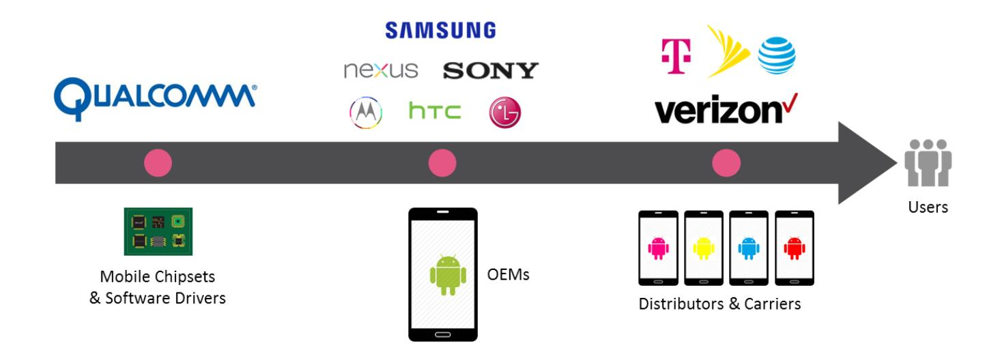
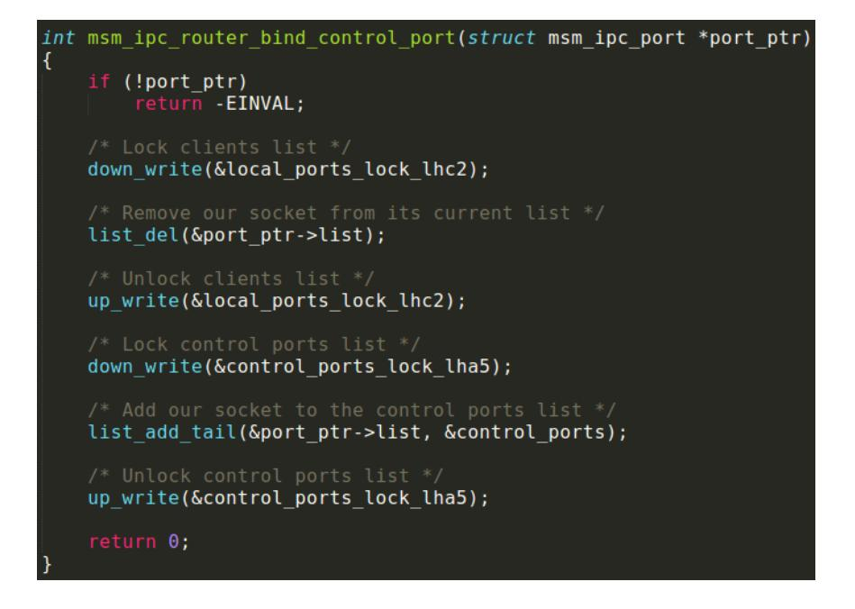
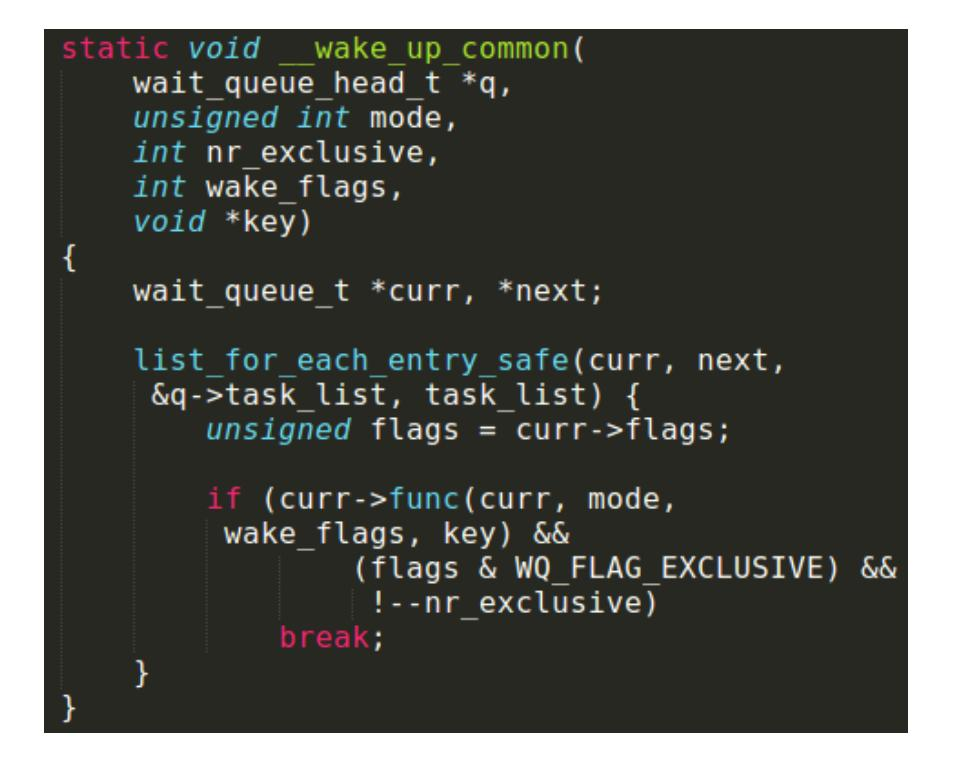
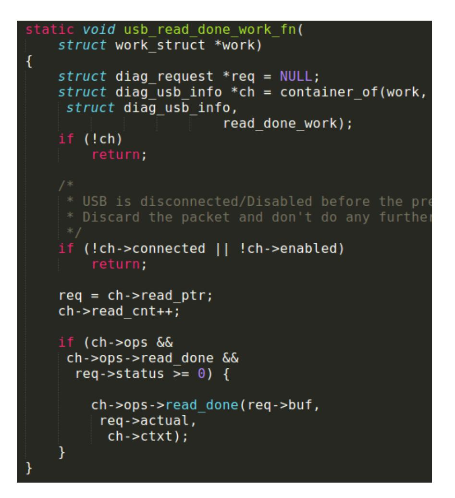
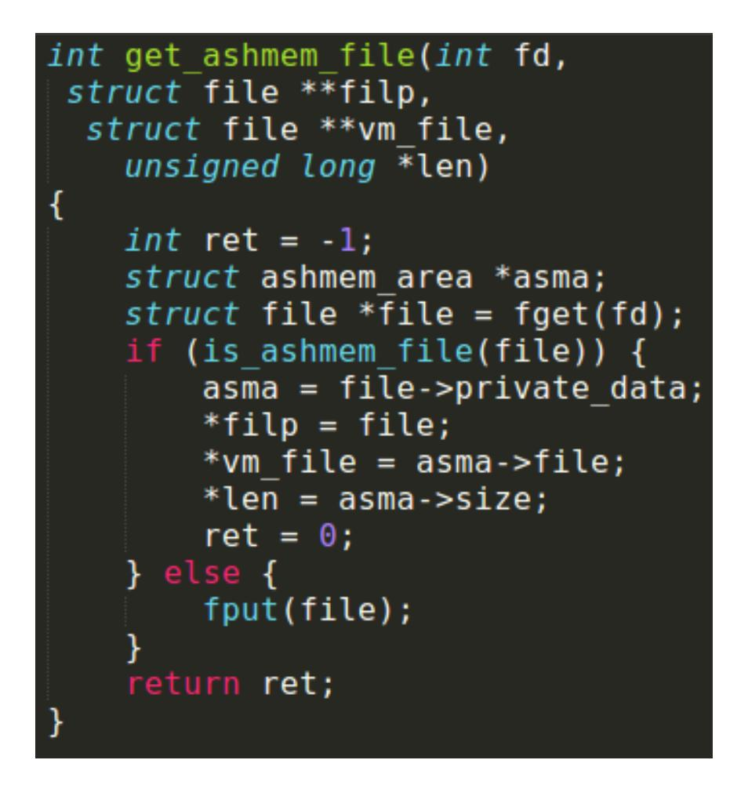
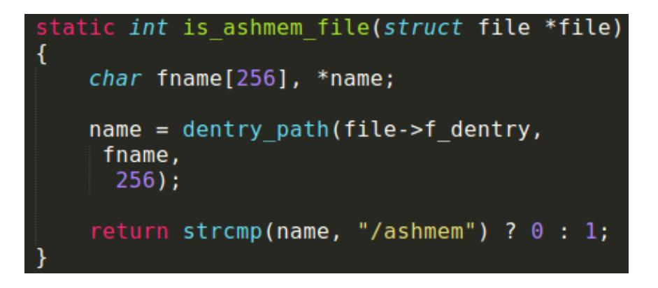
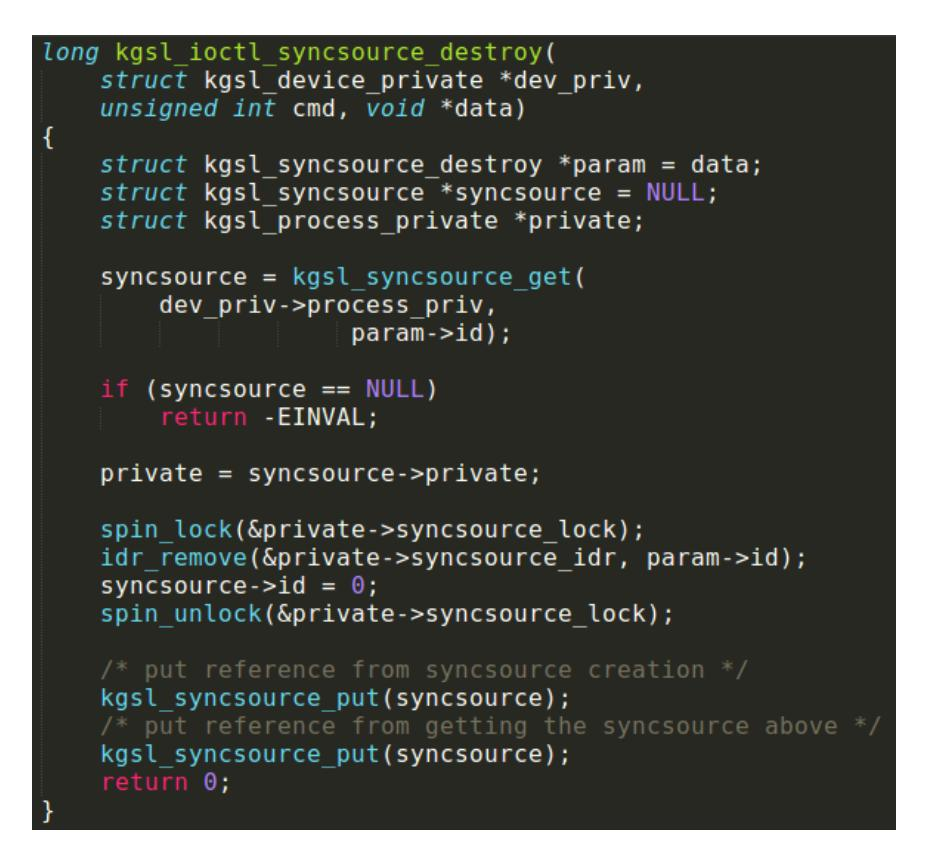

# **QUADROOTER**

NEW VULNERABILITIES AFFECTING OVER 900 MILLION ANDROID DEVICES

by the Check Point Research Team

## INTRODUCTION

The cloak-and-dagger of cybercrime makes for entertaining theater. That's especially true for sensational breaches often caused by malware or other sophisticated attacks. Behind the drama though are some inherent vulnerabilities making these attacks possible.

A myriad of device models, operating system versions, and unique software modifications makes handling Android vulnerabilities a challenge. The earlier these vulnerabilities are born in the supply chain, the more difficult they are to fix.

Fixes require mind-bending coordination between suppliers, manufacturers, carriers *and users* before patches make it from the drawing board to installation. The fragmented world of Android leaves many users exposed to risk, even with out-of-the-box devices.

In this report, the research team details four newly-discovered vulnerabilities affecting over 900 million Android smartphones and tablets. If exploited, each of these can give attackers complete control of devices and access to sensitive personal and enterprise data on them.

# QUADROOTER

QuadRooter is a set of four vulnerabilities affecting Android devices built on Qualcomm® chipsets. The world's leading designer of LTE chipsets, Qualcomm owns a 65% share of the LTE modem baseband market.1

1 ABI Researc[h: https://www.abiresearch.com/press/abi-research-reports-qualcomm-maintains-clear-lead/](https://www.abiresearch.com/press/abi-research-reports-qualcomm-maintains-clear-lead/) If any one of the four vulnerabilities is exploited, an attacker can trigger privilege escalations and gain root access to a device.

An attacker can exploit these vulnerabilities using a malicious app. These apps require no special permissions to take advantage of these vulnerabilities, alleviating any suspicion users may have when installing.

The vulnerabilities are found in Qualcomm's software drivers that come with its chipsets. The drivers, controlling communication between chipset components, become incorporated into Android builds manufacturers develop for their devices.

Pre-installed on devices at the point of manufacturing, these vulnerable drivers can only be fixed by installing a patch from the distributor or carrier. Distributors and carriers can only issue patches after receiving fixed driver packs from Qualcomm.

#### **WHAT IS ROOTING?**

Rooting enables administrative control of a device and allows apps to run privileged commands not usually available on factory-configured devices. An attacker can use these commands to perform operations like changing or removing system-level files, deleting or adding apps, as well as accessing hardware on the device, including the touchscreen, camera, microphone, and other sensors.

The research team provided Qualcomm with information about the vulnerabilities in April 2016. The team then followed the industry-standard disclosure policy (CERT/CC policy) of allowing 90 days for patches to be produced before disclosing these vulnerabilities to the public.

Qualcomm reviewed these vulnerabilities, classified each as high risk, and confirmed that it released patches to original equipment manufacturers (OEMs).

This affects an estimated 900 million Android devices manufactured by OEMs like Samsung, HTC, Motorola, LG and more. In fact, some of the latest and most popular Android devices found on the market today use the vulnerable Qualcomm chipsets including:

- BlackBerry Priv
- Blackphone 1 and 2
- Google Nexus 5X, 6 and 6P
- HTC One M9 and HTC 10
- LG G4, G5, and V10
- New Moto X by Motorola
- OnePlus One, 2 and 3
- Samsung Galaxy S7 and S7 Edge
- Sony Xperia Z Ultra

Unique vulnerabilities affect four modules. Each vulnerability impacts a device's entire Android system:

- **IPC Router (inter-process communication)** The ipc\_router module provides inter-process communication for various Qualcomm components, user mode processes, and hardware drivers.
- **Ashmem (Android kernel anonymous shared memory feature)** Android's propriety memory allocation subsystem, Ashmem enables processes to share memory buffers efficiently. Android devices using Qualcomm chipsets use a modified ashmem system, providing easy access to the subsystem API from the GPU drivers.
- **kgsl (kernel graphics support layer) & kgsl\_sync (kernel graphics support layer sync)** The Qualcomm GPU component kgsl is a kernel driver that renders graphics by communicating with user-mode binaries. While this driver includes many modules, kgsl\_sync is the one responsible for synchronization between the CPU and apps.

# FRAGMENTATION VISUALIZED

A number of factors contribute to Android fragmentation including different Android builds for different device makers, models, carriers and distributors. 

In-market Android devices as of August 2015. (Source: OpenSignal)

## WHY DOES THIS KEEP HAPPENING? THE SUPPLY CHAIN.

Suppliers, like chipset makers, provide the hardware and software modules needed to manufacture smartphones and tables. Original equipment manufacturers (OEMs) combine these software modules, Android builds from Google, and their own customizations to create a unique Android build for a particular device. Distributors resell the devices, often including their own customizations and apps – creating yet another unique Android build. When patches are required, they must flow through this supply chain before making it onto an end user's device. That process often takes weeks or even months.

# CONSUMERS MAY BE LEFT UNPROTECTED FOR LONG PERIODS OF TIME OR EVEN INDEFINITELY, BY ANY DELAYS IN PATCHING VULNERABILITIES ONCE THEY ARE DISCOVERED. – Federal Communications Commission **" "**

## RECOMMENDATIONS

Vulnerabilities like QuadRooter bring the unique challenge of securing Android devices into focus:

- Fragmentation puts the responsibility of keeping Android devices and their data safe into the hands of a complex supply chain.
- Making patches and security updates available is resource and timeintensive – leaving users without protection while these are coded, tested, accepted and distributed.
- In-market devices that cannot support the latest versions of Android may not receive important security updates at all, leaving them exposed to new vulnerabilities.
- End-users remain poorly informed by retailers and employers on the risks of using mobile devices and networks, including the risks of rooting, downloading apps from third-party sources, and using public Wi-Fi® networks.
- These gaps not only put at risk the user's personal information, but also any sensitive enterprise information that may be on their device.

Stake holders throughout the Android supply chain continue to explore comprehensive solutions that address these concerns. They are no doubt motivated by the United States Federal Communications Commission2

2 Federal Communications Commission: https://www.fcc.gov/document/fcc-launches-inquiry-mobile-devicesecurity-updates

and Federal Trade Commission3 , which recently requested explanations from carriers and manufacturers for why the Android security update process is so badly broken.

Unfortunately, reasonable solutions require coordination and standardization across the industry. Until then, Check Point continues to recommend these best practices to keep your Android devices safe:

- Download and install the latest Android updates as soon as they become available. These include important security updates that help keep your device and data protected.
- Understand the risks of rooting your device either intentionally or as a result of an attack.
- Avoid side-loading Android apps (.APK files) or downloading apps from third-party sources. Instead, practice good app hygiene by downloading apps only from Google Play.
- Carefully read permission requests when installing apps. Be wary of apps that ask for unusual or unnecessary permissions or that use large amounts of data or battery life.
- Use known, trusted Wi-Fi networks. If traveling, use only networks you can verify are provided by a trustworthy source.
- Consider mobile security solutions that detect suspicious behavior on a device, including malware hiding in installed apps.

3 Federal Trade Commission: https://www.ftc.gov/news-events/press-releases/2016/05/ftc-study-mobiledevice-industrys-security-update-practices

## QUADROOTER TECHNICAL DETAILS

### **CVE-2016-2059:**

*Linux IPC router binding any port as a control port* 

A kernel module introduced by Qualcomm, called ipc\_router, contains the vulnerability. This module provides inter-process communication capabilities for various Qualcomm components, user mode processes, and hardware drivers.

The module opens a unique socket (address family AF\_MSM\_IPC, 27) that adds propriety features to the normal IPC functionality such as:

- Assigning a predefined identification (ID) to each hardware module, allowing it to be addressed efficiently by any other component.
- Components can whitelist or blacklist other IDs, controlling and preventing communication from unprivileged endpoints.
- Anyone can monitor the creation or destruction of new AF\_MSM\_IPC sockets.

A new AF\_MSM\_IPC socket always starts by default as a regular endpoint (no whitelist rules, and doesn't receive any information when a new socket is created or destroyed). By issuing an IOCTL (*IPC\_ROUTER\_IOCTL\_BIND\_CONTROL\_PORT*) on a regular socket (CLIENT\_PORT), attackers can convert it to a monitoring socket (CONTROL\_PORT).

The vulnerability is located in the conversion function (figure 1), which uses a flawed locking logic to corrupt the monitoring sockets' list. Corrupting the sockets' list is possible by deleting *port\_ptr* (an extension struct to the original struct socket) from its list, using *list\_del* function and while the *local\_ports\_lock\_lhc2* lock is used.

Figure 1: Conversion of a "CLIENT\_PORT" socket to a "CONTROL\_PORT" socket

Calling this function on a monitoring socket removes the monitoring socket from its list while locking the regular sockets' list, which has **nothing** to do with the monitoring sockets' list. Attackers can use this vulnerability to corrupt *control\_ports list* causing it to point to a free data, which they then control with heap spraying. Assuming an attacker can occupy the newly freed memory and control it, the kernel treats the sprayed memory like a regular *msm\_ipc\_port* object.

As discussed, *control\_ports* is a list of the monitoring sockets repeated each time notifications send for a socket creation or destruction. A function called *post\_control\_ports* notifies every item in the *control\_ports* list. It goes over the list and calls the *post\_pkt\_to\_port* function for each item. Figure 2 contains the functions source code, highlighting the variable representing a fake object.

Figure 2: Function is called once the control\_ports list is iterated, with the fake object marked.

Faking a port\_ptr allows for multiple methods of exploitation, as the object contains multiple function call primitives, information disclosure, and other helpful primitives.

Attackers can take advantage of the lack of kASLR on Android devices and use the wake\_up function. This function is a macro which eventually leads to a function called *\_\_wake\_up\_common*  (figure 3).

Figure 3: the \_\_wake\_up\_common function.

By using *\_\_wake\_up\_common,* an attacker can completely control the content (but not the address) of the *q* argument.

Controlling *q* allows attackers to manipulate control *q->task\_list*, enabling the attacker to call any kernel-function and control most of the first argument**4** . Since it is an iterated list, the attacker can call as many functions as they wish.

The vulnerability's exploit goal is to gain root privileges while disabling SELinux. The discussed primitive disables SELinux (since it is possible to just call *enforce\_setup*, passing a "0" string as the first parameter), however, it is not enough to call to the *commit\_creds* function to gain root privileges.

To call *commit\_creds* successfully, the attacker must ensure it doesn't defer a user space memory address in another thread, resulting in a kernel crash. To do so, it can pass the kernel's

**4** An attacker can only control most of the argument because the pointers to the function as well as the pointer to next are contained in *curr*.

*init\_cred* struct (shown in figure 4) as a first argument. This is possible due to the cred struct being statically allocated instead of allocated on the heap.

However, since *wake\_up\_common* does not allow control of first argument memory address, another function that can must be found. *Usb\_read\_done\_work\_fn* is an excellent candidate.

Figure 4: The init\_cred struct, representing the permission that the init process receives.

Figure 5: usb\_read\_done\_work\_fn function is used as a gadget to improve function-call primitive.

Since the first argument is controllable, so are the *ch* pointer and also the *req* pointer, (derived from the *ch* pointer). The last line of code in figure 5 is exactly what the attacker needs –a call to an arbitrary function while controlling the address of the parameters (*req->buf* is a pointer).

By then chaining the function calls, the attacker can create a q- >task\_list, granting root privileges and disabling SELinux.

 The first function called in the chain is qdisc\_list\_del, which allows the attacker to close the control\_ports list, preventing a fake object from being used multiple times.

- The second function of the chain, enforcing\_setup, sets up a pointer to a string that contains '0'. This value sets the SELinux status to "permissive".
- The last chained function is commit\_creds, which receives the function init\_cred as the first argument. The function sets the UID to 0, elevating the maximum capabilities available on the system.

## **CVE-2016-5340**  *Ashmem vulnerability*

Ashmem is Android's propriety memory allocation subsystem that enables processes to efficiently share memory buffers. Devices using Qualcomm chipsets use a modified ashmem system that provides easy access to the subsystem API from the GPU drivers.

The driver provides a convenient way to access an ashmem file's struct file from a file descriptor. The driver supplies two new functions in the ashmem module to allow this: *get\_ashmem\_file* and *put\_ashmem\_file*.

The function *get\_ashmem\_file* (figure 6) gets a file descriptor and checks whether the file descriptor points to an *ashmem* file. If the file descriptor points to it, the function extracts its *private\_data* struct and returns it back to the caller.

Figure 6: get\_ashmem\_file function added by Qualcomm to ease access to the ashmem API.

The problem is in the *is\_ashmem\_file* function, which inappropriately checks the file type (figure 7).

Figure 7: is\_ashmem\_file function. Obscure check for the file type of the given fd.

Attackers can use a deprecated feature of Android, called *Obb5* to create a file named *ashmem* on top of a file system. With this feature, an attacker can mount their own file system, creating a file in their root directory called "ashmem."

By sending the fd of this file to the *get\_ashmem\_file* function, an attacker can trick the system to think that the file they created is actually an *ashmem* file, while in reality, it can be any file.

**CVE-2016-2503, CVE-2106-2504** *[Use after free due to race conditions in KGSL](https://www.codeaurora.org/use-after-free-due-race-conditions-kgsl-module-cve-2016-2504-cve-2016-2503)*

#### **CVE-2016-2503**

One of Qualcomm's GPU components is called "kgsl" (Kernel Graphics Support Layer). This kernel driver communicates with userland binaries to render graphics. While there are many modules in this driver, kgsl\_sync is responsible for synchronization between the CPU and the apps.

The vulnerability lies in the 'destroy' function. Creating and destroying this object can be done by IOCTLing the driver (/dev/kgsl-3d0) and sending the following IOCTLs:

- IOCTL\_KGSL\_SYNCSOURCE\_CREATE
- IOCTL\_KGSL\_SYNCSOURCE\_DESTROY

5 More information can be found at https://developer.android.com/google/play/expansion-files.html

Figure 8: *kgsl\_ioctl\_syncsource\_destroy* function. Receives an ID of a syncsource object, checks for its preexistence and then destroys it.

The function is prone to a race condition flaw, where two parallel threads call the function simultaneously. This could make the kernel force a context switch in one thread. This happens right after the kgsl\_syncsource\_get call to the second thread which will call this function too.

Together, these two threads can pass the kgsl\_syncsource\_get before starting the refcount reduction. This drops the refcount of a syncsource object below 0, exposing itself to a use-after-free attack.

#### **CVE-2016-2504**

Another vulnerability is found in the kernel graphics support layer driver when a module called kgsl creates an object called *kgsl\_mem\_entry* (representing a GPU memory). Since a user-space process can allocate and map memory to the GPU, it can both create and destroy a *kgsl\_mem\_entry*.

The *kgsl\_mem\_entry* is created using a function called *kgsl\_mem\_entry\_create*. The function allocates memory for the *kgsl\_mem\_entry* objects and upon success, sets the refcount to 1 using the kref mechanism.

The allocated object is then passed to the function *kgsl\_mem\_entry\_attach\_process* (figure 9), binding it to a particular process. Process binding is done by either referencing *kgsl\_mem\_entry using the "*idr" mechanism, or through the GPU mapping mechanism (*kgsl\_mem\_entry\_track\_gpuaddr*).

Once the kernel calls the *idr\_alloc* function with *kgsl\_mem\_entry* as its argument (figure 9), attackers can free this specific id using another IOCTL (*IOCTL\_KGSL\_GPUMEM\_FREE\_ID*). Since there's no access protection enforced, another thread can simply free this object, invoking an use-after-free flaw.

Figure 9: *kgsl\_mem\_entry\_attach\_process.* Access to UM is granted before initialization of *entry*

### **[Learn More About](https://www.checkpoint.com/products/mobile-threat-prevention/?utm_source=content&utm_medium=pdf&utm_content=productpage&utm_campaign=16%2DQ3%2DGLOBALPRGMS%2DMobility%2DQuadRooter%20Enterprise) [Check Point Mobile Threat Prevention](https://www.checkpoint.com/request-a-demo/?utm_source=content&utm_medium=pdf&utm_content=productpage&utm_campaign=16%2DQ3%2DGLOBALPRGMS%2DMobility%2DQuadRooter%20Enterprise)**

©2016 Check Point Software Technologies Ltd. All rights reserved.